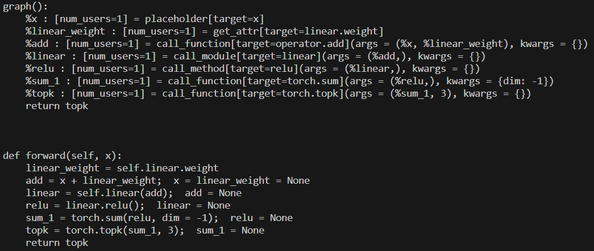

---

layout: default 
title: torch.fx源码剖析 02 -深入理解 TORCH.FX
nav_order: 1 
parent: torch.fx 
grand_parent: PyTorch
grand_grand_parent: AI编译
author: DimancheH 
---



 <div> 
     作者: {{ author.name }}   邮箱：{{ author.email }}
 </div>


# torch.fx源码剖析 02 -深入理解 TORCH.FX

[zhuanlan.zhihu.com](https://zhuanlan.zhihu.com/p/625690498)

torch.jit.trace 和 torch.fx 的区别:

1. **目的和使用场景**:
    - torch.jit.trace: 主要用于将动态 PyTorch 模型转换为静态 JIT 模型。
    - torch.fx: 对 PyTorch 模型进行符号级别的分析和转换。生成的 GraphModule 用于各种图优化和变换。
2. **输入格式**:
    - torch.jit.trace: 需要一个具体的输入来跟踪模型的执行。
    - torch.fx: 不需要输入,基于模型的定义进行符号级别的分析。
3. **生成的中间表示**:
    - torch.jit.trace: 生成一个 torch.jit.ScriptModule,它是 PyTorch JIT 编译器的输入。
    - torch.fx: 生成一个 torch.fx.GraphModule,包含一个 torch.fx.Graph对象,表示模型的符号级别表示。
4. **额外功能**:
    - torch.jit.trace: 提供对 JIT 编译器的各种优化选项和控制,如融合、常量折叠等。
    - torch.fx: 提供了更丰富的图转换和分析功能,如自定义 pass、图遍历等。

# 1.简介

fx 模块包含以下特性：

1. 采用trace的方式去捕捉神经网络结构（通过 `Tracer` 类和 `Proxy` 类）。fx 模块与 jit.trace 不同，前者**将输入替换为 `Proxy` 做追踪**，后者基于样例输入做追踪 ，因此 fx 不会对输入做特例化。

2.  fx **不支持动态控制流**，即与输入相关的控制流，在 IR 中不包含控制流指令；fx 也**不支持可变状态和别名**，例如 `x` 是一个tensor，`y=x[i]` 并没有新创建一个 tensor ，而是 `x` 的一个 view ，为了支持这种可变特性，需要设计非常复杂的 IR 并且做复杂的安全分析。

这种设计可行吗？实际上随着 transfomer 的提出，循环神经网络逐渐被替代，**主流神经网络中的动态控制流越来越少**，更多只是简单的序列输入输出。对于复杂的需求，用户可以通过重新定义 Trace 类或者 Proxy 类来实现（例如 Trace 类的 `is_leaf_module` 方法可以被重写，定义哪些 Module 不应该被拆开跟踪内部的计算和调用）。

3. 将变换后的 IR 转为可运行的 Python 代码（更准确的说是一个 Python 函数对象）。

# **2.FX 源码解析**

## 2.1示例：

```python
import torch
import torch.fx

class MyModule(torch.nn.Module):
    def __init__(self):
        super().__init__()
        self.param = torch.nn.Parameter(torch.rand(3, 4))
        self.linear = torch.nn.Linear(4, 5)

    def forward(self, x):
        w = self.linear.weight
        x = x + w
        x = self.linear(x)
        x = x.relu()
        x = torch.sum(x ,dim=-1)
        x = torch.topk(x, 3)
        return x

m = MyModule()
gm = torch.fx.symbolic_trace(m)
print(gm.graph)
print(gm.code)
```

这段代码中：

- 定义了 MyModule 类，
- 通过 torch.fx.symbolic_trace 对该类的实例 m 进行 fx 追踪，返回 gm 。
- gm 是GraphModule 类的实例，GraphModule 继承自 Mudule ，可以直接当做 Module 使用。gm 所定义的计算行为与 m 完全一致，几乎可以在所有场景使用 gm 替代 m。 gm 有两个重要的属性，一个是 graph ，另一个是 code。



### 2.1.1.graph

torch.fx.graph.Graph类的实例，也就是经过 fx 追踪后的 m 对应的计算图，计算图由一组节点（ torch.fx.node.Node）组成，可由GraphModule.graph.nodes访问。

### 2.1.2.node（IR）

每个节点是一条 IR ，记录了节点的输入参数和计算行为（调用函数，方法，模块等），每个节点都有五个属性：

- opcode ：节点种类的标识，我们前面提到 fx 模块总共只有 6 条 IR ，包括 placeholder ，get_attr ，call_function ，call_module，call_method，output。
- name ：每个节点的名字，与调用的对象相关。
- target ：每个节点调用的对象，可以能是函数，方法，属性或模块。
- args ：每个节点的可变参数。
- kwargs ：每个节点的可变关键字参数。

```python
for node in gm.graph.nodes:
    print(f"Node: {node.name}")
    print(f"  Op: {node.op}")
    print(f"  Target: {node.target}")
    print(f"  Args: {node.args}")
    print(f"  Kwargs: {node.kwargs}")
    print(f"  Type: {type(node)}")
    print()
```


### 2.1.3.IR对应的语义

- placeholder：函数输入。
    - name：此变量将采用的名称。
    - target：参数的名称。
    - args： 1. 空。 2. 函数输入的默认值。
    - kwargs：无用。
- get_attr：从模块层次结构中检索参数。
    - name：结果的名称。
    - target：参数在模块层次结构中的位置的完全限定名称（如my_module.MyClass.my_attr）。
    - args 和 kwargs：无用。
- call_function：将独立的函数应用于某些值。
    - name：名称。
    - target：是要应用的函数。
    - args 和 kwargs：函数的参数，遵循 Python 调用约定。
- call_module：将模块的 forward() 方法中的模块应用于给定参数。
    - name：如前。
    - target：要调用的模块的完全限定名称。
    - args 和 kwargs：调用模块的参数，不包括 self 参数。
- call_method：调用一个值的方法。
    - name 如前。
    - target：应用于 self 参数的方法的字符串名称。
    - args 和 kwargs：调用方法的参数，包括 self 参数 *。*
- output的args[0] 包含被跟踪函数的输出。对应计算图中的 return 语句。

## 2.1.4.code

模型经过 fx 追踪后生成计算图，计算图的只是一组 IR ，无法直接运行的。

因此 fx 会对 IR 做代码生成，生成python 源代码。

这样又回到了 python 运行时，方便用户调试和使用。

具体来说， fx 会生成一个函数对象，然后绑定到 gm 的 forward 方法上，而 code 属性就是 forward 方法对应的 python 源代码。

然后执行gm即可，作为执行原module的替代。

## 2.2.计算图生成

前面调用的是torch.fx.symbolic_trace，定义在pytorch/torch/fx/_symbolic_trace.py#L1169

注释中提到：无法直接追踪含有控制流的情况，但可以通过concrete_args()部分专门化函数,去除控制流。


主要功能：

- 创建 torch.fx.Tracer，进行简单的初始化；
- 调用 trace() 来捕获 torch.fx.Graph；
- 创建 torch.fx.GraphModule；

**Trace.trace()**


### **2.2.1.初始化被追踪模块与函数**

\#L717：


如果传入的是一个LazyGraphModule，就会强行将其编译，因为它已经被优化过，但是没有实际上编译。

如果传入的是普通的nn.Module，就会查看是否有”forward”方法(即traced_func_name)，并将fn设置为forward的引用。

如果传入的不是nn.Module，就说明传入的是独立的函数，创建空的nn.Module并填写信息。

> Dynamo 的主要工作就是通过 JIT 编译将有分支的模型划分成多个无分支的子图,然后再交给 Tracer 进行编译优化。这就是为什么在fx图的tracer中调用recompile，在dynamo中也会调用recompile，因为在dynamo中转换得到的output是gm和fx图中的gm都是graphmodule，内部有recompile。
> 

### **2.2.2.初始化计算图**


填写基本信息，包括tracer的类型(可能是jit.tracer、fx.tracer或者自定义tracer等等)、以及其他元信息。

### **2.2.3.构建张量到属性名的映射**


收集模块中所有 Tensor 及其对应的属性路径,并将这些信息存储在 self.tensor_attrs 字典中。

### 2.2.4.**创建参数节点**


获得 fn 的全局变量，之后用于函数和方法的 Monkey Patch。

调用 self.create_args_for_root ，为 fn 的参数创建计算图节点。

```python
def create_args_for_root(self, root_fn, is_module, concrete_args=None):
        """
        Create ``placeholder`` nodes corresponding to the signature of the ``root``
        Module. This method introspects root's signature and emits those
        nodes accordingly, also supporting ``*args`` and ``**kwargs``.
        """
        # In some cases, a function or method has been decorated with a wrapper
        # defined via ``functools.wraps``. In this case, the outer code object
        # will likely not contain the actual parameters we care about, so unwrap
        # the function to get to the innermost callable.
        fn_for_analysis = inspect.unwrap(root_fn) # 装饰器包装的原始函数
        co = fn_for_analysis.__code__
        total_args = co.co_argcount + co.co_kwonlyargcount
        orig_args = list(co.co_varnames)
        names_iter = iter(co.co_varnames)
        args: List[Any] = []
        skip_arg_idx = 0
        if is_module:
            if total_args == 0:
                raise RuntimeError(
                    "``self`` argument cannot be part of *args expansion!"
                )
            skip_arg_idx = 1
            next(names_iter)  # skip self
            args.append(self.root)

        sig = inspect.signature(fn_for_analysis)

        # This covers the very specific case where we are passing in flat
        # concrete_args as a tuple, but our traced fn takes (*args, **kwargs).
        # In this case, just take the concrete_args and pass them through.
        name_idx = 0
        if isinstance(concrete_args, tuple) and \
                len(concrete_args) > 0 and \
                (co.co_flags & HAS_VARSTUFF) and \
                total_args == 1:
            for concrete_arg in concrete_args:
                out = self.create_proxy("placeholder", f"input_{name_idx}", (), {})
                if isinstance(concrete_arg, PHBase):
                    if concrete_arg != PH:
                        # Transfer attrs in the case where you're using a placeholder other
                        # than the singleton PH (PH has no attributes to transfer).
                        # Proxies were created out of the placeholders.
                        # Transfer any metadata (put on the placeholders in the form of
                        # attributes set by the user) from the placeholder to the
                        # underlying nodes (the proxy is unwrapped by the user, but
                        # the metadata should hold).
                        _transfer_attrs(fr=concrete_arg, to=out.node)
                args.append(out)
                name_idx += 1
            return root_fn, args

        arg_names = [next(names_iter) for idx in range(skip_arg_idx, total_args)]
        if isinstance(concrete_args, tuple):
            if len(arg_names) != len(concrete_args):
                raise RuntimeError(
                    f"Tracing expected {len(arg_names)} arguments but got {len(concrete_args)} concrete arguments"
                )
            concrete_args = dict(zip(arg_names, concrete_args))
				
				# 
        def proxy_placeholder(name):
            return self._proxy_placeholder(name, concrete_args, sig, fn_for_analysis)

        args.extend(proxy_placeholder(names) for names in arg_names)

        if co.co_kwonlyargcount > 0 or co.co_flags & HAS_VARSTUFF:
            # TODO: type annotations for *args and **kwargs
            if co.co_flags & inspect.CO_VARARGS:
                args.append(proxy_placeholder("*" + next(names_iter)))
            if co.co_flags & inspect.CO_VARKEYWORDS:
                args.append(proxy_placeholder("**" + next(names_iter)))
            root_fn = _patch_function(root_fn, len(args))

        flat_args, in_spec = pytree.tree_flatten(tuple(args))
        if not all(child.is_leaf() for child in in_spec.children_specs):
            # In the case that we have pytree-flattened inputs in
            # `concrete_args`, generate a flattening wrapper around the
            # original root function and return that.
            self.graph._codegen = _PyTreeCodeGen(
                _PyTreeInfo(orig_args[:total_args], in_spec, None)
            )

            def flatten_fn(*args):
                tree_args = pytree.tree_unflatten(list(args), in_spec)
                tree_out = root_fn(*tree_args)
                out_args, out_spec = pytree.tree_flatten(tree_out)
                assert isinstance(self.graph._codegen, _PyTreeCodeGen)
                self.graph._codegen.pytree_info = (
                    self.graph._codegen.pytree_info._replace(out_spec=out_spec)
                )
                return out_args

            return flatten_fn, flat_args
        return root_fn, args
```

1. 对输入做了 unwrap；（装饰器会创建新函数替换原始函数，可能不包含原始函数的参数信息）
2. 获得原始函数的代码对象 co；
3. co.co_argcount 和 co.co_kwonlyargcount 分别记录了 *args 之前的参数个数，和 *args 之后 **kwargs 之前的参数个数。
4. co.co_varnames 记录了函数内所有局部变量的名字，参数也是局部变量，最先被记录。
5. 如果是module，也会添加self；
6. 获取参数列表arg_names；
7. 为arg_names中的所有参数调用proxy_placeholder()并将结果存储到args中。proxy_placeholder的核心是self.create_proxy，创建 placeholder类型的torch.fx.proxy.Proxy：
    1. 使用 self.create_arg 方法创建参数，将各种类型的输入转为 Node 输出。
    2. 利用之前的提到的 IR 所有的五个元素创建了一个新的 Node 实例 node，插入计算图中。
      
        
        
        
        
    3. 调用 self.proxy 方法创建一个新的 Proxy 实例 proxy，proxy()的self就是tracer，用来初始化Proxy。一个 `Proxy` 其实就是包含了一个 `Node` 和一个 `Tracer` 。
      
        
        
        
    
8. 返回root_fn和args

create_args_for_root 做的：

遍历了除 self 之外的参数，为每一个参数都生成了一个 Proxy ，其中每个 Proxy 都包含一个类型为 placeholder 的 Node ，且被插入到计算图中，返回这些Proxy。

假设待追踪的方法是 forward(self, x) ，其中 self 是模块本身， x 是输入，那么返回 args 包含两个元素，第一个是 self ，第二个是 Proxy(x) 。

### 2.2.5.**初始化属性名到 Proxy 的字典**


使用parameter_proxy_cache来存储已经生成的Proxy减少重复生成。

### 2.2.6.**可能的叶子函数/方法的monkey patch**

trace的时候如何记录每一个函数/模块/方法调用？

e.g.：遇到 x = self.linear(x) ，需要调用 Linear 模块，但是在tracing中并不想真的调用 Linear 模块。所以生成一个计算图节点，描述调用 Linear 模块这个行为。

fx 采用的做法是 monkey patch ，什么是 monkey patch 呢？ 就是动态的属性替换，这种替换是在运行时发生的。fx 在追踪时，将 Linear 的 __call__ 方法保存，替换成生成描述调用的计算图节点，返回 Proxy 的函数。追踪完以后，又把这个原来的 __call__ 方法替换回去。

实际上是将外部调用抽象成一个调用call节点插入到计算图中。


通过with _Patcher() as patcher: 上下文管理来实现这样的功能，在**_Patcher类**中，有两个主要函数：

- patch()：函数名，原函数保存在 patches_made 中，用新的函数替换frame_dict中原有的；
- __exit __()：在 with 结束时调用，会调用 patch_made 中所有元素的的 revert 方法，即将被替换的转换回去。

在 fx 追踪的过程中，我们不希望再深入到这些函数和方法内部了，所以直接把这个调用记录成一个计算图节点。例如所有 torch 内置的模块，它们都被视为叶子模块，那么它们的 `__call__` 方法，其实就应该被视为叶子方法，需要被 patch。

> **Monkey Patch和直接创建外部调用节点的区别？**
> 
> 
> 最终结果都是在 Tracer 的计算图中创建一个 call_function 节点，节点中保存被调用的函数和参数。这确保了外部函数调用能够正确地表示为计算图中的节点，并且在后续的图转换和优化过程中能够被处理。
> 
> ## **为什么Monkey Patch更好？**
> 
> ### 1. 简化符号跟踪过程
> 
> **Monkey Patch** 可以直接在符号跟踪期间捕获对函数或方法的调用，而不需要修改原始的代码结构。这使得符号跟踪过程更加简化：
> 
> - **透明捕获**：通过 Monkey Patch，可以在函数或方法调用时插入自定义逻辑，而不需要修改调用代码。这种方式在符号跟踪期间自动捕获调用并记录到计算图中。
> - **减少重复工作**：不用为每个外部函数或方法调用单独编写捕获逻辑，只需对特定函数或方法进行 Monkey Patch。
> 
> ### 2. 保持代码的透明性和最小侵入性
> 
> **Monkey Patch** 对用户代码的侵入性较小，用户无需修改原始代码即可进行符号跟踪：
> 
> - **用户友好**：用户代码可以保持不变，符号跟踪逻辑通过 Monkey Patch 动态注入。这对用户来说更加方便，不需要了解符号跟踪的内部细节。
> - **降低复杂度**：使用 Monkey Patch 可以避免在每个潜在的外部调用点显式地创建节点，从而降低符号跟踪的复杂度。
> 
> ### 3. 处理复杂的外部调用
> 
> 有些外部调用可能涉及复杂的逻辑或依赖关系，通过 Monkey Patch 可以更方便地捕获和处理这些调用：
> 
> - **统一处理**：通过 Monkey Patch，可以统一处理特定函数或方法的所有调用，而不需要在每个调用点单独处理。可以用参数映射的方式传递参数，而不需要一一对应。因为FX框架要求在创建节点时,参数列表必须与目标函数的签名完全一致。
> - **灵活性**：可以根据需要在 Monkey Patch 中添加额外的逻辑，如日志记录、输入输出检查等。
> 
> ### 4. 可维护性和扩展性
> 
> 使用 Monkey Patch 可以更容易地进行维护和扩展：
> 
> - **集中管理**：所有涉及符号跟踪的逻辑可以集中在 Monkey Patch 中进行管理和维护，而不需要分散在多个调用点。
> - **方便扩展**：如果需要支持更多的外部函数或方法，只需在一个地方添加相应的 Monkey Patch 逻辑即可。

---

---

**Module.__getattr__ 的 patch**


patcher上下文管理中，首先将nn.Module的__getattr __方法替换成module_getattr_wrapper:


getattr做的就是返回属性对应的proxy。

原本的__getattr__方法是在对应的module中寻找名称匹配的方法，而替换成module_getattr_wrapper后，会返回名称对应的proxy，记录调用的目标和参数等信息，并不会执行实际的调用。

---

---

**operator 的 patch**

operator 是 python 的内置模块，提供了一系列与 Python 的内置运算符对应的函数。例如 + ， - ， * ， / 等运算符，等价于 operator.add ， operator.sub ， operator.mul ， operator.truediv 。

对于运算符的patch，在追踪时，遇到一句 x = x + y ，那其实会去调用 x 的 __add__ 方法，所以需要修改 x 的 __add__ 方法。

那么在追踪的时候，x 是什么呢，是 Proxy ！所以需要修改 Proxy 类的各种魔术方法。

在 proxy.py 下有这样一段代码：


magic_method 内部包含了常见的运算符函数。

tracing的过程中，所有的操作都会被替换为对应的 proxy 对象,包括函数调用和其他语句。

---

---

**torch 内置函数的 patch**

torch 自带了很多函数，例如 torch.sum 和 torch.topk 等。调用这些方法实际上会去调用 Tensor 的 __torch_function__ 方法。

在trace的时候，中间传递的参数是 Proxy ，默认情况下会调用 Tensor 的 __torch_function__ 方法，但是这不是我们想要的。我们可以自定义 Proxy 的 __torch_function__ 方法，这样在追踪时遇到 torch 内置函数，就会去调用 Proxy 的 __torch_function__ 方法，也就完成了 patch 。

proxy.py中自定义Proxy的__torch_function__方法，在符号追踪过程中捕获对张量方法和操作的调用，并将这些调用转换为计算图中的节点，也就是将其转换为proxy。

---

---

**自定义函数和库函数的 patch**

有时用户想在模块中使用自定义函数或者一些库函数 。这个函数的调用也需要被视作一个计算图中的一个节点，fx 提供了一个 `wrap` 接口给用户来达到这个目的。

```python
@torch.fx.wrap(len)

class MyModule(torch.nn.Module):
    def __init__(self):
        super().__init__()
        ...
    def forward(self, x):
        ...
        l = len(x)
        ...
```

pytorch/torch/fx/_symbolic_trace.py#L1107是wrap的具体实现：

1. 获取需要被 wrap 的函数的名字。
2. 获取上一个帧对象 `f` 。什么是帧对象呢，python 虚拟机在调用函数或者导入模块的时候，就会在堆栈中压入一个帧对象。在 `wrap` 函数中获取到的当前帧 `currentframe` ，它对应着 `wrap` 函数的调用。它的上一帧对应的是调用 `wrap` 函数的 `__main__` 模块。
3. 把 `f` 的全局变量字典 `f_globals` 和需要被 wrap 的函数的名字 `fn_name` 做为键和值添加到了 `_wrapped_fns_to_patch` 里面。最后返回了函数。

所以其实 `wrap` 只是做了一个记录的工作，真实的替换是 fx 追踪开始前做的：


_patch_wrapped_functions处理被包装的方法和全局函数。

为`_wrapped_fns_to_patch`中的每个方法进行patch，用_create_wrapped_func(orig_fn) 替换了原函数。对方法的处理同理。

 _create_wrapped_func 是如何生成新函数：

调用 _find_proxy，在输入中寻找是否存在 Proxy ，

1. 如果有一个计算图的节点作为输入，就返回一个 call_function 类型的 Proxy ，
2. 否则就只是执行一下原函数，然后返回原函数的返回值，

猜测是为了精简计算图。

---

---

**模块的 patch**

存在一些模块，例如 `math` ，里面所有的函数都非常的常用，所以 fx 自动的 patch 整个模块。让我们看看 fx 是怎么做的，首先是在 `Tracer` 初始化的过程中：


参数 autowrap_modules，表示需要自动被 patch 的模块，默认包含了 math 模块。


初始化的过程首先会取出所有 math 模块中对外提供的函数，把他们的 id 放到 _autowrap_function_ids 中。然后会把 autowrap_modules 赋值给 _autowrap_search 。

这也是在做记录的工作，所有的 patch 是在 trace 开始之前完成的。

patch 的实现：


这个 patch 核心也是调用 patcher.patch 方法，在 frame_dict 中用新的函数 _create_wrapped_func(value) 替换了 _autowrap_function_ids中的原函数。

两次调用的 frame_dict 分别对应 fn_globals 和 math.__dict__ 。这两种 patch 分别对应于 from math import sqrt; sqrt(x) 和 import math; math.sqrt() 两种情况。

---

---

**Module.__call__ 的 patch**


module_call_wrapper：


        检查被调用模块的 forward 方法中是否有需要被包装的全局函数调用。如果有,它会调用 patcher.patch 方法对这些函数进行包装替换。

因为，当我们进行module.__call__的时候，这个类的内部可能也有调用外部的函数。

接着调用 call_module：

        如果这个模块不是叶子模块，则递归的进入模块内部执行追踪；如已经是叶子模块，则直接返回一个 call_module 类型的 Proxy。

### 2.2.7.trace


在前面已经通过 create_args_for_root 方法，创建了 args 的 Proxy即当前计算图的输入节点 ，tracing的准备工作即patch也已经完成，接下来将 args 传入 fn 执行，执行的过程就是trace的过程。

接下来将计算结果作为output节点的值，并创建最后的output节点作为当前计算图的输出。

fx不会对return进行patch，因为假如有语句return x，x之前已经被处理过成为了x的proxy，此时执行fn(*args)的时候遇到return就能直接返回return的结果，即x的proxy给output节点作为值。如果没有return语句，output就是None。

所以说fx做tracing的过程实际上就是：

1. 准备参数
2. 为所有中间涉及的计算和调用做patch
3. 逐条执行函数内部的语句，将其翻译成IR
4. 准备output

为什么使用IR而不是AST？主要是因为python是动态语言。

## 2.3.code gen


刚刚看完了tracer.trace()，接下来看后面的部分。

trace完毕之后，获取root的name，然后使用_make_graph_module由trace得到的graph对象生成graphModule对象。


最终会确定对应的类型为GraphModule并调用GraphModule的构造函数，构造函数中重要的是：


对应


GraphModule中有一个属性_graph用于存储trace得到的graph，然后使用GraphModule的recompile方法来进行CodeGen。

recompile中重要的两条语句：

- self._graph.python_code：生成python代码
- _forward _from_src：生成GraphModule自身forward方法


基本就是遍历计算图每个节点，然后每个节点生成对应的一句 python 源代码就好了。例如 `call_function` 类型的节点，就会生成类似于这样一句 `${node.name} = ${node.target}(${argsnode.name});`。

这部分recompile在dynamo中也使用到了，将含有分支的计算图划分之后，对子图进行编译。

symbolic_trace只是生成IR，优化工作会交给其他组件，比如transform等