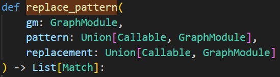



 <div> 
     作者: {{ author.name }}   邮箱：{{ author.email }}
 </div>

# torch.fx源码剖析 03 - 子图重写

使用 subgraph_rewriter.replace_pattern() 来进行简单的图变换，复杂的图变换与 replace_pattern() 相似。

把 operator.add 替换为 operator.mul：

```python
import torch
import torch.fx

class MyModule(torch.nn.Module):
    def __init__(self):
        super().__init__()
        self.param = torch.nn.Parameter(torch.rand(3, 4))
        self.linear = torch.nn.Linear(4, 5)

    def forward(self, x):
        w = self.linear.weight
        x = x + w
        x = self.linear(x)
        x = x.relu()
        x = torch.sum(x ,dim=-1)
        x = torch.topk(x, 3)
        return x

m = MyModule()
gm = torch.fx.symbolic_trace(m)
print(gm.graph)

from torch.fx import subgraph_rewriter
# 将x+y替换成x*y
pattern = lambda x, y: x + y
replacement = lambda x, y: x * y

subgraph_rewriter.replace_pattern(gm, pattern, replacement)
```

调用的是pytorch/torch/fx/subgraph_rewriter.py#L83，



实际上调用#L227的_replace_pattern()

# 子图匹配

**子图重写的第一步是子图匹配。**

## 获取gm、pattern、replacement

获取3张 torch.fx.Graph：GraphModule 中的 graph，pattern 和 replacement 对应的 graph。

后两者在_replace_pattern()函数中同样会通过 symbolic_trace() 获取 graph，分别称为pattern_graph和replacement_graph。

## 创建matcher并获得匹配的子图

_SubgraphMatcher 类的实例，负责进行模式匹配，试图匹配由 pattern_graph 所确定的模式。


当匹配重叠的时候，优先选择较大的子图。

匹配的时候从pattern的anchor开始（output依赖的那个节点），从下往上依次匹配。

matcher.match返回匹配到的子图。

## 子图替换


记录需要变更的节点，通过遍历每个match的子图，将每个需要替换的placeholder与replacement的placeholder一一对应，并记录在match_changed_node中。

将新的子图（替换子图）插入到原始计算图中。为了正确地插入替换子图，需要知道替换子图的返回节点在原始计算图中被哪些节点使用，并确定第一个用户节点的位置，以便将替换子图正确地接入到原始计算图的执行流中。

1. **插入替换子图**：在原始计算图的指定位置插入替换子图。
2. **节点替换**：将匹配子图的返回节点替换为复制的返回节点，并更新所有引用。就是把原图中所有对原有子图的输出的引用更新为替换子图的输出。
3. **删除原始节点**：从原始计算图中删除匹配子图的所有非占位符和非输出节点。
4. **记录替换信息**：创建并记录替换操作的详细信息，包括锚点节点、节点映射和替换节点。