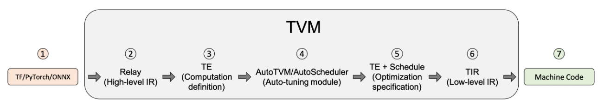


<div> 作者: {{ author.name }}  
 邮箱：{{ author.email }}
</div>


# 1 TVM框架

​		本文从TVM框架的基本结构讲起，然后逐步深入TVM代码，并着重讲Relay层的数据结构，然后通过项目导向，讲解TVM中接口的调用关系以及怎样从TVM的复杂数据结构中的张量描述信息以及张量数据，最后，根据项目经验介绍利用Python接口来实现TVM的子图划分以及实现多后端的异构计算。

​		在讲TVM框架之前，首先我们需要知道TVM是干什么的。

​		首先我们先了解一下深度学习从训练到执行需要经历几个步骤。现在深度学习在多种领域中起到了重要作用，在任意深度学习的应用场景落地一个模型/算法时，需要经历两个基本步骤：1. 根据大量数据，训练一个模型；2. 将生产出的模型部署到目标设备上，进行推理运行。第1个步骤目前的主流框架有Tensorflow、PyTorch、Keras、MXNet等。

​		TVM是一款开源的、端到端的深度学习模型编译框架，用于优化深度学习模型在CPU、GPU、ARM等任意目标环境下的推理运行速度，应用于上述的第2点。

​		那么为什么要选择TVM框架来作为模型编译推理框架呢？其原因在于推理任务的复杂性：训练后的模型需要部署于多样的设备上（Intel CPU/ NVIDIA GPU/ ARM CPU/FPGA/ AI芯片等），要在这些不同的设备上都能保证模型推理的高效是一项极有挑战的工作。

​		一般来说，主流的硬件厂商会针对自家硬件推出对应的推理加速框架以最大化利用硬件性能，但这些框架在实际应用上会遇到很多问题，例如厂商推理框架对主流训练框架训练的模型中的算子的种类支持不够完善，导致部分模型无法部署在硬件上。而且，模型的种类越来越多，导致模型部署侧的开发人员需要针对不同的硬件编写不同的框架代码，产生了极高的成本。因此，一套可以让我们在任意硬件后端上高效运行任意模型的统一框架就显得尤其有价值，而TVM正是这样一套框架。

## 1.1 TVM 框架综述

​		在本节中，我们将研究编译器中的编译流。在高层次上来看，它包含几个步骤：

- 导入：前端组件将模型摄取到IRModule中，IRModule包含内部表示模型的函数集合。

- 转换：编译器将一个IRModule转换为另一个功能等效或近似等效（例如，在量化的情况下）的IRModule。许多转换是独立于目标（后端）的。我们还允许target影响transformation pipeline的配置。

- 目标翻译：编译器将IRModule翻译（codegen）为目标指定的可执行格式。目标翻译结果被封装为运行时。可以在目标运行时环境中导出、加载和执行的模块。

- 运行时（runtime）执行：用户加载回运行时。模块，并在支持的运行时环境中运行编译后的函数。

  

​		下图说明了机器模型在使用TVM优化编译器框架进行转换时所采取的步骤。



​		下面我们对这个图中每个步骤进行解读：

1. 从Tensorflow、PyTorch或Onnx等框架导入模型。模型导入层使得TVM可以从其他框架（如Tensorflow、PyTorch或ONNX）中获取模型。随着不断改进开源项目，TVM为每个前端提供的支持水平各不相同。如果在将模型导入TVM时遇到问题，可以尝试将其转换为ONNX。
2. 翻译成TVM的高级模型语言Relay。可以在Relay中表示已导入TVM的模型。Relay是一种用于神经网络的函数语言和中间表示（IR）。Relay应用图形级优化过程来优化模型。
3. lower到张量表达式（Tensor Expression，TE）表示。lower是指将较高级别的IR表示转换为较低级别的IR表示。在应用高层次优化后，Relay运行FuseOps pass（即算子融合过程）将模型划分为许多小子图，并将子图降低为TE表示。张量表达式（TE）是一种用于描述张量计算的特定领域语言。TE还提供了几个调度原语来指定低级循环优化，例如tiling、vectorization、parallelization、unrolling和fusion。为了帮助将Relay表示转换为TE表示的过程，TVM包括张量算子清单（TOPI），该清单具有常见张量算子的预定义模板（例如，conv2d、transpose），定义了算子的具体计算过程。
4. 使用自动调度模块AutoTVM或AutoScheduler搜索最佳调度。“调度”过程是为TE中定义的运算符或子图指定低级别循环优化。自动调度模块搜索最佳调度，并将其与成本模型和设备上的测量值进行比较。TVM中有两个自动调度模块。AutoTVM：一个基于模板的自动调度模块。它运行搜索算法，在用户定义的模板中为指定的变量在范围内找到最佳值。对于常见运算符，TOPI中已经提供了它们的模板。AutoScheduler（又名Ansor）：一个无模板的自动调度模块。它不需要预定义的调度模板。相反，它通过分析计算定义自动生成搜索空间。然后，它在生成的搜索空间中搜索最佳调度。
5. 为模型编译选择最佳配置。调度后，自动调度模块生成JSON格式的调度记录。此步骤为每个子图选择最佳调度。
6. lower到张量中间表示（TIR）层，TIR是TVM的低级中间表示。在基于调度步骤选择最优配置之后，每个TE子图被降低到TIR，并通过低级别优化过程进行优化。接下来，将优化的TIR lower到硬件平台的目标编译器。这是生成可以部署到生产中的优化模型的最后代码生成阶段。
7. 编译为机器代码。在这个过程结束时，编译器特定生成的代码可以降为机器代码。

## 1.2 TVM的关键数据结构

​		设计和理解复杂系统的最佳方法之一是识别关键数据结构和转换这些数据结构的API。一旦我们确定了关键数据结构，我们就可以将系统分解为逻辑组件，这些逻辑组件要么定义关键数据结构的集合，要么定义数据结构之间的转换。

​		转换是什么意思呢？每个转换都可以用于两个目的之一：（1）optimization，将程序转换为等效的、可能更优化的版本；（2）lower，将程序转换为更接近硬件target的较低级别表示。

​		下图展示了TVM框架的关键数据结构以及数据结构之间的转换Pass。


​		**IRModule**是整个堆栈中使用的主要数据结构。IRModule（中间表示模块）包含一组函数。目前，主要支持函数的两个主要变体。

​		relay::Function是一个高层次的**函数类型的程序**表示方法。一个relay::Function通常对应于端到端模型。可以把relay::Function看作一个对控制流、递归和复杂数据结构提供额外支持的计算图。

​		tir::PrimFunc是一个低级程序表示，包含循环嵌套选择、多维加载/存储、线程和向量/张量指令等元素。它通常用于表示operator。

​		本篇文章主要针对TVM的Relay层，对于其他的逻辑组件就不进行一一介绍了，详情可以去看TVM的官方文档，在文章的最后部分会给出连接。

```
PS：以上部分来自TVM官网和前辈贡献的博客。下面是最这一年来学习TVM和做TVM的项目的一些经验，前面对TVM Relay层的介绍可能偏结构化一些，后面的项目部分可能会比较多的涉及TVM框架中的各类接口，例如怎么样去找张量描述，怎样找数据的内存指针等等。从这里往后的部分，不管是结构部分还是接口部分，都是离不开代码的。
	说实话项目部分完全是个人的项目经验，是非常零散的，没办法系统的讲，完全是用到啥就讲啥。我觉得下面讲的东西适用于接触TVM Relay层开发并且刚刚开始看TVM代码的人，下面讲的一些点需要配合代码一起看，说不定会有所帮助。
```

# 2 代码导向的TVM深入解读

​		在进行代码阅读之前，需要先了解一些基本概念，主要有：计算图、子图、张量、张量常量和张量变量、算子。

## 2.1 一些代码走读时要注意的点

### 2.1.1 版本

​		这篇文章是所用的TVM版本是0.10.0（到这篇文章撰写的时间点，TVM已经发布到了0.13.0版本），有一些接口和数据结构可能不尽相同。这里就不浪费篇幅去讲TVM的下载与编译过程了，在官网上有详细说明，可见https://tvm.apache.org/docs/install/from_source.html#install-from-source 。

### 2.1.2 调试方法

​		TVM框架有一个特点，那就是TVM是Python和C++混合编程，对外的接口是通过Python来定义的，接口的具体实现却是在C++里边。这就造成了一个困难：现有的调试工具很难深入到TVM框架中去调试C++代码。（其实TVM是提供了这样的工具的，叫作Google Test，但是把Google Test加入编译后，会导致原本的TVM运行报错，原因暂时未知）

​		那么我们如果想要去调试TVM的C++端只有一个办法——**通过运行时LOG**。TVM框架提供了一系列供我们运行时打印变量值的宏，例如LOG_INFO，LOG_FATAL等等。通过这些宏就可以打印C++函数和变量的值。

​		不过，这种方法是有限制的。比如在利用LOG_INFO打印CallNode时，实际上LOG_INFO是通过调用src/relay/printer/text_printer.cc(relay_text_printer.cc)中的函数来进行打印的，也就是说，如果text_printer中没有提供对应数据结构的打印函数，那么TVM是不能进行打印的（我在开发过程中确实遇到过打印不出来的情况，会报错：没有与其匹配的打印函数，这是TVM框架的一个局限性）。

​		**text_printer很重要！！！**TVM的官方文档对于框架代码的描述中有参考价值的东西不多，text_printer可以说是我们了解TVM数据结构调用链和接口唯一的方法。在了解TVM的Relay层的节点数据结构并且做了简单的测试后，一定要花时间看，总体结构不难，比较容易看懂，这里就不对着代码一行一行讲了。

​		另外一种测试方法是**通过C++来编写测试**，即新建一个.cc文件，引入TVM的库，编写测试用例测试接口，然后将源代码文件与TVM的动态链接库链接起来。这种方法的优势在于可以利用gdb调试工具来进行调试，对TVM中的代码理解很有帮助，但是缺点在于需要手写CMakeLists，可能在刚开始的时候会花费不少时间。

​		最后，在**Python端测试C++函数**时，可以利用tvm.get_global_func()方法。在这里我们来讲一下TVM的Python端和C++端是如何进行接口绑定的。

​		TVM中有一个**全局注册表**机制，在C++端，可以通过

```c++
TVM_GLOBAL_REGISTER("function_name")
```

 来把C++中的接口注册到全局注册表中，然后在Python端，通过

```c++
tvm.get_global_func("function_name")
```

在全局注册表中查询，如果查询到了function_name条目，便返回指向目标函数的指针，然后我们就可以用这个函数指针来调用C++中的函数了。TVM中使用全局注册表机制的地方相当多。

​		全局注册表机制是一种很好的封装方法，甚至可以说实现了C++代码和Python接口的完全解耦，极大地方便了框架的开发，但是对学习框架来说就显得不是那么友好，因为在VSCode中基本不可能通过Python接口找到其C++代码。

## 2.2 TVM Relay

​		现在我们开始进入Relay部分，在前面的概述中其实已经有过对Relay的介绍，Relay是一种用于神经网络的函数语言和中间表示，其作用其实类似于一种统一平台，它将前端的各种模型（例如ONNX、TensorFlow、MXNet等）转化成TVM定义的中间表示。至此，所有的模型都有其统一的中间表示，Relay向下的过程也不再需要考虑前端模型的差异性。

​		前面提到IRModule是TVM堆栈中使用的主要数据结构，在Relay中，IRModule存储的是**计算图**。

​		计算图模型由节点(nodes)和线(edges)组成，节点表示操作符Operator，或者称之为算子，线表示表示有数据传递依赖，传递的数据即张量。这是传统定义的计算图，但是在TVM中，又有所不同。下面我们会从代码角度来看TVM计算图中的节点和整个图结构。

​		和传统的自顶向下的介绍方法不同，我们通过**从细节到整体、自底向上**的方法，可以更好的理解Relay层的结构。

### 2.2.1 节点

#### 2.2.1.1 节点概述

​		在一般理解上来说，计算图的节点表示算子，例如矩阵乘（Matmul）、卷积（Conv）、激活（Relu）等等，而对于算子的输入输出张量，我们习惯上将其称为操作数（Operand）。但是在TVM中，**不管是操作数（张量）还是算子，都作为一个节点存在**，节点之间的边表示其调用关系。

​		下面我会从代码上来讲TVM的节点声明方式，这一部分建议和TVM的代码一起看。

​		在TVM中，节点有一套定义方式，即Expr与ExprNode相结合。下面我们以算子节点（Call）为例来说明。

```c++
class CallNode : public ExprNode {
 protected:
  Object::FDeleter saved_deleter_;
  static void Deleter_(Object* ptr);
 public:
  Expr op;
  tvm::Array<relay::Expr> args;
  Attrs attrs;
  tvm::Array<Type> type_args;
  void VisitAttrs(tvm::AttrVisitor* v) {
    v->Visit("op", &op);
    v->Visit("args", &args);
    v->Visit("attrs", &attrs);
    v->Visit("type_args", &type_args);
    v->Visit("virtual_device_", &virtual_device_);
    v->Visit("span", &span);
    v->Visit("_checked_type_", &checked_type_);
  }
  ............
};
class Call : public Expr {
 public:
  ~Call();
  TVM_DLL Call(Expr op, Array<Expr> args, Attrs attrs = Attrs(),
               Array<Type> type_args = Array<Type>(), Span span = Span());
  TVM_DEFINE_OBJECT_REF_METHODS(Call, RelayExpr, CallNode);
  TVM_DEFINE_OBJECT_REF_COW_METHOD(CallNode);
};
using Expr = tvm::RelayExpr;
using ExprNode = tvm::RelayExprNode;
```

​		可以看到TVM中有两个数据结构和Call有关，一个是Call，一个是CallNode，这两者显然是有关系的，因为在Call中，有下面这个宏

```c++
TVM_DEFINE_OBJECT_REF_METHODS(Call, RelayExpr, CallNode);
```

在TVM中，对于这个宏的注释是这样写的：Define object reference methods.即定义对象引用方法，并且对这个宏的三个参数的描述：

第一个参数是TypeName：The object type name.

第二个参数是ParantType：The parent type of the objectref.

第三个参数是ObjectName：The type name of the object.

​		从这里我们其实可以看出来，在算子节点这个例子中，Call是object type，CallNode是object，两者是类似于Class和Object的关系，Class声明抽象type，而Object中定义具体字段。下面的代码或许可以说的更加通俗一点：

```c++
//利用Call获取op属性
auto op_get = Call->op;
//利用CallNode获取op属性
auto op_get = CallNode.op;
//是不是很像C++中的对象指针和对象实例？实际上确实可以把它们之间的关系看成是指针与实例，用法也相似
```

​		那么现在就出现了另外一个问题：为什么Call可以用->运算符？答案是TVM在其基类中对->运算符进行了重写！重写的位置在tvm::runtime::ObjectPtr中。这里要注意所有的object type类（例如Call）最终继承于tvm::runtime::ObjectRef，而所有的object类（例如CallNode）最终继承于tvm::runtime::Object。

#### 2.2.1.2 节点类型转换

​		TVM中的节点种类很多，常用的有VarNode、ConstantNode、CallNode、FunctionNode、IfNode、TupleNode等。不同类型的节点之间是不能进行转换的，这里提到的节点转换指的是由节点向其基类转换，或由其基类向节点类型转换。C++中由子类向其基类转换很容易，这里不多赘述了。在TVM编程中真正有价值的是**由基类向其特定的子类转换**。

​		C++中提供的dynamic_cast<>函数可以实现由基类向子类进行强制转换，但是这种方法限制性非常大，当你使用这个方法时，大概率会出现信息丢失或错误。但是在TVM中实现了由基类向子类转换的函数，目前测试可行的转换函数由两个，分别是DownCast<>()和as<>()，<>中是转换后类的type，()是要进行转换的对象。下面在讲节点类型时会针对每个节点类型调用不同的转换函数。

### 2.2.2 张量变量Var

​		Var一般是用来存储变量形式的张量的（有可能是其他的，不过我没有遇到过）。所谓变量形式的张量，指的是有确定的张量描述（即维度、shape、数据布局等都是确定的），但是没有确定的数据，可以理解为已经进行初始化但是还没有复制的数组。

​		我们先来看一下Var与VarNode的声明代码：

```c++
class VarNode : public ExprNode {
 public:
  /*!
   * \brief The unique identifier of the Var.
   */
  Id vid;
  /*!
   * \brief type annotaion of the variable.
   */
  Type type_annotation;
  /*! \return The name hint of the variable */
  const String& name_hint() const { return vid->name_hint; }
  .........
};

class Var : public Expr {
 public:
  TVM_DLL Var(String name_hint, Type type_annotation, Span span = Span())
      : Var(Id(name_hint), type_annotation, span) {}
  TVM_DLL Var(Id vid, Type type_annotation, Span span = Span());
  static Var GenSym(Type type_annotation = {}, Span span = {});
  TVM_DEFINE_OBJECT_REF_METHODS(Var, RelayExpr, VarNode);
  TVM_DEFINE_OBJECT_REF_COW_METHOD(VarNode);
};
```

​		可以看到VarNode的属性很简单，只有两个属性，第一个属性是Id类型的vid，很容易理解这个指的是变量的唯一标识符，第二个属性是Type类型的type_annotation，这个属性中保存的是张量描述。但是我们发现TypeNode中没有属性可以获取到张量描述。

```c++
class TypeNode : public Object {
 public:
  /*!
   * \brief Span that points to the original source code.
   *        Reserved debug information.
   */
  mutable Span span;
  .........
};
```

​		我们可以找到Type的一个子类TensorType，在TensorType中有张量描述属性。

```c++
class TensorTypeNode : public BaseTensorTypeNode {
 public:
  /*!
   * \brief The shape of the tensor,
   *  represented by PrimExpr(tvm::Expr).
   */
  Array<PrimExpr> shape;
  /*! \brief The content data type */
  DataType dtype;
  .........
};
```

​		shape属性中存储着张量描述，shape是一个tvm::runtime::Array< tvm::PrimExpr >类型，这里的Array是TVM中定义的一个数组类，而不是C++中的数组类（这一点很重要！有的情况下C++中的一些方法在tvm::runtime::Array中并不适用）。

​		我们可以用前文提到的DownCast函数将Type转化为TensorType。
```c++
auto tensor = tvm::runtime::Downcast<tvm::relay::TensorType>(input->type_annotation);
auto shape = tensor->shape;
for(int i=0; i<shape.size(); i++) {
    //PrimExpr中不能直接获取值，需要调用DownCast转换成tvm::IntImm，然后取value
    my_tensor.shape[i] = tvm::runtime::Downcast<tvm::IntImm>(shape[i])->value; }
```

​		DataType是TVM中定义的数据类型表示，可以表示Float32，Int16等。DataType中有一个DLDataType属性，DLDataType中的code表示是float、int、uint等，bit表示8位、16位、32位等。

```c++
class DataType {
 public:
  /*!
   * \brief Type code for the DataType.
   *
   * DLPack consistency:
   * 1) kInt is consistent with kDLInt
   * 2) kUInt is consistent with kDLUInt
   * 3) kFloat is consistent with kDLFloat
   */
  enum TypeCode {
    kInt = kDLInt,
    kUInt = kDLUInt,
    kFloat = kDLFloat,
    kHandle = TVMArgTypeCode::kTVMOpaqueHandle,
    kBFloat = kDLBfloat,
    kCustomBegin = 129
  };
  /*! \brief default constructor */
  DataType() { data_ = DataType::Void(); }
  /*!
   * \brief Constructor
   * \param dtype The DLDataType
   */
  explicit DataType(DLDataType dtype) : data_(dtype) {}
  /*!
   * \brief Constructor
   * \param code The type code.
   * \param bits The number of bits in the type.
   * \param lanes The number of lanes.
   */
  DataType(int code, int bits, int lanes) {
    data_.code = static_cast<uint8_t>(code);
    data_.bits = static_cast<uint8_t>(bits);
    data_.lanes = static_cast<uint16_t>(lanes);
    if (code == kBFloat) {
      ICHECK_EQ(bits, 16);
    }
  }
 private:
  DLDataType data_;
};
typedef struct {
  /*!
   * \brief Type code of base types.
   * We keep it uint8_t instead of DLDataTypeCode for minimal memory
   * footprint, but the value should be one of DLDataTypeCode enum values.
   * */
  uint8_t code;
  /*!
   * \brief Number of bits, common choices are 8, 16, 32.
   */
  uint8_t bits;
  /*! \brief Number of lanes in the type, used for vector types. */
  uint16_t lanes;
} DLDataType;
```

​		下面是一个精度转换的例子：

```
MyDataType ConvertToMyPrecision(const DLDataType& dtype){
  switch (dtype.code) {
    case kDLInt:
      if (dtype.bits == 8 && dtype.lanes == 1)
        return MyDataType_I8;
      else if (dtype.bits == 32 && dtype.lanes == 1)
        return MyDataType_I32;
      else if (dtype.bits == 16 && dtype.lanes == 1)
        return MyDataType_I16;
      else
        LOG(FATAL) << "Unsupported type";
      break;
    case kDLUInt:
      if (dtype.bits == 8 && dtype.lanes == 1)
        return MyDataType_U8;
      else if (dtype.bits == 16 && dtype.lanes == 1)
        return MyDataType_U16;
      else if (dtype.bits == 32 && dtype.lanes == 1)
        return MyDataType_U32;
      LOG(FATAL) << "Unsupported type";
      break;
    case kDLFloat:
      if (dtype.bits == 16 && dtype.lanes == 1)
        return MyDataType_F16;
      else if (dtype.bits == 32 && dtype.lanes == 1)
        return MyDataType_F32;
      else
        LOG(FATAL) << "Unsupported type";
    break;
  }
  return MyDataType_DEFAULT;
}
```

### 2.2.3 张量常量Constant

​		Constant和Var类似，区别在于Constant中存储的张量有确定的数据。

​		下面是Constant和ConstantNode的代码：

```c++
class Constant : public Expr {
 public:
  /*!
   * \brief The constructor
   * \param data The data of the constant tensor.
   * \param span The source span of the expression.
   */
  TVM_DLL explicit Constant(runtime::NDArray data, Span span = Span());
  TVM_DEFINE_OBJECT_REF_METHODS(Constant, RelayExpr, ConstantNode);
  TVM_DEFINE_OBJECT_REF_COW_METHOD(ConstantNode);
};
class ConstantNode : public ExprNode {
 public:
  /*! \brief The data of the tensor */
  runtime::NDArray data;
  .........
};
```

​		ConstantNode中data属性存储的是常量数据。但是，ConstantNode中找不到关于张量描述的信息。而且，通过LOG是无法打印ConstantNode的，因为在text_printer中没有打印ConstantNode的函数。

​		在这里我们主要关注data属性。如果通过LOG直接打印data，会打印出data是NDArray类型，以及data在内存中的指针。在C++测试中通过gdb查看内存可以发现其存储的值确实是ConstantNode的常量数据。

​		在这里要说明一个点：张量描述信息很重要！例如，在异构（即CPU和NPU/GPU协同推理深度学习模型）的情况下，将算子分配到GPU/NPU运行时，需要将该算子的输入张量也保存到GPU/NPU上，那么在这个步骤就需要在GPU/NPU上分配一块合适大小的内存空间来保存张量，并与CPU内存绑定。要想知道分配内存的大小，就需要知道张量描述信息。在ConstantNode上同样也需要做属性的类型转换。

​		可以通过下面的代码得到张量描述：

```c++
//将NDArray转化成DLManagedTensor
auto* dl_managed_tensor = constant->data.ToDLPack();
//DLManagedTensor中的DLTensor中有张量描述信息和张量数据的内存指针
void* data_ptr = dl_managed_tensor->dl_tensor.data;
auto data_buffer = data_ptr;
auto shape = dl_managed_tensor->dl_tensor.shape;
auto precision = dl_managed_tensor->dl_tensor.dtype;
auto dimensions = dl_managed_tensor->dl_tensor.ndim;

//相关数据结构
typedef struct DLManagedTensor {
  /*! \brief DLTensor which is being memory managed */
  DLTensor dl_tensor;
  /*! \brief the context of the original host framework of DLManagedTensor in
   *   which DLManagedTensor is used in the framework. It can also be NULL.
   */
  void * manager_ctx;
  /*! \brief Destructor signature void (*)(void*) - this should be called
   *   to destruct manager_ctx which holds the DLManagedTensor. It can be NULL
   *   if there is no way for the caller to provide a reasonable destructor.
   *   The destructors deletes the argument self as well.
   */
  void (*deleter)(struct DLManagedTensor * self);
} DLManagedTensor;
typedef struct {
  /*!
   * \brief The opaque data pointer points to the allocated data. 
   */
  void* data;
  /*! \brief The device of the tensor */
  DLDevice device;
  /*! \brief Number of dimensions */
  int ndim;
  /*! \brief The data type of the pointer*/
  DLDataType dtype;
  /*! \brief The shape of the tensor */
  int64_t* shape;
  /*!
   * \brief strides of the tensor (in number of elements, not bytes)
   *  can be NULL, indicating tensor is compact and row-majored.
   */
  int64_t* strides;
  /*! \brief The offset in bytes to the beginning pointer to data */
  uint64_t byte_offset;
} DLTensor;
```

### 2.2.4 算子Call

​		上文的VarNode、ConstantNode属于张量节点，可以看成是存储节点，不含有计算逻辑。CallNode表示的是算子节点（包括Matmul、Conv、Pooling、Relu、Add等在内的所有算子都属于CallNode），是计算节点。

​		这里有一点要说明的是：CallNode中不含有算子的具体计算逻辑。以Matmul来举例说明，在Relay层，CallNode更像是Matmul算子的一个表示，一种占位符，它仅仅表示在计算图的这个位置有一个Matmul计算，而具体怎样计算，这里并没有相关信息。

​		TVM的计算和调度是分开的，算子的计算逻辑存储在TOPI中，具体的调度可以看这一篇官网 https://tvm.apache.org/docs/how_to/work_with_schedules/schedule_primitives.html 。

​		下面是CallNode的定义：

```c++
class CallNode : public ExprNode {
 protected:
  // CallNode uses own deleter to indirectly call non-recursive destructor
  Object::FDeleter saved_deleter_;
  static void Deleter_(Object* ptr);
 public:
  /*!
   * \brief The operator(function) being invoked
   *  - It can be tvm::Op which corresponds to the primitive operators.
   *  - It can also be user defined functions (Function, GlobalVar, Var).
   */
  Expr op;

  /*! \brief The arguments(inputs) of the call */
  tvm::Array<relay::Expr> args;

  /*! \brief The additional attributes */
  Attrs attrs;

  /*!
   * \brief The type arguments passed to polymorphic(template) function.
   */
  tvm::Array<Type> type_args;
  .........
};
```

​		CallNode中最重要的三个属性：op、args、attrs。

​		这里我们依旧以Matmul算子作为例子。

​		op属性表示CallNode是哪一种算子，这里op是Expr类型，我们可以通过

```c++
auto op_node = call->op.as<tvm::relay::OpNode>();
```

将Expr类型的op转化为OpNode类型，OpNode类型中的name标识了算子的类型，Matmul算子的name为"nn.matmul"。

​		args表示CallNode的输入参数，Matmul算子有两个输入张量，args[0]表示第一个输入张量，args[1]表示第二个输入张量。args[i]一般需要转换成VarNode、ConstantNode或CallNode，然后再进行分析（下文中会讲到为什么arg[i]有可能是CallNode）。这里需要对args[i]进行类型判断：

```c++
String input_key = call->args[0]->GetTypeKey();
```

VarNode会返回："relay.Var"，ConstantNode会返回："relay.Constant"，CallNode会返回："relay.Call"。通过key可以判断节点类型。

​		attrs中存储了算子的其他属性值，在Matmul中，attrs中保存了布尔类型的transpose_a和transpose_b，表示matmul算子的第一个输入张量和第二个输入张量是否进行转置。其定义如下：

```c++
Expr MakeMatmul(Expr tensor_a, Expr tensor_b, IndexExpr units, DataType out_dtype, bool transpose_a,
                bool transpose_b) {
  auto attrs = make_object<MatmulAttrs>();
  attrs->units = units;
  attrs->out_dtype = out_dtype;
  attrs->transpose_a = transpose_a;
  attrs->transpose_b = transpose_b;
  static const Op& matmul_op = Op::Get("nn.matmul");
  return Call(matmul_op, {tensor_a, tensor_b}, Attrs(attrs), {});
}
```

### 2.2.5 子图Function

​		FunctionNode表示的是计算图，其代码定义如下：

```c++
class FunctionNode : public BaseFuncNode {
 public:
  /*! \brief Function parameters */
  tvm::Array<Var> params;
  /*!
   * \brief
   * The expression which represents the computation of the function,
   * the expression may reference the parameters, and the type of it
   * or sub-expressions may reference the type variables.
   */
  Expr body;
  /*! \brief User annotated return type of the function. */
  Type ret_type;
  /*!
   * \brief Type parameters of the function.
   *  Enables the function to vary its type based on these.
   *  This corresponds to template paramaters in c++'s terminology.
   *
   * \note This can be usually empty for non-polymorphic functions.
   */
  tvm::Array<TypeVar> type_params;
  .........
};
```

​		params是FunctionNode的输入参数，body表示的是计算图的运算体，具体的图结构在body中定义，ret_type表示计算图的输出张量Type。params和ret_type的处理类似于VarNode和VarNode中的type_annotation。

​		接下来我们着重讲body。

​		让我们来看这样一个计算图（mnist图像识别模型，v_tensor表示Var，c_tensor表示Constant）：

``` c++
v_tensor0 -> matmul0 -> bias_add0 -> relu0 -> matmul1 -> bias_add1 ->  output_tensor
                |           |                    |           |
            c_tensor1   c_tensor2            c_tensor3   c_tensor4
```

​		其在FuntionNode的body中的数据结构如下（这里仅列出Op和args，目的是表示计算图的结构）：

```c++
//对于bias_add1，其arg[0]是Call(matmul1)
Call(bias_add1, [Call(matmul1), c_tensor4])
//对于matmul1，其arg[0]是Call(relu0)
Call(matmul1, [Call(relu0), c_tensor3])
//对于relu0，其arg[0]是Call(bias_add0)
Call(relu0, [Call(bias_add0)])
//对于bias_add0，其arg[0]是Call(matmul0)
Call(bias_add0, [Call(matmul0), c_tensor2])
//对于matmul0，其arg[0]是v_tensor0
Call(matmul0, [v_tensor0, c_tensor1])
```

​		可以看到body的结构是通过**Call节点嵌套表示**的。所以，如果我们想要得到计算图的输出张量，根据body的结构，我们可以**自底向上、深度优先递归**。

### 2.2.6 计算图IRModule

​		接下来我们来看Relay层最重要的数据结构IRModule。其实在讲解了节点、算子和子图的概念之后，IRModule也就很简单了。其实IRModule中最重要的数据结构是：

```c++
Map<GlobalVar, BaseFunc> functions;
```

​		看到这里的时候会产生一个疑问：为什么需要IRModule中需要Map来存储Function？这是因为**一个IRModule中可能会有多个计算图，但是计算图的入口只有一个**。下面我们继续用上面的mnsit模型的例子来解释：

```c++
//为了方便表示，这里省略常量
//整个计算图称为main
//假如我们对这个计算图划分子图，将 bias_add0 - relu0 - matmul1 划分为一个计算图，称其为subgraph0

v_tensor0 -> matmul0 -> bias_add0 -> relu0 -> matmul1 -> bias_add1 ->  output_tensor
                      | --------- subgraph0 ---------- |

//此时，Map<GlobalVar, BaseFunc> functions如下：
{["main", main_func], ["subgraph0", subgraph0]}

//此时，IRModule计算图如下(省略常量)：
def@ main (%0: v_tensor) {
	%1 = matmul0(%0);
	%2 = subgraph0(%1);
	%3 = bias_add1(%2);
	out = %3;
};
def@ subgraph0 (%1) {
	%4 = bias_add0(%1);
	%5 = relu0(%4);
	%6 = matmul1(%6);
	out = %6;
};
```

​		我们通过GlobalVar在Map中检索计算图。这里要注意的是，上面声明的Map是tvm::runtime::Map< tvm::GlobalVar, tvm::BaseFunc>，而不是C++库中定义的Map。所以C++中在Map中查询的函数在tvm:: runtime::Map中是不适用的。TVM为其Map定义了Lookup函数来查找Map中对应的条目。

```c++
GlobalVarNode globalVarNode;
auto globalVar_subgraph_func = mod->Lookup(globalVarNode->name_hint);
```

# 3 项目导向的TVM机制解读

​		这一部分是我做过的一个TVM项目，以项目为导向可以更好的理解TVM中的代码结构，这里我们仅讨论项目的研究方法与技术路线。这一部分主要讲TVM运行时。

## 3.1 项目概述及技术路线

​		TVM的默认硬件后端是CPU，也可以在CUDA GPU上运行。这个项目的目的在于将TVM框架优化后的模型放在NPU上运行，即利用TVM的前端导入模块和其IR的优化方法，但是将执行模型的硬件后端转为NPU。换句话说，项目工作是为TVM完成NPU硬件后端适配，使TVM可以在指定硬件后端运行。

​		本项目提供的硬件后端NPU提供了较高的算子封装程度，其每个计算单元的接口是一个算子接口，例如，matmul算子在NPU上被封装成了一个npu_matmul函数，对外暴露的是函数调用接口。这就使得我们需要在一个较高层次的IR将TVM的算子映射为硬件的算子接口。然后，构造在NPU上支持的子图结构。最后，延申TVM的运行时模块，使TVM运行时支持NPU运行。

## 3.2 算子映射

​		算子映射简单来说就是把TVM中的算子转换成NPU支持的算子，这里有两部分工作：一是将TVM中的张量转化为NPU的张量描述；二是得到TVM的算子参数，然后调用NPU的算子接口，构造NPU算子对象和网络对象。

​		要完成第一部分工作，需要的到TVM中的张量描述，上文中已经讲过如何在Var节点和Constant节点中得到张量描述方法，这里就不多赘述了。

​		第二部分工作的重点也是在获取TVM的算子属性和计算图遍历方法上，在上文中也有所讲述，剩下的工作就是根据算子属性调用NPU算子接口构造算子对象。

## 3.3 Runtime

​		在本节中，逐步实现一个自定义的 TVM 运行时，并将其注册到 TVM 运行时模块。自定义运行时应位于 TVM 的运行时构建模块中。在例子中，将运行时命名为“NPUModuleNode”。同样地，首先定义一个自定义的运行时类，该类必须从 TVM 的 ModuleNode 基类派生，以便与 TVM 的其他运行时模块兼容。

​		特别是，在 NPUModuleNode 中，必须实现从 ModuleNode 派生出来的构造函数、GetFunction、SaveToBinary 和 LoadFromBinary。该类的构造函数应接受一个子图，这里接收的是经过计算图转换后生成的子图，对其进行处理并以设备允许的形式存储它。

​		保存的子图可以由GetFunction、SaveToBinary和LoadFromBinary函数使用。GetFunction 是该类中最重要的函数。当 TVM 运行时想要执行具有设备编译器标记的子图时，TVM 运行时会从自定义运行时模块中调用此函数。

​		它提供函数名称以及运行时参数，在函数体中定义子图的具体执行逻辑，并返回一个打包的函数实现，供 TVM 运行时执行。SaveToBinary 将运行时模块序列化为二进制格式以供以后部署。当用户使用 export_library API 时，TVM将调用此函数。另一方面，由于现在正在使用自己的图形表示，因此必须确保LoadFromBinary 能够通过接受 SaveToBinary 生成的序列化二进制文件构建相同的运行时模块。

​		构造函数的实现较为简单，可以直接通过上文中提到的计算图转换步骤生成的计算图来构造。GetFunction 由三个主要部分组成。（1）第一部分将数据从 TVM 运行时参数复制到在构造函数中分配的相应数据条目中。（2）第二部分使用 Run 函数执行子图，并将结果保存到另一个数据条目中。（3）第三部分将结果从输出数据条目复制到相应的 TVM 运行时参数以进行输出。

​		Run 函数主要分为两部分。（1）第一部分分配一个 TVMValue 列表，并映射相应的数据条目块，这将成为子图执行的数据参数。（2）第二部分实现对计算图的执行逻辑，包括分配片上内存、内存绑定、执行设备子图、释放内存等操作。只需要确保引擎将结果存储到最后一个参数中，以便它们可以传输回 TVM 运行时。

​		然而，当用户想要将构建好的运行时保存到内存以进行部署时，TVM 不知道如何保存它。因此，需要实现 SaveToBinary 和LoadFromBinary 两个函数，它们告诉 TVM 应该如何存储和恢复这个自定义运行时。SaveToBinary 函数允许用户将该模块保存在内存中。在构造函数中只需要一个子图表示作为参数，这意味着只需要一个子图表示来构建和恢复这个自定义运行时模块。因此，SaveToBinary 函数只是将子图写入一个输出流中。也就是说，当用户使用 export_library API 导出模块时，自定义模块将是一个子图的流（stream）。LoadFromBinary 的实现与 SaveToBinary 类似，只是需要另外编写一个简单字符流的读取算法，使其可以从字符流转化成计算图。当然，SaveToBinary和LoadFromBinary并不是必要的。

## 3.4 CMakeList

​		与大多数框架不同的是，TVM的CMakeList只有一个，这一个CMakeList控制着整个TVM的编译过程，几乎所有的.cc文件的编译控制项都写在里边，所以其代码相当混乱（结构写的还可以，但是代码太多了，阅读体验非常差）。这里我们简要讲一下。

​		TVM框架的.cc文件编译后，会编译成两个.so文件，分别是libtvm.so和libtvm_runtime.so，不过大部分需要用的逻辑和引入的库函数都是在libtvm.so中。需要根据编写的项目的依赖库选择将项目编译到哪个.so库中，这里建议将新编写的项目模块编译到libtvm.so中。

​		另外，建议不要直接在CMakeList中加入自己写的项目文件，可以将项目文件集中到一个文件夹中（如果方便的话，建议这么写；如果项目文件分散在整个框架的各个层，建议在CMakeList中做好管理），然后单独写一个.cmake文件控制编译，然后在CMakeList中include我们编写的.cmake文件。

# 4 Python实现TVM子图划分与异构计算

​		我们以MobileNet为例来说明子图划分与异构计算。MobileNet中有大量的bias_add算子和Conv算子，假设我们将bias_add算子分配到NPU上运行。

​		在进行图划分之前的计算图：

```
IRModule:
def @main(%input: Tensor[(1, 224, 224, 3), float32], %v_param_1: Tensor[(3, 3, 3, 32), float32], %v_param_2: Tensor[(32), float32], %v_param_3: Tensor[(3, 3, 32, 1), float32], %v_param_4: Tensor[(32), float32], ...) {
  %0 = nn.conv2d(%input, %v_param_1, strides=[2, 2], padding=[0, 0, 1, 1], channels=32, kernel_size=[3, 3], data_layout="NHWC", kernel_layout="HWIO");
  %1 = nn.bias_add(%0, %v_param_2, axis=3);
  %2 = clip(%1, a_min=0f, a_max=6f);
  %3 = nn.conv2d(%2, %v_param_3, padding=[1, 1, 1, 1], groups=32, channels=32, kernel_size=[3, 3], data_layout="NHWC", kernel_layout="HWOI");
  %4 = nn.bias_add(%3, %v_param_4, axis=3);
  %5 = clip(%4, a_min=0f, a_max=6f);
  .........
  }
```

​		首先我们需要为实现了算子映射的算子注册一个target。

```python
import tvm.ir

def _register_external_op_helper(op_name, supported=True):
    @tvm.ir.register_op_attr(op_name, "target.npu")
    def _func_wrapper(expr):
        return supported

    return _func_wrapper

_register_external_op_helper("nn.bias_add")
```

​		调用AnnotateTarget为指定算子分配指定target，调用MergeCompilerRegions融合相邻的两个同target算子，调用PartitionGraph划分计算图。

```
target = "npu"
mod = tvm.relay.transform.AnnotateTarget(target)(mod)
mod = tvm.relay.transform.MergeCompilerRegions()(mod)
mod = tvm.relay.transform.PartitionGraph()(mod)
```

进行图划分之后：

```
Partitioned relay module: 
def @main(%input: Tensor[(1, 224, 224, 3), float32] /* ty=Tensor[(1, 224, 224, 3), float32] */, output_tensor_names=["MobilenetV1_Predictions_Reshape_1"]) -> Tensor[(1, 1001), float32] {
  %0 = nn.conv2d(%input, meta[relay.Constant][0] /* ty=Tensor[(3, 3, 3, 32), float32] */, strides=[2, 2], padding=[0, 0, 1, 1], channels=32, kernel_size=[3, 3], data_layout="NHWC", kernel_layout="HWIO") /* ty=Tensor[(1, 112, 112, 32), float32] */;
  %1 = @tvmgen_default_npu_main_0(%0) /* ty=Tensor[(1, 112, 112, 32), float32] */;
  %2 = clip(%1, a_min=0f, a_max=6f) /* ty=Tensor[(1, 112, 112, 32), float32] */;
  %3 = nn.conv2d(%2, meta[relay.Constant][1] /* ty=Tensor[(3, 3, 32, 1), float32] */, padding=[1, 1, 1, 1], groups=32, channels=32, kernel_size=[3, 3], data_layout="NHWC", kernel_layout="HWOI") /* ty=Tensor[(1, 112, 112, 32), float32] */;
  %4 = @tvmgen_default_npu_main_2(%3) /* ty=Tensor[(1, 112, 112, 32), float32] */;
  %5 = clip(%4, a_min=0f, a_max=6f) /* ty=Tensor[(1, 112, 112, 32), float32] */;
  .........
  }
def @tvmgen_default_npu_main_0(%npu_0_i0: Tensor[(1, 112, 112, 32), float32] , Inline=1, Compiler="npu", global_symbol="tvmgen_default_npu_main_0", Primitive=1) -> Tensor[(1, 112, 112, 32), float32] {
  nn.bias_add(%npu_0_i0, meta[relay.Constant][28] 
}
def @tvmgen_default_npu_main_2(%npu_2_i0: Tensor[(1, 112, 112, 32), float32] , Inline=1, Compiler="npu", global_symbol="tvmgen_default__npu_main_2", Primitive=1) -> Tensor[(1, 112, 112, 32), float32] {
  nn.bias_add(%npu_2_i0, meta[relay.Constant][34] 
}
```

​		然后根据Compiler属性调用对应target的代码生成模块和runtime模块。

# 5 参考文献

[1] TVM Introduction https://tvm.apache.org/docs/tutorial/introduction.html#introduction

[2] TVM Design and Architecture https://tvm.apache.org/docs/arch/index.html

[3] TVM GitHub https://github.com/apache/tvm/

[4] Chen T, Moreau T, Jiang Z, et al. {TVM}: An automated {End-to-End} optimizing compiler for deep learning[C]//13th USENIX Symposium on Operating Systems Design and Implementation (OSDI 18). 2018: 578-594.

[5] Roesch J, Lyubomirsky S, Weber L, et al. Relay: A new ir for machine learning frameworks[C]//Proceedings of the 2nd ACM SIGPLAN international workshop on machine learning and programming languages. 2018: 58-68.

[6] Feng S, Hou B, Jin H, et al. Tensorir: An abstraction for automatic tensorized program optimization[C]//Proceedings of the 28th ACM International Conference on Architectural Support for Programming Languages and Operating Systems, Volume 2. 2023: 804-817.

[7] Chen T, Zheng L, Yan E, et al. Learning to optimize tensor programs[J]. Advances in Neural Information Processing Systems, 2018, 31.

[8] Zheng L, Jia C, Sun M, et al. Ansor: Generating {High-Performance} tensor programs for deep learning[C]//14th USENIX symposium on operating systems design and implementation (OSDI 20). 2020: 863-879.

