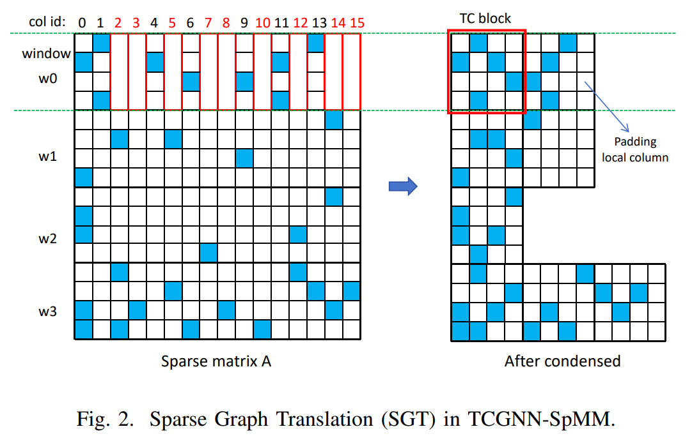
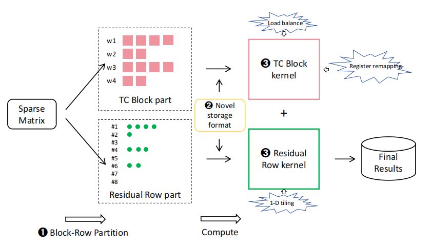



 
 
     作者: {{ author.name }}   邮箱：{{ author.email }}
 

# BRP-SpMM: Block-Row Partition Based Sparse
Matrix Multiplication with Tensor and CUDA Cores

# wechat blog 速读+原文

[mp.weixin.qq.com](https://mp.weixin.qq.com/s/Lc_8VzWiRhFvPr8N4zJGUA)

## 1.背景

稀疏矩阵运算，CUDA core兼容广泛使用的存储格式，如坐标格式（COO）和压缩稀疏行格式（CSR）；Tensor core要求输入数据必须符合NVIDIA定义的块格式，例如m16n8k8和m8n8k4（m*k · k*n = m*n）。

NVIDIA提供了两种主要的API用于TC编程：面向高级C代码的WMMA API、低级PTX代码中的mma API。TC主要针对GEMM优化，API并未涵盖稀疏计算所需的全部操作。所以目前利用TC进行SpMM工作，都通过结合mma PTX API与标准CUDA C代码实现。

Tensor Core（TC）在Nvidia GPU中专为16*16和8*8的小矩阵乘设计，速度快。但是SpMM是稀疏矩阵乘，稀疏矩阵中的0会浪费算力。

现有方案是将稀疏矩阵分块，找到非零多的块压缩成TC Block交给TC加速。

当前存在的问题：

1. 内存访问效率低：非0元素数量和分布不可预测，导致非对齐访问，L2 cache利用率低。
    
    Gmem粒度128B，L2 cache line 32B。
    
    
    
    TC block列宽可能是2/1/3等等，不对齐。
    
2. 计算单元不匹配：某些TC Block还是太稀疏，应该交给CUDA core而非TC。
    
    如上面w1的第二个4*4，只有一个非0.
    
3. GPU kernel过大：一些多重优化后的kernel体积较大，指令数过多，可能超出指令缓存容量（A100 128KB），导致取指停顿。
    
    如DTC-SpMM，用了PTX mma+双缓冲+向量加载+寄存器重映射。
    
    而VectorSparse指出I-cache miss会导致较多性能损失。
    

## 2.设计与实现

创新点：

1. BRP（block-row partition）划分稀疏矩阵为TC和RR
2. 存储TC和RR的格式
3. 两个kernel，负载均衡+寄存器重映射、一维平铺

### 2.1.BRP块-行划分

以m行（示例图中m为4，实际为16，更匹配WMMA操作）、8列作为一个TC block。其中，每列仅有一个非0值。

如图a，w0行，共10个非0值，则拆分为8+2。同一列有多个非0值的，会被拆分为多列，保证每列仅有一个非0值。

w1正好8个，w2有5个，w3有13个。

4个block一组，正好包含32个元素128B，与L2 cache line的32B对齐。

### 2.2.存储格式

TC block：

RR：

因为一行可能有多列非0.

为什么要用rr代替csr：应为rr是残余的部分，只占少数几行，如果用csr，会浪费空间。同时也是窗口中挑出来的部分，行号不连续，所以需要指定。

### 2.3.kernel优化

负载均衡：传统SpMM因为每行稀疏情况不同，线程块负载不同。而TC block group大小固定，工作量相近。

寄存器重映射：传统方式对非0元素乘加，然后原子写回输出矩阵。

传统方法面向加载，如A00，将其使用充分，A00参与了C00和C01的计算。每乘法计算都要原子写回目标矩阵。

本文方法面向结果，针对C00，将A00B00的结果写入寄存器，然后累加，最后统一写回目标矩阵。

多个同时进行时，需要排队。改进方式，将多个mma指令（nvidia TC的矩阵乘加指令）的中间结果统一写到寄存器集合中，当前group计算完毕后一次性写回。

一维tiling：RR部分不规则、不成块、用TC低效。所以用一维线程块，沿矩阵B（通常是稠密矩阵）列方向展开，每次计算一行，每个线程负责一个向量点乘。

## 3.实验

几个类似工作以及库：

1. cuSPARSE SpMM，NVIDIA 提供的最常用SpMM库；
2. Sputnik，一种面向深度学习的稀疏库，基于CUDA Cores；
3. TCGNN-SpMM，最早利用Tensor Cores优化GNN中SpMM的研究；
4. DTC-SpMM，在Tensor Cores上实现的最新高效SpMM方法。

8个常用图数据集，稀疏度超过99%。（图的邻接矩阵）

### 3.1.加速比

BRP-SpMM在N=32、64、128、256时，相对cuSPARSE的平均加速比分别为 2.1×、1.8×、1.4×、1.4×，其中最佳性能出现在N=32。因为在32x4的线程块配置下，每个线程块包含四个warp，每个warp正好利用mma.m16n8k8指令处理8列输出矩阵，实现了线程资源的最大化利用。

### 3.2.预处理开销

BRP-SpMM和DTC-SpMM均基于TCGNN-SpMM构建。其中，TCGNN-SpMM依赖CPU进行格式转换，因此开销最长；而DTC-SpMM和本文的方法则充分利用GPU，实现了显著加速。

BRP方法中，预处理过程对所有行窗口并行执行。TC块通过列优先对非零元素进行排序，获取局部行索引。每个TC块中的非零元素数量固定，减少了索引计算所需的时间。一个线程块负责处理一个行窗口。对于剩余部分，先剔除空行，然后采用CSR格式进行压缩。

在DTC-SpMM中，由于难以确定每个TC块中非零元素的数量，导致识别线程索引的过程较复杂。

### 3.3.L2 cache命中率

命中率提升

### 3.4.存储空间

对比了CSR、COO、TCGNN-SpMM、DTC-SpMM、BRP-SpMM。

COO：横纵坐标+value；

CSR：按行压缩。存储值和列索引；通过行偏移数组来确定每行的起始位置。

values: [10, 20, 30, 40, 50, 60]
col_indices: [0, 2, 2, 0, 1, 3]
row_offsets: [0, 2, 3, 5, 6] (第 0 行从索引 0 开始，有 2 个元素；第 1 行从索引 2 开始，有 1 个元素...)

BRP-SpMM与COO格式极为接近，相比CSR格式，最多仅需额外50%的内存。

GCN为基础模型。

本文方法对50~80%的中等稀疏度不适用，同时对于过大矩阵中，RR中非0元素过少，也降低GPU利用率。