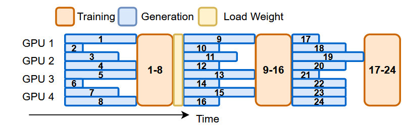



 作者: {{ author.name }}  
 邮箱：{{ author.email }}

# AREAL: A Large-Scale Asynchronous Reinforcement Learning System for Language Reasoning

[https://arxiv.org/abs/2505.24298](https://arxiv.org/abs/2505.24298)

[Wei Fu](https://arxiv.org/search/cs?searchtype=author&query=Fu,+W), [Jiaxuan Gao](https://arxiv.org/search/cs?searchtype=author&query=Gao,+J), [Xujie Shen](https://arxiv.org/search/cs?searchtype=author&query=Shen,+X), [Chen Zhu](https://arxiv.org/search/cs?searchtype=author&query=Zhu,+C), [Zhiyu Mei](https://arxiv.org/search/cs?searchtype=author&query=Mei,+Z), [Chuyi He](https://arxiv.org/search/cs?searchtype=author&query=He,+C), [Shusheng Xu](https://arxiv.org/search/cs?searchtype=author&query=Xu,+S), [Guo Wei](https://arxiv.org/search/cs?searchtype=author&query=Wei,+G), [Jun Mei](https://arxiv.org/search/cs?searchtype=author&query=Mei,+J), [Jiashu Wang](https://arxiv.org/search/cs?searchtype=author&query=Wang,+J), [Tongkai Yang](https://arxiv.org/search/cs?searchtype=author&query=Yang,+T), [Binhang Yuan](https://arxiv.org/search/cs?searchtype=author&query=Yuan,+B), [Yi Wu](https://arxiv.org/search/cs?searchtype=author&query=Wu,+Y)

IIIS, Tsinghua University; Ant Research; HKUST

## **Introduction**

- **Background:** Reinforcement learning (RL) has become a trending paradigm for training large language models (LLMs), particularly for reasoning tasks.
- **Problem:** Most existing large-scale RL systems for LLMs are synchronous by alternating generation and training in a batch setting, where the rollouts in each training batch are generated by the same (or latest) model.
    - This stabilizes RL training but suffers from severe system-level inefficiency.
    - Generation must wait until the longest output in the batch is completed before model update, resulting in GPU underutilization.
    - Synchronous systems distribute generation across all devices, reducing the per-GPU decoding batch size.
- **Motivation:** This paper presents AReaL, a fully asynchronous RL system that completely decouples generation from training.
    - The goal of AReaL is to completely decouple generation from training without hurting the final performance.
    - Rollout worker continuously generates new outputs without waiting, leading to high GPU utilization.
    - Meanwhile, the trainer workers in AREAL run parallel model updates whenever a training batch is obtained from the rollout workers.
    - Once the model is updated, we synchronize the model weights in each rollout worker.
- **Challenge and Method:**
    - In such an asynchronous design, each training batch of AREAL may contain samples generated by different model versions.
    - Therefore, AReaL inocorporates a modified objective of the PPO algorithm, which can leverage samples generated from much older model versions without any performance drop.
    - Several system-level optimizations, including interruptible rollout workers, dynamic batching for variable-length outputs, and parallel reward service.

## **Method**

### System overview

- **Interruptible Rollout Worker:** Handles two types of requests:
    - The `generate` request generates responses given prompts
    - The `upload_weights`  request interrupts all ongoing generations and loads parameters of new versions. Upon the interruption, the rollout workers discard KV caches computed by old weights, and re-compute them using the new weights.
- **Reward Service.**
- **Trainer Workers:** Continuously sample from the replay buffer, accumulating data until reaching the configured training batch size, then perform PPO updates.
- **Rollout Controller:**
    - Reads data from the dataset and invokes the rollout worker’s generate request.
    - The received response is then sent to the reward service to obtain the reward.
    - The trajectory, along with the reward, is stored in the replay buffer, waiting to be trained by the model worker.
    - Calls the rollout worker’ to update weights.

### Staleness-aware  training

- Introduce a hyperparameter η representing the maximum permitted staleness in each training batch for stalenessaware training.
- In particular, when η = 0, our system degenerates to synchronous RL with all training samples generated by the current policy.

### Decoupled PPO Objective

- The main difference between the asynchronous PPO objective in Equation 5.
    - 当不发生clip的时候，asynchornous PPO和conventional PPO的目标函数是完全一致的
    - In asynchronous training, using the behavior policy as the proximal policy will pull the latest policy towards the old-version and low-quality policies, thus slowing down model improvements.
    - By **employing a recent policy as the proximal policy**, model updates happen within the trust region around the high-quality proximal policy.

## **Experiments**

- Implementation
    - Implement AREAL using Python and PyTorch built upon the ReaLHF framework.
    - Combines SGLang v0.4.6 for generation serving with Megatron-Core v0.11.0 as the training backend
- Configurations
    - Model: R1-Distilled-Qwen.
    - Dataset:
        - Math: Open-source dataset from DeepScaleR
        - Coding: Open-source dataset from DeepCoder
    - Staleness: η = 4 for coding and η = 8 for math.
    - Resource allocation: 3/4 of the devices for inference.
- Main results on AIME24 and LiveCodeBench:
    - 2.77x speedup without performance degradation

- Ablation studies:
    - Effectiveness of decoupled PPO Objective

- Interruptible generation:
    - Without interruptible generation, the controller must wait for the longest response

## **Conclusion**

- This paper introduces AREAL, a fully asynchronous system designed for efficient large-scale reinforcement learning (RL) training.
- Contribute several algorithmic innovations, including staleness-aware training and a decoupled PPO objective, which enable efficient and stable PPO training in asynchronous environments.