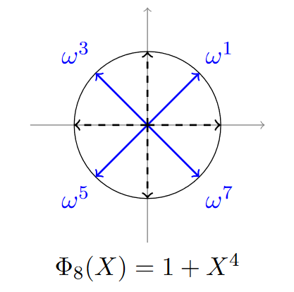



 作者: {{ author.name }}  
 邮箱：{{ author.email }}

# Basic Math

## 1 Some notations

* $$\mathbb{R}[X]$$ ：多项式集合，其多项式的所有系数（coefficients）都在$$\mathbb{R}$$中。例如，$$\mathbb{Z}[X]$$代表所有系数为整数的多项式。
* $$\mathbb{Z}_a[x]/(x^n +1)$$: 系数为$$\{\lceil - \frac{a}{2} \rceil , \dots,  \lfloor \frac{a}{2} \rfloor\}$$，不超过$$n$$阶的多项式。

## 2 商环（The Quotient Ring）

商环 $$\mathbb{C}[X]/(X^N +1)$$ 是通过将多项式 $$\mathbb{C}[X]$$ 模 $$X^N +1$$.

例子: $$\mathbb{C}[X]/(X^3 -1)$$:

$$\mathit{p}(X) = X^4 + 2X^2 +3$$. 模 $$X^3 -1$$:

$$
X^4 \equiv X \cdot X^3 \equiv X \cdot 1 = X.
$$

因此, $$\mathit{p}(X) = X + 2X^2 +3$$.

商环主要作用是构建一个**有限域**，其在后续的典范嵌入中也起到重要作用。

## 3 `N`次单元根（The `N`-th roots of Unity）

`N`次单位根是以下方程的复数解:

$$
z^N =1.
$$

这些根的解为: 

$$
\omega = e^{2\pi ik/N}, k = 0,1,2,...,N-1
$$

其中， $$\left\{\omega = e^{2\pi ik/n} \mid \gcd(k, n) = 1\right\}$$ 是 **本原`N`次根**。因为只有当 $$\omega$$ 为n次方时才等于1，即$$\omega^n =1$$ ，也称之为阶为n的单元根。
## 4 RLWE问题

一个加密方案通常会基于一个困难问题来设计，而LWE问题就是同态加密方案里的常用困难问题。

**LWE（Learning with Errors）问题**：
* 给定一个随机矩阵 $$A \in \mathbb{Z}_q^{n \times m}$$ ，一个秘密向量 $$\mathbf{s} \in \mathbb{Z}_q^n$$​，以及一个“噪声”向量 $$\mathbf{e}$$，目标是通过观测 $$(A, \mathbf{b} = A\mathbf{s} + \mathbf{e} \mod q)$$ 来恢复 $$\mathbf{s}$$。
* 噪声 $$\mathbf{e}$$ 通常来自某个已知的概率分布（如离散高斯分布）。
由于噪声的加入，恢复 $$\mathbf{s}$$ 是极其困难的。

**RLWE（Ring Learning with Errors）** 是LWE问题的一个重要变体，通过将LWE问题的矩阵运算结构化为多项式环上的运算，显著提高了效率，同时保留了其计算难度和安全性。
典型的环定义为：
- $$R = \mathbb{Z}[x] / (f(x))$$，其中 $$f(x)$$ 是一个不可约多项式（通常为 $$x^n + 1$$，且 $$n$$ 是2的幂）。
- 元素定义在模数 $$q$$ 的有限域上，即 $$R_q = \mathbb{Z}_q[x] / (f(x))$$。
给定：
- 一个公开的多项式 $$a(x) \in R_q$$​；
- 一个秘密多项式 $$s(x) \in R_q$$​；
- 一个误差多项式 $$e(x) \in R$$（通常取自某个离散高斯分布或均匀分布）；
计算：
$$b(x) = a(x) \cdot s(x) + e(x) \pmod{q}.$$
目标是从 $$(a(x), b(x))$$ 中恢复秘密多项式 $$s(x)$$。

RLWE中的多项式乘法可以用快速傅里叶变换（FFT）实现复杂度为$$O(nlog^n)$$的算法，而LWE中的矩阵运算复杂度为$$O(n^2)$$。  

## 5 典范嵌入

典范嵌入（Canonical embedding）是一种将**多项式**转为**向量**的方法。

给定多项式 $$a(x) \in \mathbb{Z}[x] / (f(x))$$，其 Canonical Embedding 的定义如下：

$$
\Phi(a(x)) = (\sigma_1(a(x)), \sigma_2(a(x)), \dots, \sigma_n(a(x)))
$$

其中 $$\sigma_i$$​ 表示将 $$x$$ 替换为 $$f(x)$$ 的第 $$i$$ 个根 $$\alpha_i$$​，即：

$$
\sigma_i(a(x)) = a(\alpha_i).
$$

这里 $$\alpha_i$$​ 是 $$f(x)$$ 在复数域中的根。所以Canonical Embedding 的定义可简化为：

$$
\Phi(a(x)) = (a(\alpha_1), a(\alpha_2), \dots, a(\alpha_n))
$$

示例：
**输入：**
- 定义多项式 $$f(x) = x^3 - x - 1$$（不可约）。
- 被嵌入的多项式 $$a(x) = 2x^2 + 3x + 5$$。

**过程：**
1. **求根**： $$f(x)$$ 的三个根为 $$\alpha_1, \alpha_2, \alpha_3$$​。例如：$$\alpha_1 \approx 1.32, \quad \alpha_2 \approx -0.66 + 0.56i, \quad \alpha_3 \approx -0.66 - 0.56i$$
2. **计算嵌入值**： 对 $$a(x) = 2x^2 + 3x + 5$$，依次计算：
		$$a(\alpha_1) = 2\alpha_1^2 + 3\alpha_1 + 5$$
		$$a(\alpha_2) = 2\alpha_2^2 + 3\alpha_2 + 5$$ 
		$$a(\alpha_3) = 2\alpha_3^2 + 3\alpha_3 + 5$$ 
	代入根的值后，得到三个复数结果。
3. **构造向量**： 嵌入向量为：
    $$\Phi(a(x)) = (a(\alpha_1), a(\alpha_2), a(\alpha_3))$$

**输出：**
* 嵌入向量（近似值）： $$\Phi(a(x)) \approx (11.56, 8.34 + 4.72i, 8.34 - 4.72i).$$

最终多项式 $$a(x) = 2x^2 + 3x + 5$$ 可以用  $$\Phi(a(x)) \approx (11.56, 8.34 + 4.72i, 8.34 - 4.72i)$$ 表示。
如果我们将 $$a(x) \in \mathbb{Z}[x] / (f(x))$$ 中的 $$f(x)$$ 表示为$$x^N =1$$, 那么它的根就为`n`次单元根$$\omega = e^{2\pi ik/N}$$，其典范嵌入就是将`n`次单元根带入到$$a(x)$$中进行求解出长度为n的向量。

## 6 圆分多项式

### 6.1 圆分多项式的定义
圆分多项式（cyclotomic polynomial）是一种特殊的多项式，它的根将圆等分。其定义如下：

$$
\Phi_n(x) = \prod_{\substack{1 \leq k \leq n \\ \gcd(k, n) = 1}} \left(x - e^{2\pi i k / n}\right)
$$

$$\Phi_n(x)$$ 是整系数多项式，在有理数域中$$\mathbb{Q}$$中不可约（可理解为多项式中的“质数”），它具备以下的递归关系：

$$
x^n - 1 = \prod_{d \mid n} \Phi_d(x)
$$   

那么$$\Phi_n(x) = \frac{x^n - 1}{\prod_{d \mid n, \, d < n} \Phi_d(x)}$$ 。

**例子**：
* $$\Phi_1(x) = x - 1$$, 因为 $$(x^1 - 1)$$ 的根是 $$1$$.
* $$\Phi_2(x) = x + 1$$, 因为$$x^2 - 1 = (x - 1)(x + 1) = \Phi_1(x)\Phi_2(x)$$.
* $$\Phi_3(x) = x^2 + x + 1$$, 因为$$\Phi_3(x) = \frac{x^3-1}{\Phi_1(x)}$$.
* $$\Phi_6(x) = x^2 - x + 1$$, 因为$$\Phi_6(x) = \frac{x^6-1}{\Phi_1(x)\Phi_2(x)\Phi_3(x)}$$.

根据定义，我们可以知道圆分多项式的根是是 `n`-次单位根中的那些指数 $$k$$ 满足 $$\gcd(k, n) = 1$$。也就是我们之前提到的本原`n`次根 $$\left\{\omega = e^{2\pi ik/n} \mid \gcd(k, n) = 1\right\}$$。 

它的几何含义可以理解为在单位圆上选出本原单位根，并通过这些根构造一个最低次的整系数多项式。
### 6.2 根的共轭性
根据代数基本定理，多项式的系数为实数时，其复根必须成共轭对出现。这是因为实系数多项式 $$f(x)$$ 满足：$$f(z) = 0 \implies f(\overline{z}) = 0$$。

所以，圆分多项式的根成共轭对出现。圆分多项式从 $$(x^n - 1)$$ 中去掉低次因子得到，因此其根是所有 `n`-次单位根中与低次约数无关的部分。这些根是本原单位根，必然包含成对的复共轭，因为：$$e^{2\pi ik/n},e^{-2\pi ik/n}$$ 总是一起出现在$$\Phi_n(x)$$的根集合中。

例如，$$\Phi_3(x) = x^2 +x+1$$。
它的根是$$e^{2\pi i/3}$$ 和$$e^{4\pi i/3}$$:
* $$e^{2\pi i/3}= -\frac{1}{2} + i\frac{\sqrt{3}}{2}$$ 
* $$e^{4\pi i/3}= -\frac{1}{2} - i\frac{\sqrt{3}}{2}$$ 

### 6.3 二次幂阶圆分多项式
二次幂阶圆分多项式（power-of-two degree cyclotomic polynomials）是圆分多项式中较为独特的多项式，其定义如下：

$$
\Phi_{2^k}(x) = \frac{x^{2^k}-1}{x^{2^{k-1}}-1}
$$

它的性质如下：
* $$\deg(\Phi_{2^k}(x)) = \varphi(2^k) = 2^{k-1}$$
* 它的根为：$$\omega = e^{2\pi i / 2^k}, \, \omega^3, \, \omega^5, \dots, \omega^{2^k-1}$$ ,其指数为小于$$2^k$$的奇数
* 它可简化为$$\Phi_{2^k}(x)=x^{2^{k-1}} +1$$

例子：
* $$\Phi_2(x) = x + 1$$
* $$\Phi_4(x) = x^2 + 1$$
* $$\Phi_8(x) = x^4 + 1$$

## 7 典范嵌入 in 二次幂阶圆分多项式

在 Canonical Embedding 中，多项式的根被映射到复数空间：
- 每个根 $$z_k$$ 都会被作为一个数据点；
- 根的复共轭 $$\bar{z_k}$$​ 必然是同一多项式的另一根。

由于二次幂阶圆分多项式的根成共轭出现，那么只有一半的根是独立的，另一半只是它们的镜像。所以在 Canonical Embedding 中，我们只需要取独立的根即可。

取独立的根可以通过取根的半区间来实现。例如当 $$n = 3$$ 时，$$\Phi_8(x) = x^4 + 1$$，根为：$$\omega^1, \, \omega^3, \, \omega^5, \, \omega^7$$。我们只需选取  $$\omega^1, \omega^3$$ 对应 $$k = 1, 3$$，因为  $$\omega^5$$ 和 $$\omega^7$$ 是它们的共轭。

在群论中，我们可以通过乘法子群$$\{\pm 1\}$$  来实现取根的半区间，它将根分为正方向（独立根），负方向（共轭根）两部分。几何直观上理解：它只取了圆的上半部分，下半部分可以看作上半部分的自然投影。

