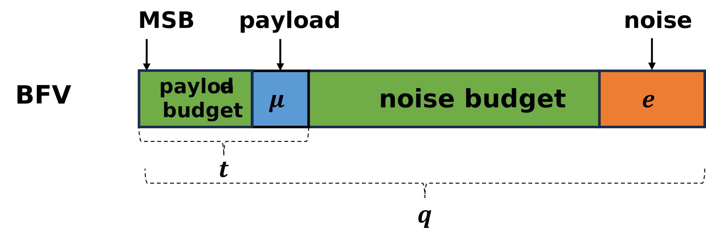
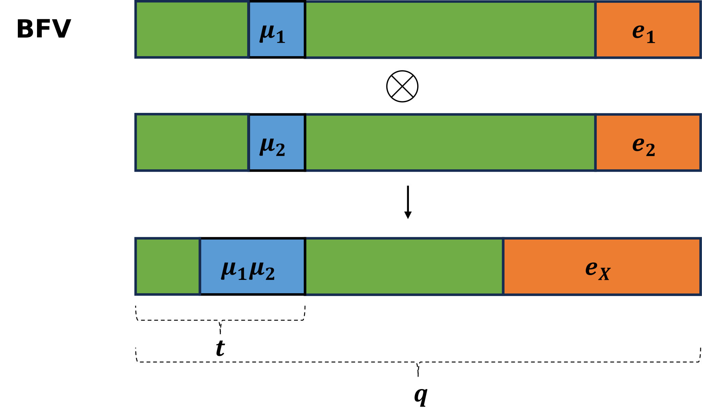

# 1 BFV

## 1.1 Plaintext and Ciphertext spaces

* Plaintext: $$\mathcal{P} = R_t = \mathbb{Z}_t[x]/(x^n+1)$$ , $$t \in \mathbb{Z}$$
* Ciphertext: $$\mathcal{C} = R_q \times R_q$$ , $$R_q \in \mathbb{Z}_q[x]/(x^n +1)$$

一般，$$n = 2^k$$ , $$k \in \mathbb{Z}$$。也就是说，一般为二次幂阶分圆多项式。
一般，$$q$$ 会远远大于$$t$$，前者往往代表了可进行同态计算的空间。

## 1.2 Parameters

参数除了包含1.1中$$(t,q,n)$$，还包含以下参数：
* $$R_2$$：整数系数为$$\{-1,0,1\}$$的n次多项式，用于生成密钥
* $$\mathcal{X}$$ ：离散高斯分布
* $$R_q$$：$$R_q$$的均匀随机分布

具体的参数选择，参见[Homomorphic encryption security standard](https://eprint.iacr.org/2019/939)。

## 1.3 Plaintext Encoding and Decoding

整数编码方案(The integer encoding scheme)：
对于给定的Message $$m$$, 我们通过如下操作将其转化为明文 $$M$$：
1. 二进制表示$$m$$，$$m = a_{n-1}\dots a_2a_1a_0$$
2. 转成多项式$$M =a_{n-1}x^{n-1}+\dots+a_2x^2+a_1x+a_0$$ ，一般来说，n很大，没用的位会置0

在后续计算的过程中，系数和阶数都会增长，所以我们要确保
1. 系数不超过$$t$$的范围
2. 阶数不超过$$n$$的范围

## 1.4 Key Generation

密钥分为两类，私钥**SK** (The secret key) 和公钥**PK** (The public key)。

**SK** : 从$$R_2$$中随机生成多项式，即系数为$$\{-1,0,1\}$$的n次多项式
**PK**：是一对多项式（$$PK_1$$, $$PK_2$$）
* $$PK_1 = [-1(a\cdot\text{SK} +e)]_q$$ 
* $$PK_2 =a$$
其中 $$a$$ 是 $$R_q \in \mathbb{Z}_q[x]/(x^n +1)$$ 中的一个随机多项式，$$e$$是从$$\mathcal{X}$$中随机抽样的误差多项式。$$[\cdot]_q$$ 意味着多项式系数要模$$q$$。

## 1.5 Encryption and Decryption

**加密：**
 首先生成三个**小的**随机多项式，$$u$$ from $$R_2$$，$$e_1,e_2$$ from $$\mathcal{X}$$。
 然后生成密文（Ciphertext）$$C = (C_1,C_2)$$：
 * $$C_1 = [PK_1\cdot u +e_1+\Delta M]_q$$ ：屏蔽的明文信息
 * $$C_2 = [PK_2 \cdot u +e_2]_q$$ ：解密的辅助信息
 这里的$$\Delta = \lfloor \frac{q}{t} \rfloor$$，可以理解为将$$M$$放大了。那么$$M$$在高位，噪音$$e$$就在低位，如下图所示：
 

**解密：**
解密就是加密的逆过程，$$M$$通过如下方式计算：

$$
M = [\lfloor\frac{t[C_1+C_2\cdot SK]_q}{q}\rceil]_t
$$

我们对M的计算方式按步骤分析。

首先：

$$\begin{aligned}
C_1 +C_2\cdot SK  &= PK_1 \cdot u + \Delta M + (PK_2 \cdot u + e_2) \cdot SK\\
 &= \Delta M - e\cdot u + e_1 + e_2 \cdot SK \\
 &= \Delta M + v
 \end{aligned}$$

这里省略了一些计算过程，可自行验证。我们使用 $$v$$ 来代表误差。这里，我们需要注意 $$v$$ 的无限范数，即$$v$$ 中绝对值最大的系数，它最有可能破坏我们的信息$$M$$。而 $$v = - e\cdot u + e_1 + e_2 \cdot SK$$ ，这里的$$e,e_1,e_2,SK$$都是很小的多项式，由参数$$\beta$$（离散高斯分布$$\mathcal{X}$$的参数） 限制，具体的，$$\|v\|_\infty = 2n\beta^2 +\beta$$ 。

其次：

$$\begin{aligned}
[C_1 +C_2\cdot SK]_q  &= [\Delta M + v]_q \\
&= \Delta M + v + q\cdot r
 \end{aligned}$$

然后：

$$\begin{aligned}
\frac{t[C_1 +C_2\cdot SK]_q}{q}  &= \frac{t(\Delta M + v + q\cdot r)}{q} \\
&= M + \frac{t}{q}\cdot v + t \cdot r
 \end{aligned}$$

最终：

$$\begin{aligned}
[\lfloor\frac{t[C_1+C_2\cdot SK]_q}{q}\rceil]_t  &= [\lfloor M + \frac{t}{q}\cdot v + t \cdot r\rceil]_t \\
&= M 
 \end{aligned}$$

 round操作$$\lfloor \cdot \rceil$$ 去除掉了$$\frac{t}{q}\cdot v$$ ，模t操作$$[\cdot]_t$$去掉了$$t\cdot r$$ 。
 需要注意的是round操作，我们得确保$$\frac{t}{q}\cdot \|v\|_\infty < \frac{1}{2}$$ ，才不影响$$M$$。
 因为M是由二进制表示的，如果$$\frac{t}{q}\cdot \|v\|_\infty > \frac{1}{2}$$ ，我们在round时会将部分0解释为1，因为$$0+\frac{t}{q}\cdot \|v\|_\infty > \frac{1}{2}$$，反之亦然（注意无限范数是绝对值，可以将1解释为0） 。

## 1.6 Homomorphic Evaluation

### 1.6.1 EvalAdd

$$
EvalAdd(C^1,C^2) = ([C^1_1 + C^2_1]_q,[C^1_2 +C^2_2]_q) = (C^3_1,C^3_2) = C^3
$$

其证明较为简单，略。在最坏的情况，$$C^3$$中的噪音是$$C^1$$和$$C^2$$的噪音相加。

### 1.6.2 EvalMult

乘法的最终结果是输出$$M^1 \cdot M^2$$ ，但乘法是在密文上操作，所以我们先尝试将两个密文解密后相乘$$C^1(SK)\cdot C^2(SK)$$ 。

$$\begin{aligned}
C^1(SK) = \Delta M^1 + v_1 + q\cdot r_1 \\
C^2(SK) = \Delta M^2 + v_2 + q\cdot r_2
\end{aligned}$$

那么，

$$\begin{aligned}
(C^1\cdot C^2)(SK) = \Delta ^2M^1\cdot M^2 + \Delta(M^1 \cdot v_2 + M^2 \cdot v_1) + q(v1 \cdot r_2 + v_2\cdot r_1) \\
+ q\cdot \Delta(M^1 \cdot r_2 + M^2 \cdot r_1) + v_1\cdot v_2 + q^2\cdot r_1 \cdot r_2 
 \end{aligned}$$

在密文解密相乘中，我们的目标是获得$$\Delta M^1 \cdot M^2$$ ，所以将 $$(C^1\cdot C^2)(SK)$$ 缩放 $$\frac{1}{\Delta}$$ 即$$\frac{t}{q}$$，就能获得目标结果。

$$\begin{aligned}
\frac{t}{q}(C^1\cdot C^2)(SK) =\Delta [M^1\cdot M^2]_t + (M^1\cdot v_2+ M^2 \cdot v_1) + t(v_1\cdot r_2 + v_2\cdot r_1) \\ + r_v + (q-[q]_t)\cdot (r_M + M^1\cdot r_2 + M^2 \cdot r_1) + q\cdot t\cdot r_1 \cdot r_2 + \frac{t}{q}[v_1\cdot v_2]_\Delta \\
- \frac{[q]_t}{q}(\Delta M^1\cdot M^2 + M^1\cdot v_2 + M^2\cdot v_1 + r_v) \\
\end{aligned}$$

经过简化多项式并分析（已省略），我们得出噪音**线性增长**的结论，其中

$$
\|v_p\| = \|v_i\|\cdot 2\cdot t\cdot n^2\cdot \|SK\|
$$

这里，$$\|v_p\|$$ 代表乘法后的密文噪音，$$\|v_i\|$$ 代表输入密文的噪音。

最终，乘法可以用如下表示：

$$
EvalMult(C^1,C^2)=([\lfloor \frac{t(C^1_1 + C^2_1)}{q} \rceil]_q,[\lfloor \frac{t(C^1_1\cdot C^2_2 + C^1_2\cdot C^2_1)}{q} \rceil]_q,[\lfloor \frac{t(C^1_2 + C^2_2)}{q} \rceil]_q)
$$

可以看见，乘法将密文从三项变为两项，如果直接进行解密的话，需要另外的解密方法。后续，我们通过重线性化（Relinearization）将密文变为两项。

乘法在密文结构图上的表示如下：

## 1.7 Relinearization

重线性化就是在乘法后，将三项密文变为两项。
问题可形式化为，对于密文$$C = \{C_1,C_2,C_3\}$$ ，找到一个密文$$C^* = \{C_1^*,C_2^*\}$$ ,使得

$$
 [C_1 + C_2 \cdot SK + C_3 \cdot SK^2]_q \approx [C_1^* + C_2^*\cdot SK + r]_q
$$

成立。

为了访问$$SK^2$$，我们引入新的密钥 evaluation key $$EK = (-(a\cdot SK + e)+SK^2,a)$$ ，其中$$EK_1 +EK_2 \cdot SK = SK^2 -e$$ 。然后，我们可以通过如下方式计算$$C^*$$：

$$\begin{aligned}
C_1^* = [C_1 + EK_1 \cdot C_3]_q \\
C_2^* = [C_2 + EK_2 \cdot C_3]_q
\end{aligned}$$

我们可对$$C^*$$进行验证：

$$\begin{aligned}
C_1^* +C_2^*\cdot SK  &=C_1 + EK_1 \cdot C_3 + SK\cdot (C_2 + EK_2 \cdot C_3) \\
 &= C_1 + C_2\cdot SK + C_3\cdot (EK_1 + EK_2 \cdot SK) \\
 &= C_1 + C_2\cdot SK + C_3 \cdot SK^2 + C_3 \cdot e
 \end{aligned}$$

 其中$$C_3$$的系数较大，但可以将其分解。

# 参考资料
[Introduction to the BFV encryption scheme](https://www.inferati.com/blog/fhe-schemes-bfv)

[Homomorphic encryption security standard](https://eprint.iacr.org/2019/939)

相关论文：
* Brakerski, Zvika. "Fully homomorphic encryption without modulus switching from classical GapSVP." Annual cryptology conference. Berlin, Heidelberg: Springer Berlin Heidelberg, 2012.
* Fan, Junfeng, and Frederik Vercauteren. "Somewhat practical fully homomorphic encryption." Cryptology ePrint Archive (2012). 