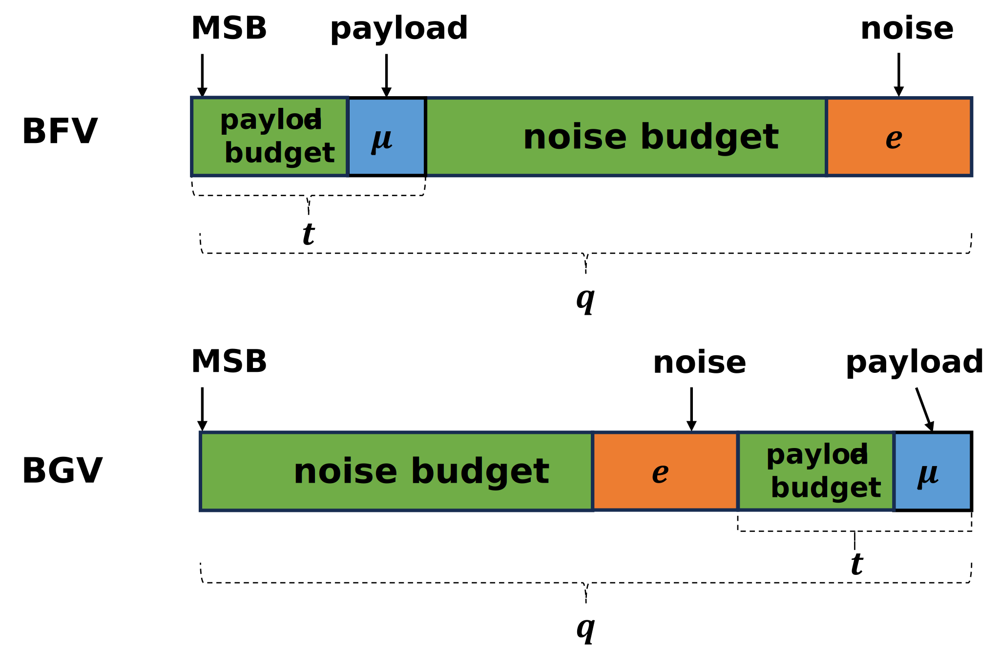
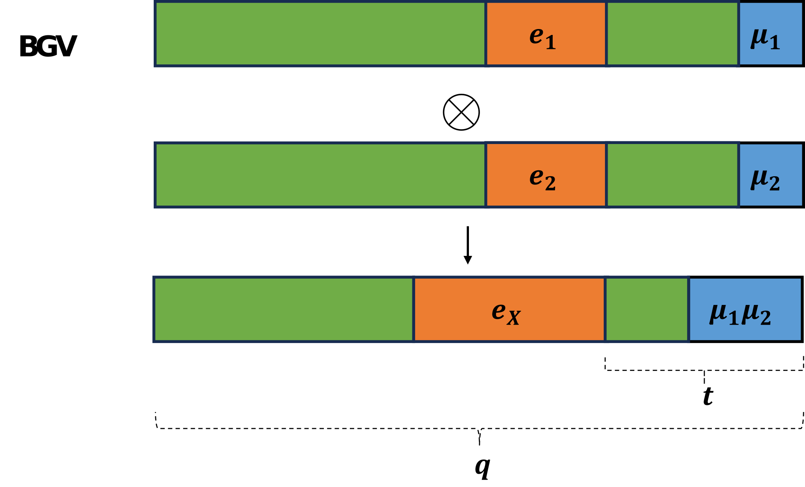
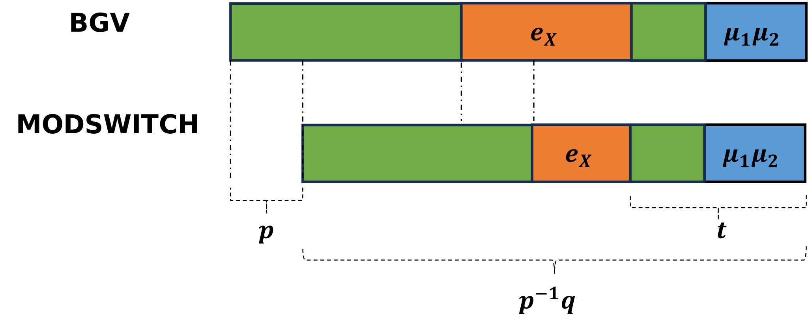



 作者: {{ author.name }}  
 邮箱：{{ author.email }}

# 2 BGV

在BFV中，密文的模数$$q$$是不会发生改变的，我们称之为scale-invariant，scale-independent。
但在BGV中，密文的模数$$q$$会随着计算发生改变，我们称之为scale-dependent。
BGV定义了一系列的模$$\{p_0,p_1,\dots,p_L\}$$，这些模使得密文构成了不同的level。对于一个模 $$q_l (0\leq l \leq L)$$   的密文，我们称这个密文处在 $$l$$ level。被加密的明文首先会处在 $$L$$ level，随着计算的推进，会从 $$l$$ 降低到 $$l -1$$，最终到达level 0。

另外在BFV中，明文处在密文的顶端，即MSB（Most Significant Bits），这是通过缩放 $$\Delta$$ 实现的。
而在BGV中，明文处在密文的底端，即LSB（Least Significant Bits）。这在加密时详细讨论。

## 2.1 Plaintext and Ciphertext

与BFV相似，BGV的明文，密文空间如下：

* Plaintext: $$\mathcal{P} = R_t = \mathbb{Z}_t[x]/(x^n+1)$$ , $$t \in \mathbb{Z}$$
* Ciphertext: $$\mathcal{C} = R_{q_l} \times R_{q_l}$$ , $$R_{q_l} \in \mathbb{Z}_{q_l}[x]/(x^n +1)$$，$$q_l \in \mathbb{Z}$$ means level $$l$$

一般，$$n = 2^k$$ , $$k \in \mathbb{Z}$$。也就是说，一般为二次幂阶分圆多项式。
一般，$$q$$ 会远远大于$$t$$，前者往往代表了可进行同态计算的空间。

## 2.2 Parameters

与BFV相似，BGV的参数除了包含1.1中$$(t,q,n)$$，还包含以下参数：
* $$R_2$$：整数系数为$$\{-1,0,1\}$$的n次多项式，用于生成密钥
* $$\mathcal{X}$$ ：离散高斯分布
* $$R_q$$：$$R_q$$的均匀随机分布

## 2.3 Plaintext Encoding and Decoding

与BFV相似，BGV可使用整数编码方案(The integer encoding scheme)：
对于给定的Message $$m$$, 我们通过如下操作将其转化为明文 $$M$$：
1. 二进制表示$$m$$，$$m = a_{n-1}\dots a_2a_1a_0$$
2. 转成多项式$$M =a_{n-1}x^{n-1}+\dots+a_2x^2+a_1x+a_0$$ ，一般来说，n很大，没用的位会置0

在后续计算的过程中，系数和阶数都会增长，所以我们要确保
1. 系数不超过$$t$$的范围
2. 阶数不超过$$n$$的范围

## 2.4 Key Generation

**SK** : 从$$R_2$$中随机生成多项式，即系数为$$\{-1,0,1\}$$的n次多项式

**PK**：是一对多项式（$$PK_1$$, $$PK_2$$）
* $$PK_1 = [-1(a\cdot\text{SK} + t\cdot e)]_{q_L}$$ 
* $$PK_2 =a$$

其中 $$a$$ 是 $$R_q \in \mathbb{Z}_q[x]/(x^n +1)$$ 中的一个随机多项式，$$e$$是从$$\mathcal{X}$$中随机抽样的误差多项式。$$[\cdot]_q$$ 意味着多项式系数要模$$q$$。
BGV与BFV的区别在于，误差 $$e$$ 被放大了 $$t$$ 倍。

## 2.5 Encryption and Decryption

**加密：**
首先生成三个**小的**随机多项式，$$u$$ from $$R_2$$，$$e_1,e_2$$ from $$\mathcal{X}$$。

然后生成密文（Ciphertext）$$C = (C_1,C_2)$$：
 * $$C_1 = [PK_1\cdot u +t\cdot e_1+ M]_{q_l}$$ ：屏蔽的明文信息
 * $$C_2 = [PK_2 \cdot u +t\cdot e_2]_{q_l}$$ ：解密的辅助信息

在密文 $$C_1$$ 中，噪音 $$e$$ 被放大了 $$t$$ 倍，而 $$M$$ 并没有缩放 $$\Delta$$。 
 
对比BFV中的加密方式：
* $$C_1 = [PK_1\cdot u +e_1+\Delta M]_q$$ 
* $$C_2 = [PK_2 \cdot u +e_2]_q$$ 

我们可以得到以下的密文结构对比图：

**解密：**
解密就是加密的逆过程，$$M$$通过如下方式计算：

$$
M = [[C_1+C_2\cdot SK]_{q_l}]_t
$$

其中：

$$
C_1 + C_2 \cdot SK = M + t\cdot v
$$

因此得确保$$\|v\|_\infty < \frac{q_l}{2t}$$，这样才不损坏 $$M$$。原理与BFV相似。  

## 2.6 Homomorphic Evaluation

### 2.6.1 EvalAdd

加法与BFV类似。

$$
EvalAdd(C^1,C^2) = ([C^1_1 + C^2_1]_{q_l},[C^1_2 +C^2_2]_{q_l}) = (C^3_1,C^3_2) = C^3
$$

其证明较为简单，略。在最坏的情况，$$C^3$$中的噪音是$$C^1$$和$$C^2$$的噪音相加。

### 2.6.2 EvalMult

与BFV中类似，我们先尝试将两个密文解密后相乘$$C^1(SK)\cdot C^2(SK)$$ 。

$$\begin{aligned}
C^1(SK) = M^1 +t\cdot v_1 + q\cdot r_1 \\
C^2(SK) = M^2 +t\cdot v_2 + q\cdot r_2
\end{aligned}$$

那么，

$$\begin{aligned}
(C^1\cdot C^2)(SK) = M^1\cdot M^2 + t(M^1\cdot v_2 + M^2\cdot v_1 + t\cdot v_1 \cdot v_2)
 \end{aligned}$$

可以发现，密文的噪音是以乘积 $$t\cdot v_1 \cdot v_2$$ 增长，即呈指数级增长（不同于BFV线性增长）。所以BGV中引入了 ModSwitch 技术来控制噪音的指数级增长。

同样的，BGV的乘法可用如下表示：

$$
EvalMult(C^1,C^2)=([C^1_1 + C^2_1]_{q_l},[C^1_1\cdot C^2_2 + C^1_2\cdot C^2_1]_{q_l},[C^1_2 + C^2_2]_{q_l})
$$

与BFV类似，在BGV中，密文多项式经过乘法后，由两项变为三项，所以需要用到重线性化的技术。

乘法在密文结构图上的表示如下：

## 2.7 Relinearization

与BFV类似，BGV的重线性化只是有模数的差别。
重线性化就是在乘法后，将三项密文变为两项。
问题可形式化为，对于密文$$C = \{C_1,C_2,C_3\}$$ ，找到一个密文$$C^* = \{C_1^*,C_2^*\}$$ ,使得

$$
 [C_1 + C_2 \cdot SK + C_3 \cdot SK^2]_{q_l} \approx [C_1^* + C_2^*\cdot SK + r]_{q_l}
$$

成立。

为了访问$$SK^2$$，我们引入新的密钥 evaluation key $$EK = (-(a\cdot SK + e)+SK^2,a)$$ ，其中$$EK_1 +EK_2 \cdot SK = SK^2 -e$$ 。然后，我们可以通过如下方式计算$$C^*$$：

$$\begin{aligned}
C_1^* = [C_1 + EK_1 \cdot C_3]_{q_l} \\
C_2^* = [C_2 + EK_2 \cdot C_3]_{q_l}
\end{aligned}$$

我们可对$$C^*$$进行验证：

$$\begin{aligned}
C_1^* +C_2^*\cdot SK  &=C_1 + EK_1 \cdot C_3 + SK\cdot (C_2 + EK_2 \cdot C_3) \\
 &= C_1 + C_2\cdot SK + C_3\cdot (EK_1 + EK_2 \cdot SK) \\
 &= C_1 + C_2\cdot SK + C_3 \cdot SK^2 + C_3 \cdot e
 \end{aligned}$$

 其中$$C_3$$的系数较大，但可以将其分解。

## 2.8 ModSwitch

模数变换（ModSwitch）用于控制乘法计算中的噪音增长。它的主要思想是将密文 $$C$$ 的模数 $$q$$ 降低为 $$q'$$，但不改变私钥 $$SK$$。其数学表达如下：  

$$
[C(SK)]_q = [C'(SK)]_{q'}
$$

细节上，这个变换是将密文 $$C$$ 的系数缩放 $$\frac{q'}{q}$$ 并合适round，即

$$
C' = [\frac{q'}{q}\cdot C]
$$

之前我们提到，BGV定义了一系列的模数 $$\{p_0,p_1,\dots,p_L\}$$ ，随着计算的推进，模数就从$$l$$ 降低为 $$l-1$$。
另外，模数的降低并不会影响加密的**明文**，因为对于$$q_l$$ ，其中$$l \in \{0,\dots,L\}$$

$$
q_l \equiv q_L \mod t 
$$

可以简单理解为不影响密文中低 $$t$$ 位。

Modswitch在密文结构图上的表示如下：

# 参考资料
[Introduction to the BGV encryption scheme](https://www.inferati.com/blog/fhe-schemes-bgv)

[Homomorphic encryption security standard](https://eprint.iacr.org/2019/939)

相关论文：
* Brakerski, Zvika, Craig Gentry, and Vinod Vaikuntanathan. "(Leveled) fully homomorphic encryption without bootstrapping." ACM Transactions on Computation Theory (TOCT) 6.3 (2014): 1-36.