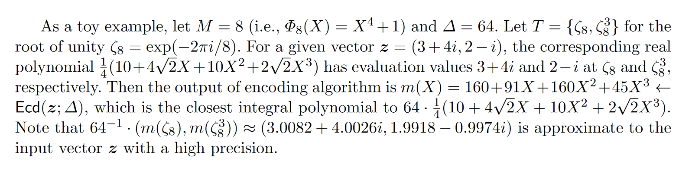
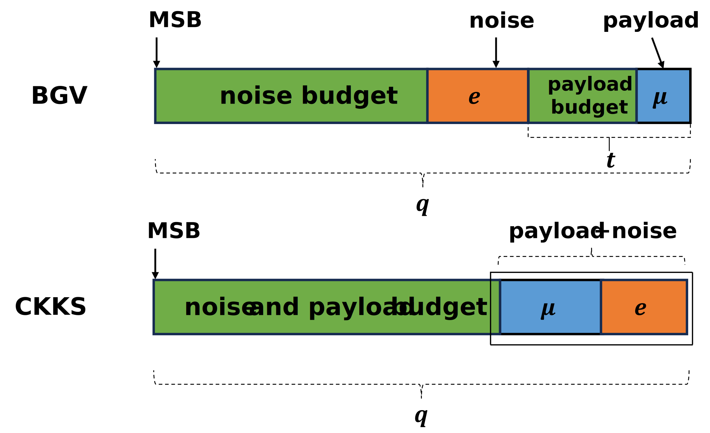
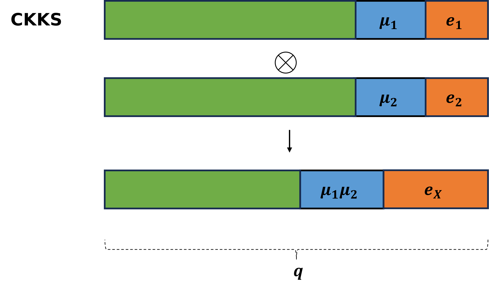
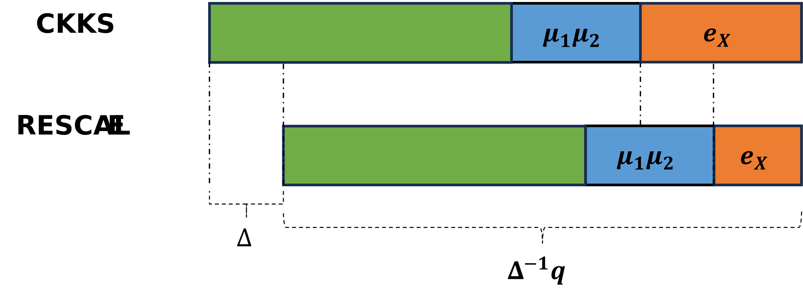

# 3 CKKS

不同于BFV和BGV针对整数计算，CKKS是一个针对实数近似计算的加密方案。其核心思想是将RLWE噪音 $$e$$ 视作Message $$m$$ 的一部分。因为如果噪音 $$e$$ 相对于 $$m$$ 足够小，那么在计算过程中就不会影响 $$m$$ 。RLWE噪音可以近似看作浮点运算的截断处理产生的误差。随着计算深度增加，噪音也会逐渐增加，CKKS引入了 RESCALE 操作用作截断处理来减少噪音，其与BGV的 MODSWITCH 极其相似。另外，与BGV相同，CKKS也是scale-dependent的加密方案，它也定义了一系列的模$$\{p_0,p_1,\dots,p_L\}$$。

## 3.1 Plaintext and Ciphertext

CKKS的密文空间如下：

* Plaintext: $$\mathcal{P} = \mathbb{Z}_q[x]/(x^n+1)$$
* Ciphertext: $$\mathcal{C} = (\mathbb{Z}_q[x]/(x^n+1))^2$$

一般，$$n = 2^k$$ , $$k \in \mathbb{Z}$$。也就是说，一般为二次幂阶分圆多项式。

## 3.2 Parameters

与BFV,BGV些微不同，CKKS的参数包含$$(\Delta,q,n)$$，还包含以下参数：
* $$R_2$$：整数系数为$$\{-1,0,1\}$$的n次多项式，用于生成密钥
* $$\mathcal{X}$$ ：离散高斯分布
* $$R_q$$：$$R_q$$的均匀随机分布

## 3.3 Plaintext Encoding and Decoding

相对于BFV，BGV来说，CKKS的编码方案较为复杂。

在CKKS中， Message $$m$$ 属于复数空间，明文 $$p$$ 属于整数多项式环。
其数学表示为：$$m \in C^{N/2}, p \in \mathbb{Z}[X]/(X^N + 1)$$ 。 我们根据典范嵌入可以将 $$p$$ 表示为 $$m$$, 这也是解码的过程。而编码就是其逆过程。

在介绍CKKS映射详细过程前，我们先熟悉以下Notations：
* $$\mathcal{R} = \mathbb{Z}[X]/(X^N + 1) = \mathbb{Z}[X]/\Phi_{M}(x)$$: 整数多项式商环，模$$X^N +1$$。也可表示为$$\mathbb{Z}[X]/\Phi_{M}(x)$$ ，其中$$\Phi_{M}(x)$$是一个二次幂阶圆分多项式，$$\deg(\Phi_{M}(x)) = \varphi(M) = N$$。那么这个多项式的根就为$$\omega = e^{2\pi i / M},\, \omega^3, \, \omega^5, \dots, \omega^{M-1}$$,指数为小于M的奇数。
* $$\mathbb{Z}_M^* =\{ x \in \mathbb{Z}_M : \gcd(x,M)=1 \}$$:  当$$M = 2^k$$, 那么$$\mathbb{Z}_M^*$$ 为小于M的奇数。
* $$T$$ 是 $$\mathbb{Z}_M^*$$的乘法子群，满足$$\mathbb{Z}_M^*/T = \{ \pm 1\}$$。在二次幂阶圆分多项式下，可简单理解为取了前半部分的奇数。
* $$\mathbb{H} = \left\{ z = (z_j)_{j \in \mathbb{Z}_M^*} \in \mathbb{C}^N : z_j = \overline{z_{-j}}, \, \forall j \in \mathbb{Z}_M^* \right\}$$ 。可以看作$$z = (z_j)_{j \in T}$$的共轭扩展。
* $$\pi : (z_j)_{j \in \mathbb{Z}_M^*} \mapsto (z_j)_{j \in T}$$ 。自然投影。几何直观理解：将单位圆的下半部投影到上半部。
* $$\sigma$$  。典范嵌入（Canonical embedding）。$$\sigma(\mathcal{R})$$ 即将多项式典范嵌入为向量。

CKKS编码的详细过程如下：
1. 从复数中选择 $$N/2$$ 维的向量$$z = (z_i)_{i \in T}$$ ；
2. $$\pi^{-1}(z) \in \mathbb{H}$$ ，将 $$z$$ 共轭拓展；  
3. $$\sigma^{-1}\pi^{-1}(z) \in \mathcal{R}$$ ?

这里需要注意，典范嵌入$$\sigma(\mathcal{R})$$ 得到的结果是 $$\mathbb{H}$$ 的子集，因为$$\sigma(\mathcal{R})$$只是在本原根上计算的结果。所以需要找到一个在$$\sigma(\mathcal{R})$$中的向量来表示$$\pi^{-1}(z)$$。回想$$\mathcal{R}$$有 $$\mathbb{Z}$$ -bais $$\{1,X,\dots,X^{N-1}\}$$。那么$$\sigma(\mathcal{R})$$ 也有bais $$\{\sigma(1),\sigma(X),\dots,\sigma(X^{N-1}\}$$，可理解为一个向量空间 。我们在$$\sigma(\mathcal{R})$$向量空间找到一个向量$$\left\lfloor \pi^{-1}(z) \right\rceil_{\sigma(R)}$$ 来代替$$\pi^{-1}(z)$$。这样的近似替代会导致一定的误差，所以我们可以先将$$\pi^{-1}(z)$$ 乘以 $$\Delta \geq1$$ ,再进行离散化，这样误差就减小为原来的$$\frac{1}{\Delta}$$ 。

最终CKKS的编码的详细过程如下：
1. 从复数中选择 $$N/2$$ 维的向量$$z = (z_i)_{i \in T}$$ ；
2. $$\pi^{-1}(z) \in \mathbb{H}$$ ，将 $$z$$ 共轭拓展；  
3. $$\Delta\pi^{-1}(z),\Delta \geq 1$$，乘以放大系数；
4. $$\left\lfloor \Delta\pi^{-1}(z) \right\rceil_{\sigma(R)}$$，离散化到$$\sigma(\mathcal{R})$$中；
5. $$\sigma^{-1}\left\lfloor \Delta\pi^{-1}(z) \right\rceil_{\sigma(R)} \in \mathcal{R}$$。

最后，放一个CKKS原论文中的例子：

## 3.4 Key Generation

**SK** : 从$$R_2$$中随机生成多项式，即系数为$$\{-1,0,1\}$$的n次多项式
**PK**：是一对多项式（$$PK_1$$, $$PK_2$$）
* $$PK_1 = [-a\cdot\text{SK} + e]_{q_L}$$ 
* $$PK_2 =a$$

其中 $$a$$ 是 $$R_{q_L} \in \mathbb{Z}_{q_L}[x]/(x^n +1)$$ 中的一个随机多项式，$$e$$是从$$\mathcal{X}$$中随机抽样的误差多项式。$$[\cdot]_{q_L}$$ 意味着多项式系数要模$$q_L$$。

## 3.5 Encryption and Decryption

**加密：**
 首先生成三个**小的**随机多项式，$$u$$ from $$R_2$$，$$e_1,e_2$$ from $$\mathcal{X}$$。
 然后生成密文（Ciphertext）$$C = (C_1,C_2)$$：
 * $$C_1 = [PK_1\cdot u +e_1+ M]_{q_l}$$ ：屏蔽的明文信息
 * $$C_2 = [PK_2 \cdot u + e_2]_{q_l}$$ ：解密的辅助信息

 注意，在编码时，我们已经将M缩放了$$\Delta$$，因此噪音 $$e$$ 相对于 M 来说很小。

对比BGV，我们得到以下的密文结构对比图：

**解密：**
解密就是加密的逆过程，$$M$$ 通过如下方式计算（因为是近似计算，我们使用$$M^*$$来表示最后解密出的信息）：

$$
M^* = [C_1+C_2\cdot SK]_{q_l}
$$

## 3.6 Homomorphic Evaluation

### 3.6.1 EvalAdd
加法与BFV，BGV类似。

$$
EvalAdd(C^1,C^2) = ([C^1_1 + C^2_1]_{q_l},[C^1_2 +C^2_2]_{q_l}) = (C^3_1,C^3_2) = C^3
$$

其证明较为简单，略。在最坏的情况，$$C^3$$中的噪音是$$C^1$$和$$C^2$$的噪音相加。注意，在加法前，两者的模的层数得相同，即同一个$$q_l$$，否则将较高层的模降低。这里降低模数的方式可以通过BGV中的 ModSwitch，也可以使用CKKS的Rescale。

### 3.6.2 EvalMult
乘法也与BFV，BGV类似。

$$
EvalMult(C^1,C^2)=([C^1_1 + C^2_1]_{q_l},[C^1_1\cdot C^2_2 + C^1_2\cdot C^2_1]_{q_l},[C^1_2 + C^2_2]_{q_l})
$$

在乘法后，多项式也从两项变为了三项，所以也需要在BFV中介绍的 Relinearization 技术将多项式缩减为两项。同样的，我们也需要确保在乘法前两个密文的模数相同。

注意，同BFV类似，CKKS在编码时引入了缩放因子 $$\Delta$$，所以在乘积后，缩放因子就变为了 $$\Delta ^2$$ ，为了控制 $$\Delta$$ 的增长，就需要 Rescale 技术。（注：BFV解决缩放因子 $$\Delta$$ 指数增长是通过在乘法后直接将密文缩放解决的。）

乘法在密文结构图上的表示如下：

## 3.7 Rescale

Rescale技术与Modswitch技术方法类似，但是前者还有控制 $$\Delta$$ 增长的目的，其定义如下：

$$
\text{RESCALE}(C,\Delta) = \frac{1}{\Delta}\cdot [C_1,C_2]_{q_l} = [C^*_1,C^*_2]_{q_{l-1}}
$$

Rescale在密文结构图上的表示如下：

# 参考资料
[Introduction to the CKKS encryption scheme](https://www.inferati.com/blog/fhe-schemes-ckks)

[Homomorphic encryption security standard](https://eprint.iacr.org/2019/939)

相关论文：
* Cheon, Jung Hee, et al. "Homomorphic encryption for arithmetic of approximate numbers." Advances in Cryptology–ASIACRYPT 2017: 23rd International Conference on the Theory and Applications of Cryptology and Information Security, Hong Kong, China, December 3-7, 2017, Proceedings, Part I 23. Springer International Publishing, 2017.