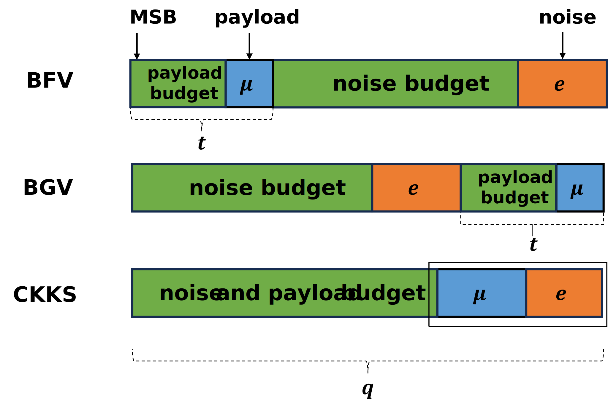
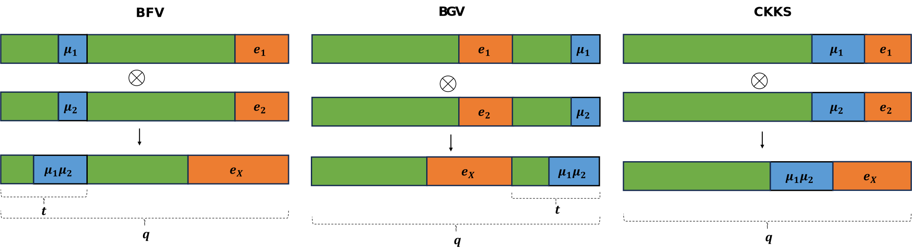
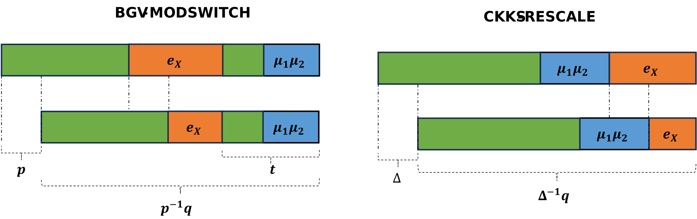

BFV，BGV，CKKS是同态加密中很著名的加密方案。前两者主要用于准确的整数运算，后者用于近似的实数运算。

在明文密文空间，参数和编码上，BFV与BGV基本相同。而CKKS的明文空间为实数，所以导致其编码较为复杂，参数也引入了额外的 $$\Delta$$，但不含参数 $$t$$ 。

在加密时，三种方案都不同。
* BFV放大$$M$$（即$$\Delta \cdot M$$）放在高位，噪音 $$e$$ 放在低位。 
* BGV将噪音$$e$$放大（即$$t\cdot e$$），$$M$$处在低位。
* CKKS则把$$M$$和噪音$$e$$放在一起，注意，其实在编码时，M也缩放了$$\Delta$$倍，所以M处在比$$e$$更高的位。
三类加密方案的密文结构图如下：

在进行同态计算时，三类加密方案中的同态加法运算都相同。同态乘法中，三类的密文都从两项变为了三项，所以都需要进行Relinearization。又因为三类加密方案的密文结构不同，所以需要一些不同的处理：
* BFV：因为放大了$$M$$（即$$\Delta \cdot M$$），所以密文乘法后（内积产生 $$\Delta ^2$$）需要将密文缩放 $$\frac{1}{\Delta}$$ 。
* BGV：不同于BFV中噪音呈线性增长，BGV中噪音呈指数级增长，所以引入了ModSwitch技术来控制噪音增长。
* CKKS：类似BFV，CKKS中引入了Rescale技术来截断密文，它不仅缩放了密文，还减少了噪音。

三类加密方案的乘法如下：

两类特殊处理（ModSwitch，Rescale）对比如下：

