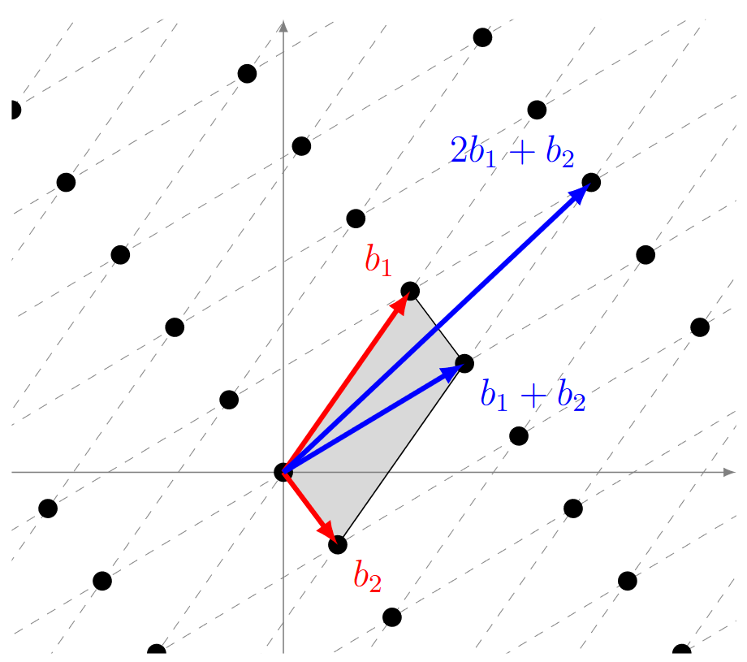



 作者: {{ author.name }}  
 邮箱：{{ author.email }}

## 基础知识

### 数论
**Def *The `N`-th roots of Unity（N次单元根）***：
>1. N次单元根是方程 $$z^N =1$$ 的解：$$\omega = e^{2\pi ik/N}, k = 0,1,2,...,N-1$$
>2. 本原`N`次根： $$\left\{\omega = e^{2\pi ik/n} \mid \gcd(k, n) = 1\right\}$$：阶为n的单元根 $$\omega^n =1$$ 
* 注：如果不满足 $$gcd(k,n)=1$$，那么 $$\omega$$ 阶就小于n，因为存在小于n的数m，使得 $$\omega^m =1$$

**Def *Cyclotomic polynomial（圆分多项式）***：
>1. $$\Phi_n(x) = \prod_{\substack{1 \leq k \leq n \\ \gcd(k, n) = 1}} \left(x - e^{2\pi i k / n}\right)$$
* 递推关系：$$x^n - 1 = \prod_{d \mid n} \Phi_d(x)$$
$$\Phi_n(x)$$ 是整系数多项式，它的根将圆等分，在有理数域中$$\mathbb{Q}$$中不可约（可理解为多项式中的“质数”）。

例子：
* $$\Phi_1(x) = x - 1$$, 因为 $$(x^1 - 1)$$ 的根是 $$1$$.
* $$\Phi_2(x) = x + 1$$, 因为$$x^2 - 1 = (x - 1)(x + 1) = \Phi_1(x)\Phi_2(x)$$.
* $$\Phi_3(x) = x^2 + x + 1$$, 因为$$\Phi_3(x) = \frac{x^3-1}{\Phi_1(x)}$$.
* $$\Phi_6(x) = x^2 - x + 1$$, 因为$$\Phi_6(x) = \frac{x^6-1}{\Phi_1(x)\Phi_2(x)\Phi_3(x)}$$.

**Def *Power-of-two degree cyclotomic polynomials（二次幂阶圆分多项式）***：
>1. $$\Phi_{2^k}(x) = \frac{x^{2^k}-1}{x^{2^{k-1}}-1}$$
* $$\deg(\Phi_{2^k}(x)) = \varphi(2^k) = 2^{k-1}$$
* 它的根为：$$\omega = e^{2\pi i / 2^k}, \, \omega^3, \, \omega^5, \dots, \omega^{2^k-1}$$ ,其指数为小于$$2^k$$的奇数
* 它可简化为$$\Phi_{2^k}(x)=x^{2^{k-1}} +1$$

例子：
* $$\Phi_2(x) = x + 1$$
* $$\Phi_4(x) = x^2 + 1$$
* $$\Phi_8(x) = x^4 + 1$$

### 格

**Def *Lattice（格）***：
>设 $$B = \{ b_1, b_2, \dots, b_k \}$$ 为 $$\mathbb{R}^n$$ 中一组线性无关的向量。由 $$B$$ 生成的格 $$L(B)$$ 定义为：
$$
L(B) = \left\{ a_1 b_1 + a_2 b_2 + \dots + a_k b_k \mid a_1, a_2, \dots, a_k \in \mathbb{Z} \right\}
$$

* 由上图所示，对于同形状的格，其基并不是唯一的（其可以通过行列式为 $$\pm 1$$ 的整数可逆矩阵（即 $$\mathrm{GL}_n(\mathbb{Z})$$ 中的变换）相互转换）
* 尽管它们张成相同的格，但基向量之间的几何性质（如长度与夹角）可能差异很大，因此可将其分为“优良基（good basis）”与“劣质基（bad basis）”，通常依据基向量的接近正交性或短小程度来评判。

例子：
1. 整数格 $$\mathbb{Z}^n$$ ：基为标准正交基$$\{e_1,e_2,\dots,e_n\}$$（优良基），形成“方格纸”的点阵

Def Span of Lattice（张成空间）：
1. $$Span(L(B)) = Span(B) = \left\{ a_1 b_1 + a_2 b_2 + \dots + a_k b_k \mid a_1, a_2, \dots, a_k \in \mathbb{R} \right\}$$
* $$Span(B)$$ 是由 $$B$$ 张成的向量空间，是连续的
* 而 $$L(B)$$ 就是这个空间中的格子点集合，是离散的、呈格子状分布，不构成向量空间

Def Fundamental domain of a lattice（基本域）：
1. $$\mathcal{F}(B) = \left\{ \sum_{i=1}^n \alpha_i v_i \;\middle|\; 0 \le \alpha_i < 1 \right\}$$
* $$\mathcal{F}(B)$$ 是格 $$L$$ 在空间中的一个“平铺单元”（即图中灰色部分），它们在空间中按格点平移可以无重叠地铺满整个 $$\operatorname{Span}(B)$$
* 基本域的体积就是该格的**行列式**（即格的协方差体积）：$$\mathrm{Vol}(\mathcal{F}(B)) = \|\det(B)\|$$

例子：
1. 整数格 $$\mathbb{Z}^2$$ ：基为 $$v_1 = (1, 0), v_2 = (0, 1)$$；基本域是单位正方形：$$\mathcal{F} = \{ x e_1 + y e_2 \mid 0 \le x, y < 1 \}$$
2. 斜格（非正交格）：基：$$v_1 = (1, 0), v_2 = \left( \frac{1}{2}, \frac{\sqrt{3}}{2} \right)$$；基本域是一个平行四边形

Def Smallest distance（最短距离）：
1. $$\lambda_1(L) = \inf \left\{ \|x - y\| \mid x, y \in L, x \neq y \right\}$$ (inf：下确界)
* 格中两个不同点之间的最短距离

例子：
1. $$\lambda_1(\mathbb{Z}^2) = \| (1, 0) \| = 1$$
2. $$\lambda_1 \left( v_1 = (1, 0), v_2 = \left( \frac{1}{2}, \frac{\sqrt{3}}{2} \right) \right) = \min \left( \| v_1 \|, \| v_2 \|, \| v_1 - v_2 \|, \dots \right) = 1$$

### 抽象代数

#### 群
群是抽象代数最基础的代数结构，其定义如下：

**Def *Group（群）***：
>1. 定义了一种二元运算（加法 or 乘法，下面以乘法为例）
>2. 运算满足结合律， $$(ab)c = a(bc)$$
>3. 存在单位元 $$e$$，使得 $$ae =ea =a$$
>4. 每个元素存在逆元， $$ab = ba = e$$，记作 $$b = a^{-1}$$
* If 满足交换律 $$ab =ba$$ , 那么该群称为 Abel（阿贝尔） 群或者交换群

例子：
1. **整数加法群：** $$(\mathbb{Z}, +)$$：加法；满足结合律；单位元0；n的逆元是-n；Abel群；
2. **模 $$n$$ 加法群 $$(\mathbb{Z}_n, +)$$**：模 $$n$$ 的整数加法，例如 $$\mathbb{Z}_5 = {0,1,2,3,4}$$；单位元0；1和4，2和3互为逆元；有限Abel群；

#### 环

**Def *Ring（环）***：
>1. 定义了两种二元运算 （加法和乘法）
>2. 加法构成了 Abel 群
>3. 乘法满足结合律，对加法满足分配律
* If 存在非0单位元（即1），那么该环称为有1单位元环
* If 乘法满足交换律 $$ab =ba$$ ，那么该环称为交换环
* If 对于 $$R$$ 中的非0元素（$$R^{*}$$） 构成乘法群，即每个非0元素都存在逆元，那么该环称为除环（Division Ring）或 体。
* If 对于$$a$$ ,存在 $$b \neq 0$$ , 使得 $$ab =0$$ ，那么称 $$a$$ 为（左）零因子
* If 不存在零因子，那么环称为整环

例子：
1. **整数环 $$(\mathbb{Z}, +, \cdot)$$** ：单位元1（乘法）；交换环；整环（无零因子）；
2. **模 $$n$$ 的整数环 $$\mathbb{Z}_n = \mathbb{Z}/n\mathbb{Z}$$**：单位元1（乘法）；交换环；n为质数时，无零因子，是整环；
3. 特殊的环：多项式环，商环
4. 交换除环 称作 Field（域）

**Def *Polynomial Ring（多项式环）***：
>1. $$R[x] = \{a_0+a_1x+a_2x_2+ \dots + a_nx_n | n \in \mathbb{N},a_i\in R\}]$$
* If $$R$$ 是交换环，则 $$R[x]$$ 是交换环
* If $$R$$ 是整环，则 $$R[x]$$ 是整环

例子：
1. **整数系数多项式环 $$\mathbb{Z}[x]$$**：元素形如：$$x^3 + 5x - 1$$，系数为整数；交换整环；
2. **有限域上的多项式环 $$\mathbb{Z}_p[x]$$**：例如：$$\mathbb{Z}_2[x]$$，系数为 $$\{0, 1\}$$，加法按模 2 运算

在介绍商环前，先介绍一下环的特殊子集，理想（Ideal）

**Def Ideal（理想）**：
>对于环 $$R$$ , 存在非空子集 $$I$$，满足：
>1. 减法封闭：$$a \in I, b \in I \Rightarrow \ a - b \in I$$
>2. (左)吸收性：$$\forall r \in R,a \in I \Rightarrow\ ra \in I$$
* 同理可得右吸收性
那么，我们称 $$I$$ 为（左）理想。同理可得右理想，双边理想。

例子：
1. 整数环中的理想 $$n\mathbb{Z}=\{nk \| k \in \mathbb{Z}\}$$：例如 $$2\mathbb{Z}=\{\dots,-4,-2,0,2,4, \dots\}$$;
2. 多项式环中的理想 $$(x) \subset \mathbb{R}[x]$$：$$(x)=\{xf(x)∣f(x)∈R[x]\}$$

**Def Proper ideal （真理想）**：
1. $$I\subseteq R$$ 是一个理想，且$$I \neq R$$ 

**Def Prime ideal（素理想）**：
设 $$R$$ 是一个交换环，$$I \subseteq R$$ 是一个真理想，那么对于任意 $$a, b \in R$$，若 $$ab \in I$$，则至少有一个 $$a \in I$$ 或 $$b \in I$$，即
$$
ab \in I \Rightarrow a \in I \quad or \quad b\in I
$$

* 可以将其类似为素数

例子：
1. 理想 $$(p) = p\mathbb{Z}$$ （$$p$$ 为素数）是素理想：理想 $$(5) = \{ 5k \mid k \in \mathbb{Z} \}$$ 是一个素理想，因为如果 $$ab \in (5)$$，即 $$5 \mid ab$$，则 $$5 \mid a$$ 或 $$5 \mid b$$。

**Def Quotient Ring（商环）**：
>1. $$R/I = \{r+I | r \in R\}$$
>2. 定义加法：$$(a+I)+(b+I)=(a+b)+I$$
>3. 定义乘法：$$(a+I)(b+I)=ab+I$$
* 商环 $$R/I$$ 的元素 $$r + I$$ 称为模 $$I$$ 剩余类。

例子：
1. 模 $$n$$ 整数环：$$\mathbb{Z}/n\mathbb{Z}=\{0+n\mathbb{Z},1+n\mathbb{Z},…,(n−1)+n\mathbb{Z}\}$$；例如模5的整数运算就是 $$\mathbb{Z}/5\mathbb{Z}$$（这也是称为模 $$I$$ 剩余类的原因）；
2. 多项式商环 $$\mathbb{R}[x]/(x^2 + 1)$$

**Def Homomorphism**:
>设 $$R$$ 和 $$R'$$ 是两个环，如果 $$R$$ 和 $$R'$$ 存在映射 $$\sigma$$ : 对于 $$\forall a,\ b \in R$$
>1. $$\sigma{(a+b)} = \sigma{(a)}+\sigma{(b)}$$
>2. $$\sigma{(ab)} = \sigma{(a)}\sigma{(b)}$$
>3. $$\sigma{(1)} = 1'$$
  则称 $$\sigma$$ 是环 $$R$$ 到 $$R'$$ 的一个同态映射，如果 $$\sigma$$ 是双射，则称为同构（Isomorphism）映射。

#### 域（圆分数域）

**Def *Field（域）***：
>1. $$(F,+)$$ 构成交换群
>2. $$(F/\{0\},\cdot)$$ 构成交换群
* 简单来说，$$F$$ 是交换除环

例子：
1. 有理数域 $$\mathbb{Q}$$
2. 实数域 $$\mathbb{R}$$
3. 复数域 $$\mathbb{C}$$
4. $$Z$$ 不是域，因为非零元素不存在乘法逆 

**Def *Algebraic Number（代数数）***：
>1. 对于一个**复数** $$\alpha \in \mathbb{C}$$，如果存在一个系数全为**有理数**的非零多项式
$$
f(x) = a_0 + a_1 x + \cdots + a_n x^n \in \mathbb{Q}[x], \quad (a_n \neq 0)
$$
使得 $$f(\alpha) = 0$$，那么我们称 $$\alpha$$ 为 algebraic number。

**Def *Algebraic Integer（代数整数）***：
>1. 对于一个**复数** $$\alpha \in \mathbb{C}$$，如果存在一个**首一整系数**多项式（即首项系数为 1 的整数系数多项式）
$$
f(x) = x^n + a_{n-1} x_{n-1} + \cdots + a_1x_1 + a_0, \quad (a_i \in \mathbb{Z})
$$
使得 $$f(\alpha) = 0$$，那么我们称 $$\alpha$$ 为 algebraic integer。

**Def *Field Extension（域扩张）***：
>1. 设 $$F$$ 和 $$K$$ 都是域，如果：$$F \subseteq K$$，且 $$F$$ 在 $$K$$ 中的加法和乘法结构保持不变（也就是说，$$F$$ 是 $$K$$ 的子域），那么我们称：
$$
K \text{ 是 } F \text{ 的一个扩张域，记作 } K/F
$$

* **理解：** 从 $$F$$ 开始，通过添加新的元素（比如代数方程的根）来“扩展”它，形成一个更大的域 $$K$$；也可以将 $$K$$ 看作 $$F$$ 上的向量空间，维度为$$[K:F]=n$$；

例子：
1. $$\mathbb{Q} \subseteq \mathbb{Q}(\sqrt{2})$$：$$\mathbb{Q}(\sqrt{2})$$ 是所有形如 $$a + b\sqrt{2} \quad​ (a, b \in \mathbb{Q})$$ 的数；维度为 $$[\mathbb{Q}(\sqrt{2}):\mathbb{Q}]=2$$；

**Def *Algebraic Extension（代数扩张）***：
>1. 设 $$K/F$$ 是一个域扩张，如果：对每一个 $$\alpha \in K$$，它在 $$F$$ 上都是代数的（每个 $$\alpha \in K$$ 都是某个非零有理系数多项式 $$f(x) \in F[x]$$ 的根），那么这种扩张就叫做代数扩张。

例子：
1. $$\mathbb{Q} \subseteq \mathbb{Q}(\sqrt{2})$$ 是代数扩张：$$\sqrt{2}$$​ 是 $$x^2 - 2$$ 的根；所有 $$a + b\sqrt{2} \in \mathbb{Q}(\sqrt{2})$$ 也都是 $$\mathbb{Q}$$ 上代数的

**Def *Splitting Field（分裂域）***
>设 $$F$$ 是一个域，$$f(x) \in F[x]$$ 是一个非零多项式。
  那么，某个扩域 $$K \supseteq F$$ 被称为 $$f(x)$$ 在 $$F$$ 上的分裂域，如果满足以下两个条件：
>1. $$f(x)$$ 在 $$K$$ 中完全分解为一次因子，即：

$$
f(x) = a(x - \alpha_1)(x - \alpha_2) \cdots (x - \alpha_n), \quad \alpha_i \in K
$$

>2. $$K$$ 是这样的最小域 —— 也就是说：  $$K = F(\alpha_1, \alpha_2, \dots, \alpha_n)$$
* 换句话说，分裂域是包含所有 $$f(x)$$ 根的最小扩域。

例子：
1. $$f(x) = x^2 - 2 \in \mathbb{Q}[x]$$：它的根是 $$\pm \sqrt{2}$$，不在 $$\mathbb{Q}$$ 中；但在扩域 $$\mathbb{Q}(\sqrt2)$$中，$$f(x)=(x−\sqrt2​)(x+\sqrt2​)$$；所以$$\mathbb{Q}(\sqrt{2})$$ 是 $$f(x)$$ 的分裂域

**Def *Cyclotomic Field（圆分数域）*:**
>1. 设 $$n$$ 是一个正整数，令 $$\zeta_n$$ 表示一个原始 $$n$$ 次单位根，即满足：$$\zeta_n^n =1,\zeta_n^k \neq 1 \quad (0<k < n)$$。则圆分数域 $$\mathbb{Q}(\zeta_n)$$：由 $$\mathbb{Q}$$ 与 $$\zeta_n$$​ 生成的最小扩域，即包含 $$\zeta_n$$​ 的最小的有理数域扩张。
* $$\zeta_n$$​ 是 $$x^n - 1$$ 的根
* $$\mathbb{Q}(\zeta_n)$$ 是 $$x^n - 1$$ 的最小不可约因子（即第 $$n$$ 个圆分多项式 $$\Phi_n(x)$$）的分裂域
* 当然，$$\mathbb{Q}(\zeta_n)$$也是代数扩张域

**Def *Ring of algebraic integers（代数整数环）***：
>1. $$\mathcal{O}_K$$ : $$K$$ 中的所有代数整数
* 例子：$$\mathcal{O}_\mathbb{Q} = \mathbb{Z}$$

这里，需要特别注意圆分数域的代数整数环 $$\mathcal{O}_{\mathbb{Q}(\zeta_n)} = \mathbb{Z}[\zeta_n]$$ 的特殊性质：
1. **Monogenic**  
2. **Dedekind**：Dedekind 域中任意非零理想可以**唯一分解**为素理想的乘积

Def Monogenic：
1. 设 $$K$$ 是一个数域（即 $$\mathbb{Q}$$ 的有限扩张），其代数整数环记为 $$\mathcal{O}_K$$​。若存在某个代数整数 $$\theta \in \mathcal{O}_K$$​，使得：$$\mathcal{O}_K = \mathbb{Z}[\theta]$$。则称这个数域 $$K$$ 是 **monogenic** 的。
* 换句话说，如果一个代数整数 $$\theta$$ 的所有 $$\mathbb{Z}$$-线性组合：$$a_0 + a_1\theta + \dots + a_{n-1}\theta^{n-1}, \quad a_i \in \mathbb{Z}$$，刚好就生成了所有 $$\mathcal{O}_K$$​ 中的元素（其中 $$n = [K:\mathbb{Q}]$$），那么 $$K$$ 就是 monogenic 的。
* 那么 $$\{1, \theta, \theta^2, \dots, \theta^{n-1}\}$$ 就是 $$\mathcal{O}_K$$​ 的一个 **整基（integral basis）**。

例子：
1. 圆分数域代数整数环$$\mathcal{O}_{\mathbb{Q}(\zeta_n)} = \mathbb{Z}[\zeta_n]$$，其整基为$$\{ 1, \zeta_n, \zeta_n^2, \dots, \zeta_n^{\varphi(n)-1} \}$$

Dedekind域和理想：为了更好地理解Dedekind域，我们使用另一种方式来看待理想。我们可以看到，$$\mathcal{O}_K$$ 与 $$\mathbb{Z}$$ 有很多性质相似。但是 $$\mathcal{O}_K$$ 没有独特的质因数分解（而$$\mathbb{Z}$$ 中的任何一个数可以表示为唯一的质数乘积）。 例如，在 $$\mathbb{Q}(\sqrt{-5})$$ 中，我们可以将 $$6$$ 表示为 $$2\cdot 3$$ 或 $$(1+\sqrt{-5})\cdot (1-\sqrt{-5})$$，而在 $$\mathbb{Z}$$ 中，能唯一表示成 $$2\cdot 3$$。Kummer 发现，我们如果拥有 “ideal numbers” $$p_i$$ ，使得

$$
2=p_1p_2,\quad 1+\sqrt{-5}=p_1p_3,\quad 3=p_3p_4,\quad 1-\sqrt{-5}=p_2p_4
$$

那么，独特的分解仍然存在。Dedekind就将这个结构转换成了抽象代数中的理想（Ideal），使得（在Dedekind域中）任意非零理想可以唯一分解为素理想的乘积。

Def fractional ideal （分式理想）：
一个 $$R$$-子集 $$I \subset K$$ 是一个分式理想，当且仅当满足以下三个条件：
1. $$I$$ 是一个 $$R$$-模；
2. 存在 $$0 \neq d \in R$$ 使得 $$dI \subseteq R$$ ；
3. $$I \neq \{0\}$$；
* （monogenic性质）：$$\mathcal{O}_K$$ 中的每一个（分式）理想都是一个秩为 $$n = [K : \mathbb{Q}]$$ 的自由 $$\mathbb{Z}$$-模；即，它可以表示为某个基 $$\{u_1, \dots, u_n\} \subset \mathcal{O}_K$$​ 的所有 $$\mathbb{Z}$$-线性组合的集合。
* 这个基就是我们将（分式）理想转换为格的关键

## 数学结构

### 多项式商环

在FHE加密方案中，我们通常使用多项式商环 $$Z_q[x]/f(x)$$ 作为基本单位。其中$$f(x)$$多为圆分多项式$$\Phi(x)$$ 。

**Def *多项式商环***：$$R_q = Z_q[X]/\Phi_m(X)$$，通常 $$m$$ 为2的幂 （即$$\Phi_{2^k}(x)=x^{2^{k-1}} +1$$），$$q$$ 为模数。 

### 圆分数域的代数整数环

多项式商环与圆分域整数环同构，即 $$\mathbb{Z}_q[X]/\Phi_m(X) \cong \mathbb{Z}[\zeta_m]/q\mathbb{Z}[\zeta_m]$$ 。

同构解释如下：令 $$\varphi(m)=n$$，则
* $$\mathbb{Z}_q[X]/\Phi_m(X) = \mathbb{Z}_q[X]/(x^n+1) =\{a_0+a_1x+a_2x^2+\dots+a_{n-1}x^{n-1}\}$$
* $$\mathbb{Z}[\zeta_m]/q\mathbb{Z}[\zeta_m]= \{b_0+b_1\zeta_m + b_2\zeta_m^2+\dots+b_{n-1}\zeta_m^{n-1}\}$$

可以很清晰地看出存在一个同构映射。

在后续分析中，我们就直接将这个多项式商环看作圆分数域的代数整数环 $$\mathcal{O}_{\mathbb{Q}(\zeta_m)}$$。

### 理想格

#### Embedding & Minkowski embedding
Def embedding：
1. 在数域 $$K \cong \mathbb{Q}[X]/f(X)$$（$$f(X)$$不可约） 中，我们可以选取 $$n=[K:\mathbb{Q}]$$ 个不同的 $$\alpha$$ （$$f(X)$$的 $$n$$ 个根）来定义扩张域 $$K = \mathbb{Q}(\alpha)$$。
2. 每个根 $$\alpha$$ 都可以定义一个embedding $$\sigma:K \rightarrow \mathbb{C}$$ 。

例子：
3. $$K = \mathbb{Q}(\sqrt2)\cong \mathbb{Q}[X]/x^2-2$$：有两个根$$\sqrt2,-\sqrt2$$，故存在两个embedding $$\sigma$$：$$\sqrt2 \rightarrow \sqrt2$$ 和 $$\sqrt2 \rightarrow -\sqrt2$$
* 在以上例子中，当数域 $$K$$ 嵌入的像落在实数域 $$\mathbb{R}$$ 中时，称其为实嵌入（real embedding）。
* 如果嵌入的像不在 $$\mathbb{R}$$ 中，而在 $$\mathbb{C}$$ 中，则称为**复嵌入**，并且复嵌入总是成对出现，互为共轭。
1. 在数域 $$K = \mathbb{Q}(\zeta_3)$$ 中，有两个复嵌入：$$\sigma(\zeta_3) = \zeta_3,\quad \bar{\sigma}(\zeta_3) = \zeta_3^{-1}$$ 它们构成一对共轭的复嵌入。

Def Minkowski embedding：
设 $$K$$ 是一个 数域，即 $$\mathbb{Q}$$ 的有限扩张。记：
- $$r_1$$​：$$K$$ 中的实嵌入（即 $$\sigma_i: K \hookrightarrow \mathbb{R}$$ 的个数）；
- $$r_2$$：复共轭嵌入对的个数（即 $$2r_2$$​ 个复嵌入 $$\sigma_j: K \hookrightarrow \mathbb{C}$$，每对共轭计为一对）；
- $$n = [K : \mathbb{Q}] = r_1 + 2r_2$$​：数域的次数。
1. 定义映射 $$\Phi: K \to \mathbb{R}^{r_1} \times \mathbb{C}^{2r_2}$$​：$$\Phi(x) = \left( \sigma_1(x), \dots, \sigma_{n}(x) \right)$$

Minkowski embedding 利用了数域 $$K$$ 的所有共轭嵌入（即实嵌入和成对的复共轭嵌入），将 $$K$$ 嵌入到欧几里得空间 $$\mathbb{R}^{r_1} \times \mathbb{C}^{2r_2}$$​ 中，其中 $$r_1$$​ 是实嵌入个数，$$r_2$$​ 是复共轭对的个数。  
在这个嵌入下，$$K$$ 的整数环 $$\mathcal{O}_K$$​ 的像构成该空间中的一个格（lattice）。

在有的文献里，Canonical embedding 指的就是 Minkowski embedding。它也有另一种变体：将$$K$$ 映射到 $$\mathbb{R}^n$$ 中，即$$\Phi: K \to \mathbb{R}^{n}$$。

Def Canonical embedding：
- $$r_1$$​：$$K$$ 中的实嵌入（即 $$\sigma_i: K \hookrightarrow \mathbb{R}$$ 的个数）；
- $$r_2$$：复共轭嵌入对的个数（即 $$2r_2$$​ 个复嵌入 $$\sigma_j: K \hookrightarrow \mathbb{C}$$，每对共轭计为一对）；
- $$n = [K : \mathbb{Q}] = r_1 + 2r_2$$​：数域的次数。
1. 定义映射 $$\Phi: K \to \mathbb{R}^n$$​：$$\Phi(x) = \left( \sigma_1(x), \dots, Re(\sigma_{r_1+1}(x)), Im(\sigma_{r_1+1}(x)),\dots,Re(\sigma_{r_1+r_2}(x)), Im(\sigma_{r_1+r_2}(x)) \right)$$
2. $$Re:$$ 实部，$$Im$$：虚部

在后续介绍中，以论文《On Ideal Lattices and Learning with Errors over Rings》中的空间 $$H \subseteq \mathbb{R}^{r_1} \times \mathbb{C}^{2r_2}$$ 为准。

#### 理想格

之前提到，$$\mathcal{O}_K$$ 中的每一个（分式）理想都可以表示为某个基 $$\{u_1, \dots, u_n\} \subset \mathcal{O}_K$$​ 的所有 $$\mathbb{Z}$$-线性组合的集合。因此，在Minkowski embedding $$\sigma$$ 下，理想 $$I$$ 生成一个秩为 $$n$$ 的理想格 $$\sigma(I)$$，其基为 $$\{\sigma(u_1), \dots, \sigma(u_n)\} \subset H$$。

在进行 Minkowski embedding 后，理想格的几何直观如下：
- 环元素 $$p(x)\in R$$ 通过Minkowski embedding $$\sigma$$ 被映射为 $$H$$ 中的向量 $$\sigma(p(x))$$ 。  
- 环 $$R$$ 中的一个理想 $$I\subset R$$ 则被映射为 $$H$$ 中的一个离散点集 $$\sigma(I)$$，这些点构成一个格。由于环的代数结构，这些理想格通常具有特定的对称性 。  
- 多项式的“大小”（例如其范数）对应于其嵌入向量的欧几里得长度。“小”多项式即对应于短的嵌入向量。

理想格继承了环 $$\mathcal{O}_K$$ 的额外代数结构。这种结构使得它们在表示上更紧凑（例如，一个理想可以用少量生成元描述，而一个一般格的基需要 $$n^2$$ 个系数），从而提高了基于它们的密码方案的效率。

### 数据结构间的联系

我们从多项式商环 $$\mathbb{Z}_q[X]/\Phi_n(X)$$ 出发，该结构同构于 $$\mathbb{Z}[\zeta_n]/q\mathbb{Z}[\zeta_n]$$。
而$$\zeta_n$$ 所在的数域 $$\mathcal{O}(\zeta_n)$$ 的整数环 $$\mathcal{O}_{\mathbb{Q}(\zeta_n)} = \mathbb{Z}(\zeta_n)$$ ，其（分式）理想可通过Minkowski embedding嵌入到 $$\mathbb{R}^{r_1} \times \mathbb{C}^{2r_2}$$ 中，形成理想格。

## 不同数据结构下的困难问题

### Lattice（格）

#### SVP
**Def *SVP***：
>给定一个格 $$L$$，SVP（Shortest Vector Problem）要求找到格 $$L$$ 中一个非零向量 $$v$$，使其在特定范数（通常是欧几里得范数 $$L_2$$​）下长度最短。形式化地，SVP 问题可以表示为：

$$
{找到 } v \in L, v \neq 0 \text{ 使得 } \|v\| = \lambda_1(L) = \min_{x \in L, x \neq 0} \|x\|
$$

  其中 $$\lambda_1(L)$$ 表示格 $$L$$ 的第一个最小长度（最短非零向量的长度）。

**几何直观：** 在格的所有非原点格点中，找到离原点最近的那个点 。这个最短向量代表了从一个格点跳到另一个不同格点所能实现的最短“跳跃”。

**困难性：** 尽管存在像LLL (Lenstra-Lenstra-Lovász) 这样的近似算法，它们能在多项式时间内找到一个长度在真实最短向量长度的指数因子范围内的向量，但精确求解或高质量近似SVP仍然非常困难 。

SVP存在几个重要的变体：
1. **GapSVP**
2. **Ideal-SVP**

Def GapSVP （Gap Shortest Vector Problem）：
判定问题：给定一个格 $$L$$ 的基，一个实数 $$\alpha>1$$，以及一个长度阈值 $$d>0$$。判定 $$\lambda_1(L) \leq d$$  或者 $$\lambda_1(L) >\alpha d$$。
* 许多加密方案的安全性被归约到 GapSVP 的困难性。

Def Ideal-SVP：
给定一个格 $$L$$ 的基，已知 $$L$$ 是一个理想格（即 $$L$$ 是某个数域的整数环中的一个理想，或者更普遍地，由某个环 $$R$$ 的理想通过嵌入产生的格）。找到格 $$L$$ 中的一个最短非零向量 $$\lambda_1(L)$$。
* 困难性：目前的共识是，对于精心选择的环和密码学相关参数，Ideal-SVP的困难性被认为与一般格上的SVP相当 。

#### CVP
**Def *CVP*：** 
>给定一个格 LLL 和一个目标向量 $$t \in \mathbb{R}^n$$（其中 $$t$$ 不一定在格 $$L$$ 中），**CVP**（Closest Vector Problem，最近向量问题）要求找到格 $$L$$ 中的一个向量 $$v$$，使得 $$v$$ 与 $$t$$ 之间的距离 $$\|v - t\|$$ 最小。形式化地，CVP 问题可以表示为：

$$
\text{找到 } v \in L \text{ 使得 } \| v - t \| = \min_{x \in L} \| x - t \|.
$$

**几何直观：** 给定空间中的一个任意点t（不必是格点），CVP的目标是找到网格上离 $$t$$最近的那个格点 。可以想象向一个标靶投掷飞镖，标靶上有效落点构成一个格，CVP就是找出飞镖实际落点最接近的那个有效格点。

**困难性：** CVP通常被认为比SVP更难 。精确求解CVP是NP难的，甚至在某些近似因子下近似求解CVP也是NP难的 。有趣的是，一个高效的CVP近似算法可以被用来高效地近似SVP 。这形式化了CVP至少与SVP一样难（甚至可能更难）的直观感觉。在一些格密码体制中，解密过程就对应于求解一个CVP实例 。

#### BDD
**Def *BDD*：** 给定一个格L，一个目标向量$$t\in \mathbb{R}^m$$以及一个距离 $$d$$，BDD问题是判断是否存在一个格向量 $$v\in L$$ 使得 $$∣|v−t∣|≤d$$。
在密码学中，**一个更常见的BDD变体**是：已知这样的 $$v$$ 存在且在以 $$t$$ 为中心、某个半径（例如 $$d<λ_1​(L)/2$$）的球内是唯一的，目标是找出这个 $$v$$ 。这本质上是一个带有“目标点离某个唯一格点非常近”承诺的CVP问题。

**几何直观：** 与CVP类似，但附加了一个保证，即目标点 $$t$$ 离某个格点非常近，并且是唯一近的格点。任务就是识别出这个唯一的邻近格点。

从SVP（关注格的内部结构特性）到CVP（引入外部目标点），再到BDD（带有承诺的CVP），这一系列问题的演化体现了从纯粹的格理论问题逐渐向密码学中常见的“译码”类任务的转变。LWE问题之后将被证明可以归约到BDD问题，这正揭示了它们之间的深刻联系。如果我们将LWE方程 $$b=As+e$$中的 $$As$$ 视为一个格点， $$b$$ 视为目标向量，那么 $$e$$ 就是它们之间的距离。当 $$e$$ 很小时，从 $$b$$ 恢复 $$s$$（进而恢复 $$As$$）就非常类似于解决一个BDD问题。

### LWE 

**Def *LWE***：给定 $$A \in \mathbb{Z}_q^{m \times n}$$，$$b = A s + e$$，其中 $$e$$ 来自某分布，求解秘密向量 $$s \in \mathbb{Z}_q^n$$。
- **搜索LWE (Search-LWE)**: 给定LWE实例 $$(A,b=As+e)$$，目标是找出秘密向量 $$s$$ 。  
- **判定LWE (Decision-LWE, DLWE)**: 目标是区分两种分布的样本：一种是真实的LWE样本 $$(A,As+e)$$，另一种是 $$(A,u)$$，其中 $$u$$ 是在 $$Z_q^m​$$ 上均匀随机选取的向量 。

**几何直观：** 在几何上， $$<a_i,s> = b_i \pmod{q}$$  描述了一个超平面，即 $$a_i$$ 在这超平面上的投影为 $$b_i$$ 。而LWE涉及多个方程，每个方程构成一个超平面，那么 $$s$$ 就是这些超平面的交集。在真正的LWE问题中，方程带有噪音，即 $$a_is+e_i=b_i \pmod{q}$$，问题也就变成了在多个带噪（近似）超平面中找到秘密向量 $$s$$。

**问题转换：** LWE方程 $$b=As+e \pmod{q}$$ 可以改写为 $$As−b=−e \pmod{q}$$。 考虑格 $$L_A=y\in Z_q^m​∣y=Ax \pmod{q}$$ for some $$x\in Z_q^n$$​。这个格是矩阵 A 的列向量所张成的空间（在模 $$q$$ 意义下）。给定 $$(A,b)$$，寻找 $$s$$ 使得 $$As≈b$$（即 $$e=b−As$$ 很小），等价于在格 $$L_A$$​ 中寻找一个格点 $$As$$ 使其“接近”向量 $$b$$。这本质上是一个CVP实例。如果 $$e$$ 足够小且对应的 $$s$$ 是唯一的，那么这就构成了一个BDD实例 。

**困难性：** 困难性与噪音的分布息息相关。Regev在2005年的开创性工作中证明，解决平均情况下的LWE问题（对于特定参数）至少与解决某些最坏情况下的格问题（如GapSVP——SVP的判定版本，或SIVP——最短无关向量组问题）一样困难，尽管最初的归约依赖于量子算法 。后续由Peikert等人给出了从最坏情况格问题到LWE的经典归约。

### RLWE

**Def *RLWE***：给定环 $$R_q = \mathbb{Z}_q[x] / \langle \Phi(x) \rangle$$，我们得到一个RLWE样本 $$(a_i,b_i) \in R_q \times R_q$$。其中，$$a_i$$ 从 $$R_q$$ 中均匀随机取样，$$b_i = a_i \cdot s + e_i$$ , $$s \in R_q$$ , $$e_i$$ ​是从一个特定的错误分布 $$\chi$$ 中抽取的“小”错误项。目的是从样本中求解出 $$s$$ 。
与LWE类似，RLWE问题也分为搜索版本和判定版本：
- **搜索RLWE**: 给定RLWE样本 $$(a_i​(x),b_i​(x)=a_i​(x)s(x)+e_i​(x))$$，目标是找出秘密多项式 $$s(x)$$ 。  
- **判定RLWE**: 目标是区分两种分布的样本：一种是真实的RLWE样本，另一种是 $$(a_i​(x),u_i​(x))$$，其中 $$a_i​(x)$$ 和 $$u_i​(x)$$ 都是从 $$R_q$$​ 中独立均匀随机选取的 。

**几何直观：** 虽然可以将 $$R_q$$ 中的多项式视为其系数构成的向量，但更有洞察力的几何视图来自于Minkowski embedding 。Minkowski embedding 将环元素（多项式）映射到向量空间 $$H$$ 中。
* 考虑 $$a \cdot s\in R_q$$​。这可以看作是由 $$R$$ 生成（并经过缩放和模q运算）的格中的一个点。
- 方程 $$b≈a\cdot s \pmod q$$ 意味着在嵌入空间中（考虑到模 $$q$$ 的影响），$$\sigma(b)$$ 在几何上接近于$$\sigma (a\cdot s)$$。它们之间的差异是 $$\sigma(e)$$，而 $$\sigma(e)$$ 是一个短向量 。  
- 这类似于一个有界距离解码（BDD）问题：给定 $$b$$，找到“格点” $$a \cdot s$$，使得它与 $$b$$ 的距离（由错误$$e$$ 定义）最小。

**困难性：** Lyubashevsky, Peikert和Regev (LPR) 的工作表明，解决平均情况下的RLWE问题（对于特定参数和环，通常是分圆环）与解决最坏情况下的理想格问题（如近似SVP）一样困难，这种归约通常是量子的。它为RLWE的安全性建立了坚实的理论基础 。

### 困难问题间的联系

在论文《On Ideal Lattices and Learning with Errors over Rings》中，作者Lyubashevsky, Peikert和Regev (LPR) 通过证明两个关键定理，将环上的学习误差问题（Ring-LWE, 简称 RLWE）规约到理想格上的近似最短向量问题（Ideal-SVP）。

Theorem1：For any large enough q, solving **search R-LWE** is as hard as quantumly solving **poly(n)-approx SVP** in any (worst-case) ideal lattice in $$R= \mathcal{O}_K$$.

Theorem2：Sloving **decision R-LWE** in $$R_q = \mathbb{Z}_q[X]/\Phi_m(X)$$ is as hard as sloving **search R-LWE**.

这些归约形式化地建立了 RLWE 问题的**平均情况困难性**（即随机生成的 RLWE 实例是困难的）与理想格问题的**最坏情况困难性**（即所有实例都是困难的）之间的联系。

这类归约意味着：如果存在一个高效算法能够解决 RLWE 问题（例如恢复秘密 $$s$$），那么可以将该算法作为“神谕”（Oracle）来构造一个高效算法，从而解决某个最坏情况的理想格问题（如近似 SVP 或 Ideal-SVP）。因此，如果理想格问题在最坏情况下被认为是困难的，那么 RLWE 问题在平均情况下也必然是困难的。

这为 RLWE 提供了强有力的安全性保证：只要最坏情况下的理想格问题确实难解，就不会存在隐藏的“容易”的 RLWE 实例。

论文进行规约化中，秘密$$s$$ 取自于对偶理想$$R_q^\vee$$，而在$$\Phi(x)$$ 为二次幂分圆多项式情况下， $$R_q^\vee$$ 就是 $$R_q$$ 的分式理想。所以，论文中提及到，在$$\Phi(x)$$ 为二次幂分圆多项式情况下，从$$R_q^\vee$$ 和 $$R_q$$ 取 $$s$$ 是等价的。
