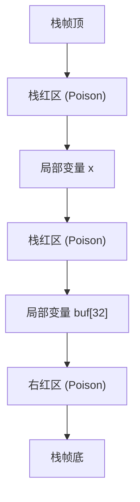
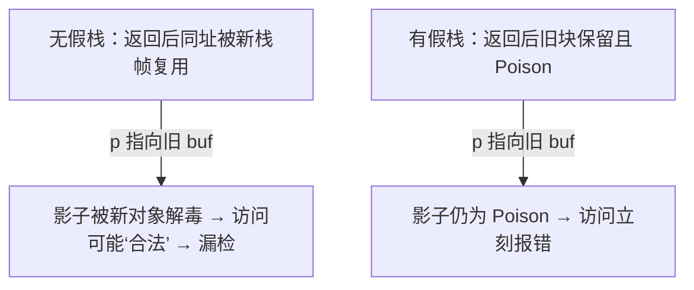
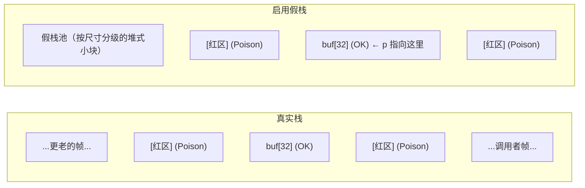
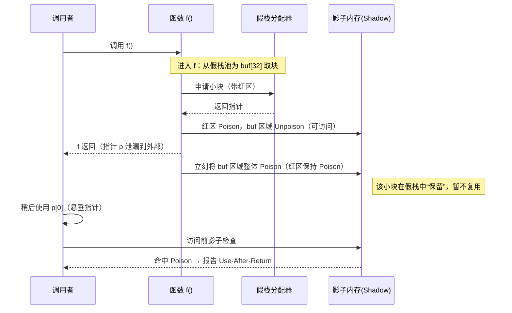
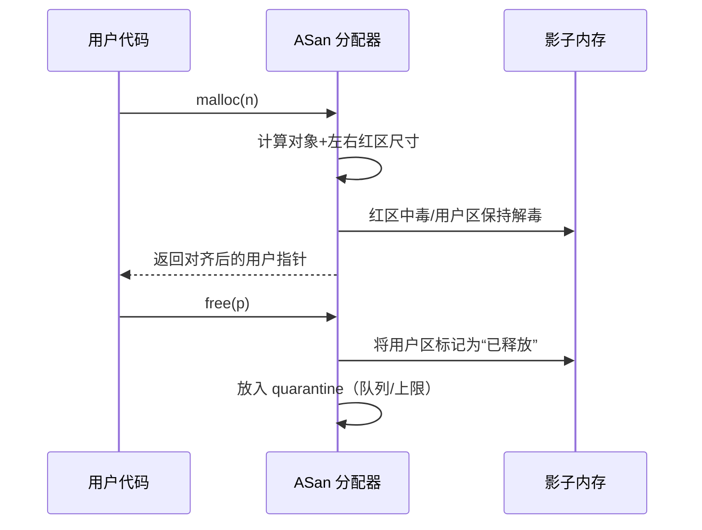

[ATC’12] <https://www.usenix.org/system/files/conference/atc12/atc12-final39.pdf>

<https://github.com/google/sanitizers/wiki/addresssanitizer>

## TL;DR

* **ASan = 编译期插桩 + 运行时库 + 影子内存**
* **1:8 映射**：每 8 字节程序内存对应 1 字节影子内存，记录“是否可访问/可访问多少字节”。
* **红区（redzone）**：在堆/栈/全局对象四周布置不可访问区，越界或 UAF 一触即发。
* **延迟释放（quarantine）**：`free/delete` 后不立刻重用；论文默认 **256 MB**，可调，显著提高 UAF 复现概率。
* **开销**：**参考（ATC’12）**：约 **+73% 时间**、**~3.4× 内存**；**经验口径**：常见 **~1.5–2× 时间**、**~2× 内存**，但**随 workload 波动较大**（与访问密度/拦截器命中/内联情况强相关）。

---

## 总览

```mermaid
flowchart TD
  B1[插桩内存读写] --> B5[可执行文件与运行库]
  B2[栈变量红区] --> B5
  B3[全局变量红区与元信息] --> B5
  B4[库函数拦截] --> B5

  B5 --> I1[建立影子内存映射]
  I1 --> A0[发起内存访问]
  I1 --分配对象--> H1[申请内存]

  A0 --> A1[读取影子字节]
  A1 --> A2{可访问}
  A2 -- 是 --> A3[执行读写]
  A2 -- 否 --> A4[报告错误并终止]


  H1 --> H2[对象两侧红区]
  H2 --> H3[红区中毒/对象区解毒]
  H3 --> H4[返回指针]
  H4 --> A0

  A3 --使用完释放--> H5[释放内存]
  H5 --> H6[影子标记已释放]
  H6 --> H7[进入 quarantine 队列]
  H7 --> H8{回收区已满?}
  H8 -- 否 --> H7
  H8 -- 是 --> H9[弹出旧块重用]
  H9 --> H10[新对象解毒/红区中毒]
  H10 --> H1
````

---

## 影子内存

### 映射关系

* **影子地址**：`shadow = (addr >> 3) + shadow_base`（`shadow_base` 由运行时决定）
* **1 字节影子**对应 **8 字节应用内存**，记录这 8 字节中**前缀多少字节可访问**：

| 影子值          | 含义                                                |
| ------------ | ------------------------------------------------- |
| `0`          | 对应的 8 字节**全部可访问**                                 |
| `1…7`        | **仅前 n 字节可访问**（常见于对象尾/红区邻接）                       |
| **负值（“中毒”）** | **完全不可访问**；不同负值区分**堆/栈/全局红区**或**已释放**等（具体取值属实现细节） |

```mermaid
graph TB
  subgraph AppMem["应用内存（示意）"]
    B0["[8B] A A A A A A A A"]
    B1["[8B] A A A X X X X X"]
  end
  subgraph Shadow["影子内存"]
    S0["0x00  ← 8B 全可访问"]
    S1["0x03  ← 仅 3B 可访问"]
  end
  B0-->S0
  B1-->S1
```

## 编译器插桩：ASan 如何“拦截”每次访问？

### 访问路径与位置

* **大部分内联**：编译器对**每次内存读写**插入快速检查（针对 1/2/4/8/16B 等常见大小有专门 fast-path）。
* **插桩时机**：LLVM/Clang 中，ASan pass 放在**优化管线末端**，只对最终保留下来的内存访问插桩，降低额外开销。

```c
// 伪代码：对 *(T*)p 的大小为 sz 的访问
shadow_byte = *(u8*)((p >> 3) + shadow_base);
if (likely(shadow_byte == 0)) {
  do_access(p, sz);  // 8B 全可访问
} else if (unlikely(!access_is_ok(p, sz, shadow_byte))) {
  __asan_report_loadN_or_storeN(p, sz); // 触发崩溃与报告
} else {
  do_access(p, sz);
}
```

### 栈变量与 Use-After-Return（UAR）

* 编译器为每个栈对象**插入红区并中毒影子**；函数返回时**解毒**或启用“**伪栈**”（将活跃栈帧搬到堆上），以检测 **use-after-return**。
* **开关示例**：
  环境变量：`ASAN_OPTIONS=detect_stack_use_after_return=1`
  编译选项：`-fsanitize-address-use-after-return=runtime`



#### 假栈TL;DR



#### 为什么“伪栈”能抓到 UAR

**UAR 是什么？**函数返回后，外部还在使用指向其**栈上对象**的悬垂指针（dangling pointer）。

**普通真实栈为何容易漏？**函数返回后，这片栈内存**马上可能被新栈帧复用并被“解毒”**（或被新对象的解毒覆盖）。悬垂指针后续访问，**可能恰好落在“新的合法对象”**上，因而**未触发报错**。

**伪栈怎么做？**

* 进入函数时，不把局部对象放在真实栈帧，而是从每线程的**假栈池（堆式小块、按尺寸分级）**拿一块，并在两侧加红区。
* **函数返回时不释放这块内存**，而是**立即将对象区域 Poison**，并**延迟复用**（一段时间后才可能再分配给别的帧）。
* 因为地址**在一段时间内保持稳定**且处于**Poison 状态**，所以悬垂指针一旦被访问，ASan 的影子检查**立刻命中报错**。
* **概率与代价权衡**：假栈越大、回收越慢，越容易在访问发生前仍处于“Poison 且未复用”的状态 → **更稳抓到 UAR**；但**内存占用更高**。

#### 内存布局对比



* **真实栈**：返回后该地址很快被新栈帧复用并解毒 → 悬垂 `p` 访问**可能“看起来合法”** → **漏检**。
* **假栈**：返回瞬间**对象区 Poison**且**延迟复用** → `p` 仍指向这片**已中毒**地址 → **一触即发**。

#### 时间轴



## 堆分配器与 Quarantine

### 堆对象布局与生命周期

* **分配**：对象两侧加红区（按策略/对齐），相应影子**中毒**；用户区**解毒**后返回指针。
* **释放**：对象不立刻回收，先进入 **quarantine（延迟垃圾区）**；影子标记为“已释放”。
  **论文默认大小**：**256 MB**（实现可调）。增大可提高 UAF 命中，但会放大内存占用。



---

## 全局变量保护与 ODR 违规提示

* 编译器为**每个全局变量**生成元信息（大小/位置信息/名称），并在其前后加入红区；
  进程启动时，运行时收集这些元信息并**统一中毒相应影子区域**。
* **ODR 指示器**：在 C/C++ 里，带外部链接的实体（全局变量、函数、类/结构体、模板实体、inline 函数/变量等）在一个完整程序中必须满足下面的规则：要么只有一个定义，要么“允许有多个定义的那些东西”（如 inline/模板等）在每个翻译单元里的定义必须字节级一致。一旦违反，就是 ODR violation（ODR 问题），行为未定义。

现代 ASan 默认注册全局并在冲突时给出提示（不同平台/链接器支持程度不同）。编译后的每个目标文件里，ASan 会为满足条件的全局变量生成一段注册元数据，进程启动时通过全局构造函数调用 `__asan_register_globals` 去登记这些全局。登记时，运行时就能顺便检查“这个名字/对象是不是已经在别的链接单元登记过”。

---

## 标准库拦截（Interceptors）

* 运行时**重写/拦截**大量易出错 API（如 `strcpy/strncpy/strcat/strlen/memcpy/memmove` 等），
* 在这些 API 内部**二次检查**边界条件，通常能更早、更清晰地报错（含参数与调用栈）。

## LeakSanitizer（LSan）

* 在**支持的平台**上（Linux/Android/macOS/NetBSD/Fuchsia 等），ASan 可与 **LSan** 协同：
  进程退出时扫描**根集合**与**可达对象**，报告**内存泄漏**。
* 启用方式（示例）：`ASAN_OPTIONS=detect_leaks=1`（具体可用性与默认值依平台/工具链而异）。

## 常见错误类型

### 越界（OOB: Out-of-Bounds）

```c
char *p = (char*)malloc(8);
p[8] = '!';   // 右越界写：落到右红区
free(p);
```

### Use-After-Free（UAF）

```c
char *p = (char*)malloc(16);
free(p);
p[0] = 'X';   // 已释放区写：影子显示“已释放”
```

### Double Free / Invalid Free

```c
char *p = (char*)malloc(4);
free(p);
free(p);      // 二次释放：到达 ASan 分配器拦截点
```

### Stack Use-After-Return

```c
char* leak_ptr() {
  char buf[32];
  return buf;   // 返回栈地址（悬垂）
}
int main() {
  char* p = leak_ptr();
  return p[0];  // 若启用伪栈，将在访问处命中
}
```

---

## 性能与资源开销

* **时间**：**ATC’12 实测**在 SPEC CPU2006 上约 **+73%**；**经验口径**在实际工程中常见 **~1.5–2×**。
* **内存**：影子占 **~1/8**；再叠加红区/元信息/quarantine，**ATC’12 实测 ~3.4×**，工程经验常见 **~2×** 左右。
* **调优建议**：减少热路径细粒度访问；合适对齐；按需调小 quarantine；热函数可 A/B（仅测试环境开启）；确保关键模块统一插桩、避免未插桩“黑洞”。

---

## 局限与典型“漏检”（假阴性）

* **未插桩路径**：自定义分配器、内联汇编/手写 `memcpy`、设备内存（MMIO）、共享内存映射等可能绕过 ASan。
* **论文列举的三类假阴性**：

  1. **未对齐且仅“部分越界”的访问**可能被前缀可访问规则掩蔽；
  2. **“跳得太远”的 OOB** 恰好落在另一块合法对象中；
  3. **quarantine 被快速分配/释放冲掉**，导致已释放块很快再利用，从而错过 UAF。
