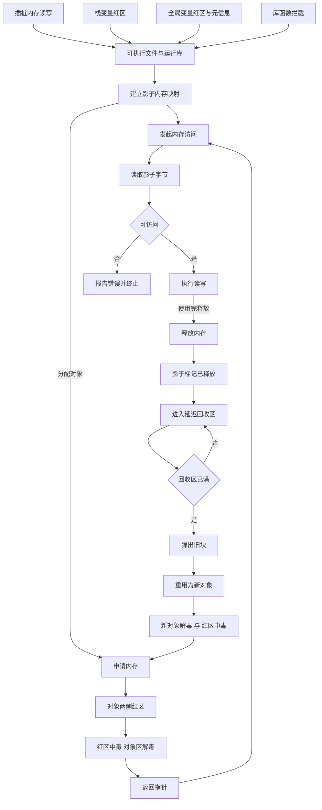
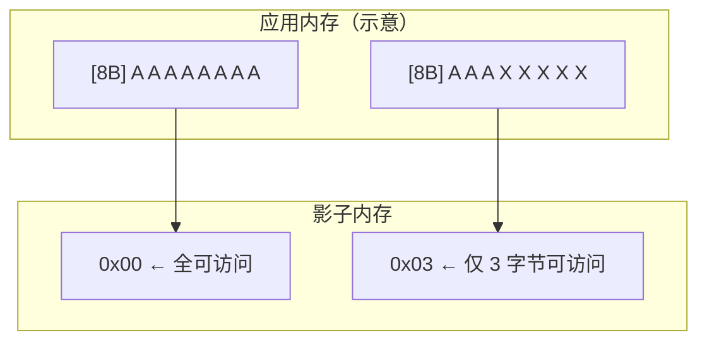
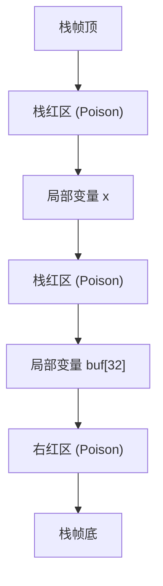
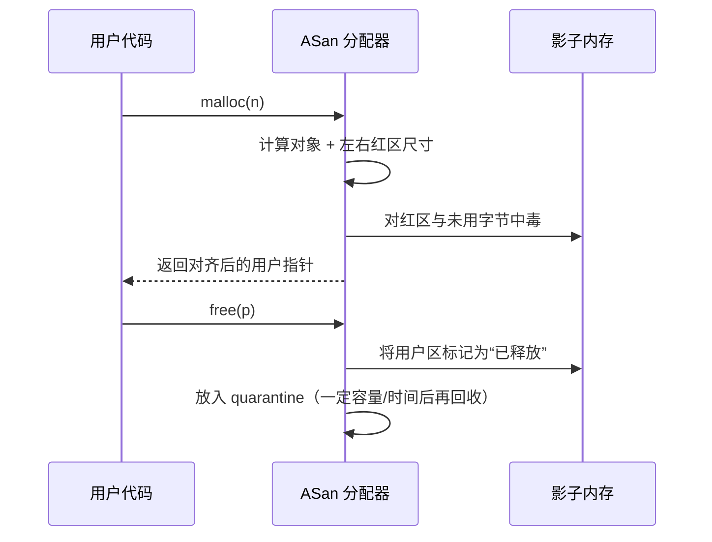

<https://www.usenix.org/system/files/conference/atc12/atc12-final39.pdf>

## TL;DR

* **ASan = 编译期插桩 + 运行时库 + 影子内存**
* **1:8 映射**：每 8 字节程序内存对应 1 字节影子内存，记录“是否可访问/可访问多少字节”。
* **红区（redzone）**：在堆/栈/全局对象四周布置不可访问区，越界或 UAF 一触即发。
* **延迟释放（quarantine）**：`free/delete` 后不立刻重用，显著提高 UAF 复现概率。
* **开销**：典型 **~2× 内存**、**~1.5–2× 时间**；但**随 workload 波动较大**，与访问密度/拦截器命中/内联情况强相关，可更高或更低。

---

## 总览



---

## 影子内存

### 映射关系

* **影子地址**：`shadow = (addr >> 3) + shadow_base`（`shadow_base` 由运行时决定）
* **1 字节影子**对应 **8 字节应用内存**，记录这 8 字节中**前缀多少字节可访问**：

| 影子值            | 含义                                                  |
| -------------- | --------------------------------------------------- |
| `0`            | 对应的 8 字节全部可访问                                       |
| `1…7`          | 仅前 n 字节可访问（常见于尾部对齐/红区邻接）                            |
| **`0xF*`** | 被“中毒”的不可访问区域；不同取值代表不同类型（堆红区、已释放、栈红区、全局红区等，具体值属实现细节） |



## 编译器插桩：ASan 如何“拦截”每次访问？

### 访问路径

编译器对**每次内存读写**插入快速检查（多数场景**内联**）：

```c
// 伪代码：对 *(T*)p 的大小为 sz 的访问
shadow_byte = *(u8*)((p >> 3) + shadow_base);
if (likely(shadow_byte == 0)) {
  do_access(p, sz);  // 8B 全可访问
} else if (unlikely(!access_is_ok(p, sz, shadow_byte))) {
  __asan_report_loadN_or_storeN(p, sz); // 触发崩溃与报告
} else {
  do_access(p, sz);
}
```

> 注：实际实现会根据**访问大小/对齐**选择更精准的内联序列（如读取 `(p+sz-1)>>3` 对应影子、结合 `p & 7` 做快速判定），对 1/2/4/8/16B 等固定大小有专门 fast-path，以减少分支与开销。上例为教学化简。

### 栈变量与红区

编译器为每个栈对象插入红区并**中毒**影子字节；函数返回时**解毒**或启用“**伪栈**”以检测 **use-after-return**。



> 注（UAR 开关）：常用 `ASAN_OPTIONS=detect_stack_use_after_return=1`（或编译器对应选项）启用“伪栈”，将活跃栈帧搬到堆上，函数返回后仍保持**中毒**以捕获 UAR。

## 堆分配器与 Quarantine

### 堆对象布局

* 分配时：对象两侧加红区（左/右红区大小按策略/对齐），相应影子**中毒**。
* 释放时：对象不立刻回收；进入 **quarantine（延迟垃圾区）**，对应影子标记为“已释放”。

> ASan 的“中毒/解毒”作用于**内存区域的影子字节**，非指针位模式。



* **收益**：UAF 被触发概率高（短时间内访问到“已释放”区域→报错）。
* **成本**：更多内存占用（可通过选项调小）。

---

## 全局变量保护

* 编译器为**每个全局变量**生成元信息（大小、位置信息、名称）并在其前后加入红区；
* 进程启动时，运行时收集这些元信息，**中毒**相应影子区域；在终止或卸载时**解毒**。
* ASan 在一定程度上可帮助发现 **ODR 违规**（同名全局对象在不同模块尺寸/布局不一致），但能力有限，视工具链与链接方式而定。

## 常见错误类型

### 越界（OOB: Out-of-Bounds）

```c
char *p = (char*)malloc(8);
p[8] = '!';   // 右越界写：落到右红区
free(p);
```

> 触发：访问 p[8] → 影子字节非 0 且不满足“前缀可访问” → 报告

### Use-After-Free（UAF）

```c
char *p = (char*)malloc(16);
free(p);
p[0] = 'X';   // 已释放区写：影子显示“已释放”
```

### Double Free / Invalid Free

```c
char *p = (char*)malloc(4);
free(p);
free(p);      // 二次释放：到达 ASan 分配器拦截点
```

### Stack Use-After-Return

```c
char* leak_ptr() {
  char buf[32];
  return buf;   // 返回栈地址（悬垂）
}
int main() {
  char* p = leak_ptr();
  return p[0];  // 若启用伪栈，将在访问处命中
}
```

## 标准库拦截（Interceptors）

* ASan 运行时**重写/拦截**大量易出错 API：`strcpy/strncpy/strcat/strlen/memcpy/memmove` 等；
* 可在这些 API 内部**二次检查**边界条件，从而更早、更友好地报错。

## LeakSanitizer（LSan）

* 多数平台上，ASan 可与 **LSan** 协同：程序退出时扫描**根集合**与**可达对象**，报告**内存泄漏**。
* 控制：`ASAN_OPTIONS=detect_leaks=1`（平台支持时默认开启）
* **平台提示**：不同系统/工具链对 LSan 的默认启用与可用性不尽相同（Linux/Android/macOS/Windows 差异明显）。

## 性能与资源开销

* **时间**：一般 1.5–2×，但依 workload 可高可低（访问密度/是否命中拦截器/内联成功率影响明显）。
* **内存**：影子内存占 **~1/8**，再加红区/元信息/quarantine，整体**~2×** 常见。
* **调优**：减少热路径频繁小步访问、合适对齐、缩小 quarantine、尽量统一插桩关键模块、必要时对热函数做 A/B（仅测试环境开启）。

## 局限

* **自定义分配器/共享内存/内核映射/设备内存（MMIO）**：可能绕过 ASan；需要专门适配或避开插桩区域。
* **内联汇编/手写 memcpy**：未插桩路径无法检查。
* **信号与 setjmp/longjmp/协程栈**：非常规栈切换需确认与 ASan 兼容性与参数。
* **与 TLS/线程析构**：线程结束时的对象、析构顺序可能影响 LSan/ASan 的报告完整性。
* **跨语言边界**：C/C++ ↔ 其他语言（JNI/FFI）时，注意对象所有权与对齐与“未插桩区”。

## 使用

<https://github.com/google/sanitizers/wiki/addresssanitizer>
