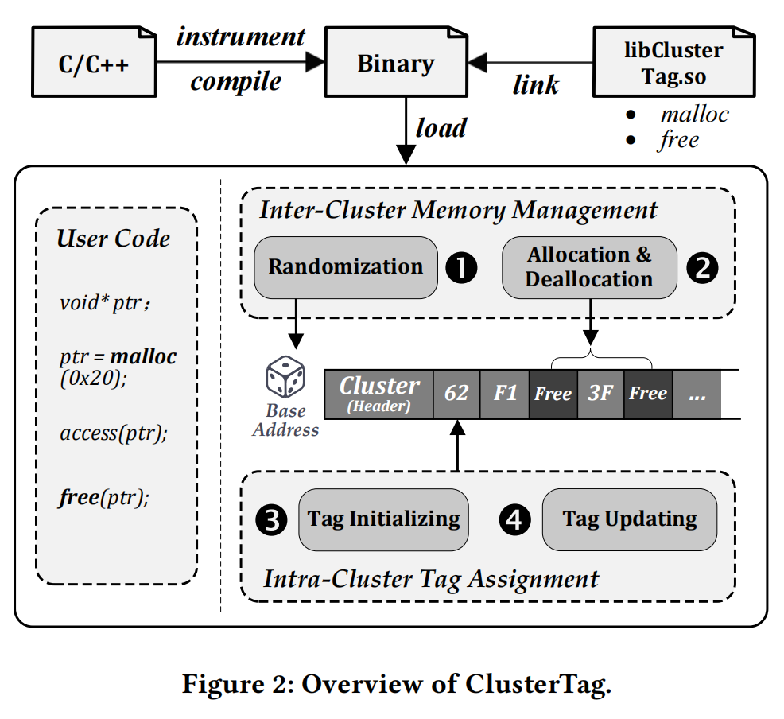
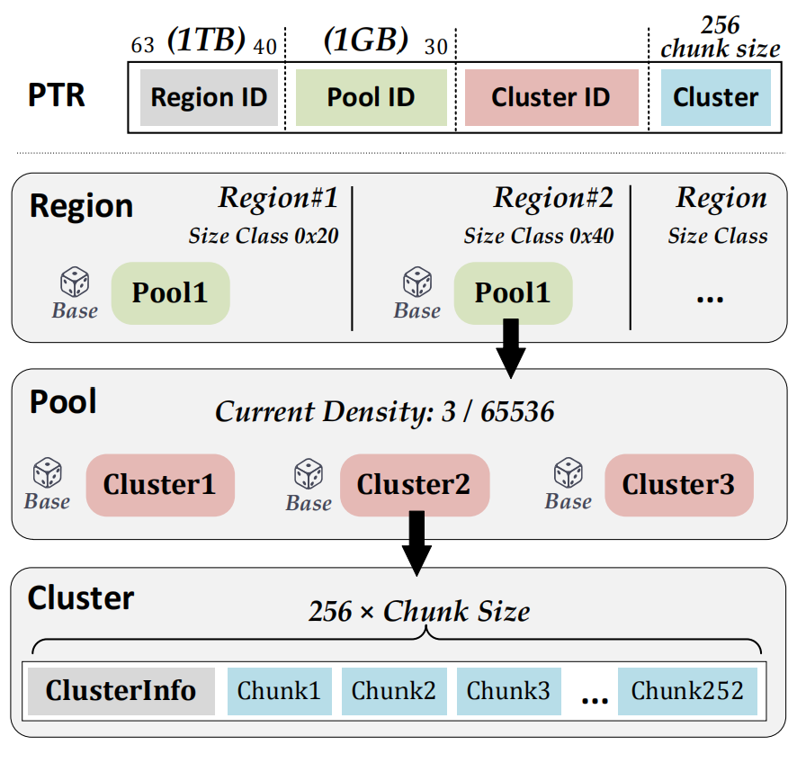
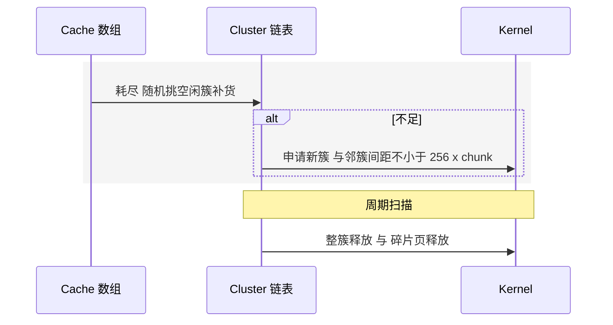
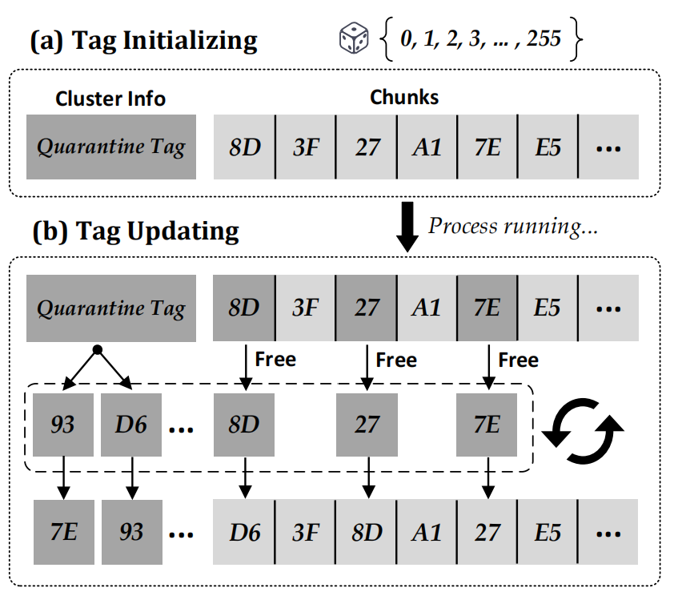
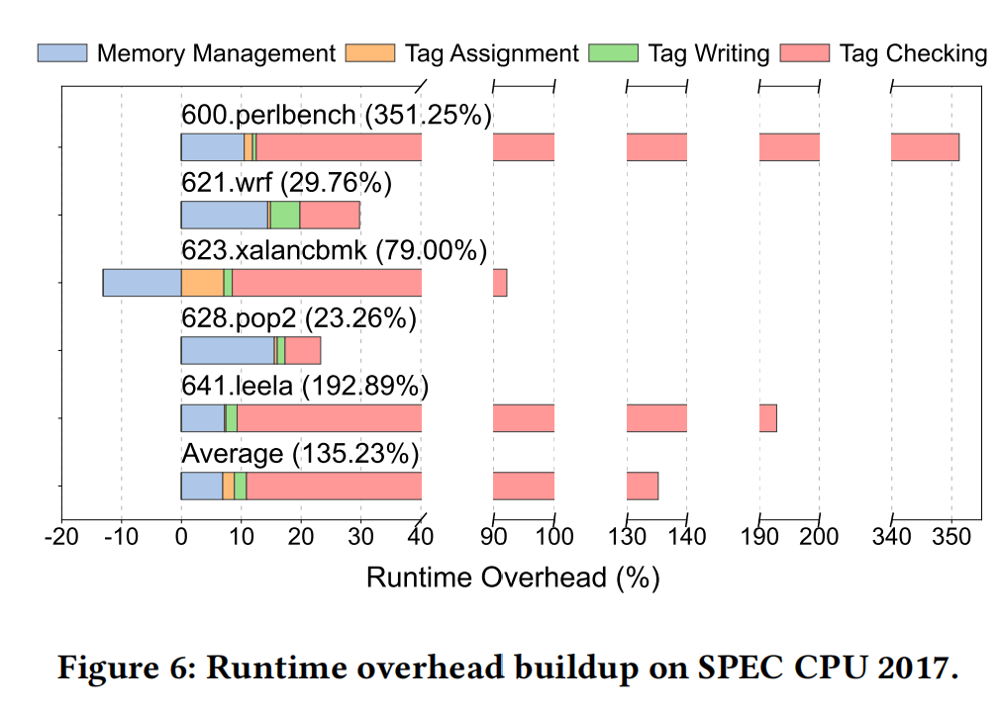
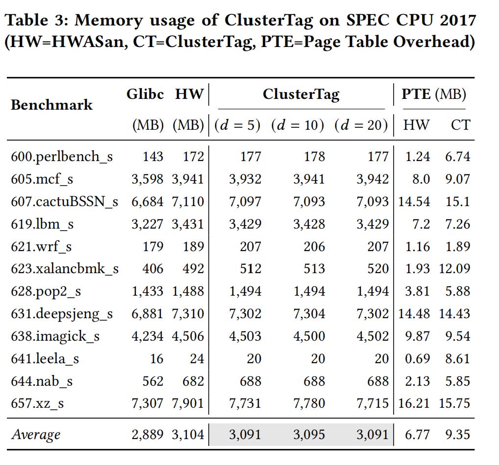
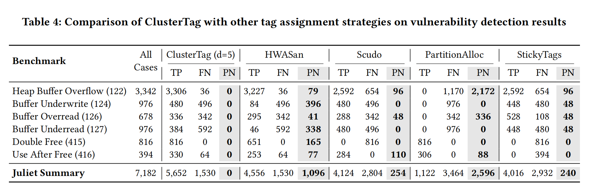

ClusterTag 把标签碰撞变成小概率事件。

## TL;DR

* **问题**：HWASan / MTE 这类**标签化**内存检测因**标签位数受限**（常见 8 / 6 / 4 bit）天然存在**标签碰撞** → 随机漏报（PN）。单次理论命中率 **(2^TS − 1) / 2^TS**，TBI 8b / LAM 6b / MTE 4b 约 **99.61% / 98.44% / 93.75%**。  
* **思路**：把堆按 **Region – Pool – Cluster** 分层（BiBOP 风格）并**在层间做低密度随机化**；**每个 Cluster 内唯一标签化**（8-bit 标签空间最多 256 值），**重用时环形位移换签**，同时拉大**空间**与**时间**的**碰撞距离**。  
* **关键性质**：最小**空间碰撞距离**从 HWASan 的 **1 × chunk** 提升到 **256 × chunk**；**空间平均距离**约 **256 · d**；**不可预测性（熵）**随 d 提升并超过 HWASan。  
* **效果**：Juliet 7182 用例 × 500 轮，ClusterTag **稳定命中 5672**；在这些能命中的用例里，HWASan 仍出现 **1096** 次概率性漏报（PN）。以 **PHP CVE-2018-14883 的 594 个 PoC** 为样本，其非法指针的影响范围 **−2095..+1791 字节**，低于 ClusterTag 的最小空间距离覆盖半径（例如 32B 对象可达 ±8192B），说明 ClusterTag 对**跨对象非连续越界**更有把握。  
* **开销**：**Tag Checking** 是主要来源（对总开销的贡献占比常 >100%），**Tag Assignment** 极低（通常 **0.2–1.3%**）。**PTE 体量**评测均值：**ClusterTag ≈ 9.35 MB** vs **HWASan ≈ 6.77 MB**，差值约 **2.6 MB**；设计上单个 **1 GB Pool** 的寻址级约需 **~2 MB** 页表（作为上界直觉）。  

---

## 背景

**为什么会“抖”？**  
标签化 Sanitizer（HWASan / MTE 等）把**指针**与**内存块**都“着色”：访问时比对**指针标签 vs 影子标签**，不等即报错。受限的高位标签空间带来**不可避免的碰撞概率**：越界或复用若**刚好**落到同签对象，就会**偶发**放过（PN）。ClusterTag 的核心是在**分配器层**把**同签对象**在**空间上拉远、时间上拉久**，把“偶发”尽量变成“稳定命中或稳定不命中”。

---

## 标签分配策略

> 不同策略在三项指标上的取舍：**最小碰撞距离**、**平均碰撞距离**、**不可预测性（熵）**；都分空间 / 时间两维。文中默认 **HWASan 取 TS=8**，其余 **TS=4**。

| Strategy  | Research       | **Minimum** (Space / Time) | **Average** (Space / Time) | **Unpred.** (Space / Time) |
|-----------|----------------|-----------------------------|-----------------------------|----------------------------|
| Random    | HWASan         | 1 / 1                       | 2^TS / 2^TS                 | 9.44 / 9.44                |
| Random    | Ptmalloc       | header / 1                  | 2^TS / 2^TS                 | 5.40 / 5.40                |
| Staggered | Scudo          | 2 / 2                       | 2^TS / 2^(TS−1)             | 4.35 / 4.35                |
| Fixed     | PartitionAlloc | 1 / 2^TS                    | 2^TS / 2^TS                 | 5.40 / 0                   |
| Fixed     | StickyTags     | 2^TS / 1                    | 2^TS / 1                    | 0 / 0                      |

* **随机（HWASan / Ptmalloc）**：不可预测性高，但最小空间 / 时间距离仅 1，相邻越界或“刚释放即复用”更易撞同签；Ptmalloc 的块头固定 tag 0 能**确定性**抓住邻接越界。  
* **交错（Scudo）**：把可用标签分为奇/偶两组，相邻块必不同签（最小 2），但时间维平均降到 2^(TS−1)，熵也更低。  
* **固定（PartitionAlloc / StickyTags）**：把某一维的“最小 / 平均”拉满到 2^TS，代价是那一维**熵为 0**（完全可预测）。

> ClusterTag 的目标是**三指标更均衡**：**三层随机化 + 簇内唯一 + 环移换签**，同时做大最小与平均距离，并保持足够不可预测性。

---

## ClusterTag 总览

> **定位**：作为**独立堆分配器**链接到程序，与 HWASan / MTE 的检查机制协同；体系分为**簇间内存管理**与**簇内标签分配**两块。  
> **术语对齐**：运行时流程采用**分配 事件触发（Event-triggered）**与**回收 时间触发（Time-triggered）**两条路径。

在簇内：**初始化**时为每个 chunk 赋**唯一标签**；**重用**时采用 **Circular-Shift** 把“预留标签 + 已释放块旧标签”组成环并右移一格，更换将被重新启用的块标签，无需保存历史。

---

## 设计细节

### 1) Inter-Cluster：Region – Pool – Cluster

* **BiBOP 分区**：同尺寸对象位于**连续的 1 TB Region**；每个 Region 内划分**1 GB Pool**，既限制随机化范围、也降低页表放大。  
* **Cluster**：每簇容量 **256 × chunk**，与 8-bit 标签空间匹配，并**严格页对齐**；元数据集中于 **ClusterInfo（固定 tag 0）**，避免相邻越界破坏对象头。  
* **随机化密度 d**：限制每个 Pool 内启用的簇数量（常用 d=5），Pool 饱和则在 Region 内**随机创建新 Pool**，在全局制造“空洞”，兼顾**随机性与 PTE 成本**。  
* **PTE**：设计上单个 1 GB Pool 的寻址级约需 ~2 MB 页表；实际评测为**整进程均值**：ClusterTag ~9.35 MB，HWASan ~6.77 MB，差值约 2.6 MB。

> 小结：局部保持**对齐与局部性**，全局引入**可调稀疏度随机化**，从而放大**跨簇的最小空间距离**并控制 PTE 成本。

### 2) 运行时分配 与 回收

* **分配（Event-triggered）**：  
  小对象（< 64 KB）优先从**缓存数组**复用释放块；若缓存不足，**随机选择空闲簇补货**，仍不足则向内核申请**新簇**（相邻簇至少相隔 **256 × chunk_size**）。大对象（≥ 64 KB）直接使用 `mmap`。  

* **回收（Time-triggered）**：  
  `free` 仅标记释放；由**周期扫描**负责真实返还：**整簇可回收**则整簇 `munmap`；**形成连续空页**时按阈值返还；这一策略既**缩短簇寿命**、拉大时间维最小碰撞距离，也避免与内核过度频繁交互。

### 3) Intra-Cluster：唯一着色 + 环形位移

* **首次赋签**：在 8-bit 标签空间中**预留一组标签值**（实验常用 16 个）不分配给任何 chunk，其余值用于**簇内唯一着色**，消灭簇内空间碰撞。
* **重用换签**：把“预留标签 + 已释放块旧标签”组成**标签环**，每次右移一格赋给将被重新启用的块；这保证了**同一时刻簇内标签仍两两不同**，并拉大**同地址同标签的最小时间间隔**。

> **时间维指标**：最小时间距离**保底 16**（由预留 16 标签保证），实测最小约 **19**；**25 分位数** ClusterTag 明显更大（**265 vs 157**），**平均值** HWASan ≈ **543.76**、ClusterTag ≈ **510.21**（分布更不易近期撞回旧签，但均值略低）。

---

## “碰撞距离”的三指标

* **Objective 1 最小距离**：避免相邻同签、避免刚释放即复用回原签 → 最大化 min(D_S) / min(D_T)。
* **Objective 2 平均距离**：做大同签对象的空间 / 时间平均间隔 → 最大化 avg(D)。
* **Objective 3 不可预测性**：让 D_S / D_T 的分布具有足够**熵**，使攻击者难以预测同签对象。

### 空间维（跨对象）

* **最小距离**：跨簇至少 **256 × chunk**。
* **平均距离**：建模为 `Distance = 256 · D + (Z2 − Z1)`，其中 `D ~ 几何分布 G(1/d)`，`Z1, Z2 ~ U{0..255}`，因此 **E[Distance] ≈ 256 · d**。
* **不可预测性**：随 d 增大，空间熵可达 **12.33 / 13.41 / 14.45 bit（d=5 / 10 / 20）**，超过 HWASan 的 ~9.44 bit。

### 时间维（重用）

* **最小距离**：HWASan = 1；ClusterTag 由预留标签与环移保证**保底 16**（实测最小约 19）。
* **分布特征**：随机策略偏斜、环移策略多峰；**25 分位数** **265 vs 157**；**均值** HWASan ≈ **543.76**、ClusterTag ≈ **510.21**。

---

## 为什么能显著减少 PN？

* **空间**：三层低密度随机化 + 簇间最小间距 **≥ 256 × chunk**，让多数 OOB 很难跨对象刚好撞到同签。
* **时间**：簇级随机复用 + 缩短簇寿命 + 环移换签，让“旧签回到旧址”的窗口更窄更晚。

---

## 与 HWASan / MTE 的关系

* ClusterTag 是**分配器层增强**，可直接替换 HWASan 的 runtime 分配器，与其插桩协同；原型以 **8-bit** 为例，但方法对 **MTE / LAM** 这类更短位宽同样适用（论文提出了面向 4-bit 的组级隔离思路）。

---

## 实验概览

* **性能 / 内存**：总体与 HWASan 相近；密度降低使碰撞概率下降，开销保持稳定。
* **PTE 体量（整进程均值）**：ClusterTag ~**9.35 MB** vs HWASan ~**6.77 MB**，差值 ~**2.6 MB**。

---

## 限制与未覆盖

* 栈对象、某些库函数路径与字段级越界仍可能形成盲点（取决于底层 Sanitizer 的覆盖）。
* 攻击者可尝试探测标签与喷堆，但需未知随机种子；ClusterTag 通过**随机复用 + 缩短簇寿命**降低实时利用窗口。

---

## 小结

ClusterTag 把“**标签位数受限**”这个**概率学问题**，转化为**分配器布局**与**重用策略**的工程优化：
**把同签对象在空间上拉远、在时间上拉久** → **显著降低 PN**；在 Juliet / Magma 等基准中**补足了 HWASan 的概率盲点**，且在内存与页表开销上处于可控区间。

---

## 参考

* *Beyond Tag Collision: Cluster-based Memory Management for Tag-based Sanitizers*, Mengfei Xie et al., CCS’25
