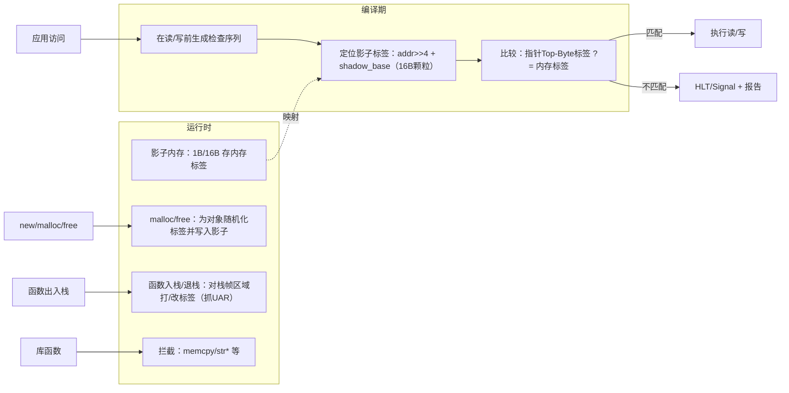
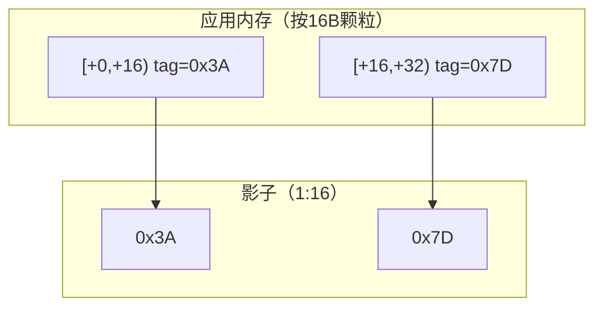
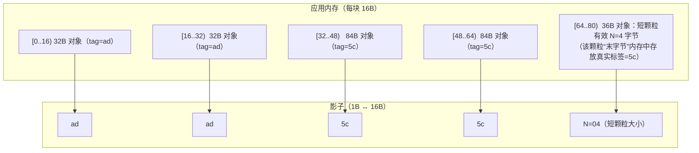
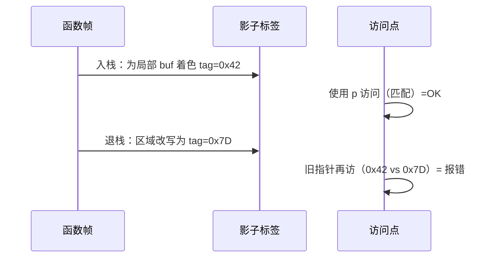

## TL;DR

* **思路**：**指针顶字节携带标签**（Top-Byte），**内存按 16B 颗粒存标签**；访问时比较**指针标签 vs. 内存标签**，不一致即报错。依赖 **AArch64 的 TBI（Top-Byte-Ignore）**。([Clang][1])
* **粒度**：常见 **TG=16B、TS=8bit**（颗粒/标签位数）；**1:16 影子映射**。检测为**概率式**，理论漏报约 **1/256（0.4%）**。
* **覆盖**：堆/栈/全局越界、UAF、**UAR（use-after-return）** 等；UAR 检测天然强（栈帧出入时重打标签）。([Android Open Source Project][2])
* **开销**（Android 实测口径）：**CPU ~2×**、**代码 40–50%**、**RAM 10–35%**（通常低于 ASan 的 RAM 开销）。([Android Open Source Project][2])

---

## 总览



> 机制基于 **TBI 地址标记**：利用 64 位指针的高 8 位做“指针标签”，并在影子区保存“内存标签”，每次访问时比较两者是否相等。([Clang][1])

---

## 标签与影子

### 指针标签（Pointer Tag）

* AArch64 **TBI** 允许忽略虚拟地址的顶字节，HWASan 将其作为 **8 位指针标签** 持有。编译器在生成/传播指针时保留该标签。([Clang][1])

### 内存标签（Memory Tag）

* 运行时维护**影子内存**，**1 字节影子 ↔ 16 字节应用内存**；同一颗粒被“着色”为某个标签。访问 `p` 时比较 **Top-Byte(p)** 与 **shadow[(p>>4)]**。([Clang][1])

> 论文给出的典型配置是 **TG=16、TS=8**，从而在一次运行中**理论命中率 ~99.6%**（漏报 ~0.4%）。



#### 短颗粒

当对象末尾不足 16B 时，影子处会编码“有效前缀长度”，实际标签存于颗粒尾字节；检查序列需同时判定“短颗粒”路径。([Clang][1])。

影子（1B 对 16B）：若该颗粒是“短颗粒”，影子字节不再存标签，而是存有效大小 N (1..15)。

应用内存：把真正的标签值写入该颗粒的最后 1 个字节。

普通颗粒（非短颗粒）：影子里照常存内存标签。



## 编译器插桩

```c
// 输入：地址 p，访问大小 sz（1/2/4/8/16 等）
// 1) 取影子
u8 shadow = *(u8*)(shadow_base + (p >> 4));   // (p / 16)

// 2) 快速路径：普通颗粒（影子里就是标签）
if (shadow == top_byte(p)) ok();

// 3) 短颗粒路径：影子里是大小 N (1..15)
if (shadow <= 15) {
  u8 N = shadow;                       // 有效字节数
  u8 pos_last = (p & 0xF) + (sz - 1);  // 低 4 位掩码 0xF (= 15) 取出 p 在本 16B 颗粒内的偏移 (0..15)。
  // 再加上 (sz-1) 得到“本次访问的最后一个字节”在颗粒内的位置
  if (pos_last < N) {
    u8 tag_last = *(u8*)((p | 0xF));   // 低 4 位或上 0xF，把地址对齐到本 16B 颗粒的“最后 1 个字节”
    // “真实标签”
    if (tag_last == top_byte(p)) ok();
  }
}
// 4) 其他情况 → 报错
__hwasan_tag_mismatch_report(...);

```

因为合法的指针标签值也可能是 1..15，所以影子值为 1..15既可能表示“这是个短颗粒（大小=N）”，也可能是“普通颗粒的标签==N”。
因此检查过程必须做“两段式”判定,先当普通标签比一遍，不行再走短颗粒分支。

## 无需“伪栈”

* 函数**入栈**时，对本帧可见的栈区**按 16B 对齐并着色**；**退栈**时更换/恢复标签。返回后的旧指针再次访问将与现状标签**不匹配** → 报错（即 UAR 命中）。([Clang][1])



---

## 堆与 UAF：随机化标签 + 轻量延迟

* **分配**：为对象挑选**随机标签**并写入影子，返回**带同标签**的指针；
* **释放**：将对象区域写入**不同标签**，即便不重度 quarantine 也能提高 UAF 命中概率（旧指针多半失配）。但**标签空间有限** → **撞色**时可能漏报。([Clang][1])

---

## 全局对象

* 大多数全局变量会被打上**静态标签**并在装载时由运行时根据 `hwasan_globals` 段**着色**，取地址指令序列也会保留标签。([Clang][1])

---

## 常见错误类型与检测特性

### 越界（OOB）

* 跨颗粒/跨对象越界：高概率**标签失配 → 报错**；低概率越到了另一个对象，但两边的标签恰好相同。

### Use-After-Free（UAF）

* 释放时区域被写入**新标签**，旧指针访问**失配** → 报错；但若新对象**恰好同标签**，则**概率性漏报**，8bit 标签，理论 1/256。([Clang][1])

### Use-After-Return（UAR）

* 由**栈标签更换**天然捕获，无需 ASan 的“伪栈”。([Clang][1])

### Intra-object overflow（对象内字段越界）

* HWASan靠标签区分对象，不区分对象内的字段。同一对象内部通常共用一枚标签，字段间小幅跨越**可能不触发**（与 ASan 相似的已知盲点）。

---

## 与 ASan 的关系

* **无需红区/大 quarantine**：越界/已释放访问的可检出性**不受越界距离或释放时间长短影响**；但**检测为概率式**（标签碰撞）。([Android Open Source Project][2])
* **开销侧重点不同**：HWASan **RAM 开销显著更低**（影子约 1/16 + 标签对齐），CPU/代码体积与 ASan 相近。([Clang][1])

---

## 性能与资源开销

* **CPU**：约 **~2×**；**代码**：约 **40–50%**；**RAM**：约 **10–35%**（Android 文档）。([Android Open Source Project][2])
* **概率性**：**TS=8** 时单次运行**漏报约 0.4%**；实际仍受实现/保留值/负载分布影响。

---

## 局限

* **平台依赖**：主要面向 **AArch64 + TBI**；x86-64 仅有**受限实现**（基于页别名，fork() 有共享隐患）。([Clang][1])
* **16B 粒度**：同颗粒内的小越界可能漏报。
* **概率性**：标签空间有限导致**撞色漏报**不可避免。([Clang][1])
* **跨边界兼容**：未插桩库、清除顶字节的接口、内联汇编/自写 memcpy、共享内存/MMIO 等路径可能形成盲区。([Clang][1])

---

## 参考

* Clang HWASan 设计文档([Clang][1])
* Android HWASan 文档([Android Open Source Project][2])
* 论文 *Memory Tagging and how it improves C/C++ memory safety*([paper][3])
* ASan ([GitHub][4])

[1]: https://clang.llvm.org/docs/HardwareAssistedAddressSanitizerDesign.html "Hardware-assisted AddressSanitizer Design Documentation — Clang 22.0.0git documentation"
[2]: https://source.android.com/docs/security/test/hwasan "Hardware-assisted AddressSanitizer  |  Android Open Source Project"
[3]: https://arxiv.org/pdf/1802.09517 "Memory Tagging and how it improves C/C++ memory safety"
[4]: https://github.com/google/sanitizers/wiki/addresssanitizer?utm_source=chatgpt.com "AddressSanitizer · google/sanitizers Wiki"
