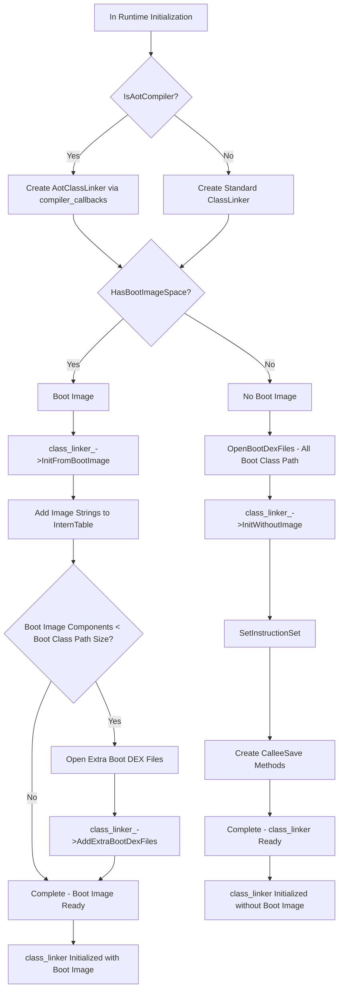
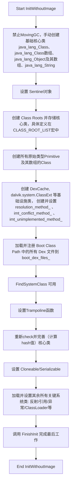

# ClassLinker

ClassLinker 是 ART在 AOSP 中负责“Java 类”加载与链接的核心组件。它的主要职责包括：
- 加载解析 DEX 文件
- 在运行时解析并绑定类、方法符号引用
- 维护类表结构
- 在需要时初始化与准备类


## 初始化

在运行时创建的时候ClassLinker被创建，`Runtime::Init`函数中




### 打开加载Dex文件

在ClassLinker的初始化的同时，还完成了打开、解析所有 bootclasspath 的 DEX 文件的步骤


`OpenBootDexFiles` 负责批量打开并加载BCP的 DEX 文件，将它们封装为 `DexFile` 对象并收集到输出列表中，统计打开失败的文件数量。


```cpp
   ArtDexFileLoader dex_file_loader(dex_filename, file, dex_location);
   if (!dex_file_loader.Open(verify, kVerifyChecksum, &error_msg, out_dex_files)) {
     LOG(WARNING) << "Failed to open .dex …";
     ++failure_count;
   }
```

通过 `ArtDexFileLoader` 尝试打开DEX。  
成功时，会把对应的 `unique_ptr<DexFile>` 加入 `out_dex_files`；失败时记录错误并计数。

ArtDexFileLoader会根据对应的Dex文件构造出对应的DexFile的对象


###  InitFromBootImage 


存在2个初始化函数，分别在Runtime::Init的时候根据bootimage的有无进行初始化


```cpp
  // Initialize class linker by bootstraping from dex files.
  bool InitWithoutImage(std::vector<std::unique_ptr<const DexFile>> boot_class_path,
                        std::string* error_msg)
      REQUIRES_SHARED(Locks::mutator_lock_)
      REQUIRES(!Locks::dex_lock_);

  // Initialize class linker from one or more boot images.
  bool InitFromBootImage(std::string* error_msg)
      REQUIRES_SHARED(Locks::mutator_lock_)
      REQUIRES(!Locks::dex_lock_);
```

对于存在Bootimage的时候，InitFromBootImage执行流程如下

```mermaid
flowchart TD
    A[InitFromBootImage] --> B[获取 BootImageSpaces]
    B --> C[验证 ImageHeader 和 PointerSize]
    C --> D{PointerSize 有效?}
    
    D -->|No| E[返回错误]
    D -->|Yes| F[从Image中读取，初始化一些关键的内置方法： <br/> Runtime三个ArtMethod指针成员 resolution_method_ 、 imt_conflict_method_ 、 imt_unimplemented_method_ <br/> 这些是 ART 用于处理动态链接、处理接口方法表（IMT）冲突、接口方法未实现的高度优化的小段代码。]
    
    F --> G[从Image中读取，使用 SetCalleeSaveMethod 初始化6个CalleeSave方法，保存在Runtime指针数组类型的callee_save_methods_中。因为ART 并不总是需要保存所有 Callee-Save 寄存器。为了极致的性能，它准备了多套方案，包括：<br/>  kSaveAllCalleeSavesMethod、 kSaveRefsOnlyMethod、 kSaveRefsAndArgsMethod、 kSaveEverythingMethod、 kSaveEverythingMethodForClinit、 kSaveEverythingMethodForSuspendCheck]
    
    G --> H[注册每个ImageSpace对应的OatFiles到oat_file_manager中]
    H --> I[从第一个 OAT 文件中，加载并设置一系列关键的Trampoline函数指针。]
    
    I --> J[Trampoline函数包括:<br/> jni_dlsym_lookup_trampoline_<br/> quick_resolution_trampoline_<br/> quick_imt_conflict_trampoline_<br/> quick_generic_jni_trampoline_ <br/> quick_to_interpreter_bridge_trampoline_<br/> nterp_trampoline_]
    
    J --> K{Debug 模式?}
    K -->|Yes| L[验证所有 OatFile 的 Trampoline 一致性]
    K -->|No| M[从image中读取Java核心的一些类对象到一个类对象数组的GCRoot中class_roots_]
    
    L --> N{Trampoline 一致?}
    N -->|No| O[检查 ArtMethod 入口点]
    N -->|Yes| M
    
    O --> P{发现错误入口点?}
    P -->|Yes| Q[返回错误]
    P -->|No| M
    
    M --> R[从 ImageHeader 获取 boot_image_live_objects，这些是必须在运行时保持存活的关键对象]
    R --> S[从boot_image_live_objects中拿到Sentinel 对象，设置Runtime的成员sentinel_，用于处理 JNI（例如，已被清除的弱引用）和 JDWP中的各种无效引用情况。]
    S --> T[AddImageSpaces<br/>1. 找到镜像中包含的所有 DexFile 对象，添加到ClassLinker 的 boot_dex_files_ <br/> 2.根据当前运行时对镜像内容进行一些调整，比如设置ArtMethod的各类 trampoline，设置hotness_threshold <br/> 3. 将所有类批量添加到 ClassLoader 的 class_table（Boot class path table的是ClassLinker的boot_class_table_），使其可被查找和使用]
    
    T --> U{非调试模式?}
    U -->|Yes| V[缓存 JNI Stub 方法到boot_image_jni_stubs_，这是针对不同参数的JNI调用生成的专用的trampoline函数]
    U -->|No| W[InitializeObjectVirtualMethodHashes 把当前这个ClassLinker的每一个VirtualMethods的hash值预先计算出来]
    
    V --> W
    W --> X[FinishInit<br/>1. 绑定 String 的初始化方法, String 是一个非常特殊的类, ART 内部有Ljava/lang/StringFactory;专门处理各种String的初始化工作 <br/> 2. 确保所有class_roots_类都已成功加载并正确初始化 <br/> 3. 设置 init_done_ 标志 <br/> 4.预初始化 StackOverflowError]
    X --> Y[初始化完成]
    
    style A fill:#e1f5fe
    style E fill:#ffebee
    style Q fill:#ffebee
    style Y fill:#e8f5e8
    style F fill:#fff3e0
    style I fill:#f3e5f5
    style M fill:#e0f2f1

```


#### 各种Trampoline函数解释

- jni_dlsym_lookup_trampoline_：用于处理动态注册的 JNI 方法。当 Java 代码调用一个通过 C++ RegisterNatives 函数绑定的 native 方法时，会走到这个跳板来进行符号查找
- jni_dlsym_lookup_critical_trampoline_ 同上，只用于标记为 @CriticalNative 的 JNI 方法（不使用Java对象）
- quick_resolution_trampoline_： 当一个方法第一次被调用时，ART 需要找到它在内存中的真正地址，然后把调用点的指令修正为直接指向目标地址，这样下一次调用就快了 
- quick_imt_conflict_trampoline_： 如果一个类实现了多个接口，且这些接口中有签名相同的方法，就会产生“冲突”。调用这种冲突方法时，就会先跳转到这个跳板，由它来执行更复杂的逻辑，以确定到底该调用哪个实现。
- quick_generic_jni_trampoline_： 通用 JNI 跳板。这是最标准、最常用的 JNI 调用入口。
- quick_to_interpreter_bridge_trampoline_： AOT 编译的代码需要调用一个没有被编译的方法时，执行流就会跳转到这个跳板。它负责将当前的执行状态从“原生模式”转为“解释模式”，然后由解释器来执行目标方法。
- nterp_trampoline_ ： 这个跳板是所有需要由 Nterp 执行的方法的入口点。

#### boot_image_live_objects有哪些？

BootImageLiveObjects枚举中定义

- kOomeWhenThrowingException：  是一个OutOfMemoryError 对象。当虚拟机在抛出任何普通异常的过程中，突然耗尽了内存时，使用这个预分配的 OutOfMemoryError。

- kOomeWhenThrowingOome：  OutOfMemoryError 对象。 这是更极端的情况。当虚拟机在抛出 OutOfMemoryError 的过程中，又一次耗尽内存时，使用这个实例。

- kOomeWhenHandlingStackOverflow： 当发生栈溢出 StackOverflowError 时，处理这个错误本身也可能需要少量堆内存。如果此时堆内存也刚好用完，就使用这个预分配的 OutOfMemoryError 来报告这个复合型灾难。

- kNoClassDefFoundError： NoClassDefFoundError 对象。 找不到类定义。

- kClearedJniWeakSentinel：  一个普通的 Object。用于处理 JNI（例如，已被清除的弱引用）和 JDWP（Java 调试线协议，例如，无效的引用）中的各种无效情况。

- kIntrinsicObjectsStart： 这不是一个对象，而是一个标记。它标志着在这个索引之后，数组里存放的是用于"Intrinsics"（内建函数）的预分配对象。它起到了一个分割线的作用。


##### Sentinel怎么起作用的？

SweepJniWeakGlobals 函数专门负责清理 JNI 弱全局引用

```cpp
void IndirectReferenceTable::SweepJniWeakGlobals(IsMarkedVisitor* visitor) {
  CHECK_EQ(kind_, kWeakGlobal);
  MutexLock mu(Thread::Current(), *Locks::jni_weak_globals_lock_);
  Runtime* const runtime = Runtime::Current();
  for (size_t i = 0, capacity = Capacity(); i != capacity; ++i) {
    GcRoot<mirror::Object>* entry = table_[i].GetReference();
    // Need to skip null here to distinguish between null entries and cleared weak ref entries.
    if (!entry->IsNull()) {
      mirror::Object* obj = entry->Read<kWithoutReadBarrier>();
      // 对于每个有效的引用，它会通过 visitor->IsMarked(obj) 来询问垃圾回收器：“这个引用指向的 Java 对象在刚才的 GC 过程中是否还存活？”

      mirror::Object* new_obj = visitor->IsMarked(obj);

      // 如果对象存活: IsMarked 会返回这个对象的新地址（GC 可能是移动式的，对象地址会变）。代码会用新地址更新引用表。
      // 如果对象已被回收: IsMarked 会返回 nullptr。这表明这个弱引用现在指向了一个不存在的对象，它变成了一个“悬空指针”。
      if (new_obj == nullptr) {
        // 在发现对象被回收后 (new_obj == nullptr) 用这个哨兵对象来覆盖引用表中原来的条目。
        new_obj = runtime->GetClearedJniWeakGlobal();
      }
      *entry = GcRoot<mirror::Object>(new_obj);
    }
  }
}
```
一个引用表条目如果是 nullptr，通常意味着这个位置是空的、未被使用。

而一个条目如果是哨兵对象，则明确地表示“这里曾经有一个弱引用，但它指向的对象已经被 GC 回收了”。
这样就清楚地区分了“未使用”和“已被清除”这两种完全不同的状态。

通过使用哨兵对象，ART 的实现变得简单：所有被清除的弱引用都指向同一个哨-兵对象。因此，IsSameObject 函数的内部逻辑只需要判断 weak_ref 是不是指向哨兵对象即可，而不需要为每个弱引用维护一个单独的“是否已清除”的标志。


### InitWithoutImage


