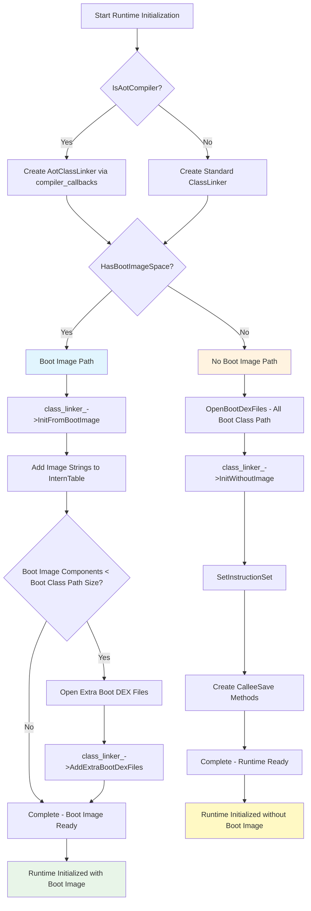

# ClassLinker

ClassLinker 是 ART在 AOSP 中负责“Java 类”加载与链接的核心组件。它的主要职责包括：
- 加载解析 DEX 文件
- 在运行时解析并绑定类、方法符号引用
- 维护类表结构
- 在需要时初始化与准备类


## 初始化

在运行时创建的时候ClassLinker被创建，`Runtime::Init`函数中




### 打开加载Dex文件

在ClassLinker的初始化的同时，还完成了打开、解析所有 bootclasspath 的 DEX 文件的步骤


`OpenBootDexFiles` 负责批量打开并加载BCP的 DEX 文件，将它们封装为 `DexFile` 对象并收集到输出列表中，统计打开失败的文件数量。


```cpp
   ArtDexFileLoader dex_file_loader(dex_filename, file, dex_location);
   if (!dex_file_loader.Open(verify, kVerifyChecksum, &error_msg, out_dex_files)) {
     LOG(WARNING) << "Failed to open .dex …";
     ++failure_count;
   }
```
通过 `ArtDexFileLoader` 尝试打开DEX。  
成功时，会把对应的 `unique_ptr<DexFile>` 加入 `out_dex_files`；失败时记录错误并计数。

ArtDexFileLoader会根据对应的Dex文件构造出对应的DexFile的对象


###  InitWithout/FromBootImage 


存在2个初始化函数，分别在Runtime::Init的时候根据bootimage的有无进行初始化


```cpp
  // Initialize class linker by bootstraping from dex files.
  bool InitWithoutImage(std::vector<std::unique_ptr<const DexFile>> boot_class_path,
                        std::string* error_msg)
      REQUIRES_SHARED(Locks::mutator_lock_)
      REQUIRES(!Locks::dex_lock_);

  // Initialize class linker from one or more boot images.
  bool InitFromBootImage(std::string* error_msg)
      REQUIRES_SHARED(Locks::mutator_lock_)
      REQUIRES(!Locks::dex_lock_);
```

对于存在Bootimage的时候，

```cpp

bool ClassLinker::InitFromBootImage(std::string* error_msg) {
  VLOG(startup) << __FUNCTION__ << " entering";
  CHECK(!init_done_);

  Runtime* const runtime = Runtime::Current();
  Thread* const self = Thread::Current();
  gc::Heap* const heap = runtime->GetHeap();
  std::vector<gc::space::ImageSpace*> spaces = heap->GetBootImageSpaces();
  CHECK(!spaces.empty());
  const ImageHeader& image_header = spaces[0]->GetImageHeader();
  image_pointer_size_ = image_header.GetPointerSize();
  if (UNLIKELY(image_pointer_size_ != PointerSize::k32 &&
               image_pointer_size_ != PointerSize::k64)) {
    *error_msg =
        StringPrintf("Invalid image pointer size: %u", static_cast<uint32_t>(image_pointer_size_));
    return false;
  }
  if (!runtime->IsAotCompiler()) {
    // Only the Aot compiler supports having an image with a different pointer size than the
    // runtime. This happens on the host for compiling 32 bit tests since we use a 64 bit libart
    // compiler. We may also use 32 bit dex2oat on a system with 64 bit apps.
    if (image_pointer_size_ != kRuntimePointerSize) {
      *error_msg = StringPrintf("Runtime must use current image pointer size: %zu vs %zu",
                                static_cast<size_t>(image_pointer_size_),
                                sizeof(void*));
      return false;
    }
  }
  DCHECK(!runtime->HasResolutionMethod());
  runtime->SetResolutionMethod(image_header.GetImageMethod(ImageHeader::kResolutionMethod));
  runtime->SetImtConflictMethod(image_header.GetImageMethod(ImageHeader::kImtConflictMethod));
  runtime->SetImtUnimplementedMethod(
      image_header.GetImageMethod(ImageHeader::kImtUnimplementedMethod));
  runtime->SetCalleeSaveMethod(
      image_header.GetImageMethod(ImageHeader::kSaveAllCalleeSavesMethod),
      CalleeSaveType::kSaveAllCalleeSaves);
  runtime->SetCalleeSaveMethod(
      image_header.GetImageMethod(ImageHeader::kSaveRefsOnlyMethod),
      CalleeSaveType::kSaveRefsOnly);
  runtime->SetCalleeSaveMethod(
      image_header.GetImageMethod(ImageHeader::kSaveRefsAndArgsMethod),
      CalleeSaveType::kSaveRefsAndArgs);
  runtime->SetCalleeSaveMethod(
      image_header.GetImageMethod(ImageHeader::kSaveEverythingMethod),
      CalleeSaveType::kSaveEverything);
  runtime->SetCalleeSaveMethod(
      image_header.GetImageMethod(ImageHeader::kSaveEverythingMethodForClinit),
      CalleeSaveType::kSaveEverythingForClinit);
  runtime->SetCalleeSaveMethod(
      image_header.GetImageMethod(ImageHeader::kSaveEverythingMethodForSuspendCheck),
      CalleeSaveType::kSaveEverythingForSuspendCheck);

  std::vector<const OatFile*> oat_files =
      runtime->GetOatFileManager().RegisterImageOatFiles(spaces);
  DCHECK(!oat_files.empty());
  const OatHeader& default_oat_header = oat_files[0]->GetOatHeader();
  jni_dlsym_lookup_trampoline_ = default_oat_header.GetJniDlsymLookupTrampoline();
  jni_dlsym_lookup_critical_trampoline_ = default_oat_header.GetJniDlsymLookupCriticalTrampoline();
  quick_resolution_trampoline_ = default_oat_header.GetQuickResolutionTrampoline();
  quick_imt_conflict_trampoline_ = default_oat_header.GetQuickImtConflictTrampoline();
  quick_generic_jni_trampoline_ = default_oat_header.GetQuickGenericJniTrampoline();
  quick_to_interpreter_bridge_trampoline_ = default_oat_header.GetQuickToInterpreterBridge();
  nterp_trampoline_ = default_oat_header.GetNterpTrampoline();
  if (kIsDebugBuild) {
    // Check that the other images use the same trampoline.
    for (size_t i = 1; i < oat_files.size(); ++i) {
      const OatHeader& ith_oat_header = oat_files[i]->GetOatHeader();
      const void* ith_jni_dlsym_lookup_trampoline_ =
          ith_oat_header.GetJniDlsymLookupTrampoline();
      const void* ith_jni_dlsym_lookup_critical_trampoline_ =
          ith_oat_header.GetJniDlsymLookupCriticalTrampoline();
      const void* ith_quick_resolution_trampoline =
          ith_oat_header.GetQuickResolutionTrampoline();
      const void* ith_quick_imt_conflict_trampoline =
          ith_oat_header.GetQuickImtConflictTrampoline();
      const void* ith_quick_generic_jni_trampoline =
          ith_oat_header.GetQuickGenericJniTrampoline();
      const void* ith_quick_to_interpreter_bridge_trampoline =
          ith_oat_header.GetQuickToInterpreterBridge();
      const void* ith_nterp_trampoline =
          ith_oat_header.GetNterpTrampoline();
      if (ith_jni_dlsym_lookup_trampoline_ != jni_dlsym_lookup_trampoline_ ||
          ith_jni_dlsym_lookup_critical_trampoline_ != jni_dlsym_lookup_critical_trampoline_ ||
          ith_quick_resolution_trampoline != quick_resolution_trampoline_ ||
          ith_quick_imt_conflict_trampoline != quick_imt_conflict_trampoline_ ||
          ith_quick_generic_jni_trampoline != quick_generic_jni_trampoline_ ||
          ith_quick_to_interpreter_bridge_trampoline != quick_to_interpreter_bridge_trampoline_ ||
          ith_nterp_trampoline != nterp_trampoline_) {
        // Make sure that all methods in this image do not contain those trampolines as
        // entrypoints. Otherwise the class-linker won't be able to work with a single set.
        TrampolineCheckData data;
        data.error = false;
        data.pointer_size = GetImagePointerSize();
        data.quick_resolution_trampoline = ith_quick_resolution_trampoline;
        data.quick_imt_conflict_trampoline = ith_quick_imt_conflict_trampoline;
        data.quick_generic_jni_trampoline = ith_quick_generic_jni_trampoline;
        data.quick_to_interpreter_bridge_trampoline = ith_quick_to_interpreter_bridge_trampoline;
        data.nterp_trampoline = ith_nterp_trampoline;
        ReaderMutexLock mu(self, *Locks::heap_bitmap_lock_);
        auto visitor = [&](mirror::Object* obj) REQUIRES_SHARED(Locks::mutator_lock_) {
          if (obj->IsClass()) {
            ObjPtr<mirror::Class> klass = obj->AsClass();
            for (ArtMethod& m : klass->GetMethods(data.pointer_size)) {
              const void* entrypoint =
                  m.GetEntryPointFromQuickCompiledCodePtrSize(data.pointer_size);
              if (entrypoint == data.quick_resolution_trampoline ||
                  entrypoint == data.quick_imt_conflict_trampoline ||
                  entrypoint == data.quick_generic_jni_trampoline ||
                  entrypoint == data.quick_to_interpreter_bridge_trampoline) {
                data.m = &m;
                data.error = true;
                return;
              }
            }
          }
        };
        spaces[i]->GetLiveBitmap()->Walk(visitor);
        if (data.error) {
          ArtMethod* m = data.m;
          LOG(ERROR) << "Found a broken ArtMethod: " << ArtMethod::PrettyMethod(m);
          *error_msg = "Found an ArtMethod with a bad entrypoint";
          return false;
        }
      }
    }
  }

  class_roots_ = GcRoot<mirror::ObjectArray<mirror::Class>>(
      ObjPtr<mirror::ObjectArray<mirror::Class>>::DownCast(
          image_header.GetImageRoot(ImageHeader::kClassRoots)));
  DCHECK_EQ(GetClassRoot<mirror::Class>(this)->GetClassFlags(), mirror::kClassFlagClass);

  DCHECK_EQ(GetClassRoot<mirror::Object>(this)->GetObjectSize(), sizeof(mirror::Object));
  ObjPtr<mirror::ObjectArray<mirror::Object>> boot_image_live_objects =
      ObjPtr<mirror::ObjectArray<mirror::Object>>::DownCast(
          image_header.GetImageRoot(ImageHeader::kBootImageLiveObjects));
  runtime->SetSentinel(boot_image_live_objects->Get(ImageHeader::kClearedJniWeakSentinel));
  DCHECK(runtime->GetSentinel().Read()->GetClass() == GetClassRoot<mirror::Object>(this));

  // Boot class loader, use a null handle.
  if (!AddImageSpaces(ArrayRef<gc::space::ImageSpace*>(spaces),
                      ScopedNullHandle<mirror::ClassLoader>(),
                      /*context=*/nullptr,
                      &boot_dex_files_,
                      error_msg)) {
    return false;
  }
  // We never use AOT code for debuggable.
  if (!runtime->IsJavaDebuggable()) {
    for (gc::space::ImageSpace* space : spaces) {
      const ImageHeader& header = space->GetImageHeader();
      header.VisitJniStubMethods([&](ArtMethod* method)
          REQUIRES_SHARED(Locks::mutator_lock_) {
        const void* stub = method->GetOatMethodQuickCode(image_pointer_size_);
        boot_image_jni_stubs_.Put(std::make_pair(JniStubKey(method), stub));
        return method;
      }, space->Begin(), image_pointer_size_);
    }
  }

  InitializeObjectVirtualMethodHashes(GetClassRoot<mirror::Object>(this),
                                      image_pointer_size_,
                                      ArrayRef<uint32_t>(object_virtual_method_hashes_));
  FinishInit(self);

  VLOG(startup) << __FUNCTION__ << " exiting";
  return true;
}


```


```cpp

bool ClassLinker::InitWithoutImage(std::vector<std::unique_ptr<const DexFile>> boot_class_path,
                                   std::string* error_msg) {
  VLOG(startup) << "ClassLinker::Init";

  Thread* const self = Thread::Current();
  Runtime* const runtime = Runtime::Current();
  gc::Heap* const heap = runtime->GetHeap();

  CHECK(!heap->HasBootImageSpace()) << "Runtime has image. We should use it.";
  CHECK(!init_done_);

  // Use the pointer size from the runtime since we are probably creating the image.
  image_pointer_size_ = InstructionSetPointerSize(runtime->GetInstructionSet());

  // java_lang_Class comes first, it's needed for AllocClass
  // The GC can't handle an object with a null class since we can't get the size of this object.
  heap->IncrementDisableMovingGC(self);
  StackHandleScope<64> hs(self);  // 64 is picked arbitrarily.
  auto class_class_size = mirror::Class::ClassClassSize(image_pointer_size_);
  // Allocate the object as non-movable so that there are no cases where Object::IsClass returns
  // the incorrect result when comparing to-space vs from-space.
  Handle<mirror::Class> java_lang_Class(hs.NewHandle(ObjPtr<mirror::Class>::DownCast(
      heap->AllocNonMovableObject(self, nullptr, class_class_size, VoidFunctor()))));
  CHECK(java_lang_Class != nullptr);
  java_lang_Class->SetClassFlags(mirror::kClassFlagClass);
  java_lang_Class->SetClass(java_lang_Class.Get());
  if (kUseBakerReadBarrier) {
    java_lang_Class->AssertReadBarrierState();
  }
  java_lang_Class->SetClassSize(class_class_size);
  java_lang_Class->SetPrimitiveType(Primitive::kPrimNot);
  heap->DecrementDisableMovingGC(self);
  // AllocClass(ObjPtr<mirror::Class>) can now be used

  // Class[] is used for reflection support.
  auto class_array_class_size = mirror::ObjectArray<mirror::Class>::ClassSize(image_pointer_size_);
  Handle<mirror::Class> class_array_class(hs.NewHandle(
      AllocClass(self, java_lang_Class.Get(), class_array_class_size)));
  class_array_class->SetComponentType(java_lang_Class.Get());

  // java_lang_Object comes next so that object_array_class can be created.
  Handle<mirror::Class> java_lang_Object(hs.NewHandle(
      AllocClass(self, java_lang_Class.Get(), mirror::Object::ClassSize(image_pointer_size_))));
  CHECK(java_lang_Object != nullptr);
  // backfill Object as the super class of Class.
  java_lang_Class->SetSuperClass(java_lang_Object.Get());
  mirror::Class::SetStatus(java_lang_Object, ClassStatus::kLoaded, self);

  java_lang_Object->SetObjectSize(sizeof(mirror::Object));
  // Allocate in non-movable so that it's possible to check if a JNI weak global ref has been
  // cleared without triggering the read barrier and unintentionally mark the sentinel alive.
  runtime->SetSentinel(heap->AllocNonMovableObject(self,
                                                   java_lang_Object.Get(),
                                                   java_lang_Object->GetObjectSize(),
                                                   VoidFunctor()));

  // Initialize the SubtypeCheck bitstring for java.lang.Object and java.lang.Class.
  if (kBitstringSubtypeCheckEnabled) {
    // It might seem the lock here is unnecessary, however all the SubtypeCheck
    // functions are annotated to require locks all the way down.
    //
    // We take the lock here to avoid using NO_THREAD_SAFETY_ANALYSIS.
    MutexLock subtype_check_lock(Thread::Current(), *Locks::subtype_check_lock_);
    SubtypeCheck<ObjPtr<mirror::Class>>::EnsureInitialized(java_lang_Object.Get());
    SubtypeCheck<ObjPtr<mirror::Class>>::EnsureInitialized(java_lang_Class.Get());
  }

  // Object[] next to hold class roots.
  Handle<mirror::Class> object_array_class(hs.NewHandle(
      AllocClass(self, java_lang_Class.Get(),
                 mirror::ObjectArray<mirror::Object>::ClassSize(image_pointer_size_))));
  object_array_class->SetComponentType(java_lang_Object.Get());

  // Setup java.lang.String.
  //
  // We make this class non-movable for the unlikely case where it were to be
  // moved by a sticky-bit (minor) collection when using the Generational
  // Concurrent Copying (CC) collector, potentially creating a stale reference
  // in the `klass_` field of one of its instances allocated in the Large-Object
  // Space (LOS) -- see the comment about the dirty card scanning logic in
  // art::gc::collector::ConcurrentCopying::MarkingPhase.
  Handle<mirror::Class> java_lang_String(hs.NewHandle(
      AllocClass</* kMovable= */ false>(
          self, java_lang_Class.Get(), mirror::String::ClassSize(image_pointer_size_))));
  java_lang_String->SetStringClass();
  mirror::Class::SetStatus(java_lang_String, ClassStatus::kResolved, self);

  // Setup java.lang.ref.Reference.
  Handle<mirror::Class> java_lang_ref_Reference(hs.NewHandle(
      AllocClass(self, java_lang_Class.Get(), mirror::Reference::ClassSize(image_pointer_size_))));
  java_lang_ref_Reference->SetObjectSize(mirror::Reference::InstanceSize());
  mirror::Class::SetStatus(java_lang_ref_Reference, ClassStatus::kResolved, self);

  // Create storage for root classes, save away our work so far (requires descriptors).
  class_roots_ = GcRoot<mirror::ObjectArray<mirror::Class>>(
      mirror::ObjectArray<mirror::Class>::Alloc(self,
                                                object_array_class.Get(),
                                                static_cast<int32_t>(ClassRoot::kMax)));
  CHECK(!class_roots_.IsNull());
  SetClassRoot(ClassRoot::kJavaLangClass, java_lang_Class.Get());
  SetClassRoot(ClassRoot::kJavaLangObject, java_lang_Object.Get());
  SetClassRoot(ClassRoot::kClassArrayClass, class_array_class.Get());
  SetClassRoot(ClassRoot::kObjectArrayClass, object_array_class.Get());
  SetClassRoot(ClassRoot::kJavaLangString, java_lang_String.Get());
  SetClassRoot(ClassRoot::kJavaLangRefReference, java_lang_ref_Reference.Get());

  // Fill in the empty iftable. Needs to be done after the kObjectArrayClass root is set.
  java_lang_Object->SetIfTable(AllocIfTable(self, 0, object_array_class.Get()));

  // Create array interface entries to populate once we can load system classes.
  object_array_class->SetIfTable(AllocIfTable(self, 2, object_array_class.Get()));
  DCHECK_EQ(GetArrayIfTable(), object_array_class->GetIfTable());

  // Setup the primitive type classes.
  CreatePrimitiveClass(self, Primitive::kPrimBoolean, ClassRoot::kPrimitiveBoolean);
  CreatePrimitiveClass(self, Primitive::kPrimByte, ClassRoot::kPrimitiveByte);
  CreatePrimitiveClass(self, Primitive::kPrimChar, ClassRoot::kPrimitiveChar);
  CreatePrimitiveClass(self, Primitive::kPrimShort, ClassRoot::kPrimitiveShort);
  CreatePrimitiveClass(self, Primitive::kPrimInt, ClassRoot::kPrimitiveInt);
  CreatePrimitiveClass(self, Primitive::kPrimLong, ClassRoot::kPrimitiveLong);
  CreatePrimitiveClass(self, Primitive::kPrimFloat, ClassRoot::kPrimitiveFloat);
  CreatePrimitiveClass(self, Primitive::kPrimDouble, ClassRoot::kPrimitiveDouble);
  CreatePrimitiveClass(self, Primitive::kPrimVoid, ClassRoot::kPrimitiveVoid);

  // Allocate the primitive array classes. We need only the native pointer
  // array at this point (int[] or long[], depending on architecture) but
  // we shall perform the same setup steps for all primitive array classes.
  AllocPrimitiveArrayClass(self, ClassRoot::kPrimitiveBoolean, ClassRoot::kBooleanArrayClass);
  AllocPrimitiveArrayClass(self, ClassRoot::kPrimitiveByte, ClassRoot::kByteArrayClass);
  AllocPrimitiveArrayClass(self, ClassRoot::kPrimitiveChar, ClassRoot::kCharArrayClass);
  AllocPrimitiveArrayClass(self, ClassRoot::kPrimitiveShort, ClassRoot::kShortArrayClass);
  AllocPrimitiveArrayClass(self, ClassRoot::kPrimitiveInt, ClassRoot::kIntArrayClass);
  AllocPrimitiveArrayClass(self, ClassRoot::kPrimitiveLong, ClassRoot::kLongArrayClass);
  AllocPrimitiveArrayClass(self, ClassRoot::kPrimitiveFloat, ClassRoot::kFloatArrayClass);
  AllocPrimitiveArrayClass(self, ClassRoot::kPrimitiveDouble, ClassRoot::kDoubleArrayClass);

  // now that these are registered, we can use AllocClass() and AllocObjectArray

  // Set up DexCache. This cannot be done later since AppendToBootClassPath calls AllocDexCache.
  Handle<mirror::Class> java_lang_DexCache(hs.NewHandle(
      AllocClass(self, java_lang_Class.Get(), mirror::DexCache::ClassSize(image_pointer_size_))));
  SetClassRoot(ClassRoot::kJavaLangDexCache, java_lang_DexCache.Get());
  java_lang_DexCache->SetDexCacheClass();
  java_lang_DexCache->SetObjectSize(mirror::DexCache::InstanceSize());
  mirror::Class::SetStatus(java_lang_DexCache, ClassStatus::kResolved, self);


  // Setup dalvik.system.ClassExt
  Handle<mirror::Class> dalvik_system_ClassExt(hs.NewHandle(
      AllocClass(self, java_lang_Class.Get(), mirror::ClassExt::ClassSize(image_pointer_size_))));
  SetClassRoot(ClassRoot::kDalvikSystemClassExt, dalvik_system_ClassExt.Get());
  mirror::Class::SetStatus(dalvik_system_ClassExt, ClassStatus::kResolved, self);

  // Set up array classes for string, field, method
  Handle<mirror::Class> object_array_string(hs.NewHandle(
      AllocClass(self, java_lang_Class.Get(),
                 mirror::ObjectArray<mirror::String>::ClassSize(image_pointer_size_))));
  object_array_string->SetComponentType(java_lang_String.Get());
  SetClassRoot(ClassRoot::kJavaLangStringArrayClass, object_array_string.Get());

  LinearAlloc* linear_alloc = runtime->GetLinearAlloc();
  // Create runtime resolution and imt conflict methods.
  runtime->SetResolutionMethod(runtime->CreateResolutionMethod());
  runtime->SetImtConflictMethod(runtime->CreateImtConflictMethod(linear_alloc));
  runtime->SetImtUnimplementedMethod(runtime->CreateImtConflictMethod(linear_alloc));

  // Setup boot_class_path_ and register class_path now that we can use AllocObjectArray to create
  // DexCache instances. Needs to be after String, Field, Method arrays since AllocDexCache uses
  // these roots.
  if (boot_class_path.empty()) {
    *error_msg = "Boot classpath is empty.";
    return false;
  }
  for (auto& dex_file : boot_class_path) {
    if (dex_file == nullptr) {
      *error_msg = "Null dex file.";
      return false;
    }
    AppendToBootClassPath(self, dex_file.get());
    boot_dex_files_.push_back(std::move(dex_file));
  }

  // now we can use FindSystemClass

  // Set up GenericJNI entrypoint. That is mainly a hack for common_compiler_test.h so that
  // we do not need friend classes or a publicly exposed setter.
  quick_generic_jni_trampoline_ = GetQuickGenericJniStub();
  if (!runtime->IsAotCompiler()) {
    // We need to set up the generic trampolines since we don't have an image.
    jni_dlsym_lookup_trampoline_ = GetJniDlsymLookupStub();
    jni_dlsym_lookup_critical_trampoline_ = GetJniDlsymLookupCriticalStub();
    quick_resolution_trampoline_ = GetQuickResolutionStub();
    quick_imt_conflict_trampoline_ = GetQuickImtConflictStub();
    quick_generic_jni_trampoline_ = GetQuickGenericJniStub();
    quick_to_interpreter_bridge_trampoline_ = GetQuickToInterpreterBridge();
    nterp_trampoline_ = interpreter::GetNterpEntryPoint();
  }

  // Object, String, ClassExt and DexCache need to be rerun through FindSystemClass to finish init
  // We also need to immediately clear the finalizable flag for Object so that other classes are
  // not erroneously marked as finalizable. (Object defines an empty finalizer, so that other
  // classes can override it but it is not itself finalizable.)
  mirror::Class::SetStatus(java_lang_Object, ClassStatus::kNotReady, self);
  CheckSystemClass(self, java_lang_Object, "Ljava/lang/Object;");
  CHECK(java_lang_Object->IsFinalizable());
  java_lang_Object->ClearFinalizable();
  CHECK_EQ(java_lang_Object->GetObjectSize(), mirror::Object::InstanceSize());
  mirror::Class::SetStatus(java_lang_String, ClassStatus::kNotReady, self);
  CheckSystemClass(self, java_lang_String, "Ljava/lang/String;");
  mirror::Class::SetStatus(java_lang_DexCache, ClassStatus::kNotReady, self);
  CheckSystemClass(self, java_lang_DexCache, "Ljava/lang/DexCache;");
  CHECK_EQ(java_lang_DexCache->GetObjectSize(), mirror::DexCache::InstanceSize());
  mirror::Class::SetStatus(dalvik_system_ClassExt, ClassStatus::kNotReady, self);
  CheckSystemClass(self, dalvik_system_ClassExt, "Ldalvik/system/ClassExt;");
  CHECK_EQ(dalvik_system_ClassExt->GetObjectSize(), mirror::ClassExt::InstanceSize());

  // Run Class through FindSystemClass. This initializes the dex_cache_ fields and register it
  // in class_table_.
  CheckSystemClass(self, java_lang_Class, "Ljava/lang/Class;");

  // Setup core array classes, i.e. Object[], String[] and Class[] and primitive
  // arrays - can't be done until Object has a vtable and component classes are loaded.
  FinishCoreArrayClassSetup(ClassRoot::kObjectArrayClass);
  FinishCoreArrayClassSetup(ClassRoot::kClassArrayClass);
  FinishCoreArrayClassSetup(ClassRoot::kJavaLangStringArrayClass);
  FinishCoreArrayClassSetup(ClassRoot::kBooleanArrayClass);
  FinishCoreArrayClassSetup(ClassRoot::kByteArrayClass);
  FinishCoreArrayClassSetup(ClassRoot::kCharArrayClass);
  FinishCoreArrayClassSetup(ClassRoot::kShortArrayClass);
  FinishCoreArrayClassSetup(ClassRoot::kIntArrayClass);
  FinishCoreArrayClassSetup(ClassRoot::kLongArrayClass);
  FinishCoreArrayClassSetup(ClassRoot::kFloatArrayClass);
  FinishCoreArrayClassSetup(ClassRoot::kDoubleArrayClass);

  // Setup the single, global copy of "iftable".
  auto java_lang_Cloneable = hs.NewHandle(FindSystemClass(self, "Ljava/lang/Cloneable;"));
  CHECK(java_lang_Cloneable != nullptr);
  auto java_io_Serializable = hs.NewHandle(FindSystemClass(self, "Ljava/io/Serializable;"));
  CHECK(java_io_Serializable != nullptr);
  // We assume that Cloneable/Serializable don't have superinterfaces -- normally we'd have to
  // crawl up and explicitly list all of the supers as well.
  object_array_class->GetIfTable()->SetInterface(0, java_lang_Cloneable.Get());
  object_array_class->GetIfTable()->SetInterface(1, java_io_Serializable.Get());

  // Check Class[] and Object[]'s interfaces.
  CHECK_EQ(java_lang_Cloneable.Get(), class_array_class->GetDirectInterface(0));
  CHECK_EQ(java_io_Serializable.Get(), class_array_class->GetDirectInterface(1));
  CHECK_EQ(java_lang_Cloneable.Get(), object_array_class->GetDirectInterface(0));
  CHECK_EQ(java_io_Serializable.Get(), object_array_class->GetDirectInterface(1));

  CHECK_EQ(object_array_string.Get(),
           FindSystemClass(self, GetClassRootDescriptor(ClassRoot::kJavaLangStringArrayClass)));

  // The Enum class declares a "final" finalize() method to prevent subclasses from introducing
  // a finalizer but it is not itself consedered finalizable. Load the Enum class now and clear
  // the finalizable flag to prevent subclasses from being marked as finalizable.
  CHECK_EQ(LookupClass(self, "Ljava/lang/Enum;", /*class_loader=*/ nullptr), nullptr);
  Handle<mirror::Class> java_lang_Enum = hs.NewHandle(FindSystemClass(self, "Ljava/lang/Enum;"));
  CHECK(java_lang_Enum->IsFinalizable());
  java_lang_Enum->ClearFinalizable();

  // End of special init trickery, all subsequent classes may be loaded via FindSystemClass.

  // Create java.lang.reflect.Proxy root.
  SetClassRoot(ClassRoot::kJavaLangReflectProxy,
               FindSystemClass(self, "Ljava/lang/reflect/Proxy;"));

  // Create java.lang.reflect.Field.class root.
  ObjPtr<mirror::Class> class_root = FindSystemClass(self, "Ljava/lang/reflect/Field;");
  CHECK(class_root != nullptr);
  SetClassRoot(ClassRoot::kJavaLangReflectField, class_root);

  // Create java.lang.reflect.Field array root.
  class_root = FindSystemClass(self, "[Ljava/lang/reflect/Field;");
  CHECK(class_root != nullptr);
  SetClassRoot(ClassRoot::kJavaLangReflectFieldArrayClass, class_root);

  // Create java.lang.reflect.Constructor.class root and array root.
  class_root = FindSystemClass(self, "Ljava/lang/reflect/Constructor;");
  CHECK(class_root != nullptr);
  SetClassRoot(ClassRoot::kJavaLangReflectConstructor, class_root);
  class_root = FindSystemClass(self, "[Ljava/lang/reflect/Constructor;");
  CHECK(class_root != nullptr);
  SetClassRoot(ClassRoot::kJavaLangReflectConstructorArrayClass, class_root);

  // Create java.lang.reflect.Method.class root and array root.
  class_root = FindSystemClass(self, "Ljava/lang/reflect/Method;");
  CHECK(class_root != nullptr);
  SetClassRoot(ClassRoot::kJavaLangReflectMethod, class_root);
  class_root = FindSystemClass(self, "[Ljava/lang/reflect/Method;");
  CHECK(class_root != nullptr);
  SetClassRoot(ClassRoot::kJavaLangReflectMethodArrayClass, class_root);

  // Create java.lang.invoke.CallSite.class root
  class_root = FindSystemClass(self, "Ljava/lang/invoke/CallSite;");
  CHECK(class_root != nullptr);
  SetClassRoot(ClassRoot::kJavaLangInvokeCallSite, class_root);

  // Create java.lang.invoke.MethodType.class root
  class_root = FindSystemClass(self, "Ljava/lang/invoke/MethodType;");
  CHECK(class_root != nullptr);
  SetClassRoot(ClassRoot::kJavaLangInvokeMethodType, class_root);

  // Create java.lang.invoke.MethodHandleImpl.class root
  class_root = FindSystemClass(self, "Ljava/lang/invoke/MethodHandleImpl;");
  CHECK(class_root != nullptr);
  SetClassRoot(ClassRoot::kJavaLangInvokeMethodHandleImpl, class_root);
  SetClassRoot(ClassRoot::kJavaLangInvokeMethodHandle, class_root->GetSuperClass());

  // Create java.lang.invoke.MethodHandles.Lookup.class root
  class_root = FindSystemClass(self, "Ljava/lang/invoke/MethodHandles$Lookup;");
  CHECK(class_root != nullptr);
  SetClassRoot(ClassRoot::kJavaLangInvokeMethodHandlesLookup, class_root);

  // Create java.lang.invoke.VarHandle.class root
  class_root = FindSystemClass(self, "Ljava/lang/invoke/VarHandle;");
  CHECK(class_root != nullptr);
  SetClassRoot(ClassRoot::kJavaLangInvokeVarHandle, class_root);

  // Create java.lang.invoke.FieldVarHandle.class root
  class_root = FindSystemClass(self, "Ljava/lang/invoke/FieldVarHandle;");
  CHECK(class_root != nullptr);
  SetClassRoot(ClassRoot::kJavaLangInvokeFieldVarHandle, class_root);

  // Create java.lang.invoke.StaticFieldVarHandle.class root
  class_root = FindSystemClass(self, "Ljava/lang/invoke/StaticFieldVarHandle;");
  CHECK(class_root != nullptr);
  SetClassRoot(ClassRoot::kJavaLangInvokeStaticFieldVarHandle, class_root);

  // Create java.lang.invoke.ArrayElementVarHandle.class root
  class_root = FindSystemClass(self, "Ljava/lang/invoke/ArrayElementVarHandle;");
  CHECK(class_root != nullptr);
  SetClassRoot(ClassRoot::kJavaLangInvokeArrayElementVarHandle, class_root);

  // Create java.lang.invoke.ByteArrayViewVarHandle.class root
  class_root = FindSystemClass(self, "Ljava/lang/invoke/ByteArrayViewVarHandle;");
  CHECK(class_root != nullptr);
  SetClassRoot(ClassRoot::kJavaLangInvokeByteArrayViewVarHandle, class_root);

  // Create java.lang.invoke.ByteBufferViewVarHandle.class root
  class_root = FindSystemClass(self, "Ljava/lang/invoke/ByteBufferViewVarHandle;");
  CHECK(class_root != nullptr);
  SetClassRoot(ClassRoot::kJavaLangInvokeByteBufferViewVarHandle, class_root);

  class_root = FindSystemClass(self, "Ldalvik/system/EmulatedStackFrame;");
  CHECK(class_root != nullptr);
  SetClassRoot(ClassRoot::kDalvikSystemEmulatedStackFrame, class_root);

  // java.lang.ref classes need to be specially flagged, but otherwise are normal classes
  // finish initializing Reference class
  mirror::Class::SetStatus(java_lang_ref_Reference, ClassStatus::kNotReady, self);
  CheckSystemClass(self, java_lang_ref_Reference, "Ljava/lang/ref/Reference;");
  CHECK_EQ(java_lang_ref_Reference->GetObjectSize(), mirror::Reference::InstanceSize());
  CHECK_EQ(java_lang_ref_Reference->GetClassSize(),
           mirror::Reference::ClassSize(image_pointer_size_));
  class_root = FindSystemClass(self, "Ljava/lang/ref/FinalizerReference;");
  CHECK_EQ(class_root->GetClassFlags(), mirror::kClassFlagNormal);
  class_root->SetClassFlags(class_root->GetClassFlags() | mirror::kClassFlagFinalizerReference);
  class_root = FindSystemClass(self, "Ljava/lang/ref/PhantomReference;");
  CHECK_EQ(class_root->GetClassFlags(), mirror::kClassFlagNormal);
  class_root->SetClassFlags(class_root->GetClassFlags() | mirror::kClassFlagPhantomReference);
  class_root = FindSystemClass(self, "Ljava/lang/ref/SoftReference;");
  CHECK_EQ(class_root->GetClassFlags(), mirror::kClassFlagNormal);
  class_root->SetClassFlags(class_root->GetClassFlags() | mirror::kClassFlagSoftReference);
  class_root = FindSystemClass(self, "Ljava/lang/ref/WeakReference;");
  CHECK_EQ(class_root->GetClassFlags(), mirror::kClassFlagNormal);
  class_root->SetClassFlags(class_root->GetClassFlags() | mirror::kClassFlagWeakReference);

  // Setup the ClassLoader, verifying the object_size_.
  class_root = FindSystemClass(self, "Ljava/lang/ClassLoader;");
  class_root->SetClassLoaderClass();
  CHECK_EQ(class_root->GetObjectSize(), mirror::ClassLoader::InstanceSize());
  SetClassRoot(ClassRoot::kJavaLangClassLoader, class_root);

  // Set up java.lang.Throwable, java.lang.ClassNotFoundException, and
  // java.lang.StackTraceElement as a convenience.
  SetClassRoot(ClassRoot::kJavaLangThrowable, FindSystemClass(self, "Ljava/lang/Throwable;"));
  SetClassRoot(ClassRoot::kJavaLangClassNotFoundException,
               FindSystemClass(self, "Ljava/lang/ClassNotFoundException;"));
  SetClassRoot(ClassRoot::kJavaLangStackTraceElement,
               FindSystemClass(self, "Ljava/lang/StackTraceElement;"));
  SetClassRoot(ClassRoot::kJavaLangStackTraceElementArrayClass,
               FindSystemClass(self, "[Ljava/lang/StackTraceElement;"));
  SetClassRoot(ClassRoot::kJavaLangClassLoaderArrayClass,
               FindSystemClass(self, "[Ljava/lang/ClassLoader;"));

  // Create conflict tables that depend on the class linker.
  runtime->FixupConflictTables();

  FinishInit(self);

  VLOG(startup) << "ClassLinker::InitFromCompiler exiting";

  return true;
}
```
