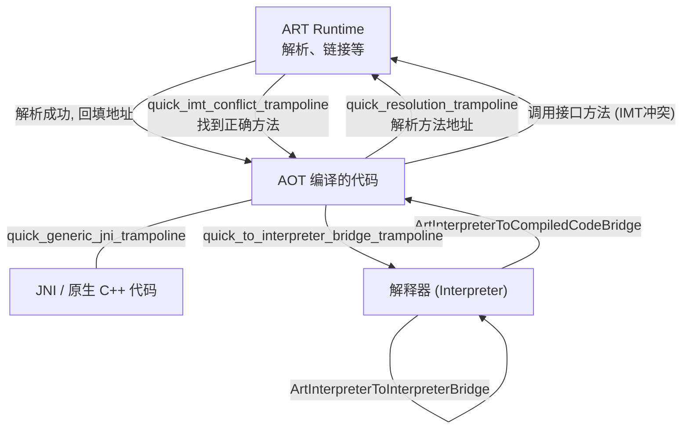
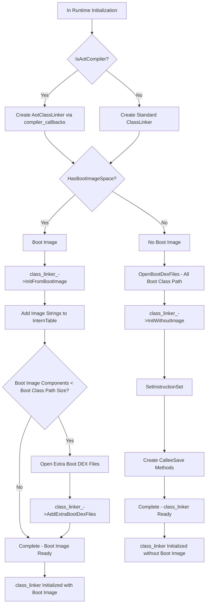
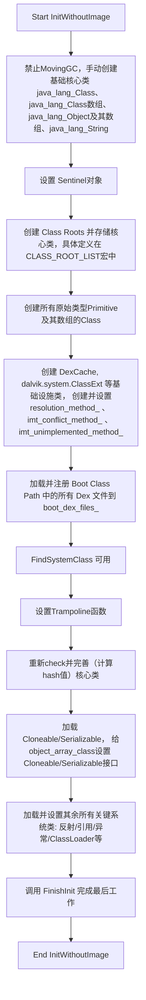
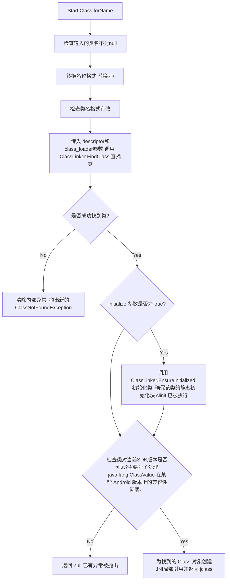
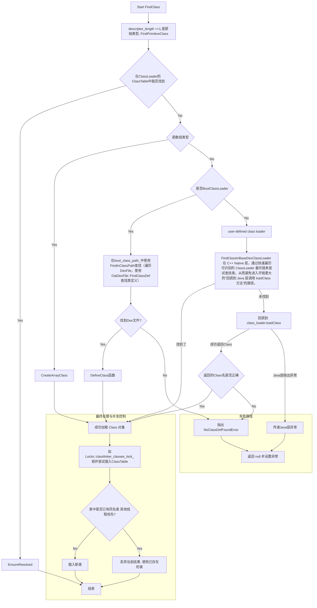
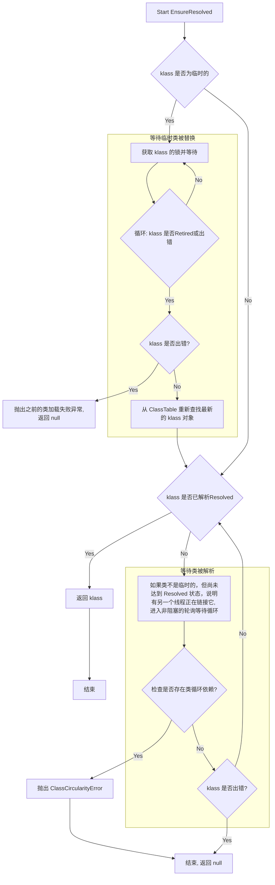
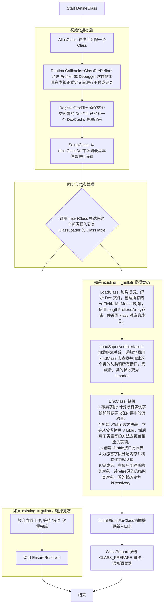
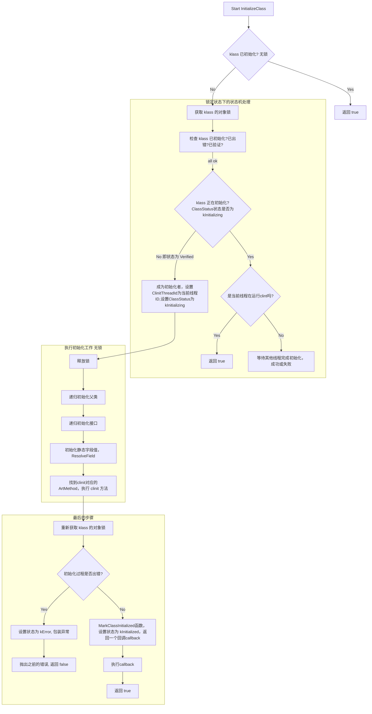

# ClassLinker

ClassLinker 是 ART在 AOSP 中负责“Java 类”加载与链接的核心组件。它的主要职责包括：

- 加载解析 DEX 文件
- 在运行时解析并绑定类、方法符号引用
- 维护类表结构
- 在需要时初始化与准备类

## ClassLinker的成员变量

### BootClassDexFile

```cpp

  std::vector<const DexFile*> boot_class_path_;
  std::vector<std::unique_ptr<const DexFile>> boot_dex_files_;
```

boot_dex_files_持有组成核心库的 DexFile 对象的所有权

在核心库DexFile中寻找类定义的时候是从boot_class_path_获取DexFile指针，然后使用 OatDexFile::FindClassDef 方法获取类在dex文件中的定义dex::ClassDef*

```cpp
  // JNI weak globals and side data to allow dex caches to get unloaded. We lazily delete weak
  // globals when we register new dex files.
  std::unordered_map<const DexFile*, DexCacheData> dex_caches_ GUARDED_BY(Locks::dex_lock_);
```

### DexCacheData

DexCacheData 的结构如下

```cpp
struct DexCacheData {
  ......
  // Weak root to the DexCache. Note: Do not decode this unnecessarily or else class unloading may
  // not work properly.
  jweak weak_root;
  // Identify the associated class loader's class table. This is used to make sure that
  // the Java call to native DexCache.setResolvedType() inserts the resolved type in that
  // class table. It is also used to make sure we don't register the same dex cache with
  // multiple class loaders.
  ClassTable* class_table;
  // Monotonically increasing integer which records the order in which DexFiles were registered.
  // Used only to preserve determinism when creating compiled image.
  uint64_t registration_index;
  ......
}; 
```

weak_root: DexCache 对象本身是在 Java 堆上分配的。当加载它的 ClassLoader 以及所有由它加载的类都可以被垃圾回收时，这个 DexCache 对象也应该被回收。
如果 ClassLinker 直接用一个强引用（比如 jobject 或 GcRoot）指向 DexCache，那么 DexCache 将永远无法被回收，进而导致相关的 ClassLoader 和所有类都无法卸载，造成内存泄漏。
使用 jweak（弱引用），ClassLinker 可以保持对 DexCache 的追踪，而不会阻止它被 GC 回收。当 GC 发生后，ClassLinker 可以通过检查这个弱引用是否已被清除，来判断对应的 DexFile 是否可以被安全地卸载。

class_table: ART 中每个 ClassLoader 都有自己专属的 ClassTable，用于存放它加载的类。当 Java 代码在运行时动态解析一个类型时（例如通过反射），最终会调用到底层的 DexCache.setResolvedType() native 方法。 ClassLinker 需要确保这个新解析出来的类被放入正确的 ClassTable 中。这个 class_table 成员就提供了这个信息。

registration_index: 通过给每个注册的 DexFile 分配一个唯一的、递增的索引，编译器可以根据这个索引进行排序，从而保证每次处理 DexFile 的顺序都是固定的，最终确保了输出的镜像文件是二进制级别一致的。

### ClassLoaderData

```cpp
  // This contains the class loaders which have class tables. It is populated by
  // InsertClassTableForClassLoader.
  std::list<ClassLoaderData> class_loaders_
      GUARDED_BY(Locks::classlinker_classes_lock_);
```

ClassLoaderData 定义如下

```cpp
  struct ClassLoaderData {
    jweak weak_root;  // Weak root to enable class unloading.
    ClassTable* class_table; // 一个哈希表 
    LinearAlloc* allocator;
  };
```

ClassLoaderData 这个结构体是 ClassLinker 用来管理非BootClassLoader加载器的数据结构。
对于应用中由开发者创建的各种 ClassLoader，ART 则通过 ClassLinker 里的一个 `std::list<ClassLoaderData>` 列表来管理它们。

`LinearAlloc* allocator` 指向一个与此 ClassLoader 关联的线性内存分配器, 当 ClassLinker 加载一个类时，它需要为这个类分配一些ART内部使用的数据结构,如 ArtMethod 数组、ArtField 数组等.使用一个LinearAlloc （ART里使用ArenaAllocator）保证这些分配到一个线性的内存空间里。

### BootClassLoader

```cpp
  // Boot class path table. Since the class loader for this is null.
  std::unique_ptr<ClassTable> boot_class_table_ GUARDED_BY(Locks::classlinker_classes_lock_);
  ```
  
ClassLinker 为 BootClassLoader 准备了一个专用的 boot_class_table_, 用于存放由 BootClassLoader 加载的所有核心系统类。

### 根对象数组

  ```cpp

  // New gc-roots, only used by CMS/CMC since the GC needs to mark these in the pause.
  // 记录在并发标记期间，由 ClassLinker 动态创建的新的堆对象根
  // 当并发标记阶段结束后，GC 线程会专门遍历 new_roots_ 列表
  std::vector<GcRoot<mirror::Object>> new_roots_ GUARDED_BY(Locks::classlinker_classes_lock_);

  // Boot image oat files with new .bss GC roots to be visited in the pause by CMS.
  // 记录那些包含了需要在 .bss 段中查找 GC 根的启动镜像 OAT 文件。
  // 在 ART 中，一些类的静态字段（如果它们是指向堆对象的引用）可能会被编译到 OAT 文件的 .bss 段中。这些字段同样是 GC Roots。
  std::vector<const OatFile*> new_bss_roots_boot_oat_files_
      GUARDED_BY(Locks::classlinker_classes_lock_);

  // 这个成员的功能应该属于性能优化与缓存的部分，但是定义顺序如此
  // Number of times we've searched dex caches for a class. After a certain number of misses we move
  // the classes into the class_table_ to avoid dex cache based searches.
  Atomic<uint32_t> failed_dex_cache_class_lookups_;

  //一个根对象数组，包含了虚拟机最常用、最核心的类的类对象,ART 通过这个数组可以立即访问这些类，而无需进行任何查找
  // Well known mirror::Class roots.
  GcRoot<mirror::ObjectArray<mirror::Class>> class_roots_;
```

### 性能优化与缓存

`failed_dex_cache_class_lookups_`成员
一个计数器。当通过 DexCache 查找一个类失败次数过多时，ART 可能会决定将这个类直接移入更稳定的 ClassTable 中，以优化后续的查找路径。

```cpp
  // 预先计算并缓存了 java.lang.Object 所有虚方法（如 equals, hashCode, toString）的哈希值。由于所有类都继承自 Object，这避免了在链接每个新类时都重复计算这些哈希值。
  // Method hashes for virtual methods from java.lang.Object used
  // to avoid recalculating them for each class we link.
  uint32_t object_virtual_method_hashes_[mirror::Object::kVTableLength];

  // A cache of the last FindArrayClass results. The cache serves to avoid creating array class
  // descriptors for the sake of performing FindClass.
  static constexpr size_t kFindArrayCacheSize = 16;
  // 一个小型缓存，用于存放最近查找过的数组类
  std::atomic<GcRoot<mirror::Class>> find_array_class_cache_[kFindArrayCacheSize];
  size_t find_array_class_cache_next_victim_;

  bool init_done_; 
  bool log_new_roots_ GUARDED_BY(Locks::classlinker_classes_lock_);

  // 指向字符串常量池InternTable的指针。ClassLinker 在解析类和字符串字面量时需要与这个表交互，以确保所有相同的字符串常量都指向同一个 String 对象
  InternTable* intern_table_;

  const bool fast_class_not_found_exceptions_; // 在FindClass中起作用
```

#### 各种trampoline函数指针

```cpp
  // Trampolines within the image the bounce to runtime entrypoints. Done so that there is a single
  // patch point within the image. TODO: make these proper relocations.
  const void* jni_dlsym_lookup_trampoline_;
  const void* jni_dlsym_lookup_critical_trampoline_;
  const void* quick_resolution_trampoline_;
  const void* quick_imt_conflict_trampoline_;
  const void* quick_generic_jni_trampoline_;
  const void* quick_to_interpreter_bridge_trampoline_;
  const void* nterp_trampoline_;
```
  
- jni_dlsym_lookup_trampoline_：用于处理动态注册的 JNI 方法。当 Java 代码调用一个通过 C++ RegisterNatives 函数绑定的 native 方法时，会走到这个跳板来进行符号查找
- jni_dlsym_lookup_critical_trampoline_ 同上，只用于标记为 @CriticalNative 的 JNI 方法（不使用Java对象）
- quick_resolution_trampoline_： 当一个方法第一次被调用时，ART 需要找到它在内存中的真正地址，然后把调用点的指令修正为直接指向目标地址，这样下一次调用就快了
- quick_imt_conflict_trampoline_： 如果一个类实现了多个接口，且这些接口中有签名相同的方法，就会产生“冲突”。调用这种冲突方法时，就会先跳转到这个跳板，由它来执行更复杂的逻辑，以确定到底该调用哪个实现。
- quick_generic_jni_trampoline_： 通用 JNI 跳板。这是最标准、最常用的 JNI 调用入口。
- quick_to_interpreter_bridge_trampoline_： AOT 编译的代码需要调用一个没有被编译的方法时，执行流就会跳转到这个跳板。它负责将当前的执行状态从“原生模式”转为“解释模式”，然后由解释器来执行目标方法。
- nterp_trampoline_ ： 这个跳板是所有需要由 Nterp 执行的方法的入口点。



### 其他成员

```cpp
  // Image pointer size.
  PointerSize image_pointer_size_;

  // 这些变量和锁用于处理一个复杂的多线程问题：如何确保一个类的初始化完成对所有其他线程立即可见。
  // Classes to transition from ClassStatus::kInitialized to ClassStatus::kVisiblyInitialized.
  Mutex visibly_initialized_callback_lock_;
  std::unique_ptr<VisiblyInitializedCallback> visibly_initialized_callback_
      GUARDED_BY(visibly_initialized_callback_lock_);
  IntrusiveForwardList<VisiblyInitializedCallback> running_visibly_initialized_callbacks_
      GUARDED_BY(visibly_initialized_callback_lock_);

  // Whether to use `membarrier()` to make classes visibly initialized.
  bool visibly_initialize_classes_with_membarier_;

  // Java 语言规范严格规定，在调用一个类的任何方法（特别是静态方法）之前，必须先执行该类的静态初始化块 <clinit>。
  // @CriticalNative 是一个为极致性能而生的注解。被它标记的 JNI 方法可以获得最快的调用速度，因为它省去了几乎所有的 JNI 开销。为了达到这个速度，它的一个重要优化就是默认跳过类的初始化检查。
  // 一个映射表，特殊处理 @CriticalNative 方法。如果一个 @CriticalNative 方法所在的类需要执行静态初始化块，ART 会把该方法的原生代码指针存放在这个表中而不是原生代码指针直接存入 ArtMethod，以确保在调用前强制执行初始化检查。
  // 如果存入 ArtMethod ，AOT 编译器生成的代码会认为这是一个可以直接跳转的目标地址，从而跳过初始化检查。
  // Registered native code for @CriticalNative methods of classes that are not visibly
  // initialized. These code pointers cannot be stored in ArtMethod as that would risk
  // skipping the class initialization check for direct calls from compiled code.
  Mutex critical_native_code_with_clinit_check_lock_;
  std::map<ArtMethod*, void*> critical_native_code_with_clinit_check_
      GUARDED_BY(critical_native_code_with_clinit_check_lock_);

  // 用于缓存在boot image中找到的JNI Stub Methods, 
  // Load unique JNI stubs from boot images. If the subsequently loaded native methods could find a
  // matching stub, then reuse it without JIT/AOT compilation.
  JniStubHashMap<const void*> boot_image_jni_stubs_;

  // Class Hierarchy Analysis 类继承关系分析模块的指针
  // 通过分析整个应用的类继承树，它可以将一些虚方法调用优化为直接方法调用（静态绑定），从而提升代码执行效率。
  std::unique_ptr<ClassHierarchyAnalysis> cha_;
```

## ClassLinker初始化

在运行时创建的时候ClassLinker被创建，`Runtime::Init`函数中



### 打开加载Dex文件

在ClassLinker的初始化的同时，还完成了打开、解析所有 bootclasspath 的 DEX 文件的步骤

`OpenBootDexFiles` 负责批量打开并加载BCP的 DEX 文件，将它们封装为 `DexFile` 对象并收集到输出列表中，统计打开失败的文件数量。

```cpp
   ArtDexFileLoader dex_file_loader(dex_filename, file, dex_location);
   if (!dex_file_loader.Open(verify, kVerifyChecksum, &error_msg, out_dex_files)) {
     LOG(WARNING) << "Failed to open .dex …";
     ++failure_count;
   }
```

通过 `ArtDexFileLoader` 尝试打开DEX。  
成功时，会把对应的 `unique_ptr<DexFile>` 加入 `out_dex_files`；失败时记录错误并计数。

ArtDexFileLoader会根据对应的Dex文件构造出对应的DexFile的对象

### InitFromBootImage

存在2个初始化函数，分别在Runtime::Init的时候根据bootimage的有无进行初始化

```cpp
  // Initialize class linker by bootstraping from dex files.
  bool InitWithoutImage(std::vector<std::unique_ptr<const DexFile>> boot_class_path,
                        std::string* error_msg)
      REQUIRES_SHARED(Locks::mutator_lock_)
      REQUIRES(!Locks::dex_lock_);

  // Initialize class linker from one or more boot images.
  bool InitFromBootImage(std::string* error_msg)
      REQUIRES_SHARED(Locks::mutator_lock_)
      REQUIRES(!Locks::dex_lock_);
```

对于存在Bootimage的时候，InitFromBootImage执行流程如下

```mermaid
flowchart TD
    A[InitFromBootImage] --> B[获取 BootImageSpaces]
    B --> C[验证 ImageHeader 和 PointerSize]
    C --> D{PointerSize 有效?}
    
    D -->|No| E[返回错误]
    D -->|Yes| F[从Image中读取，初始化一些关键的内置方法： <br/> Runtime三个ArtMethod指针成员 resolution_method_ 、 imt_conflict_method_ 、 imt_unimplemented_method_ <br/> 这些是 ART 用于处理动态链接、处理接口方法表（IMT）冲突、接口方法未实现的高度优化的小段代码。]
    
    F --> G[从Image中读取，使用 SetCalleeSaveMethod 初始化6个CalleeSave方法，保存在Runtime指针数组类型的callee_save_methods_中。因为ART 并不总是需要保存所有 Callee-Save 寄存器。为了极致的性能，它准备了多套方案，包括：<br/>  kSaveAllCalleeSavesMethod、 kSaveRefsOnlyMethod、 kSaveRefsAndArgsMethod、 kSaveEverythingMethod、 kSaveEverythingMethodForClinit、 kSaveEverythingMethodForSuspendCheck]
    
    G --> H[注册每个ImageSpace对应的OatFiles到oat_file_manager中]
    H --> I[从第一个 OAT 文件中，加载并设置一系列关键的Trampoline函数指针。]
    
    I --> J[Trampoline函数包括:<br/> jni_dlsym_lookup_trampoline_<br/> quick_resolution_trampoline_<br/> quick_imt_conflict_trampoline_<br/> quick_generic_jni_trampoline_ <br/> quick_to_interpreter_bridge_trampoline_<br/> nterp_trampoline_]
    
    J --> K{Debug 模式?}
    K -->|Yes| L[验证所有 OatFile 的 Trampoline 一致性]
    K -->|No| M[从image中读取Java核心的一些类对象到一个类对象数组的GCRoot中class_roots_]
    
    L --> N{Trampoline 一致?}
    N -->|No| O[检查 ArtMethod 入口点]
    N -->|Yes| M
    
    O --> P{发现错误入口点?}
    P -->|Yes| Q[返回错误]
    P -->|No| M
    
    M --> R[从 ImageHeader 获取 boot_image_live_objects，这些是必须在运行时保持存活的关键对象]
    R --> S[从boot_image_live_objects中拿到Sentinel 对象，设置Runtime的成员sentinel_，用于处理 JNI（例如，已被清除的弱引用）和 JDWP中的各种无效引用情况。]
    S --> T[AddImageSpaces<br/>1. 找到镜像中包含的所有 DexFile 对象，添加到ClassLinker 的 boot_dex_files_ <br/> 2.根据当前运行时对镜像内容进行一些调整，比如设置ArtMethod的各类 trampoline，设置hotness_threshold <br/> 3. 将所有类批量添加到 ClassLoader 的 class_table（Boot class path table的是ClassLinker的boot_class_table_），使其可被查找和使用]
    
    T --> U{非调试模式?}
    U -->|Yes| V[缓存 JNI Stub 方法到boot_image_jni_stubs_，这是针对不同参数的JNI调用生成的专用的trampoline函数]
    U -->|No| W[InitializeObjectVirtualMethodHashes 把当前这个ClassLinker的每一个VirtualMethods的hash值预先计算出来]
    
    V --> W
    W --> X[FinishInit<br/>1. 绑定 String 的初始化方法, String 是一个非常特殊的类, ART 内部有Ljava/lang/StringFactory;专门处理各种String的初始化工作 <br/> 2. 确保所有class_roots_类都已成功加载并正确初始化 <br/> 3. 设置 init_done_ 标志 <br/> 4.预初始化 StackOverflowError]
    X --> Y[初始化完成]
    
    style A fill:#e1f5fe
    style E fill:#ffebee
    style Q fill:#ffebee
    style Y fill:#e8f5e8
    style F fill:#fff3e0
    style I fill:#f3e5f5
    style M fill:#e0f2f1

```



#### boot_image_live_objects有哪些？

BootImageLiveObjects枚举中定义

- kOomeWhenThrowingException：  是一个OutOfMemoryError 对象。当虚拟机在抛出任何普通异常的过程中，突然耗尽了内存时，使用这个预分配的 OutOfMemoryError。

- kOomeWhenThrowingOome：  OutOfMemoryError 对象。 这是更极端的情况。当虚拟机在抛出 OutOfMemoryError 的过程中，又一次耗尽内存时，使用这个实例。

- kOomeWhenHandlingStackOverflow： 当发生栈溢出 StackOverflowError 时，处理这个错误本身也可能需要少量堆内存。如果此时堆内存也刚好用完，就使用这个预分配的 OutOfMemoryError 来报告这个复合型灾难。

- kNoClassDefFoundError： NoClassDefFoundError 对象。 找不到类定义。

- kClearedJniWeakSentinel：  一个普通的 Object。用于处理 JNI（例如，已被清除的弱引用）和 JDWP（Java 调试线协议，例如，无效的引用）中的各种无效情况。

- kIntrinsicObjectsStart： 这不是一个对象，而是一个标记。它标志着在这个索引之后，数组里存放的是用于"Intrinsics"（内建函数）的预分配对象。它起到了一个分割线的作用。

##### Sentinel怎么起作用的？

SweepJniWeakGlobals 函数专门负责清理 JNI 弱全局引用

```cpp
void IndirectReferenceTable::SweepJniWeakGlobals(IsMarkedVisitor* visitor) {
  CHECK_EQ(kind_, kWeakGlobal);
  MutexLock mu(Thread::Current(), *Locks::jni_weak_globals_lock_);
  Runtime* const runtime = Runtime::Current();
  for (size_t i = 0, capacity = Capacity(); i != capacity; ++i) {
    GcRoot<mirror::Object>* entry = table_[i].GetReference();
    // Need to skip null here to distinguish between null entries and cleared weak ref entries.
    if (!entry->IsNull()) {
      mirror::Object* obj = entry->Read<kWithoutReadBarrier>();
      // 对于每个有效的引用，它会通过 visitor->IsMarked(obj) 来询问垃圾回收器：“这个引用指向的 Java 对象在刚才的 GC 过程中是否还存活？”

      mirror::Object* new_obj = visitor->IsMarked(obj);

      // 如果对象存活: IsMarked 会返回这个对象的新地址（GC 可能是移动式的，对象地址会变）。代码会用新地址更新引用表。
      // 如果对象已被回收: IsMarked 会返回 nullptr。这表明这个弱引用现在指向了一个不存在的对象，它变成了一个“悬空指针”。
      if (new_obj == nullptr) {
        // 在发现对象被回收后 (new_obj == nullptr) 用这个哨兵对象来覆盖引用表中原来的条目。
        new_obj = runtime->GetClearedJniWeakGlobal();
      }
      *entry = GcRoot<mirror::Object>(new_obj);
    }
  }
}
```

一个引用表条目如果是 nullptr，通常意味着这个位置是空的、未被使用。

而一个条目如果是哨兵对象，则明确地表示“这里曾经有一个弱引用，但它指向的对象已经被 GC 回收了”。
这样就清楚地区分了“未使用”和“已被清除”这两种完全不同的状态。

通过使用哨兵对象，ART 的实现变得简单：所有被清除的弱引用都指向同一个哨-兵对象。因此，IsSameObject 函数的内部逻辑只需要判断 weak_ref 是不是指向哨兵对象即可，而不需要为每个弱引用维护一个单独的“是否已清除”的标志。

### InitWithoutImage



## 加载、链接、初始化类的部分

### 反射

反射是在运行时才知道要操作的类是什么，并且可以在运行时获取类的完整构造，并调用对应的方法。

```java
public class Apple {

    private int price;

    public int getPrice() {
        return price;
    }

    public void setPrice(int price) {
        this.price = price;
    }

    public static void main(String[] args) throws Exception{
        //正常的调用
        Apple apple = new Apple();
        apple.setPrice(5);
        System.out.println("Apple Price:" + apple.getPrice());
        //使用反射调用
        Class clz = Class.forName("com.example.api.Apple");
        Method setPriceMethod = clz.getMethod("setPrice", int.class);
        Constructor appleConstructor = clz.getConstructor();
        Object appleObj = appleConstructor.newInstance();
        setPriceMethod.invoke(appleObj, 14);
        Method getPriceMethod = clz.getMethod("getPrice");
        System.out.println("Apple Price:" + getPriceMethod.invoke(appleObj));
    }
}
```

### Class.forName Java实现

可以从`Class.forName`方法开始跟踪。

```java
    @CallerSensitive
    public static Class<?> forName(String className)
                throws ClassNotFoundException {
        Class<?> caller = Reflection.getCallerClass();
        return forName(className, true, ClassLoader.getClassLoader(caller));
    }

    @CallerSensitive
    public static Class<?> forName(String name, boolean initialize,
                                   ClassLoader loader)
        throws ClassNotFoundException
    {
        if (loader == null) {
            loader = BootClassLoader.getInstance();
        }
        Class<?> result;
        try {
            result = classForName(name, initialize, loader);
        } catch (ClassNotFoundException e) {
            Throwable cause = e.getCause();
            if (cause instanceof LinkageError) {
                throw (LinkageError) cause;
            }
            throw e;
        }
        return result;
    }

    /** Called after security checks have been made. */
    @FastNative
    static native Class<?> classForName(String className, boolean shouldInitialize,
            ClassLoader classLoader) throws ClassNotFoundException;
```

主要传了三个className，shouldInitialize， ClassLoader 的参数：

- className类名
- shouldInitialize 是否初始化
- ClassLoader，默认使用当前Class的ClassLoader，如果为null则使用 BootClassLoader

### classForName native实现

```cpp
// "name" is in "binary name" format, e.g. "dalvik.system.Debug$1".
static jclass Class_classForName(JNIEnv* env, jclass, jstring javaName, jboolean initialize,
                                 jobject javaLoader) {
  ScopedFastNativeObjectAccess soa(env);
  StackHandleScope<3> hs(soa.Self());
  Handle<mirror::String> mirror_name = hs.NewHandle(soa.Decode<mirror::String>(javaName));
  if (mirror_name == nullptr) {
    soa.Self()->ThrowNewWrappedException("Ljava/lang/NullPointerException;", /*msg=*/ nullptr);
    return nullptr;
  }

  // We need to validate and convert the name (from x.y.z to x/y/z).  This
  // is especially handy for array types, since we want to avoid
  // auto-generating bogus array classes.
  std::string name = mirror_name->ToModifiedUtf8();
  if (!IsValidBinaryClassName(name.c_str())) {
    soa.Self()->ThrowNewExceptionF("Ljava/lang/ClassNotFoundException;",
                                   "Invalid name: %s", name.c_str());
    return nullptr;
  }

  std::string descriptor = DotToDescriptor(name);
  Handle<mirror::ClassLoader> class_loader(
      hs.NewHandle(soa.Decode<mirror::ClassLoader>(javaLoader)));
  ClassLinker* class_linker = Runtime::Current()->GetClassLinker();
  Handle<mirror::Class> c = hs.NewHandle(
      class_linker->FindClass(soa.Self(), descriptor.c_str(), descriptor.length(), class_loader));
  if (UNLIKELY(c == nullptr)) {
    StackHandleScope<2> hs2(soa.Self());
    Handle<mirror::Object> cause = hs2.NewHandle(soa.Self()->GetException());
    soa.Self()->ClearException();
    Handle<mirror::Object> cnfe =
        WellKnownClasses::java_lang_ClassNotFoundException_init->NewObject<'L', 'L'>(
            hs2, soa.Self(), mirror_name, cause);
    if (cnfe != nullptr) {
      // Make sure allocation didn't fail with an OOME.
      soa.Self()->SetException(ObjPtr<mirror::Throwable>::DownCast(cnfe.Get()));
    }
    return nullptr;
  }
  if (initialize) {
    class_linker->EnsureInitialized(soa.Self(), c, true, true);
  }

  // java.lang.ClassValue was added in Android U, and proguarding tools
  // used that as justification to remove computeValue method implementation.
  // Usual pattern was to check that Class.forName("java.lang.ClassValue")
  // call does not throw and use ClassValue-based implementation or fallback
  // to other solution if it does throw.
  // So far ClassValue is the only class with such a problem and hence this
  // ad-hoc check.
  // See b/259501764.
  if (!c->CheckIsVisibleWithTargetSdk(soa.Self())) {
    DCHECK(soa.Self()->IsExceptionPending());
    return nullptr;
  }

  return soa.AddLocalReference<jclass>(c.Get());
}
```

流程图



### ClassLinker::FindClass

函数大致流程如图



### EnsureResolved

EnsureResolved 函数核心职责是，在一个多线程环境中，当一个线程需要使用某个类时，确保这个类已经达到了**已解析Resolved**状态。

如果此时有另一个线程正在解析这个类，那么当前线程就必须通过 EnsureResolved 安全地等待，直到解析完成或失败。

当一个线程首次从 Dex 文件中定义一个类时，为了防止多线程的问题，它会先在 ClassTable 中放入一个“临时”的、不完整的 Class 对象作为占位符（ClassStatus在kResolving之前）。定义完成后，它会用一个完整的 Class 对象替换掉这个临时对象，这个过程称为retire。一个类即使是永久的，也可能处于“未解析”状态，意味着它的父类、接口、字段等信息还没有被完全链接。



### DefineClass

ClassLinker::DefineClass  负责从 .dex 文件中读取一个类的原始定义 dex::ClassDef ，并在内存中创建出对应的 mirror::Class 对象。是链接和初始化的前置步骤。



### InitializeClass

InitializeClass是 ART 中负责执行类初始化过程的函数。确保在多线程环境中，一个类的静态初始化块 `<clinit>` 只被执行一次。


