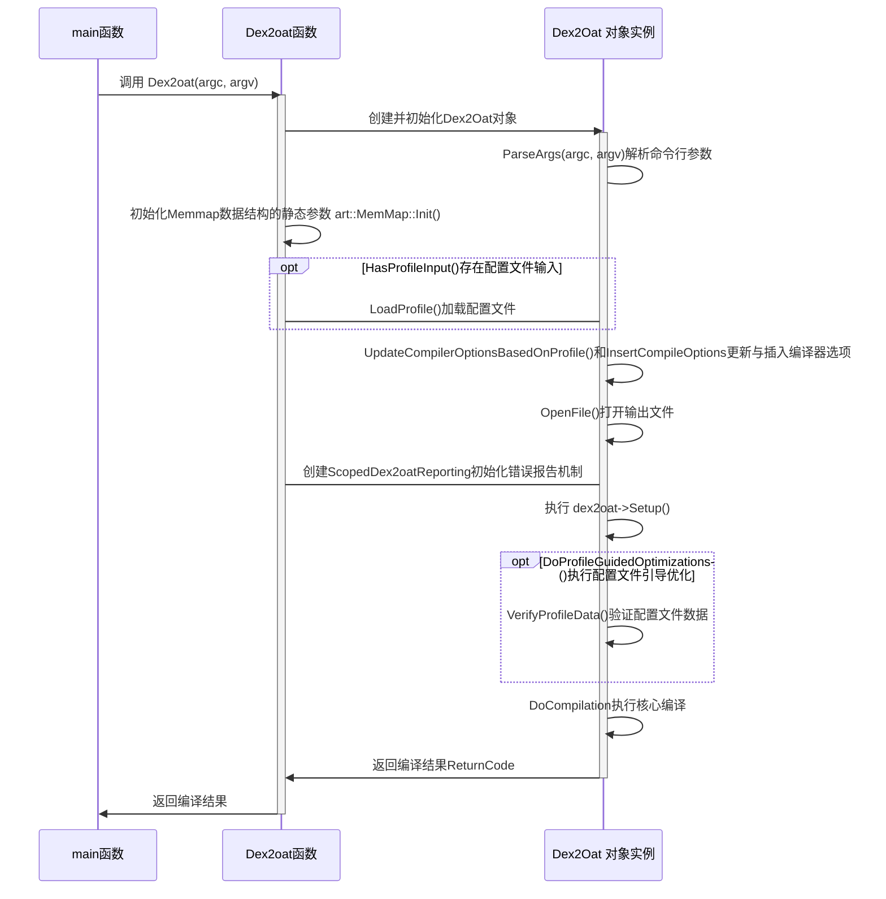
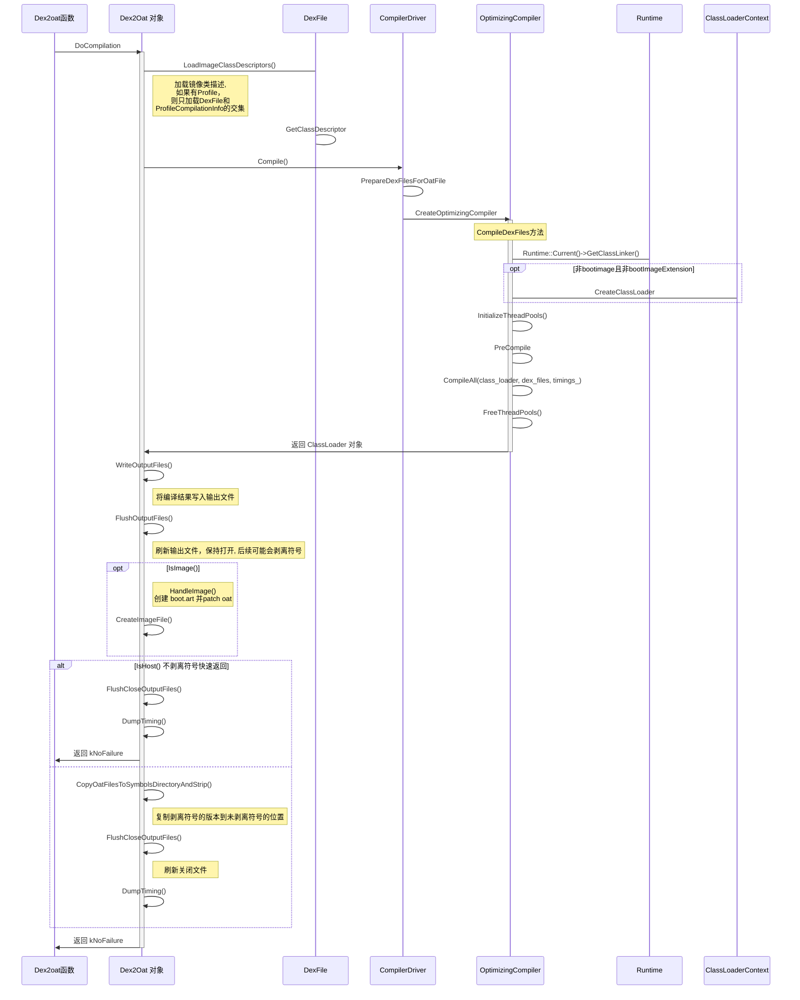
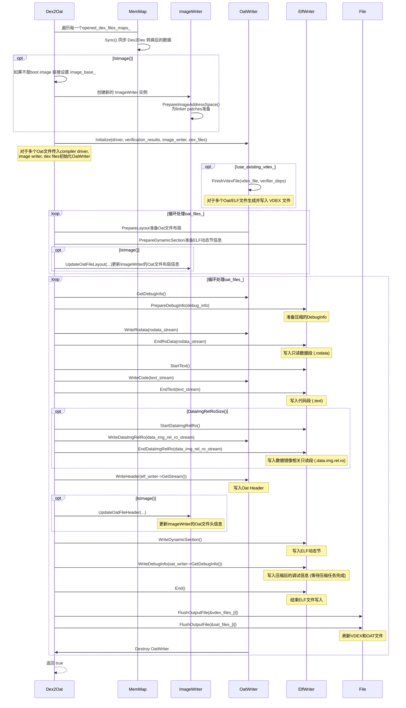

# Dex2oat流程

## dex2oat 主函数

## Dex2Oat对象成员方法

### ParseArgs 

解析命令行参数。如果遇到无法识别的选项、无效的数值或参数组合，程序将显示用法错误并退出。因此，如果此方法返回，则表示参数已成功解析。

除了解析命令行参数，在这个函数中还会执行Locks::Init()，如果各种locks没有初始化则会执行初始化。

### Profile

LoadInternal函数

1. OpenSource创建/打开文件源 ProfileSource， ProfileSource包含一个fd_和Memmap成员

2. 调用ProfileSource::Read读取文件头数据，包括magic、version、section_count

3. 获取 section_count

4. 调用ProfileSource::Read读取FileSectionInfo， 返回所有 SectionInfo

5. 处理强制的 dex 文件区域
    - 检查第一个 Section 是否为 kDexFiles
    - ReadDexFilesSection

6. 遍历接下来的section
    - 获取 section_info，不同的类型不同处理
    - kExtraDescriptors  ReadExtraDescriptorsSection
    - kClasses 且 merge_classes标志被设置  ReadClassesSection
    - kMethods  ReadMethodsSection
    - kAggregationCounts 忽略此Section，仅服务器端使用
    - default 跳过未知Section，兼容新版本

###  DoCompilation

#### WriteOutputFiles函数

