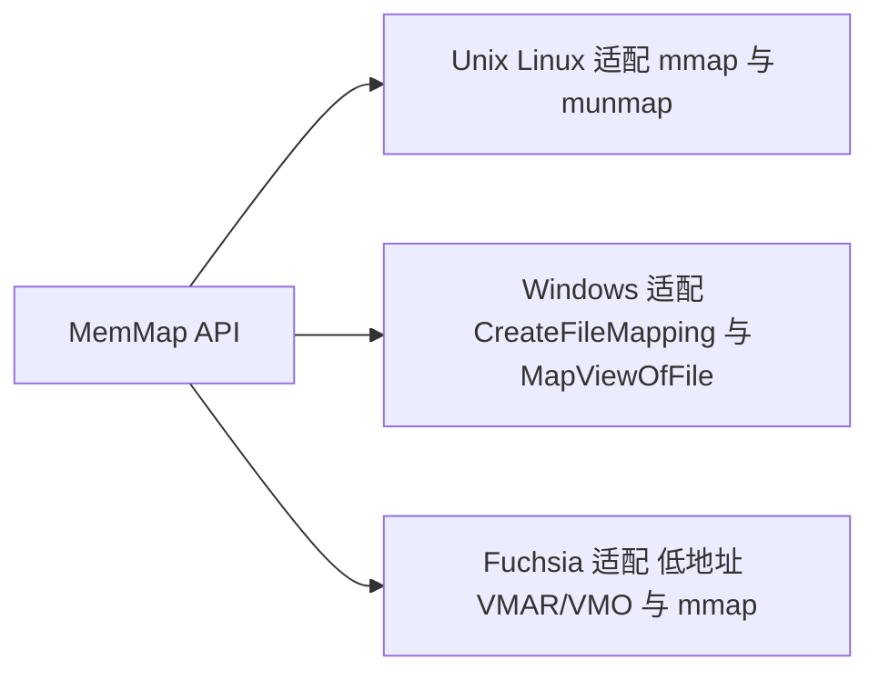
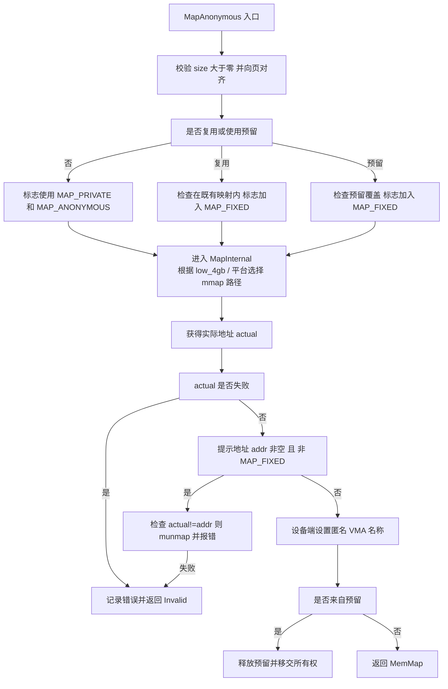
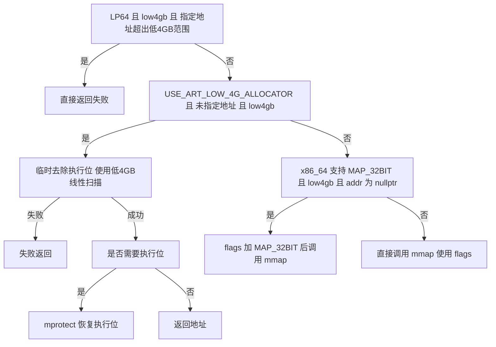
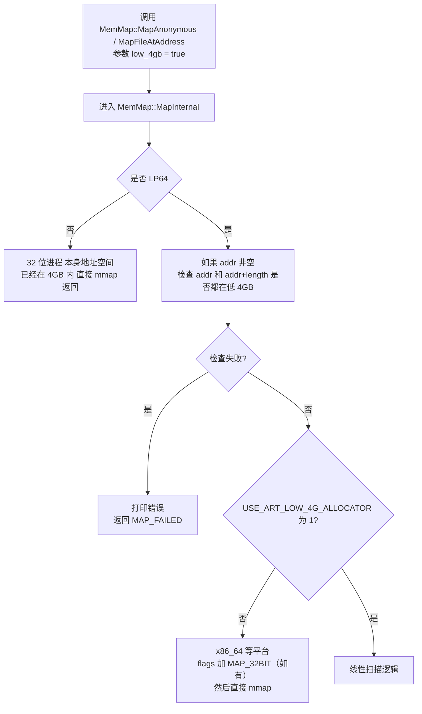
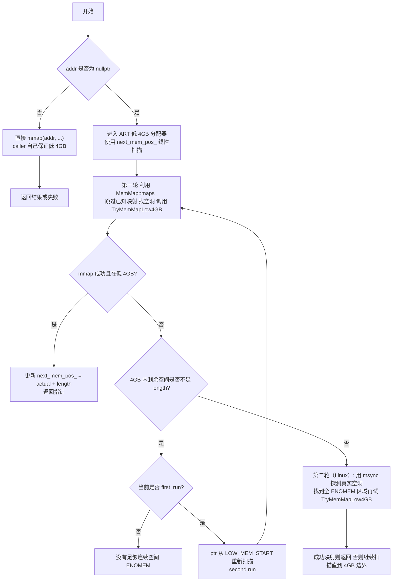
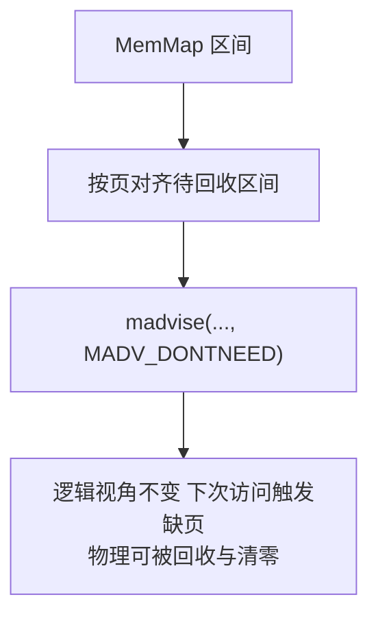
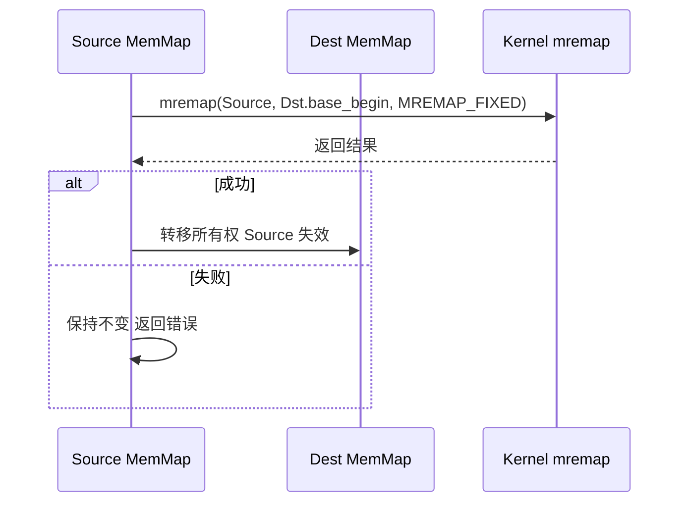

## TL;DR

> 统一封装 mmap 与 munmap 等平台接口，管理 ART 进程中的映射区域与元数据；在 64 位但不支持 MAP_32BIT 的平台上，提供低 4GB 线性扫描分配器，满足 JIT 与指针压缩等对 32bit 可寻址区域的要求。

## `mmap` 基础速览

* 文件映射：将文件页映射到进程虚拟地址空间。
* 匿名映射：不关联文件（如大块 malloc 背后常用）。
* 访问：首次触发缺页，内核按需填充页表。
* 写回：MAP_SHARED 可写回文件；MAP_PRIVATE 写时复制 COW。
* 解除与同步：munmap 解除映射；msync 同步页缓存到后端。
* 安全页判定（Linux）：对未映射页调用 msync 会立刻返回 ENOMEM，可用来判定一段地址确实空白。低 4GB 分配器在 Linux 上用此技巧确认可用区间。

## AOSP 的 MemMap 封装层

```cpp
// 统一出口（Unix Linux Fuchsia Windows 各有实现）
static void* TargetMMap(void* start, size_t len, int prot, int flags, int fd, off_t off);
static int   TargetMUnmap(void* start, size_t len);
````

* Unix / Linux：直接转调 mmap 与 munmap。
* Windows：翻译为 CreateFileMapping 与 MapViewOfFile，限制较多（不支持 MAP_FIXED，PROT_EXEC 组合受限）。
* Fuchsia：使用 VMAR/VMO 机制封装底层映射，通常会在低地址段预留“低内存区域”，在其上做匿名映射；文件映射仍经由统一的 TargetMMap 接口。

**适配图：**



---

## 平台差异与宏

* USE_ART_LOW_4G_ALLOCATOR

  * 在 LP64 且非 Fuchsia 的 aarch64 / riscv / Apple 平台启用低 4GB 线性扫描分配器。
  * x86_64 上可以直接依赖内核 MAP_32BIT 支持低地址映射。

* kMadviseZeroes 与 HAVE_MREMAP_SYSCALL（Linux）

  * kMadviseZeroes 为真时，madvise 的 DONTNEED（等）可以在逻辑内容不变的前提下，让内核丢弃驻留页、下次访问再按需拉回。
  * HAVE_MREMAP_SYSCALL 为真时，mremap 支持做原子替换映射（用于 ReplaceWith）。

---

## 成员布局与生命周期

```cpp
  std::string name_;
  uint8_t* begin_ = nullptr;   // 用户可用起点 可能不是页对齐
  size_t size_ = 0;            // 用户可用长度

  void*  base_begin_ = nullptr;// 页对齐起点
  size_t base_size_  = 0;      // 页对齐长度
  int    prot_ = 0;
  bool   reuse_ = false;       // 仅视图 不负责 unmap
  bool   already_unmapped_ = false;
  size_t redzone_size_ = 0;    // Sanitizer redzone
  ...
```

* IsValid 近似等价于 base_size_ 不为零。
* 析构与 Reset 负责 munmap（除非 reuse 视图或 already_unmapped）。
* 对齐与切分：有 AlignBy、RemapAtEnd、TakeReservedMemory 等工具方法。

---

## 匿名映射 MapAnonymous

> 这是 ART 中最常走的入口，兼顾提示地址、低 4GB 与预留或复用的多分支。

**关键点：**

* 复用 / 预留

  * 复用已有 MemMap 区间时，将标志加入 MAP_FIXED，让新映射强制覆盖在原地址上。
  * 使用预留（reservation）时，同样加入 MAP_FIXED，并在成功后把预留对象释放、移交所有权。

* 匿名映射

  * 默认使用 MAP_PRIVATE | MAP_ANONYMOUS。
  * 若调用方设置了 MAP_FIXED，则完全按调用方要求执行，失败直接返回。

* 低 4GB

  * 若启用线性扫描分配器且未指定地址（`USE_ART_LOW_4G_ALLOCATOR && low_4gb && addr == nullptr`），先以去掉执行位的 prot 通过 MapInternalArtLow4GBAllocator 探测映射，成功后再 mprotect 加回执行位。
  * 否则在 x86_64 上，若需要 low_4gb 且未指定地址，则给 flags 加上 MAP_32BIT，交给内核选择低 2GB/4GB 范围的地址。

**流程图：**



### MapInternal 内部逻辑（精简视图）



---

## 低 4GB 线性扫描分配器

### 从 low_4gb 请求到分配器入口

> 当调用方传入 `low_4gb = true` 时，整体从 API 到低 4GB 扫描分配器的大致路径如下（仅 LP64 场景）：



### ART_LOW_4G_ALLOCATOR 线性扫描逻辑



> 仅在启用低 4GB 扫描、addr 为空且 low4gb 为真时走。
> 目标是在 4GB 以下找到连续空闲页：使用随机化起点、用 gMaps 跳过已占区间，并在 Linux 上通过对每页 msync 期待 ENOMEM 的方式确认这一段没有其他匿名/文件映射。

---

## 文件映射与对齐

对齐规则

* 起始偏移向下页对齐；
* 实际映射长度加上页内偏移后再向上页对齐；
* 最终 begin 等于 base_begin 加上页内偏移，size 为用户可见长度。


提示地址检查

* 若传入 addr 但未使用 MAP_FIXED，成功后需检查实际 begin 是否等于 addr，否则立刻 munmap 并报错。

---

## 保护、同步与回收

* Protect：调用 mprotect，更新 prot_。
* Sync：调用 msync（如 Linux 上使用 MS_SYNC），用于持久化或失效缓存。
* ZeroMemory / MadviseZero（Linux 上的典型行为）：

  * 对齐到页边界后，对目标区间调用 madvise(..., MADV_DONTNEED)。
  * 内核可以丢弃驻留物理页，逻辑内容仍被视为零页，会在后续访问时按需重新拉入。



> 某些 GC 空间实现可能在此基础上使用 mincore 聚合驻留页，以便只对“实际驻留的页面”调用 madvise；这一层属于上层策略，MemMap 自身只提供基础接口。

---

## 原子替换映射 ReplaceWith

仅 Linux 支持，依赖 mremap。
前置条件：

* 源与目标不重叠，且都拥有真实映射（非 reuse 视图）。
* redzone、页对齐、页内偏移等参数一致。
* 目标区间足以容纳源区间。


