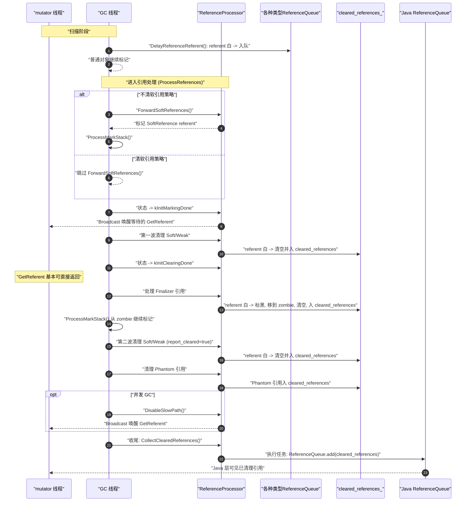

## java.lang.ref.Reference

在 Java 里，对象默认都是 **强引用 (Strong Reference)**：

* 只要有强引用指向对象，GC 就绝不会回收它。
* 强引用很安全，但可能导致**内存压力下无法及时释放对象**，比如缓存场景。

于是 JDK 在 `java.lang.ref` 包里定义了一个通用抽象类 **`Reference<T>`**，它是**所有特殊引用类型的基类**，用来给垃圾回收器 (GC) 提供“更灵活的内存回收策略”。

### `Reference` 的分类

`Reference` 有 4 个主要子类（按“强度”从强到弱）：

1. **`SoftReference<T>`**

   * 适合做缓存。
   * GC 在内存充足时会尽量保留软引用的对象；只有内存紧张时才会回收。
   * 典型场景：图片缓存。

2. **`WeakReference<T>`**

   * 一旦没有强引用，GC 下次就会立刻回收该对象。
   * 典型场景：`WeakHashMap` 的 key。

3. **`PhantomReference<T>`**（虚引用/幻象引用）

   * `get()` 永远返回 `null`。
   * 用于跟踪对象是否已经被 GC 回收，通常与 `ReferenceQueue` 配合，用来做**资源清理**（例如直接内存、文件句柄）。

4. **`FinalizerReference`**（在 Java 层看不到，是虚拟机内部的实现）

   * 用来支持 `Object.finalize()`，但从 Java 9 开始已被官方标记为过时。

### 工作原理

* **引用对象**：`referent` 保存着目标对象。
* **注册队列**：可以选择性地把 `Reference` 与一个 `ReferenceQueue` 绑定。
* **GC 行为**：当 GC 发现对象只被弱/软/虚引用持有时，会按照规则清理：

  1. 清除 `referent`；
  2. 把这个 `Reference` 入队到 `ReferenceQueue`；
  3. 程序员可以从 `ReferenceQueue` 取出这些“已清理的引用”，再做善后处理。

### 作用与应用场景

1. **缓存管理**

   * `SoftReference` 让缓存对象在内存紧张时自动释放。
   * 避免 OOM，又不需要手动清理。

2. **避免内存泄漏**

   * `WeakReference` 常用于存放监听器、回调等，不会因为忘记移除导致对象无法回收。

3. **资源管理**

   * `PhantomReference` + `ReferenceQueue` 可以实现比 `finalize()` 更安全的清理机制（比如 DirectByteBuffer 释放堆外内存）。

4. **JVM 内部实现**

   * ART/HotSpot 在 GC 阶段通过 `ReferenceQueue` 和 `ReferenceProcessor` 协调，把不同类型的 `Reference` 入队、清理、触发 Finalizer 线程。

### 与 `finalize()` 的比较

* `finalize()` 不可靠：调用时机不确定，可能导致对象迟迟不释放。
* 引用机制更灵活：程序员可以显式从 `ReferenceQueue` 得知对象“死亡”事件，做资源回收。
* 因此，现代 Java 推荐用 **`Cleaner`（基于 PhantomReference）** 或 **`try-with-resources`**，而不是依赖 `finalize()`。

## ReferenceQueue是什么

`ReferenceQueue` 不是 Java 层的 `java.lang.ref.ReferenceQueue`，而是 **GC 内部用于暂存 `java.lang.ref.Reference` 实例** 的辅助结构。
实现采用 **单向、无序、环形链表**，通过每个 `Reference` 对象里的 **`pendingNext` 字段** 串起来。

* 成员

  * `Mutex* lock_`：并发 GC 时用于“**原子入队**”的互斥锁。
  * `mirror::Reference* list_`：环形链表的一个“表头”指针（指向链中的某个元素即可）。

* 基本不变式

  * 空队列：`list_ == nullptr`
  * 非空队列：令 `head = list_->pendingNext`，链表是环形的：不停 `pendingNext` 直到回到 `list_`。

### 关键操作

* `AtomicEnqueueIfNotEnqueued`
  带锁检查 `ref->IsUnprocessed()` 后入队，避免**重复入队**（同一 `Reference` 可能因脏卡等被多次扫描到）。

* `EnqueueReference`
  假设不并发（停顿期调用），最小化锁开销：

  * 空 -> 把 `list_` 设为 `ref`，并令它自环；
  * 非空 -> 把 `ref` 插到 `list_` 的“中间”（保持环形）；

* `DequeuePendingReference`
  单线程调用（由 `ProcessReferences` 驱动），从 `list_->pendingNext` 取一个节点并摘除。如果最后一个则置空。

* `DisableReadBarrierForReference`
  **与 Baker 读屏障 + 并发复制（CC）收集器配合**：在并发复制时，GC 处理过的 `Reference` 可能被标成 **灰色**（read barrier state）。从队列取出并完成 referent 处理后，需要把该 `Reference` 的读屏障状态从 **灰** 改成 **非灰**，保证后续读屏障语义正确。

* `ClearWhiteReferences`
  逐个出队，检查 referent 是否**白色（未标记）**：白则清空 `referent` 字段，并把该 `Reference` **转存到 `cleared_references_`**（一个专门的清空队列，后续会被异步/同步地投递到 Java 层 `ReferenceQueue`）。

* `EnqueueFinalizerReferences`
  仅处理 `FinalizerReference`：

  * 如果 referent 是白色 -> **“保活并转移”：标记 referent（变黑），把它移动到 `zombie` 字段，同时清空 `referent`**；然后把这个 `FinalizerReference` 放入 `cleared_references_`。
    这样可以让最终化线程（FinalizerDaemon）有机会处理“尸体”（zombie），但不再通过 `referent` 直接可达。

* `ForwardSoftReferences`
  仅在“不清理软引用”的策略下使用：对队列里还没清的 `SoftReference` 的 referent 做一次 **标记转发**（`visitor->MarkHeapReference`），相当于**保留软引用**。

* `UpdateRoots(IsMarkedVisitor*)`
  给 **Mark-Compact** 这类“会移动对象”的 GC 用：如果 `list_` 指向的那个 `Reference` 自身被搬迁了，这里更新 `list_` 指针为新地址（根更新）。

## ReferenceProcessor：一次引用处理的“总指挥”

### 是什么

`ReferenceProcessor` 管理四类内部队列：

* `soft_reference_queue_` / `weak_reference_queue_` / `finalizer_reference_queue_` / `phantom_reference_queue_`
  以及一个收尾队列：
* `cleared_references_`（清掉 referent 后的引用，等待入 Java `ReferenceQueue`）

它还维护处理状态 `RpState` 与一个条件变量 `condition_`，**协调 GC 线程与 mutator 在“取 referent”时的并发语义**。

### 处理状态机（`RpState`）

* `kStarting`：刚开始引用处理；
* `kInitMarkingDone`：完成“初次标记”与禁止弱引用快速路径访问；
* `kInitClearingDone`：已完成“软/弱引用清理（第一波）”等，之后 **mutator 读取 referent** 可依据**标记状态**直接得到正确结果。

### 慢路径开关（SlowPath）

* `EnableSlowPath/DisableSlowPath` 操作的是 `java.lang.ref.Reference.slowPathEnabled` 静态布尔，**只在并发处理时开启**。
* 当慢路径启用时，`GetReferent()` 会走一段“协调逻辑”：如果仍在关键阶段，可能需要 **等待 GC 处理推进或依据标记提前返回**，以确保不会把“白色对象”泄露给 mutator。

> **有读屏障（如 CC）时**，弱引用访问的禁用/恢复是通过 `Thread::GetWeakRefAccessEnabled()` 来体现的，语义与上面一致。

### 关键方法与时序

#### （A）扫描期：把“可疑引用”放进对应队列

* `DelayReferenceReferent(klass, ref, collector)`
  当 GC 在标记过程中遇到 `Reference` 对象：

  * 若 `referent` 是白色（`IsNullOrMarkedHeapReference` 为 false），**按类型入队**到软/弱/终结/虚引用队列之一（原子入队，避免重复）。
  * 事务模式下（`IsTransactionActive()`）特殊处理：直接把 referent 标黑，**跳过整个引用处理**（因为事务回滚无法重放引用处理）。

#### （B）正式处理：`ProcessReferences()`

整体步骤（同时考虑并发与停顿两种 GC）：

1. **并发时**先把 “可能晚发现的 `SoftReference`” 做一轮 `ForwardSoftReferences()`（策略是不清软引用时）。
2. 进入 `kInitMarkingDone` 状态并广播（`condition_.Broadcast`）：

   * 含义：标记阶段的**初始结果已定**；mutator 在慢路径下可根据“是否已标记”来决定 `GetReferent()` 的正确返回。
3. **第一波清理**（“非经终结器路径”能到的引用）：

   * `soft_reference_queue_.ClearWhiteReferences(...)`
   * `weak_reference_queue_.ClearWhiteReferences(...)`
     -> 把 referent 白的软/弱引用清掉（referent 置 `null`），并入 `cleared_references_`。
4. 切换到 `kInitClearingDone`：

   * 含义：此时所有 **mutator 可触达（黑）的**对象已稳定，mutator 的 `GetReferent()` 大多可以**快速返回**。
5. **处理终结器**：

   * `finalizer_reference_queue_.EnqueueFinalizerReferences(...)`
   * 对被清的 `FinalizerReference` 的 referent 执行“保活并转移到 `zombie`”（见上文），然后 **从这些 zombie 再次向外扩散标记**（`collector_->ProcessMarkStack()`），确保最终化要使用的对象闭包被保留。
6. **第二波清理**（“只经终结器路径”能到的软/弱引用）：

   * 再次对 soft/weak 执行 `ClearWhiteReferences(..., report_cleared=true)`
   * 这个阶段会暴露一些规范上的“边缘语义”问题（代码里有注释解释），ART 的选择是**按通常规则清理**，并承认可能出现“已入队的不可达引用”等现象（这是 JVM 实现间公认的灰色地带）。
7. **清理虚引用**：

   * `phantom_reference_queue_.ClearWhiteReferences(...)`（只需一次）。
8. **收尾**：四个内部队列应为空；并发 GC 的话 **关闭慢路径**（`DisableSlowPath`），唤醒等待 `GetReferent()` 的线程。

#### 把“清掉的引用”交给 Java 层

* `CollectClearedReferences()`
  把 `cleared_references_` 的链表封成一个 `global ref`，返回一个 **任务**（`SelfDeletingTask`）：

  * 任务里调用 `ReferenceQueue.add(cleared)`，把这批清掉的 `Reference` 真正**入队到 Java 层的 `ReferenceQueue`**。
  * 可以同步执行，也可以异步投给 `Heap` 的 `TaskProcessor`。

#### 与 mutator 侧 `GetReferent()` 的协作

* `GetReferent(Thread* self, Reference* r)`
  依据“是否启用慢路径/弱引用访问是否禁用、当前 `rp_state_`、引用类型”等，决定：

  * 直接读出；
  * 或在 `reference_processor_lock_` 下**等待**状态推进；
  * 或在 `kInitMarkingDone` 阶段，**根据标记位**“提前计算应返回的 referent”（若 referent 已标记，返回转发地址；否则返回 `null`）。
    这保证了：**无论并发/停顿，mutator 看到的 referent 都与 GC 的清理策略一致**。

## 宏观图

