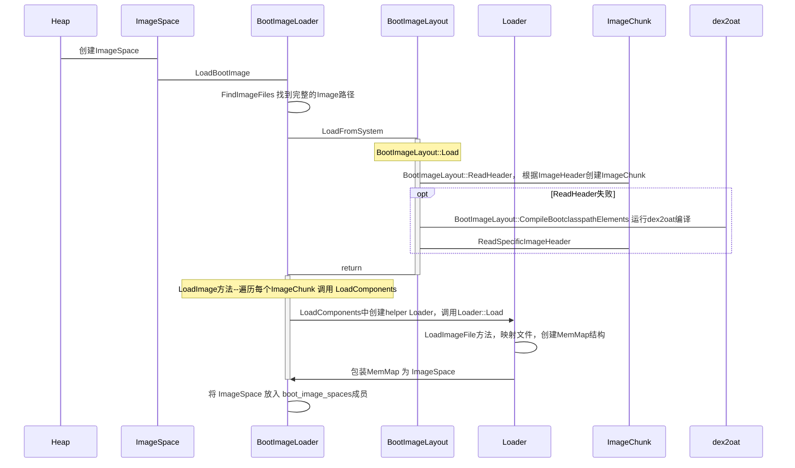

# BootImage


## BootClass 

引导类库包含了 Android 系统的基础类（如`java.lang`、`android.os`等），是应用程序运行的基础。引导类路径是系统启动时加载的核心类库的路径集合。

在堆（heap）创建的过程中，会加载引导镜像（BootImage）。加载成功后，加载的镜像空间将被添加到`boot_image_spaces`中，并且`extra_reservation`将被设置为位于最后一个加载的 OAT 文件末尾之后的请求内存预留区域。
 
### Image Location
镜像位置是一个由冒号分隔的列表，用于指定一个或多个组件的名称，并且可以指定与剩余引导类路径（boot class path，BCP）扩展相对应的扩展搜索路径。


#### Primary boot image 主引导镜像
主引导镜像可以指定为以下形式之一：

- `<路径>/<基础名称>`：指定完整路径。

-  `<基础名称>`：仅指定基础名称，此时将使用第一个BCP的路径。

如果主引导镜像的磁盘版本不可接受（例如不存在或验证失败，可能是因为过时），则可以指定一个或多个配置文件（profile）来在内存中编译主引导镜像。配置文件的指定可以是以下形式之一：

-  `!<配置文件路径>/<配置文件名称>`：指定完整路径的配置文件。

-  `!<配置文件名称>`：仅指定配置文件名称，此时将使用主引导镜像的路径作为配置文件的路径。


#### Extension （扩展镜像）的指定
扩展镜像的命名指定必须与`<基础名称>`的 BCP 组件扩展相对应。

例如，带有 BCP 组件名称`<jar路径>/framework.jar`的`boot.art`会扩展为`boot-framework.art`。扩展镜像可以指定为以下形式之一：

- `<扩展路径>/<扩展名称>`：指定完整路径。

-  `<扩展名称>`：仅指定扩展名称，此时将使用对应的 BCP 组件路径。

与主引导镜像类似，扩展镜像也可以指定配置文件来在内存中编译。如果扩展镜像的磁盘版本不可接受，则使用指定的配置文件进行编译。配置文件的指定形式与主引导镜像相同。

####  剩余扩展的搜索路径
剩余扩展的搜索路径可以在命名组件之后指定为以下形式之一：

- `<搜索路径>/*`：指定一个搜索路径。

-  `*`：使用某个特定 BCP 组件的路径来搜索该组件的引导镜像扩展。


#### 实际文件名的派生
实际的文件名将通过`GetSystemImageFilename()`根据指定的位置派生。


#### 示例镜像位置
以下是一些示例镜像位置及其说明：

	
-  `/system/framework/boot.art` 	 只有主引导镜像，且指定了完整路径。 	
-  `/data/misc/apexdata/com.android.art/dalvik-cache/boot.art!/apex/com.android.art/etc/boot-image.prof!/system/etc/boot-image.prof` 	 只有主引导镜像，且指定了完整路径；如果主引导镜像未找到或损坏，则使用两个指定路径的配置文件在内存中编译。 	
-  `boot.art:boot-framework.art` 	 主引导镜像和一个扩展，使用 BCP 组件路径。 	
-  `/apex/com.android.art/boot.art:*` 	 主引导镜像指定了确切位置，其余扩展基于 BCP 组件路径搜索。 	
-  `boot.art:/system/framework/*` 	 主引导镜像基于 BCP 组件路径，扩展在 `/system/framework` 中搜索。 	
-  `/apex/com.android.art/boot.art:/system/framework/*:*` 	 主引导镜像指定了确切位置，扩展首先在 `/system/framework` 中搜索，然后在对应的 BCP 组件路径中搜索。 	
-  `/apex/com.android.art/boot.art:*:/system/framework/*` 	 主引导镜像指定了确切位置，扩展首先在对应的 BCP 组件路径中搜索，然后在 `/system/framework` 中搜索。 	
-  `/apex/com.android.art/boot.art:*:boot-framework.jar` 	 无效，命名组件不能跟在搜索路径之后。 	
-  `boot.art:boot-framework.jar!/system/framework/framework.prof` 	 主引导镜像和一个扩展，使用 BCP 组件路径；如果扩展未找到或损坏，则使用指定路径的配置文件在内存中编译。 	
-  `boot.art:boot-framework.jar:conscrypt.jar!conscrypt.prof` 	 主引导镜像和两个扩展，使用 BCP 组件路径；只有第二个扩展有配置文件，并且可以在未找到或损坏时使用 BCP 组件路径中指定的配置文件在内存中编译，且只有在第一个扩展正常时才会编译。 	
-  `boot.art:boot-framework.jar!framework.prof:conscrypt.jar!conscrypt.prof` 	 主引导镜像和两个扩展，使用 BCP 组件路径；如果任何扩展未找到或损坏，则使用 BCP 组件路径中指定的配置文件在内存中编译，每个扩展仅依赖于主引导镜像进行编译。 	


## BootImage加载流程





### space::ImageSpace::LoadBootImage

```cpp
bool ImageSpace::LoadBootImage(const std::vector<std::string>& boot_class_path,
                               const std::vector<std::string>& boot_class_path_locations,
                               ArrayRef<File> boot_class_path_files,
                               ArrayRef<File> boot_class_path_image_files,
                               ArrayRef<File> boot_class_path_vdex_files,
                               ArrayRef<File> boot_class_path_odex_files,
                               const std::vector<std::string>& image_locations,
                               const InstructionSet image_isa,
                               bool relocate,
                               bool executable,
                               size_t extra_reservation_size,
                               bool allow_in_memory_compilation,
                               const std::string& apex_versions,
                               /*out*/ std::vector<std::unique_ptr<ImageSpace>>* boot_image_spaces,
                               /*out*/ MemMap* extra_reservation) {
  ScopedTrace trace(__FUNCTION__);

  DCHECK(boot_image_spaces != nullptr);
  DCHECK(boot_image_spaces->empty());
  DCHECK_ALIGNED(extra_reservation_size, kElfSegmentAlignment);
  DCHECK(extra_reservation != nullptr);
  DCHECK_NE(image_isa, InstructionSet::kNone);

  if (image_locations.empty()) {
    return false;
  }

  BootImageLoader loader(boot_class_path,
                         boot_class_path_locations,
                         boot_class_path_files,
                         boot_class_path_image_files,
                         boot_class_path_vdex_files,
                         boot_class_path_odex_files,
                         image_locations,
                         image_isa,
                         relocate,
                         executable,
                         &apex_versions);
  loader.FindImageFiles();

  std::string error_msg;
  if (loader.LoadFromSystem(extra_reservation_size,
                            allow_in_memory_compilation,
                            boot_image_spaces,
                            extra_reservation,
                            &error_msg)) {
    return true;
  }
  LOG(ERROR) << "Could not create image space with image file '"
             << Join(image_locations, kComponentSeparator)
             << "'. Attempting to fall back to imageless running. Error was: "
             << error_msg;

  return false;
}
```

这个函数创建了一个BootImageLoader，其负责将设备上的预编译 Android Boot Image（包含 dex/oat/vdex 等数据）加载到虚拟机地址空间。

主要流程是：
1. 根据运行时环境与 APK 路径构建布局(BootImageLayout)
2. 预留一段连续内存用来放映像
3. 逐个“块”(chunk) 地映射各个组件（主映像 + 扩展）
4. 校验 OAT checksum、BCP（Boot Class Path）等一致性
5. （可选）重定位指针，使映像可运行于随机基址
6. 去重各空间中驻留字符串，节省内存

### BootImageLoader

成员变量

```cpp
  const ArrayRef<const std::string> boot_class_path_;
  const ArrayRef<const std::string> boot_class_path_locations_;
  ArrayRef<File> boot_class_path_files_;
  ArrayRef<File> boot_class_path_image_files_;
  ArrayRef<File> boot_class_path_vdex_files_;
  ArrayRef<File> boot_class_path_oat_files_;
  const ArrayRef<const std::string> image_locations_;
  const InstructionSet image_isa_;
  const bool relocate_; // 是否开启随机基址（ASLR）
  const bool executable_; // 映像是否可执行
  bool has_system_; // has_system  初始化为 false  ，表示默认情况下没有找到系统路径下的镜像文件。
  const std::string* apex_versions_; // Apex 模块版本信息，用于校验
```

创建Bootloader之后，调用FindImageFiles方法根据输入的镜像位置和指令集，查找系统路径下的引导镜像文件是否存在。如果找到，则返回文件路径和 true；否则返回false  


```cpp
void FindImageFiles() {
    BootImageLayout layout(image_locations_,
                           boot_class_path_,
                           boot_class_path_locations_,
                           boot_class_path_files_,
                           boot_class_path_image_files_,
                           boot_class_path_vdex_files_,
                           boot_class_path_oat_files_,
                           apex_versions_);
    // GetPrimaryImageLocation()根据输入的镜像路径和引导类路径组件，生成一个完整的、有效的主镜像文件路径。
    std::string image_location = layout.GetPrimaryImageLocation();
    std::string system_filename;
    // FindImageFilenameImpl根据输入的镜像位置和指令集，查找系统路径下的引导镜像文件是否存在。如果找到，则返回文件路径和 true；否则返回false  
    bool found_image = FindImageFilenameImpl(image_location.c_str(),
                                             image_isa_,
                                             &has_system_,
                                             &system_filename);
    DCHECK_EQ(found_image, has_system_);
  }
  ```


#### loader.LoadFromSystem


```cpp
bool ImageSpace::BootImageLoader::LoadFromSystem(
    size_t extra_reservation_size,
    bool allow_in_memory_compilation,
    /*out*/std::vector<std::unique_ptr<ImageSpace>>* boot_image_spaces,
    /*out*/MemMap* extra_reservation,
    /*out*/std::string* error_msg) {
  TimingLogger logger(__PRETTY_FUNCTION__, /*precise=*/ true, VLOG_IS_ON(image));

  BootImageLayout layout(image_locations_,
                         boot_class_path_,
                         boot_class_path_locations_,
                         boot_class_path_files_,
                         boot_class_path_image_files_,
                         boot_class_path_vdex_files_,
                         boot_class_path_oat_files_,
                         apex_versions_);
  // LoadFromSystem函数只是读取并验证镜像头，然后读取失败的一些镜像尝试进行编译
  if (!layout.LoadFromSystem(image_isa_, allow_in_memory_compilation, error_msg)) {
    return false;
  }

  // Load the image. We don't validate oat files in this stage because they have been validated
  // before.
  if (!LoadImage(layout,
                 /*validate_oat_file=*/ false,
                 extra_reservation_size,
                 &logger,
                 boot_image_spaces,
                 extra_reservation,
                 error_msg)) {
    return false;
  }

  if (VLOG_IS_ON(image)) {
    LOG(INFO) << "ImageSpace::BootImageLoader::LoadFromSystem exiting "
        << *boot_image_spaces->front();
    logger.Dump(LOG_STREAM(INFO));
  }
  return true;
}
```


##### layout.LoadFromSystem

BootImageLayout用来帮助找到 primary boot image 、boot image extensions，然后决定boot image的布局

```cpp
  // Helper class to find the primary boot image and boot image extensions
  // and determine the boot image layout.
  class BootImageLayout {
   public:
    // Description of a "chunk" of the boot image, i.e. either primary boot image
    // or a boot image extension, used in conjunction with the boot class path to
    // load boot image components.
    struct ImageChunk {
      std::string base_location;
      std::string base_filename;
      std::vector<std::string> profile_files;
      size_t start_index;
      uint32_t component_count;
      uint32_t image_space_count;
      uint32_t reservation_size;
      uint32_t checksum;
      uint32_t boot_image_component_count;
      uint32_t boot_image_checksum;
      uint32_t boot_image_size;

      // 以下文件描述符用于存储在内存中编译的扩展的 memfd 文件，这些文件由上述字段描述。
      // 我们希望使用这些文件描述符通过 mmap() 映射内容
      // 然后关闭它们，同时将 ImageChunk 的描述视为不可变的（const），因此需要将这些字段显式声明为可变的（mutable）。
      mutable android::base::unique_fd art_fd;
      mutable android::base::unique_fd vdex_fd;
      mutable android::base::unique_fd oat_fd;
    };

    ArrayRef<const std::string> image_locations_;
    ArrayRef<const std::string> boot_class_path_;
    ArrayRef<const std::string> boot_class_path_locations_;
    ArrayRef<File> boot_class_path_files_;
    ArrayRef<File> boot_class_path_image_files_;
    ArrayRef<File> boot_class_path_vdex_files_;
    ArrayRef<File> boot_class_path_oat_files_;

    std::vector<ImageChunk> chunks_;
    uint32_t base_address_ = 0u;
    size_t next_bcp_index_ = 0u;
    size_t total_component_count_ = 0u;
    size_t total_reservation_size_ = 0u;
    const std::string& apex_versions_;
  };
```


LoadFromSystem函数只是读取并验证镜像头，然后读取失败的一些镜像尝试进行编译
```cpp
bool ImageSpace::BootImageLayout::LoadFromSystem(InstructionSet image_isa,
                                                 bool allow_in_memory_compilation,
                                                 /*out*/ std::string* error_msg) {
  auto filename_fn = [image_isa](const std::string& location,
                                 /*out*/ std::string* filename,
                                 [[maybe_unused]] /*out*/ std::string* err_msg) {
    // location = /system/framework/boot.art
    // filename = /system/framework/<isa>/boot.art
    *filename = GetSystemImageFilename(location.c_str(), image_isa);
    return true;
  };
  return Load(filename_fn, allow_in_memory_compilation, error_msg);
}
```

##### ImageSpace::BootImageLayout::Load
```cpp
template <typename FilenameFn>
bool ImageSpace::BootImageLayout::Load(FilenameFn&& filename_fn,
                                       bool allow_in_memory_compilation,
                                       /*out*/ std::string* error_msg) {
  DCHECK(GetChunks().empty());
  DCHECK_EQ(GetBaseAddress(), 0u);

  ArrayRef<const std::string> components = image_locations_;
  size_t named_components_count = 0u;
  //  验证镜像位置的格式是否正确，并获取命名组件的数量
  if (!VerifyImageLocation(components, &named_components_count, error_msg)) {
    return false;
  }

  ArrayRef<const std::string> named_components =
      ArrayRef<const std::string>(components).SubArray(/*pos=*/ 0u, named_components_count);

  std::vector<NamedComponentLocation> named_component_locations;
  // 调用  MatchNamedComponents  将用户指定的named_components与引导类路径进行匹配
  // 生成对应的 NamedComponentLocation 对象列表
  if (!MatchNamedComponents(named_components, &named_component_locations, error_msg)) {
    return false;
  }

  // Load the image headers of named components.
  DCHECK_EQ(named_component_locations.size(), named_components.size());
  const size_t bcp_component_count = boot_class_path_.size();
  size_t bcp_pos = 0u;
  // 遍历命名组件
  for (size_t i = 0, size = named_components.size(); i != size; ++i) {
    // 获取当前组件的基本位置、BCP 索引和配置文件名列表。
    const std::string& base_location = named_component_locations[i].base_location;
    size_t bcp_index = named_component_locations[i].bcp_index;
    const std::vector<std::string>& profile_filenames =
        named_component_locations[i].profile_filenames;
    DCHECK_EQ(i == 0, bcp_index == 0);
    // 如果当前组件的 BCP 索引小于   bcp_pos  ，说明该组件已经被前面的组件覆盖，跳过当前组件。
    if (bcp_index < bcp_pos) {
      DCHECK_NE(i, 0u);
      LOG(ERROR) << "Named image component already covered by previous image: " << base_location;
      continue;
    }
    std::string local_error_msg;
    std::string base_filename;
    // 调用  filename_fn  获取当前组件的实际文件路径,调用 ReadHeader 读取并验证指定引导类路径组件的镜像头，同时更新镜像块（ImageChunk）信息和状态
    if (!filename_fn(base_location, &base_filename, &local_error_msg) ||
        !ReadHeader(base_location, base_filename, bcp_index, &local_error_msg)) {
      // 出现问题 
      LOG(ERROR) << "Error reading named image component header for " << base_location
                 << ", error: " << local_error_msg;
      // If the primary boot image is invalid, we generate a single full image. This is faster than
      // generating the primary boot image and the extension separately.
      // 如果当前组件是主引导镜像, 尝试编译整个引导类路径，发现任何导致不能编译的问题就会报错
      if (bcp_index == 0) {
        if (!allow_in_memory_compilation) {
          // The boot image is unusable and we can't continue by generating a boot image in memory.
          // All we can do is to return.
          *error_msg = std::move(local_error_msg);
          return false;
        }
        // We must at least have profiles for the core libraries.
        if (profile_filenames.empty()) {
          *error_msg = "Full boot image cannot be compiled because no profile is provided.";
          return false;
        }
        std::vector<std::string> all_profiles;
        for (const NamedComponentLocation& named_component_location : named_component_locations) {
          const std::vector<std::string>& profiles = named_component_location.profile_filenames;
          all_profiles.insert(all_profiles.end(), profiles.begin(), profiles.end());
        }
        // 收集所有配置文件，尝试编译整个引导类路径
        if (!CompileBootclasspathElements(base_location,
                                          base_filename,
                                          /*bcp_index=*/ 0,
                                          all_profiles,
                                          /*dependencies=*/ ArrayRef<const std::string>{},
                                          &local_error_msg)) {
          *error_msg =
              StringPrintf("Full boot image cannot be compiled: %s", local_error_msg.c_str());
          return false;
        }
        // No extensions are needed.
        return true;
      }
      // 如果当前组件是扩展镜像
      //    - 如果允许在内存中编译且有配置文件，尝试编译扩展。
      //    - 如果编译失败，跳过当前组件。
      bool should_compile_extension = allow_in_memory_compilation && !profile_filenames.empty();
      if (!should_compile_extension ||
          !CompileBootclasspathElements(base_location,
                                        base_filename,
                                        bcp_index,
                                        profile_filenames,
                                        components.SubArray(/*pos=*/ 0, /*length=*/ 1),
                                        &local_error_msg)) {
        if (should_compile_extension) {
          LOG(ERROR) << "Error compiling boot image extension for " << boot_class_path_[bcp_index]
                     << ", error: " << local_error_msg;
        }
        bcp_pos = bcp_index + 1u;  // Skip at least this component.
        DCHECK_GT(bcp_pos, GetNextBcpIndex());
        continue;
      }
    }
    bcp_pos = GetNextBcpIndex();
  }
  // 查找剩余组件
  // 如果有通配符路径，尝试查找剩余的引导类路径组件。
  // 对于每个未处理的 BCP 组件，尝试生成镜像路径并读取镜像头
  // Look for remaining components if there are any wildcard specifications.
  ArrayRef<const std::string> search_paths = components.SubArray(/*pos=*/ named_components_count);
  if (!search_paths.empty()) {
    const std::string& primary_base_location = named_component_locations[0].base_location;
    size_t base_slash_pos = primary_base_location.rfind('/');
    DCHECK_NE(base_slash_pos, std::string::npos);
    std::string base_name = primary_base_location.sLoadImage(ubstr(base_slash_pos + 1u);
    DCHECK(!base_name.empty());
    while (bcp_pos != bcp_component_count) {
      const std::string& bcp_component =  boot_class_path_[bcp_pos];
      bool found = false;
      for (const std::string& path : search_paths) {
        std::string base_location;
        if (path.size() == 1u) {
          DCHECK_EQ(path, "*");
          size_t slash_pos = bcp_component.rfind('/');
          DCHECK_NE(slash_pos, std::string::npos);
          base_location = bcp_component.substr(0u, slash_pos + 1u) + base_name;
        } else {
          DCHECK(path.ends_with("/*"));
          base_location = path.substr(0u, path.size() - 1u) + base_name;
        }
        std::string err_msg;  // Ignored.
        std::string base_filename;
        if (filename_fn(base_location, &base_filename, &err_msg) &&
            ReadHeader(base_location, base_filename, bcp_pos, &err_msg)) {
          VLOG(image) << "Found image extension for " << ExpandLocation(base_location, bcp_pos);
          bcp_pos = GetNextBcpIndex();
          found = true;
          break;
        }
      }
      if (!found) {
        ++bcp_pos;
      }
    }
  }

  return true;
}
```
它的主要功能是解析镜像位置image_locations_ ，加载主引导镜像和扩展镜像头，并根据需要编译镜像.
##### LoadImage

`LoadImage`的作用是加载引导镜像及其扩展，并将其映射到内存中。它负责分配内存空间、加载镜像组件、验证 OAT 文件，并处理可能的错误。

1. 初始化和验证输入参数。
2. 预留足够的内存空间。
3. 遍历镜像块，加载镜像组件并处理可能的错误。
4. 处理额外预留空间。
5. 进行后处理，如重定位和去重。

其中如果任何步骤失败，函数会返回错误信息并退出。


```cpp
ArrayRef<const BootImageLayout::ImageChunk> chunks = layout.GetChunks();
DCHECK(!chunks.empty());
const uint32_t base_address = layout.GetBaseAddress();
const size_t image_component_count = layout.GetTotalComponentCount();
const size_t image_reservation_size = layout.GetTotalReservationSize();

DCHECK_LE(image_reservation_size, kMaxTotalImageReservationSize);
static_assert(kMaxTotalImageReservationSize < std::numeric_limits<uint32_t>::max());
if (extra_reservation_size > std::numeric_limits<uint32_t>::max() - image_reservation_size) {
    *error_msg = StringPrintf("Excessive extra reservation size: %zu", extra_reservation_size);
    return false;
}
```
- 获取镜像布局中的镜像块（chunks）。
- 验证镜像的总预留大小是否在允许范围内。
- 检查额外预留大小是否合理。

```cpp
uint8_t* addr = reinterpret_cast<uint8_t*>(
    relocate_ ? ART_BASE_ADDRESS + ChooseRelocationOffsetDelta() : base_address);
MemMap image_reservation =
    ReserveBootImageMemory(addr, image_reservation_size + extra_reservation_size, error_msg);
if (!image_reservation.IsValid()) {
    return false;
}
```

- 根据是否需要重定位（`relocate_`），选择合适的内存地址。

- 预留足够的内存空间（镜像预留大小+额外预留大小）。

- 如果预留失败，返回错误信息并退出。


```cpp
std::vector<std::unique_ptr<ImageSpace>> spaces;
spaces.reserve(image_component_count);
size_t max_image_space_dependencies = 0u;
for (size_t i = 0, num_chunks = chunks.size(); i != num_chunks; ++i) {
    const BootImageLayout::ImageChunk& chunk = chunks[i];
    std::string extension_error_msg;
    uint8_t* old_reservation_begin = image_reservation.Begin();
    size_t old_reservation_size = image_reservation.Size();
    DCHECK_LE(chunk.reservation_size, old_reservation_size);
    if (!LoadComponents(chunk,
                        validate_oat_file,
                        max_image_space_dependencies,
                        logger,
                        &spaces,
                        &image_reservation,
                        (i == 0) ? error_msg : &extension_error_msg)) {
        // Failed to load the chunk. If this is the primary boot image, report the error.
        if (i == 0) {
            return false;
        }
        // For extension, shrink the reservation (and remap if needed, see below).
        size_t new_reservation_size = old_reservation_size - chunk.reservation_size;
        if (new_reservation_size == 0u) {
            DCHECK_EQ(extra_reservation_size, 0u);
            DCHECK_EQ(i + 1u, num_chunks);
            image_reservation.Reset();
        } else if (old_reservation_begin != image_reservation.Begin()) {
            // Part of the image reservation has been used and then unmapped when
            // rolling back the partial boot image extension load. Try to remap
            // the image reservation.
            image_reservation.Reset();
            std::string remap_error_msg;
            image_reservation = ReserveBootImageMemory(old_reservation_begin,
                                                       new_reservation_size,
                                                       &remap_error_msg);
            if (!image_reservation.IsValid()) {
                *error_msg = StringPrintf("Failed to remap boot image reservation after failing "
                                          "to load boot image extension (%s: %s): %s",
                                          boot_class_path_locations_[chunk.start_index].c_str(),
                                          extension_error_msg.c_str(),
                                          remap_error_msg.c_str());
                return false;
            }
        } else {
            DCHECK_EQ(old_reservation_size, image_reservation.Size());
            image_reservation.SetSize(new_reservation_size);
        }
        LOG(ERROR) << "Failed to load boot image extension "
                   << boot_class_path_locations_[chunk.start_index] << ": " << extension_error_msg;
    }
    // Update `max_image_space_dependencies` if all previous BCP components
    // were covered and loading the current chunk succeeded.
    size_t total_component_count = 0;
    for (const std::unique_ptr<ImageSpace>& space : spaces) {
        total_component_count += space->GetComponentCount();
    }
    if (max_image_space_dependencies == chunk.start_index &&
        total_component_count == chunk.start_index + chunk.component_count) {
        max_image_space_dependencies = chunk.start_index + chunk.component_count;
    }
}
```
- 遍历每个镜像块（chunk）。

  - 调用`LoadComponents`加载镜像组件。
    - LoadComponents 调用链条还是很长，但是简而言之，遍历每个镜像位置和文件名。
      - 根据镜像文件描述符（.art文件）或路径加载镜像空间。这一步会创建一个 ImageSpace对象，并将其添加到 spaces 列表中
      - 验证加载的镜像空间是否符合预期（例如预留大小、组件数量、校验和等）
      - 加载 OAT 文件和 VDEX 文件，加载完成后，OAT 文件和 VDEX 文件的内容会被关联到对应的   ImageSpace 对象，在之后ClassLinker初始化期间，它会被释放给ClassLinker。

  - 如果加载失败：

    - 如果是主引导镜像（`i == 0`），直接返回错误。

    - 如果是扩展镜像，尝试缩小预留空间并重新映射。

  - 更新`max_image_space_dependencies`，记录当前已加载的组件数量。


```cpp
MemMap local_extra_reservation;
if (!RemapExtraReservation(extra_reservation_size,
                           &image_reservation,
                           &local_extra_reservation,
                           error_msg)) {
    return false;
}
```

- 调用`RemapExtraReservation`处理额外预留空间。

- 如果失败，返回错误信息并退出。


```cpp
MaybeRelocateSpaces(spaces, logger);
DeduplicateInternedStrings(ArrayRef<const std::unique_ptr<ImageSpace>>(spaces), logger);
boot_image_spaces->swap(spaces);
*extra_reservation = std::move(local_extra_reservation);
```


- 调用`MaybeRelocateSpaces`可能会重定位镜像空间。

- 调用`DeduplicateInternedStrings`去重字符串。

- 将加载的镜像空间列表存储到输出参数`boot_image_spaces`。

- 将额外预留空间存储到输出参数`extra_reservation`。


## Image

### ImageSection类

描述镜像文件中的一个逻辑节的起始位置和大小

```cpp
uint32_t offset_;
uint32_t size_;
```


####  ImageSections 枚举

这个枚举描述了 ART 镜像文件内部的Sections的类型和顺序。镜像文件由多个不同类型的逻辑区域组成，每个区域存储特定类型的数据。这个枚举定义了这些区域的名称和相对顺序。

注释中特别强调了，对这个结构（即这些节的顺序和数量）的任何改变都必须同时反映在ImageWriter和加载器中，因为它们需要知道如何正确地写入和解析镜像文件。

- kSectionObjects: 存储 ART 对象（mirror::Object）的节，包括 Java 对象、数组、字符串等。这是镜像中最大且最重要的部分之一。

- kSectionArtFields: 存储 ArtField 对象的节，ArtField 代表 Java 类的字段。

- kSectionArtMethods: 存储 ArtMethod 对象的节，ArtMethod 代表 Java 类的方法。

- kSectionImTables: 存储 IMT（Interface Method Table）的节。

- kSectionIMTConflictTables: 存储 IMT 冲突表的节。

- kSectionRuntimeMethods: 存储 ART 运行时内部方法的节，这些方法不是直接由 Java 代码定义，而是由 ART 虚拟机自身提供。

- kSectionJniStubMethods: 存储 JNI 存根方法的节，用于 Java 代码调用原生代码（Native Code）。

- kSectionInternedStrings: 存储内部化字符串（Interned Strings）的节。内部化字符串是唯一的字符串实例，所有内容相同的字符串都指向同一个实例，以节省内存。

- kSectionClassTable: 存储类表的节，包含类的元数据和布局信息。

- kSectionStringReferenceOffsets: 存储字符串引用偏移量的节。

- kSectionDexCacheArrays: 存储 Dex 缓存数组的节。

- kSectionMetadata: 存储通用元数据的节。

- kSectionImageBitmap: 存储镜像位图（Image Bitmap）的节，可能用于垃圾回收器标记镜像中的对象。

- kSectionCount: 枚举元素的总数，表示镜像节的总数量。


### ImageHeader

ImageHeader 类及其嵌套的 Block 类共同描述了镜像文件的结构。

#### 相关的一些枚举类型

##### ImageHeader::StorageMode 枚举

StorageMode枚举定义了镜像数据块可能的存储模式：

- kStorageModeUncompressed: 数据未压缩。

- kStorageModeLZ4: 数据使用 LZ4 算法压缩。

- kStorageModeLZ4HC: 数据使用 LZ4HC（高压缩比）算法压缩。

- kStorageModeCount: 枚举元素的数量，用于内部计数。

默认的存储模式是 kStorageModeUncompressed。


##### BootImageLiveObjects 枚举

与Boot Image相关，它定义了必须预先分配并保持活跃在引导镜像中的特定对象的类型。

- kOomeWhenThrowingException: 预先分配的内存不足错误（Out Of Memory Error），当抛出一般异常时可能用到。

- kOomeWhenThrowingOome: 预先分配的内存不足错误，当抛出另一个内存不足错误时可能用到（防止无限递归）。

- kOomeWhenHandlingStackOverflow: 预先分配的内存不足错误，当处理栈溢出错误（StackOverflowError）时可能用到。

- kNoClassDefFoundError: 预先分配的 NoClassDefFoundError 异常对象。

- kClearedJniWeakSentinel: 预先分配的用于已清除的弱 JNI 引用（JNI weak references）的哨兵对象。

- kIntrinsicObjectsStart: 内部对象起始的标记，可能用于指示后续是其他内部优化对象

##### ImageRoot枚举


这个枚举定义了 ART 镜像中根对象的类型。

- kDexCaches: 指向 Dex 缓存的根，Dex 缓存存储了类、字段、方法的查找结果，加速运行时解析。

- kClassRoots: 指向所有在镜像中定义的类的根，这些类是应用程序的基础结构。

- kSpecialRoots: 这是一个特殊的根，它的具体含义会根据镜像类型（引导镜像或应用镜像）而有所不同。

- 别名 (Aliases) 解释了 kSpecialRoots 在不同情况下的含义：

    - kAppImageClassLoader = kSpecialRoots: 如果是应用镜像，kSpecialRoots 指向用于构建此应用镜像的类加载器（ClassLoader）。类加载器是加载和管理 Java 类的关键组件。

    - kBootImageLiveObjects = kSpecialRoots: 如果是引导镜像，kSpecialRoots 指向一个数组，其中包含了必须在引导镜像中保持活跃的特定对象（详见 BootImageLiveObjects）。

    - kAppImageOatHeader = kSpecialRoots: 如果是应用镜像，kSpecialRoots 也可能指向一个字节数组，其中包含：

      - 一个伪造的 OatHeader，用于检查镜像是否可以加载到当前运行时。

      - Dex 文件的校验和。

- kImageRootsMax: 枚举元素的总数，表示根对象的最大数量。

##### ImageMethod枚举

- kResolutionMethod

- kImtConflictMethod

- kImtUnimplementedMethod

- kSaveAllCalleeSavesMethod

- kSaveRefsOnlyMethod

- kSaveRefsAndArgsMethod

- kSaveEverythingMethod

- kSaveEverythingMethodForClinit

- kSaveEverythingMethodForSuspendCheck

- kImageMethodsCount


#### ImageHeader::Block 类

Block 类描述了镜像文件中的一个数据块。每个 Block 对象包含以下信息：

- storage_mode_: 存储模式，指示该数据块是未压缩还是使用 LZ4/LZ4HC 压缩。

- data_offset_: 压缩或未压缩数据在文件中的偏移量。

- data_size_: 压缩或未压缩数据的大小。

- image_offset_: 解压缩后数据在镜像内存中的预期偏移量。

- image_size_: 解压缩后数据的原始大小。

- Block 类提供了 Decompress 方法（此处仅声明）以及获取这些信息的方法。

#### ImageHeader 类成员变量

ImageHeader 类包含了大量的成员变量，这些变量共同描述了镜像文件的各个方面：

- magic_ 和 version_: 魔数和版本号

- image_reservation_size_: 镜像文件的总内存预留大小。对于引导镜像或引导镜像扩展，它包括所有镜像文件和 Oat 文件的预留；对于应用镜像，它通常是 image_size_ 对齐到页面大小后的值。

- component_count_: 构成镜像的组件（例如 JAR 文件）的数量。

- image_begin_: 镜像文件在内存中映射的起始地址。

- image_size_: 镜像的实际大小（未进行页面对齐）。

- image_checksum_: 镜像文件的校验和。

- oat_checksum_: 关联 Oat 文件的校验和，用于加载时的一致性检查。

- oat_file_begin_, oat_data_begin_, oat_data_end_, oat_file_end_: Oat 文件相关的起始和结束地址，用于定位 Oat 文件及其数据部分。

- boot_image_begin_, boot_image_size_, boot_image_component_count_, boot_image_checksum_: 引导镜像（Boot Image）相关的信息，主要用于引导镜像扩展和应用镜像头。这些字段描述了当前镜像所依赖的引导镜像的起始地址、大小、组件数量和校验和。

- image_roots_: 指向一个 Object[] 数组的绝对地址，该数组包含从镜像重新初始化所需的根对象。

- pointer_size_: 指针大小，影响 ArtMethod 等结构的大小。

- sections_: 一个 ImageSection 数组，描述了镜像内部的各个逻辑节（如对象节、方法节、字符串节等）的偏移量和大小。ImageSections 枚举定义了这些节的类型。

- image_methods_: 一个 uint64_t 数组，存储了特定镜像方法的地址，如解析方法、冲突方法等。

- data_size_: 镜像数据的实际大小（不包括位图和头部）。对于压缩镜像，这是压缩后的数据大小。

- blocks_offset_ 和 blocks_count_: 仅用于压缩镜像，指示 Block 数组在文件中的偏移量和数量。

### ImageFileGuard 类


ImageFileGuard 是一个辅助类，用于安全地管理镜像文件写入过程。封装了一个 `std::unique_ptr<File>`，确保文件在不再需要时被正确关闭。

如果文件写入或关闭失败，它的析构函数会自动调用 Erase() 方法删除不完整的镜像文件，防止留下损坏的文件。

WriteHeaderAndClose(): 负责将 ImageHeader 写入文件头部，并关闭文件。如果写入或关闭过程中出现任何错误，它会设置错误消息并返回 false，同时通过 FlushCloseOrErase() 方法确保文件被清理。

