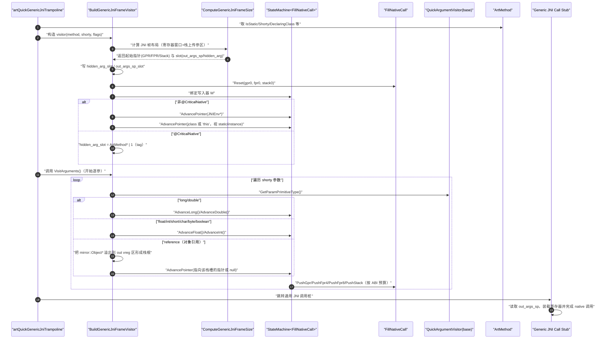

## TL;DR

> **先按 JNI 语义补齐/裁剪（JNIEnv/jclass/this/hidden），再按 C ABI 资源（GPR/FPR/栈）顺序无分支地落位；最后用固定偏移把寄存器“装回去”，切 `sp` 到“JNI 栈上传参区”并 `blr`——让 native 端完全像被普通 C 调用。**

## Native参数准备时序图

<embed src="../assets/JNIFrame.pdf" type="application/pdf" width="100%" height="400">

## 设计思路

这套“Generic JNI → 原生调用”的传参与栈帧设计，核心是把**Java/Quick 的调用约定**，在极少的汇编里，稳定地映射到**平台 C ABI**，同时又满足 **GC 安全 / 可回溯 / 可去优化**。

### 1) 分层解耦：谁做决策，谁做搬运

* **`BuildGenericJniFrameVisitor`**：只关心“**从 Java 视角读到的每个实参是什么类型**”，并按 shorty 逐个吐给“状态机”。
* **`BuildNativeCallFrameStateMachine<FillNativeCall>`**：只关心“**目标 ABI 能放进哪些寄存器、何时溢出到栈**”，把每个值落到 **x0..x7 / d0..d7 / 栈**。
* **FillNativeCall**：是“写手”，维护 GPR/FPR/Stack 三个写指针，顺序写入即可。
* **ComputeGenericJniFrameSize**：在真正填参前**先算清楚**：寄存器窗口镜像要占多少、栈上传参需要多大、对齐怎么做、隐含槽位（hidden/out_args_sp）在哪。
* **汇编桩**：极薄，只做三件事：
  1. 留出 reserved area；
  2. 调 C++；
  3. 按固定偏移把寄存器镜像 `ldp` 回来、`mov sp, out_args_sp`、`blr`。

> 好处：ABI 细节被“关在状态机里”，桩汇编不跟着 ABI 变化四处散落；不同架构只需要替换状态机/尺寸计算。

### 2) JNI 头部注入：接口稳定 + 形态裁剪

* **普通 JNI**：先注入 `JNIEnv*`，再注入 `jclass`（static）或 `this`（instance）。接口稳定、易用。
* **@CriticalNative**：**去掉** `JNIEnv/jclass/this`，最大限度减少过桥开销；但为运行时保留一个 `hidden arg = ArtMethod* | tag`（ARM64 在 x15），不“污染” C 形参，却让桩/桥在需要时能识别调用的方法是谁。

> 这体现了**按使用场景裁剪语义开销**：常规 JNI 走易用性，critical 走极致性能。

### 3) “寄存器优先、顺序落栈”：完全遵守目标 ABI

* 标量整型优先进 **x0..x7**，浮点优先进 **d0..d7**；`long/double` 做 8B 对齐；**超额**按**出现顺序**落到“JNI Stack Args”，**每参 8 字节槽**。
* **Compute** 阶段就保证**最终调用点 `sp` 16B 对齐**（AAPCS64），从而 callee 可以用**纯 C ABI 视角**无感知地取参。

> 设计目标是：**native 函数仿佛被普通 C 调用**，完全不用管“我来自 Java”。

### 4) 一次性“铺好→抬走”：reserved area 的作用

* C++ 会把**寄存器镜像**（x0..x7 / d0..d7）+ **hidden** + **out_args_sp** 都写在 **reserved area** 的**固定偏移**上。
* 汇编按固定偏移 `ldp` 回寄存器，再 `mov sp, out_args_sp`，就把整段 reserved area **一把弹走**，只留下真正应该给 callee 看到的**JNI Stack Args**。
* 这让桩汇编**无分支、无扫描、无额外对齐逻辑**，从而小而快、可验证。

> 固定偏移镜像的好处：汇编桩**可读性强、错误面小**；同时 cache 友好（顺序写/顺序读）。

### 5) 错误与分叉：返回值协议简洁

* C++ 返回 **x0=目标代码指针**，为 0 则说明**校验/锁/类初始化**等在桥上就失败了，汇编直接走异常路径。
* 成功时，汇编不再判断类型，直接 `blr`；返回后把 `d0` 也挪到 `x2` 给 end-trampoline 做统一的**签名扩展/结果封装**。

> 入口/出口各自管一半，避免在一个点同时承载过多职责。

### 6) 可移植与可演化：把“策略”关进状态机

* 新架构（或 ABI 变体）只需要换：
  * **寄存器预算**（有多少个 GPR/FPR 可用）；
  * **栈对齐与拼装规则**；
  * **hidden arg 寄存器选择**（如 ARM64 用 x15）。
* 上层的 **Visitor**、**镜像固定布局**、**桩装载/切 `sp`** 不必动。

> 这就是为什么这套代码能在多架构长期维护、少出错。
