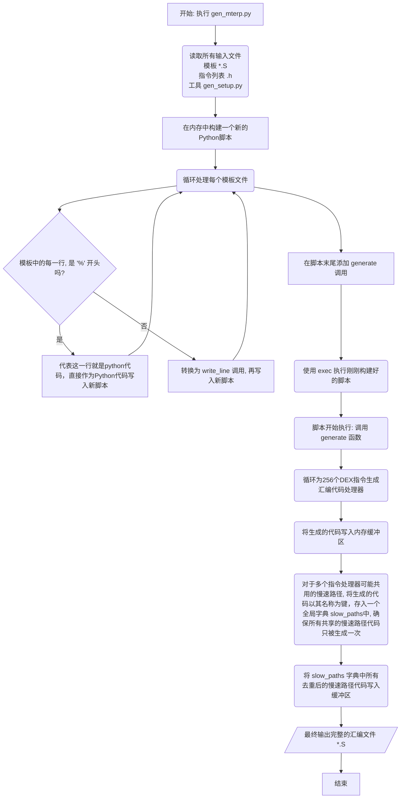

## Nterp：ART的高性能汇编解释器

**Nterp** 是 ART 虚拟机中一个**用汇编语言实现的、高性能的解释器**。

它的存在是为了解决传统解释器的一个性能瓶颈。

ART 中有两种解释器：

1. **Switch Interpreter**: 这是一个用 C++ 实现的、基于一个巨大 `switch-case` 语句的解释器。它非常便于维护和移植，但性能有上限，因为CPU在执行巨大的`switch`时难以进行高效的分支预测，会导致性能损失。
2. **Nterp**: 这是一个用**手写汇编**为特定架构（如 ARM64, x86_64）高度优化的解释器。它通过一种叫做 **穿针引线式解释”（Threaded Interpretation** 或 **计算跳转（Computed Goto）** 的技术，避免了 `switch` 语句的开销，从而获得了更高的执行效率。

所以，**Nterp 的核心目标就是为那些尚未被JIT/AOT编译的代码，提供一个比传统 `switch` 解释器更快的执行引擎**。

## 工作机制：穿针引线式执行

Nterp 的高效源于其独特的执行模型，它结合了汇编的极速**快速路径**和C++的灵活**慢速路径**。

### 1. 指令处理器表与直接跳转

Nterp 的核心是一大块汇编代码（由 `artNterpAsmInstructionStart` 和 `artNterpAsmInstructionEnd` 标记），它本质上是一个**Handler Table**。DEX字节码的每一种指令（opcode）都对应表中的一个**固定大小的汇编代码块**（称为 handler）。

当 Nterp 执行一条指令时，它会：

- a. 从DEX码流中取出下一条指令的 opcode。
- b. 通过公式 `handler_addr = table_base + (opcode * handler_size)` 计算出处理器在内存中的**绝对地址**。
- c. **直接跳转**到该地址执行。
- d. 这个 handler 执行完毕后，不会返回到一个中央分发点（像`switch`那样），而是直接重复以上过程，跳转到**下一条指令**的 handler。

每个handler函数的大小不超过`kNterpHandlerSize`。

```cpp
/*
 * Verify some constants used by the nterp interpreter.
 */
void CheckNterpAsmConstants() {
  /*
   * If we're using computed goto instruction transitions, make sure
   * none of the handlers overflows the byte limit.  This won't tell
   * which one did, but if any one is too big the total size will
   * overflow.
   */
  constexpr size_t width = kNterpHandlerSize;
  ptrdiff_t interp_size = reinterpret_cast<uintptr_t>(artNterpAsmInstructionEnd) -
                          reinterpret_cast<uintptr_t>(artNterpAsmInstructionStart);
  static_assert(kNumPackedOpcodes * width != 0);
  if (interp_size != kNumPackedOpcodes * width) {
    LOG(FATAL) << "ERROR: unexpected asm interp size " << interp_size
               << "(did an instruction handler exceed " << width << " bytes?)";
  }
}
```

这种“点对点”的跳转模式，极大地提高了CPU分支预测的准确性，是 Nterp 性能的好的原因。

### 2. C++ 辅助函数

汇编不适合处理复杂的逻辑（比如类解析、对象分配）。因此，Nterp 采用**混合模型**：

- **快速路径 (Fast Path)**: 简单的、频繁执行的指令（如整数运算、寄存器移动）完全在汇编 handler 中完成。
- **慢速路径 (Slow Path)**: 复杂的指令（如方法调用 `invoke-virtual`、字段访问 `iget-object`），其汇编 handler 会**调用 C++ 辅助函数**来完成繁重的工作。

这些 `extern "C"` 的C++函数是汇编代码和ART运行时的桥梁，它们负责处理运行时交互，并将简单的结果（如地址或偏移量）返回给汇编代码，由汇编代码完成最后的高速操作。

## Nterp 的实现：代码生成与同步

如此复杂的汇编代码并非逐行手写，而是通过一个精巧的**代码生成系统**来构建，以确保其可维护性、扩展性。

### 1. 基于 Python 的模板引擎

`Nterp` 的汇编源文件是通过一个基于 Python 的自定义模板引擎生成的。构建系统会首先将所有特定于某个CPU架构的汇编模板文件拼接成一个巨大的 Python 脚本，然后执行该脚本，最终生成一个完整的、可供编译的`.S` 文件。这种机制极大地减少了重复代码，并允许用程序化的方式来构建复杂的汇编逻辑。

```text
genrule {
    name: "libart_mterp.arm64ng",
    out: ["mterp_arm64ng.S"],
    srcs: [
        "interpreter/mterp/arm64ng/*.S",
    ],
    tool_files: [
        "interpreter/mterp/gen_mterp.py",
        "interpreter/mterp/common/gen_setup.py",
        ":art_libdexfile_dex_instruction_list_header",
    ],
    cmd: "$(location interpreter/mterp/gen_mterp.py) $(out) $(in)",
}
```

#### Python脚本生成汇编指令的流程



#### 模板代码和对应的生成代码

比如模板代码`op_sget`, 对应的模板汇编函数

```arm
%def op_sget(load="ldr", volatile_load="ldar", maybe_extend="", wide="0", is_object="0"):
%  slow_path = add_slow_path(op_sget_slow_path, volatile_load, maybe_extend, wide, is_object)
   // Fast-path which gets the field from thread-local cache.
%  fetch_from_thread_cache("x0", miss_label=slow_path)
.L${opcode}_resume:
   ldr     w1, [x0, #ART_FIELD_OFFSET_OFFSET]
   lsr     w2, wINST, #8               // w2 <- A
   ldr     w0, [x0, #ART_FIELD_DECLARING_CLASS_OFFSET]
   TEST_IF_MARKING .L${opcode}_read_barrier
.L${opcode}_resume_after_read_barrier:
   .if $wide
   ldr     x0, [x0, x1]
   SET_VREG_WIDE x0, w2                // fp[A] <- value
   .elseif $is_object
   $load   w0, [x0, x1]
   UNPOISON_HEAP_REF w0
   // No need to check the marking register, we know it's not set here.
.L${opcode}_after_reference_load:
   SET_VREG_OBJECT w0, w2              // fp[A] <- value
   .else
   $load   w0, [x0, x1]
   SET_VREG w0, w2                     // fp[A] <- value
   .endif
   FETCH_ADVANCE_INST 2
   GET_INST_OPCODE ip
   GOTO_OPCODE ip
.L${opcode}_read_barrier:
   bl      art_quick_read_barrier_mark_reg00
   .if $is_object
   $load   w0, [x0, x1]
   UNPOISON_HEAP_REF w0
.L${opcode}_mark_after_load:
   // Here, we know the marking register is set.
   bl      art_quick_read_barrier_mark_reg00
   b       .L${opcode}_after_reference_load
   .else
   b       .L${opcode}_resume_after_read_barrier
   .endif
```

生成出来的汇编函数`nterp_op_sget`

```arm

/* ------------------------------ */
    .balign NTERP_HANDLER_SIZE
.L_op_sget: /* 0x60 */
    NAME_START nterp_op_sget
    # Explicitly restore CFA, just in case the previous opcode clobbered it (by .cfi_def_*).
    CFI_DEF_CFA_BREG_PLUS_UCONST CFI_REFS, -8, CALLEE_SAVES_SIZE

   // Fast-path which gets the field from thread-local cache.
   // Fetch some information from the thread cache.
   // Uses ip and ip2 as temporaries.
   add      ip, xSELF, #THREAD_INTERPRETER_CACHE_OFFSET       // cache address
   ubfx     ip2, xPC, #2, #THREAD_INTERPRETER_CACHE_SIZE_LOG2  // entry index
   add      ip, ip, ip2, lsl #4            // entry address within the cache
   ldp      ip, x0, [ip]          // entry key (pc) and value (offset)
   cmp      ip, xPC
   b.ne     nterp_op_sget_slow_path

.Lop_sget_resume:
   ldr     w1, [x0, #ART_FIELD_OFFSET_OFFSET]
   lsr     w2, wINST, #8               // w2 <- A
   ldr     w0, [x0, #ART_FIELD_DECLARING_CLASS_OFFSET]
   TEST_IF_MARKING .Lop_sget_read_barrier
.Lop_sget_resume_after_read_barrier:
   .if 0
   ldr     x0, [x0, x1]
   SET_VREG_WIDE x0, w2                // fp[A] <- value
   .elseif 0
   ldr   w0, [x0, x1]
   UNPOISON_HEAP_REF w0
   // No need to check the marking register, we know it's not set here.
.Lop_sget_after_reference_load:
   SET_VREG_OBJECT w0, w2              // fp[A] <- value
   .else
   ldr   w0, [x0, x1]
   SET_VREG w0, w2                     // fp[A] <- value
   .endif
   FETCH_ADVANCE_INST 2
   GET_INST_OPCODE ip
   GOTO_OPCODE ip
.Lop_sget_read_barrier:
   bl      art_quick_read_barrier_mark_reg00
   .if 0
   ldr   w0, [x0, x1]
   UNPOISON_HEAP_REF w0
.Lop_sget_mark_after_load:
   // Here, we know the marking register is set.
   bl      art_quick_read_barrier_mark_reg00
   b       .Lop_sget_after_reference_load
   .else
   b       .Lop_sget_resume_after_read_barrier
   .endif

    NAME_END nterp_op_sget
    // Advance to the end of this handler. Causes error if we are past that point.
    .org nterp_op_sget + NTERP_HANDLER_SIZE  // op_sget handler is too big!

```

slow_path的代码在后面，可以看到里面调用了函数`nterp_get_static_field`

```arm
 NAME_START nterp_op_sget_slow_path
   mov     x0, xSELF
   ldr     x1, [sp]
   mov     x2, xPC
   mov     x3, #0
   EXPORT_PC
   bl      nterp_get_static_field
   tbz     x0, #0, .Lop_sget_resume
   CLEAR_STATIC_VOLATILE_MARKER x0
   ldr     w1, [x0, #ART_FIELD_OFFSET_OFFSET]
   lsr     w2, wINST, #8               // w2 <- A
   ldr     w0, [x0, #ART_FIELD_DECLARING_CLASS_OFFSET]
   TEST_IF_MARKING .Lop_sget_slow_path_read_barrier
.Lop_sget_slow_path_resume_after_read_barrier:
   add     x0, x0, x1
   .if 0
   ldar    x0, [x0]
   SET_VREG_WIDE x0, w2                // fp[A] <- value
   .elseif 0
   ldar w0, [x0]
   UNPOISON_HEAP_REF w0
   TEST_IF_MARKING .Lop_sget_mark_after_load
   SET_VREG_OBJECT w0, w2              // fp[A] <- value
   .else
   ldar w0, [x0]
   
   SET_VREG w0, w2                     // fp[A] <- value
   .endif
   FETCH_ADVANCE_INST 2
   GET_INST_OPCODE ip
   GOTO_OPCODE ip
.Lop_sget_slow_path_read_barrier:
   bl      art_quick_read_barrier_mark_reg00
   b       .Lop_sget_slow_path_resume_after_read_barrier

    NAME_END nterp_op_sget_slow_path
```

`nterp_get_static_field`实际上是函数`NterpGetStaticField`

```arm
// Macro for defining entrypoints into runtime. We don't need to save registers
// (we're not holding references there), but there is no
// kDontSave runtime method. So just use the kSaveRefsOnly runtime method.
.macro NTERP_TRAMPOLINE name, helper
ENTRY \name
  SETUP_SAVE_REFS_ONLY_FRAME
  bl \helper
  RESTORE_SAVE_REFS_ONLY_FRAME
  REFRESH_MARKING_REGISTER
  ldr xIP0, [xSELF, # THREAD_EXCEPTION_OFFSET]   // Get exception field.
  cbnz xIP0, nterp_deliver_pending_exception
  ret
END \name
.endm

// ......

NTERP_TRAMPOLINE nterp_get_static_field, NterpGetStaticField
```

NterpGetStaticField就是在nterp.cc中使用C++实现的函数。

```cpp
LIBART_PROTECTED
extern "C" size_t NterpGetStaticField(Thread* self,
                                      ArtMethod* caller,
                                      const uint16_t* dex_pc_ptr,
                                      size_t resolve_field_type)  // Resolve if not zero
    REQUIRES_SHARED(Locks::mutator_lock_) {
  UpdateHotness(caller);
  const Instruction* inst = Instruction::At(dex_pc_ptr);
  uint16_t field_index = inst->VRegB_21c();
  ClassLinker* const class_linker = Runtime::Current()->GetClassLinker();
  Instruction::Code opcode = inst->Opcode();
  ArtField* resolved_field = ResolveFieldWithAccessChecks(
      self,
      class_linker,
      field_index,
      caller,
      /*is_static=*/ true,
      /*is_put=*/ IsInstructionSPut(opcode),
      resolve_field_type);

  if (resolved_field == nullptr) {
    DCHECK(self->IsExceptionPending());
    return 0;
  }
  if (UNLIKELY(!resolved_field->GetDeclaringClass()->IsVisiblyInitialized())) {
    StackHandleScope<1> hs(self);
    Handle<mirror::Class> h_class(hs.NewHandle(resolved_field->GetDeclaringClass()));
    if (UNLIKELY(!class_linker->EnsureInitialized(
                      self, h_class, /*can_init_fields=*/ true, /*can_init_parents=*/ true))) {
      DCHECK(self->IsExceptionPending());
      return 0;
    }
    DCHECK(h_class->IsInitializing());
  }
  if (resolved_field->IsVolatile()) {
    // Or the result with 1 to notify to nterp this is a volatile field. We
    // also don't cache the result as we don't want nterp to have its fast path always
    // check for it.
    return reinterpret_cast<size_t>(resolved_field) | 1;
  } else {
    // For sput-object, try to resolve the field type even if we were not requested to.
    // Only if the field type is successfully resolved can we update the cache. If we
    // fail to resolve the type, we clear the exception to keep interpreter
    // semantics of not throwing when null is stored.
    if (opcode == Instruction::SPUT_OBJECT &&
        resolve_field_type == 0 &&
        resolved_field->ResolveType() == nullptr) {
      DCHECK(self->IsExceptionPending());
      self->ClearException();
    } else {
      UpdateCache(self, dex_pc_ptr, resolved_field);
    }
    return reinterpret_cast<size_t>(resolved_field);
  }
}
```

#### 直接跳转到下一条指令的handler

在上面的例子函数`nterp_op_sget`中，跳转逻辑如下

```arm
.Lop_sget_after_reference_load:
   SET_VREG_OBJECT w0, w2              // fp[A] <- value
   .else
   ldr   w0, [x0, x1]
   SET_VREG w0, w2                     // fp[A] <- value
   .endif
   FETCH_ADVANCE_INST 2
   GET_INST_OPCODE ip
   GOTO_OPCODE ip
```

其中宏`FETCH_ADVANCE_INST`、`GET_INST_OPCODE`、`GOTO_OPCODE`如下

```arm
.macro FETCH_ADVANCE_INST count
    ldrh    wINST, [xPC, #((\count)*2)]!
.endm

.macro GET_INST_OPCODE reg
    and     \reg, xINST, #255
.endm

.macro GOTO_OPCODE reg
    add     \reg, xIBASE, \reg, lsl #NTERP_HANDLER_SIZE_LOG2
    br      \reg
.endm
```

在跳转的时候确实就是使用`基址 + opcode * handlerSize`的地址直接进行跳转，省去了返回 C++ Switch再进行分发的开销。

### 2. C++ 与汇编的常量同步

为了让汇编代码能够正确访问 C++ 对象（如 `Thread`, `ArtMethod`）的成员，它们必须共享完全一致的内存布局信息。

- **`asm_support.h`和`arch/arm64/asm_support_arm64.h`**: 用受限但通用的宏格式定义了所有必要的常量。
- **启动时验证**: 为了防止任何不一致，ART 虚拟机会进行严格的自检。

## Nterp 的使用场景与限制

`Nterp` 为了追求速度牺牲了一些功能。函数 `CanRuntimeUseNterp()` 定义了以下**必须同时满足**的条件：

1. **硬件和构建支持**: 当前的CPU架构必须有对应的 `Nterp` 汇编实现。
2. **非调试模式**: 应用不能处于可调试状态或被调试器附加。调试所需的单步执行、断点等功能需要传统解释器的支持。
3. **无特殊插桩或分析**: 不能有`Profiler`等工具安装方法进入/退出桩，或者有其它需要慢速解释器才能支持的监听器。
4. **非AOT编译环境**: 当前进程不能是`dex2oat`，因为它有自己特殊的工作模式。
5. **无异步异常**: 线程中不能有待处理的异步异常，因为 `Nterp` 的汇编循环中没有检查这类异常的逻辑，必须切换回传统解释器才能响应。
6. **JIT编译策略兼容**: JIT编译器要么被禁用，要么没有开启“首次使用即编译”的激进模式。

```cpp
bool CanRuntimeUseNterp() REQUIRES_SHARED(Locks::mutator_lock_) {
  Runtime* runtime = Runtime::Current();
  instrumentation::Instrumentation* instr = runtime->GetInstrumentation();
  // If the runtime is interpreter only, we currently don't use nterp as some
  // parts of the runtime (like instrumentation) make assumption on an
  // interpreter-only runtime to always be in a switch-like interpreter.
  return IsNterpSupported() && !runtime->IsJavaDebuggable() && !instr->EntryExitStubsInstalled() &&
         !instr->InterpretOnly() && !runtime->IsAotCompiler() &&
         !instr->NeedsSlowInterpreterForListeners() &&
         // An async exception has been thrown. We need to go to the switch interpreter. nterp
         // doesn't know how to deal with these so we could end up never dealing with it if we are
         // in an infinite loop.
         !runtime->AreAsyncExceptionsThrown() &&
         (runtime->GetJit() == nullptr || !runtime->GetJit()->JitAtFirstUse());
}
```

## 总结

**Nterp 是 ART 为了提升非编译代码执行效率而设计的一个高性能汇编解释器。**

- 它通过**“穿针引线式执行”**避免了传统`switch`解释器的性能瓶颈。
- 它采用**混合执行模型**：用**汇编**处理简单、高频的指令（**快速路径**），用**C++辅助函数**处理复杂、低频的运行时交互（**慢速路径**）。
- 它的实现依赖于一个强大的**Python模板生成系统**，并通过**启动时校验**确保与C++世界的绝对同步。
- 它是一个**可选的、有条件的**执行引擎。是否使用 `Nterp` 是一个**性能与功能的权衡**。它被用于标准的应用执行中以获得最大性能，但一旦需要**调试、分析或处理复杂的运行时事件**，ART就会立即禁用它，并回退到功能更全面、但速度稍慢的C++解释器。
