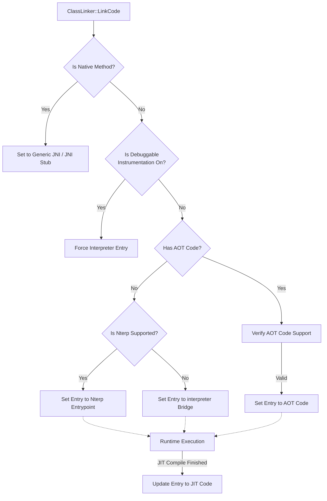

在 Android Runtime (ART) 中，代码的执行并非单一模式，而是混合了**解释执行 (Interpreter)**、**即时编译 (JIT)** 和 **预先编译 (AOT)** 的复杂系统。

## Interpreters

解释器直接读取 Dex 字节码并执行，无需编译成机器码。

* **C++ Switch Interpreter:** 纯 C++ 实现，使用巨大的 `switch-case` 结构分发指令。最慢，但可移植性最好。通常只用于调试、验证逻辑或作为不支持汇编优化的架构的 fallback。
* **Mterp (Modular Interpreter):** 高度优化的汇编解释器。使用 "Computed Goto" 技术，每条指令执行完直接跳转到下一条指令的 Handler，消除了 Switch 的开销。
* **Nterp (New Interpreter):** 为了配合 **Centralized Method Table** (节省内存、支持不可变 Boot Image) 而设计的新一代汇编解释器。Nterp 支持在不修改 `ArtMethod` 内存结构的情况下执行（参数传递和栈帧布局更接近 Compiled Code）。Nterp 遵循了 Quick ABI，和Compiled Code使用一套Trampoline。

## Compiled Code

将 Dex 字节码转换为本地机器码。

* **AOT:** 应用安装或空闲充电时生成的 `.oat` 文件。性能最好，但占用磁盘空间。
* **JIT:** 运行时根据热度（Hotness）将解释执行的函数编译成机器码并存入 JIT Cache。

## 执行模式的关系

1. 一个方法在同一时刻通常只由一种引擎执行，但生命周期内会切换。
2. **Nterp vs Mterp**：Nterp 是 Mterp 的进化版。在 Android 12+ 中，Nterp 是默认解释器。它不仅执行字节码，还充当了**Trampoline (跳板)** 的角色，使得解释器可以直接调用编译后的代码，遵循对应的 ABI 规范。
3. **解释器 -> 编译代码**：通过 JIT Profiler 发现热点，触发编译，完成后更新 `ArtMethod` 的入口点。
4. **编译代码 -> 解释器**：当发生去优化 (De-optimization) 时（例如调试器由于断点介入，或类层次结构改变导致内联失效），执行流会回退到解释器。

## ArtMethod 执行引擎的选择流程

当一个类被加载（Load）并链接（Link）时，`ClassLinker` 会负责初始化该类中所有 `ArtMethod` 的入口点（Entry Point）。

### 核心函数：`ClassLinker::LinkCode`

这是决断的核心逻辑。

### 选择流程

### 详细步骤说明

1. **Native 方法检查**：
    * 如果是 `native` 方法，入口点会被设置为 `art_jni_dlsym_lookup_stub` 或 `Generic JNI`。这实际上也是一种特殊的“编译代码”或汇编桩，用于跳转到 C/C++ 实现。

2. **调试/插桩状态检查**：
    * 如果应用处于 `debuggable` 模式，或者开启了方法追踪（Method Tracing），为了保证调试器能精确控制每一步，ART 可能会强制使用解释器模式，或者特定的“解释器桥接”。

3. **AOT 代码检查 (OAT File)**：
    * `ClassLinker` 检查该方法是否在 `.oat` 文件中有已编译的机器码。
    * 如果有，且代码校验通过（比如依赖的类没有发生不兼容变化），则 `entry_point_from_quick_compiled_code_` 直接指向 AOT 机器码地址。

4. **解释器回退 (Interpreter Fallback)**：
    * 如果没有 AOT 代码，方法必须以解释模式启动。
    * **Android 12+**: 默认设置为 **Nterp** 入口点`ExecuteNterpImpl`。
    * **Legacy**: 设置为 `art_quick_to_interpreter_bridge`，该桥接函数会引导进入Switch Interpreter。

## Nterp 的革新之处

| 特性 | C++ Switch | Mterp (Modular) | Nterp (New) |
| :--- | :--- | :--- | :--- |
| **实现语言** | C++ | Assembly (生成器生成) | Assembly (手写/生成) |
| **性能** | 低 | 高 | 高 (接近 Mterp) |
| **内存布局依赖** | 强依赖 | 依赖 | **解耦 (关键)** |
| **调用约定** | 内部约定 | 内部约定 | **遵循标准 ABI (AAPCS)** |
| **主要用途** | 调试/Fallback | 旧版主力解释器 | **省内存/不可变镜像** |

在 Android 12 引入 **Centralized Method Table** 后，为了节省内存，相同的 `ArtMethod` 数据结构可能会被多个 Dex 文件共享（例如 Boot Classpath 中的类）。

* **Mterp** 往往需要在这个 `ArtMethod` 结构体中写入一些运行时数据（如 Profiling info）。
* **Nterp** 被设计为可以处理只读的 `ArtMethod`。它将所需的可变数据存储在单独的内存区域，这使得 ART 可以将更多的元数据放入脏页更少的内存段中，从而减少 RAM 占用。
* 此外，**Nterp 可以直接充当 JIT 编译代码的调用者**，因为它严格遵循系统的 Calling Convention（调用约定），这减少了从解释器切换到编译代码时的 "Trampoline" 开销。

<https://cs.android.com/android/platform/superproject/main/+/main:art/runtime/interpreter/mterp/README.txt>
