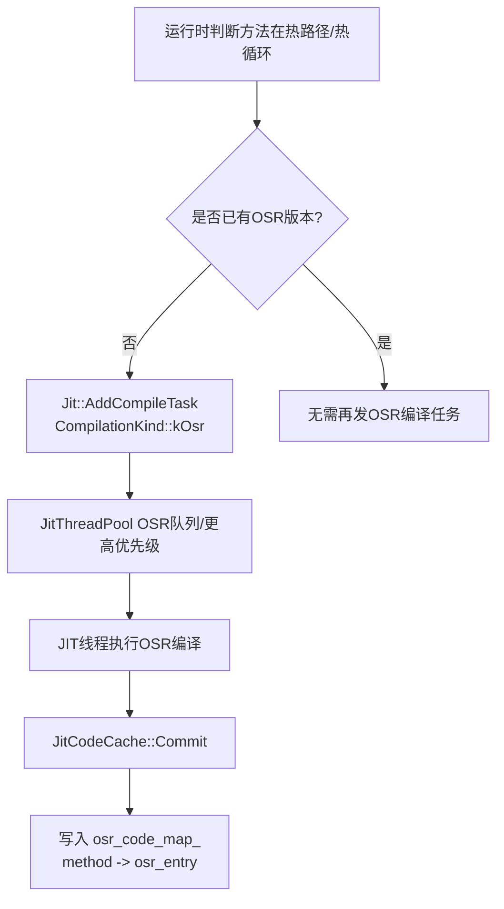
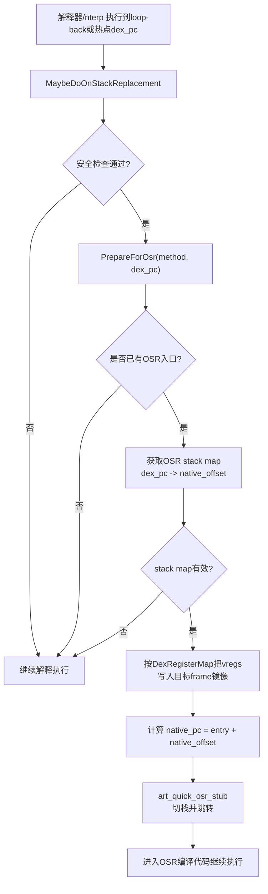

## TL;DR

**JIT 相比纯 AOT / 只解释执行，多做了三件事：**

1. 运行时持续profile（热度 & 类型等 profile 信息）。
2. 为这些信息准备专门的数据结构（ProfilingInfo、InlineCache、JitCodeCache 等）。
3. 加一套新机制（热度计数 → 提交 JIT 任务 → 写入 code cache → 代码缓存 GC / profile 持久化等）。

## 一、JIT 额外需要收集的“信息”

这些信息基本都挂在 `ProfilingInfo` / `InlineCache` 或 `JitCodeCache` 相关结构上，是纯 AOT 不需要在“运行时”收集的。

### 1. 方法热度（Hotness / 热度计数）

* 每个被 JIT baseline 编译的方法有一个 `baseline_hotness_count_` 计数器，存在 `ProfilingInfo` 里：
  一旦到达阈值，就会触发“从 baseline 升级为 optimized JIT 编译”。
* 解释器 / stub 在方法调用、回边等地方给这个计数加一，JIT 用这些计数判断：

  * 是否值得做 baseline 编译；
  * baseline 是否需要再升级为优化版；
  * 是否触发 OSR（on-stack replacement）编译热循环。

> 这些热度信息在 AOT 编译时，如果没有 Profile（speed 模式），是完全没有的；
> JIT 则是“时时更新”，用于动态决定编译策略。

### 2. 调用点类型信息（Inline Cache / 类型 profile）

* 对每个被选中的 `invoke-*` 指令，JIT 会维护一个 **InlineCache**：

  * 记录这个调用点实际出现过的 receiver 类型 / 目标方法（单态、多态、megamorphic）。
  * `ProfilingInfo` 里有 `number_of_inline_caches_` 和 `InlineCache cache_[0]` 动态数组，专门存这些信息。
* 当缓存被填满时，InlineCache 会被标记为 “megamorphic”，表示类型太多，不适合做激进内联。

这些类型/目标分布信息会被编译器用来做：

* 调用去虚拟化、内联（单态/小多态比 megamorphic 好得多）；
* 生成更紧的类型检查路径；
* 选择更合适的内联候选。

### 3. 分支 / 回边 profile

`branch_cache_entries` 用于记录特定 dex pc 上的分支信息（taken / not taken 的热点）。

这些用处包括：

* 优化循环中热分支的布局（fallthrough 哪边更热）；
* 决定是否值得对某些 if/compare 做特化。

### 4. OSR 相关信息

为了支持 **OSR（在热循环中切入 JIT 代码）**，JIT 还需要知道：

* 哪些 loop-back / dex pc 是最热的；
* 在这些点上，栈和寄存器的 live 值分布（由 stack map 描述——AOT 也有 stack map，但 JIT 会额外使用这些来构造 OSR 入口）。

OSR 的入口一般在 `JitCodeCache` 里以 `osr_code_map_` 的形式挂着（映射：方法 → OSR compiled code）。

### 5. Profile 持久化所需的信息

为了给后续 AOT（`dex2oat` speed-profile / cloud profile / baseline profile）用，JIT 还要收集：

* 哪些方法 / 类 / 代码路径足够热；
* 调用点的 InlineCache（实际看到的类型集合）。

这些信息会被后台线程 `ProfileSaver` 周期性从 `JitCodeCache` 和各个 `ProfilingInfo` 中抽取出来，序列化到 `.prof` 文件，后面 AOT 编译再读。

---

## 二、JIT 额外引入的主要数据结构

JIT 的大头就是：**ProfilingInfo + InlineCache + JitCodeCache + JitMemoryRegion + ProfileSaver 这一套。**

### 1. `ProfilingInfo`（方法级 profile 容器）

关键字段：

* `uint16_t baseline_hotness_count_`：baseline JIT 方法的热度计数，触发二次优化的依据。
* `ArtMethod* method_`：这个 `ProfilingInfo` 对应的方法。
* `const uint32_t number_of_inline_caches_`,`const uint32_t number_of_branch_caches_`：要 profile 的 invoke/branch 数量。
* `uint16_t current_inline_uses_`：被优化代码内联使用的引用计数，用于告诉 GC “先别清这个 inline cache，我还在用”。
* `InlineCache cache_[0]`：尾随数组，存每个调用点的类型信息。

这些结构完全是为 JIT/PGO 服务的，纯 AOT + 不用 profile 时根本不需要。

### 2. `InlineCache`

* “每个调用点一个小表”，里面记录：

  * 若干个 `(Class*, ArtMethod*, 计数)` 条目；
  * 状态位（空、单态、多态、megamorphic）。
* 这个结构在 `ProfileSaver` 和 `ProfileCompilationInfo` 中必须对齐，源码里专门有断言：

  > “InlineCache and ProfileCompilationInfo do not agree on kIndividualCacheSize”

### 3. `jit::Jit` 主控制器

* 挂在 `Runtime` 上，是整个 JIT 的入口。
* 内部成员（简化）：

  * `JitCodeCache* code_cache_`：JIT 代码缓存；
  * 指向编译器后端的 `jit_compiler_`；
  * JIT 的线程池 `thread_pool_`；
  * `JitOptions`：各类阈值和开关（warm/hot/OSR 阈值、code cache 大小、是否启用 JIT 等）。

### 4. `JitCodeCache`（JIT 代码 + 附属数据的“堆”）

* 代码 + 数据 + profiling info 都放在这里，带锁管理。
* 会统计各种内存使用直方图，如：

  * `histogram_stack_map_memory_use_`（stack map 用了多少内存）、
  * `histogram_code_memory_use_`（JIT 机器码）、
  * `histogram_profiling_info_memory_use_`（ProfilingInfo 占用）。
* 内部还维护：

  * 当前正在使用的 `JitMemoryRegion`；
  * 方法 → 编译代码头（`OatQuickMethodHeader`）的映射；
  * 方法 → OSR 代码（`osr_code_map_`）；
  * ProfilingInfo 集合；
  * 与 GC 的集成（为 JIT 代码里的 roots 提供扫描接口）。

### 5. `JitMemoryRegion`（每次编译用的局部“分区”）

* 负责在 JIT code cache 中分出一段区域给当前编译使用：

  * `Initialize(initial_capacity, max_capacity, ...)` 时会检查最大容量上限，并按页对齐。
  * 内部利用双视图（memfd + RW/RX 双映射）避免直接使用 RWX 页面；初始化时调用 `memfd_create("jit-cache", ...)`，失败时在不允许 RWX 的情况下直接报错。

### 6. `ProfileSaver` / `ProfileSaverOptions`

* 一个长期存在的后台线程（优先级 9），定期：

  * 遍历 `JitCodeCache` / `ProfilingInfo`；
  * 抽取热点方法 & inline caches；
  * 写入指定的 `.prof` 文件。
* 这部分是“JIT → AOT PGO”的桥梁，AOT 的 `dex2oat` 使用这些 profile 决定要不要 AOT 某个方法、怎么 AOT。

### 7. 其他辅助结构

* **JIT 线程池 & `JitCompileTask`**：运行时编译任务封装，队列里塞的就是 `ArtMethod*` 加编译 kind（baseline / optimized / osr），worker 线程不断拉任务。
* **JIT instrumentation cache**：跟解释器 / instrumentation 交互，用来统计调用次数、通知 JIT 方法进入 / 退出。
* **调试支持**：JIT 会把生成的调试信息以 in-memory ELF 的形式注册，方便 tombstone / 调试器符号化 JIT 栈。

---

## 三、JIT 额外引入的“机制”

### 1. 热度统计 & 触发策略

* 解释器 / quick stub 在方法进入、回边、虚调用等热点路径上对 profile 做累积：

  * 增加 `ProfilingInfo::baseline_hotness_count_`；
  * 更新某个调用点的 InlineCache（新增 receiver 类型或增加计数）；
* 达到阈值后，通过 `Jit` 把方法塞到 `JitThreadPool` 的编译队列。

> 没有 JIT 的情况下，解释器只要保证语义正确就行；
> 有 JIT 的时候，解释器 + stub 还要承担“在线 profiler”的角色，这是关键差异。

---

### 2. On Stack Replacement（OSR）

#### 2.1 OSR 解决什么问题？

OSR（On-Stack Replacement）解决的问题是：
**当一个方法已经在解释器 / nterp 中跑进热循环时，不必等“下次调用该方法”才能用上编译代码；而是在循环中间直接切到编译代码继续执行。**

直观效果：

* 解释器跑到 loop-back（回边）附近 → 发现已经有 OSR 版本 → 立刻跳进 OSR 编译代码；
* 跳转后继续执行的是“同一个方法”的后续逻辑，只是执行引擎变成 compiled code。

#### 2.2 OSR 的两条链路：编译侧 & 执行侧

**编译侧（产生 OSR 版本）**

* JIT 会把 OSR 视为一种单独的编译 kind：`CompilationKind::kOsr`。
* 典型策略是：如果判断“方法很可能在热循环里”，就额外发一个 OSR 编译任务进队列（OSR 通常有独立队列/优先级，避免热循环等太久）。

OSR 编译完成后：

* 产物会记录在 `JitCodeCache` 的 `osr_code_map_`，后续解释器可用它查到 OSR 入口。

**执行侧（在解释器里触发 OSR 跳转）**

执行侧可以拆成 5 步：

1. **触发点**：解释器在 loop-back / 热回边 / 特定 dex pc 检查是否要尝试 OSR。
2. **安全检查**：比如栈空间是否足够、是否处于需要强制解释执行/去优化的状态（如 instrumentation/JVMTI 等）。
3. **查找 OSR 版本**：从 code cache 查 OSR method header / entry。没有就继续解释执行。
4. **准备 OSR 数据**：基于 OSR stack map（dex pc → native offset 的映射），把当前 vregs（shadow frame）按 `DexRegisterMap` 的规则写入目标 compiled frame 的 slot。
5. **切栈跳转**：通过 `art_quick_osr_stub` 建立 compiled 栈帧并跳到 OSR entry 的 native pc，开始执行 compiled code。

#### 2.3 OSR 机制流程图

**OSR 编译侧（入队 → 编译 → 写入 `osr_code_map_`）**



**OSR 执行侧（解释器尝试 → 找 stack map → 拼帧 → stub 跳转）**



---

### 3. 在线编译任务调度

* `Jit::MaybeEnqueueCompilation()` 决定是不是把某个方法放进队列；
* `JitCompileTask` 在 JIT thread 上跑，调用统一的 Optimizing 后端生成机器码，然后通过 `JitCodeCache` 把结果落到 JIT code cache 里，并更新 `ArtMethod` 的 entrypoint。
* 同时记录 JIT 编译次数、代码大小、profiling info 内存使用等统计，用于调优。

### 4. 代码缓存管理 & JIT GC

* `JitCodeCache` 会在接近上限时触发 **JIT code cache GC**：

  * 找出已经不再热 or 不再可达的方法；
  * 回收对应的 JIT 机器码和附属 stack map / ProfilingInfo；
  * 清理 OSR 版本映射项；
  * 更新类卸载时的清理逻辑（class_linker 在类卸载时会主动通知 JIT 删除相关方法和 profile 信息）。

这套 GC 机制在纯 AOT 世界是不存在的——AOT 代码在映射的 OAT / image 里，不会被这种“代码 GC”回收。

### 5. Profile 持久化 & 与 AOT 的交互

* `ProfileSaver` 线程周期性 wakeup：

  * 根据阈值判断 profile 是否值得写盘；
  * 从 `JitCodeCache` 里分析最新 InlineCache / 方法热度，写到 `.prof`。
* 后续在设备 idle + 充电时，`dex2oat` 用 `--compiler-filter=speed-profile` / `cloud profile` / `baseline profile` 配合这些数据做增量 AOT。

### 6. 调试 & 崩溃分析机制

* JIT 会把生成的代码/调试信息通过运行时机制暴露给调试器/回溯器：

  * 崩溃时可以在 tombstone 看到落在 `memfd:jit-cache` / `jit-code-cache` 相关映射区间的 PC；
  * 调试器/符号化工具可以据此把 JIT 栈符号化出来。


当然可以。我会贴在你原文的 **OSR 之后**，在 “### 2. On Stack Replacement（OSR）” 下面加一节 **baseline → optimized 升级解释**，说明它们的区别和为何会升级。内容会尽量和 AOSP15 ART 现实实现对齐，并结合源码行为解释。

---
## 四、baseline 与 optimized JIT

ART 的 JIT 实现里其实**会区分不同的编译质量**（levels），主要体现在 baseline JIT vs optimized JIT：

* **baseline JIT**：生成速度快、优化少、体积小的机器码，适合快速启动 & 初次 hot spot 处理。
* **optimized JIT**：使用更高级别的优化（例如更多的 inlining、循环优化、更 aggressive 的常量传播等），生成更快的机器码，但编译时间更长。

二者对比上基本是一个 **编译质量 vs 编译开销** 的 trade-off：

* baseline 编译更“轻量”，优先减少 runtime 编译延迟，快速替代解释执行；
* optimized 编译更“重度”，更倾向于利用运行时信息做更深入的优化（例如用类型信息做更好的内联），但对 CPU/时间成本更高。

这也是很多现代 JIT 设计里的典型模式：**先做一个快速的 tier-1 编译，再根据热度升级到 tier-2 更优化版本**。

### 4.1 从源码角度看编译 kind 的逻辑

在 ART JIT 的源码逻辑里有几处体现这种区分（示例来自 `Jit::CompileMethodInternal`）：

* JIT 有不同的 `CompilationKind`：`kBaseline`, `kOptimized`, `kOsr` 等。
* 如果编译器接口被标记为 baseline compiler，则即使请求 optimized 也会降级为 baseline。
* 如果当前正请求 baseline，但 profiling info 不足以支持它所需的数据（例如无法为 inline cache 分配 info），就会**fallback 到 optimized**：

这段源码逻辑说明：ART 会根据资源/状态动态选择最终的编译 quality，而不是硬性每次都按照最初请求：([Android Git Repositories][2])

```cpp
if (jit_compiler_->IsBaselineCompiler() && compilation_kind == CompilationKind::kOptimized) {
  compilation_kind = CompilationKind::kBaseline;
}
// …
if ((compilation_kind == CompilationKind::kBaseline) &&
    !GetCodeCache()->CanAllocateProfilingInfo()) {
  compilation_kind = CompilationKind::kOptimized;
}
```

#### 4.1.1 为什么 “baseline 分配不到 profiling info” 反而会 fallback 到 optimized？

这个点看起来反直觉（baseline不是更“轻量”吗），但在 ART 的工程假设里，**baseline 并不是“只要能产出机器码就算完成任务”**，它更像是一个“快速上码 + 持续收集 profile + 支持后续升级”的组合包。具体原因可以从 `CanAllocateProfilingInfo()` 的定义看出来：它要求当前 region 有效、而且**不能是 shared region**，并且注释明确写了原因——profiling info 可能引用 GC 对象，而 shared region 通常不支持这类对象。

把它拆开理解就是：

1. **baseline 运行时需要有地方“继续写 profile”**
   baseline 阶段最大的价值之一是：先尽快脱离解释器/ nterp 的开销，同时继续收集运行时信息（尤其是 inline cache/类型分布、分支行为等），为更热时的 optimized（以及 profile 持久化给后续 AOT）提供“燃料”。Android 文档也明确说 JIT 会利用运行时类型信息做更好的 inlining，并支持 OSR 等，这些都建立在“持续 profile”这条链路上。

2. **profiling info 分配不到时，baseline 会变成“不可持续的半残状态”**
   如果不能分配 ProfilingInfo/inline cache，那么 baseline 即便生成了代码，也很可能：

* 没法记录/更新关键调用点类型信息（inline cache），后续 optimized 的去虚拟化/内联收益会明显下降；
* 在某些模式下（例如 shared/zygote region），profiling 相关对象根本不允许放进去，baseline 这条“边跑边记”的设计前提不成立。

与其花一次 baseline 的编译成本，却拿不到 baseline “后半段”（持续 profile + 可升级）的收益，ART 选择直接转向 optimized：至少生成一份**不依赖这些 profiling info 也能长期使用**的 compiled code，从整体收益上更划算。

1. **shared region / zygote 场景本来就更偏向“限制更多、策略更保守”**
   同一份 `jit.cc` 里你还能看到：OSR 编译在 shared region 下会直接拒绝（因为 shared region 的约束更强）。这类限制本质上和 profiling info 的限制是同一类问题：shared 区域要尽量避免存放会被 GC 移动/回收、或需要写屏障维护的对象。

> 结论：**fallback 到 optimized 并不是说 optimized “更轻”，而是说 baseline 的“设计目标”离不开 profiling info；缺了 profiling info，baseline 的性价比会急剧下降甚至断掉后续链路，于是直接走更自洽的 optimized 路径。**

### 4.2 baseline vs optimized 的优化程度区别

具体来说，baseline 和 optimized 在优化深度上存在差异：

* **baseline JIT**：

  * 目标是快速生成可执行机器码，尽早替代解释执行；
  * 优化级别较低（更强调编译速度/体积），很多基于 profile 的激进决策会更保守；
  * 同时承担“持续收集 profile”的前置阶段（为后续 optimized / profile 持久化提供数据）。
* **optimized JIT**：

  * 更强调 steady-state 性能，愿意花更多编译时间换取更强优化；
  * 更倾向使用运行时信息（尤其是类型信息）做更激进的 inlining、去虚拟化等；
  * 在 profile 信息不足时也可以退化为更保守的策略，但总体仍比 baseline 更“重”。

总的思想和很多 JIT tier-ing 技术一致：**快速 baseline 首先替换解释执行，把性能提到“可用状态”，之后再用 optimized 精细打磨最热代码**。

### 4.3 为什么需要升级（baseline → optimized）？

* **性能 vs 响应时间 trade-off**
  baseline 版本快速可用，但很多优化需要更多编译时间与更丰富的运行时信息；等方法更热时，用 optimized 重新编译往往能带来更好的 steady-state performance。

* **profile 信息的累积**
  当 profiling info 收集得足够（类型 profile、call site 分布等），optimized 编译就有了条件做更 aggressive 的优化（例如针对单态调用做内联/去虚拟化）。同时，inline cache 等运行时信息也会被记录进 profile，影响后续的 profile-guided 编译/优化。

* **OSR 场景**
  对于热循环点，OSR 让解释器不必等“下次调用方法”就能切入 compiled code；而 optimized 层级通常更能放大 OSR 的收益，因此在循环被探测为 hot 之后，经常会更积极地走 optimized + OSR 来压低循环体的执行成本。