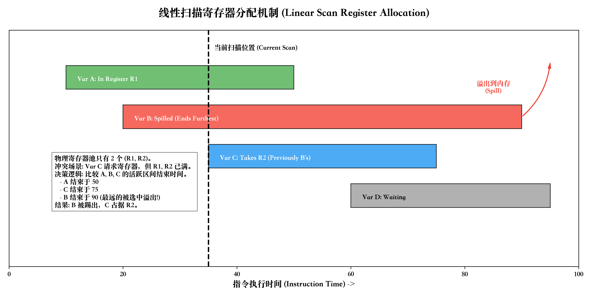

## 寄存器分配概览

ART 的优化器（dex2oat / JIT）里，寄存器分配采用 **SSA 上的线性扫描（Linear Scan on SSA Form）** 这一套路：  
先在 SSA 图上做活性分析，构建 LiveInterval，再在线性顺序上做扫描分配，最后在 “Resolve” 阶段把 SSA 形式拆解掉，把寄存器/栈槽信息回填进每条指令。  

在实现上主要有三个角色：

- `SsaLivenessAnalysis`：负责活性分析 / 计算 lifetime position；  
- `RegisterAllocatorLinearScan`：真正的线性扫描分配器，构建 & 分配 LiveInterval；  
- `RegisterAllocationResolver`：在 CFG 上插入 move、布置 spill slot、填充 `LocationSummary`。  

整个过程可以粗略分成两大步：

1. **线性扫描分配**：构建活跃区间，分配物理寄存器 / 记录需要 spill 的 interval。
2. **结果回填（Resolve）**：根据分配结果确定栈布局，插 parallel move，修正每条指令的 `LocationSummary`。

---

## 线性扫描



线性扫描（Linear Scan）按“程序执行顺序”处理活跃区间，典型实现维护四个集合：  

- `unhandled`：还没处理的区间；
- `active`：当前指令位置上 **持续活跃** 的区间（覆盖当前位置，没有 lifetime hole）；
- `inactive`：当前指令位置上 **暂时不活跃** 的区间（有 lifetime hole）；
- `handled`：已经完全结束的区间。

处理下一个区间 `current` 时，大致步骤：

1. **更新 active / inactive**  
   - 把已经结束的 active 区间移到 `handled`；  
   - 对有 lifetime hole 的 active 区间，转到 `inactive`；  
   - 对 inactive 里在当前位置已经结束的移到 `handled`，重新变得活跃的移回 `active`。

2. **尝试分配寄存器**
   - `TryAllocateFreeReg(current)`：  
     计算每个物理寄存器的 “free until” 位置，如果有寄存器在 `current` 的整个活跃区间内都空闲，就直接分配给它。  

3. **没有空闲寄存器时的牺牲者选择**
   - `AllocateBlockedReg(current)`：  
     选择一个寄存器上的 “牺牲者 interval”，比较 **下次使用位置**：
       - 如果某个 active/inactive 的下次使用比 `current` 晚，很“冷”，就把它 split + spill，寄存器让给 `current`；
       - 如果所有已占用区间都比 `current` 更“热”，说明 `current` 比较鸡肋，就把 `current` 自己 spill。

在 SSA 形式上做线性扫描，配合好解 SSA 的 “Resolve” 阶段，可以避免单独的 SSA 解构数据流分析，其实就是 Wimmer 论文那一套思路。  

---

## dex2oat 实现结构

### 总体流程图

```mermaid
flowchart TD

  subgraph Liveness[活性分析]
    A[SsaLivenessAnalysis::Analyze<br/>构建 SSA live ranges / live-in 集]
  end

  subgraph LSRA[线性扫描寄存器分配（Linear Scan）]
    B[RegisterAllocatorLinearScan::AllocateRegisters]

    B --> B1[AllocateRegistersInternal<br/>倒序遍历基本块/指令<br/>构建 LiveInterval & safepoints & temp_intervals]
    B1 --> B2[LinearScan<br/>核心线性扫描循环]
    B2 --> B3[TryAllocateFreeReg<br/>尝试找空闲寄存器]
    B3 -->|失败| B4[AllocateBlockedReg<br/>选择牺牲者并 Split / Spill<br/>内部会调用 AllocateSpillSlotFor...]
    B3 -->|成功| B5[激活 current interval<br/>active_ += current]
    B4 --> B5
  end

  subgraph Resolver[RegisterAllocationResolver]
    C[RegisterAllocationResolver::Resolve]

    C --> C1[UpdateSafepointLiveRegisters<br/>标记 safepoint 上 live 的寄存器]
    C --> C2[CalculateMaximumSafepointSpillSize<br/>计算慢路径 spill 需要的大小]
    C --> C3[根据类型重新布置 spill slot<br/>参数/当前方法/catch-phi/普通值]
    C3 --> C4[ConnectSiblings<br/>同一 SSA 值各个 sibling 衔接<br/>补 input/env/safepoint 位置信息]
    C4 --> C5[ConnectSplitSiblings<br/>跨基本块的 split interval<br/>插入并行 move]
    C5 --> C6[Phi 输入修正<br/>InsertParallelMoveAtExitOf]
    C6 --> C7[Resolve temp locations<br/>给 temps 填最终 Location]
  end

  A --> B
  B --> C
````


---

## 活性分析：SsaLivenessAnalysis::Analyze

入口是 `SsaLivenessAnalysis::Analyze()`，作用大致是：

* 给每个指令 / 基本块分配 **lifetime position**（偶数给指令，奇数给边），方便做 interval 计算；
* 为每个 SSA 值构建 `LiveInterval`：

  * 起始位置：定义点；
  * 终止位置：最后一次使用；
  * 中间可能有多个 `LiveRange` + lifetime hole；
* 把 **normal use / environment use / safepoint use** 等不同用途以 `UsePosition` / `EnvUsePosition` 的形式挂到 interval 上；
>  - normal use = 指令真的在算这个值（普通输入）；
>  - environment use “只在环境里需要、不一定影响寄存器决策”，根据类型、@DeadReferenceSafe、debuggable、OSR 等因素决定要不要真的延长 live range。
>  - safepoint use “在某些指令上 这个值依然 live，GC 需要看见它”
* 计算每个基本块的 `live_in` 集合，用于:

  * catch block / irreducible loop header 强制 spill（实现简单）；
  * 在 Resolver 里为跨基本块的 split siblings 插入 move。


---

## 线性扫描分配：RegisterAllocatorLinearScan

### 顶层入口：AllocateRegisters

`RegisterAllocatorLinearScan` 实现了基类 `RegisterAllocator` 的接口，主要入口是：

```cpp
void RegisterAllocatorLinearScan::AllocateRegisters() {
  AllocateRegistersInternal();
  RegisterAllocationResolver(codegen_, liveness_)
      .Resolve(ArrayRef<HInstruction* const>(safepoints_),
               reserved_out_slots_,
               int_spill_slots_.size(),
               long_spill_slots_.size(),
               float_spill_slots_.size(),
               double_spill_slots_.size(),
               catch_phi_spill_slots_,
               ArrayRef<LiveInterval* const>(temp_intervals_));
  ...
}
```

可以把它看成两步：

1. `AllocateRegistersInternal()`：构建并分配 LiveInterval；
2. 构造 `RegisterAllocationResolver`，调用 `Resolve(...)` 做回填。

### 1. 构建 LiveInterval：AllocateRegistersInternal + ProcessInstruction

`AllocateRegistersInternal()` 的工作：

1. 按 **线性后序（Linear Post-Order）** 遍历基本块；
2. 对每个块：

   * 逆序遍历正常指令（`HBackwardInstructionIterator`）；
   * 再遍历 phi；
     都交给 `ProcessInstruction()` 处理；
3. 对于 catch block 和 irreducible loop header，在块开头把所有寄存器标记为 fixed & blocked：

   > 意味着这些 block 的 live-in 值会强制 spill，后续只从栈里读。

`ProcessInstruction()` 会：

* 读取指令的 `LocationSummary`：

  * 为 **temp** 生成临时 interval（`MakeTempInterval`），加入 `temp_intervals_`；
  * 对硬编码寄存器（fixed register）调用 `BlockRegister`，生成 `physical_*_register_intervals_`；
  * 收集需要 safepoint 的指令，加入 `safepoints_`；
* 最终把各种 interval 填入

  * `unhandled_core_intervals_`
  * `unhandled_fp_intervals_`。

然后：

* 对 core 寄存器：

  * `unhandled_ = &unhandled_core_intervals_`；
  * `inactive_` 预先加入所有 fixed-core interval；
  * 运行一次 `LinearScan()`。
* 清空 `active_/inactive_/handled_`。
* 对 FP 寄存器：

  * `unhandled_ = &unhandled_fp_intervals_`；
  * `inactive_` 预先加入 fixed-fp interval；
  * 再运行一次 `LinearScan()`。

### 2. 核心算法：LinearScan / TryAllocateFreeReg / AllocateBlockedReg

`LinearScan()` 的主循环基本就是教科书式实现：

```cpp
while (!unhandled_->empty()) {
  // (1) 取出 start 最小的 interval
  LiveInterval* current = unhandled_->back();
  unhandled_->pop_back();

  size_t position = current->GetStart();

  // (2) 更新 active_：死亡的丢到 handled，出现 hole 的丢到 inactive
  // (3) 更新 inactive_：死亡的丢到 handled，重新覆盖当前位置的拉回 active_

  bool success = TryAllocateFreeReg(current);
  if (!success) {
    success = AllocateBlockedReg(current);
  }

  if (success) {
    active_.push_back(current);
  } else {
    // 理论上不会失败，这里只在 Debug 下做校验
  }
}
```

* `TryAllocateFreeReg(current)`：
  利用 `active_/inactive_` 计算每个寄存器的 “下次被占用位置”，选择一个 **直到最远的 free reg** 给当前 interval。

* `AllocateBlockedReg(current)`：

  * 按寄存器枚举，看各自“最早会被谁用到”；
  * 选择 **“最不着急用”的那个寄存器** 作为候选；
  * 比较候选上已有 interval 的下次使用位置 vs `current` 的第一次使用位置：

    * 如果已有 interval 更“冷”：split + spill 这个老 interval；
    * 否则把 `current` 自己 split + spill。
  * 内部需要调用 `AllocateSpillSlotFor(interval)` 为 interval 分配一个类型匹配的 spill slot。

`AllocateSpillSlotFor()` 里会根据 `interval->GetType()` 和 `NumberOfSpillSlotsNeeded()` 决定：

* int/ref / bool / short 等 → `int_spill_slots_`；
* float / double / long → 对应各自的 typed spill vector；
* catch phi 单独放在 `catch_phi_spill_slots_` 区域；
* 参数 / 当前方法 / 常量 有各自特殊规则（比如参数用 caller 给定的位置、常量通常不需要 spill）。

此时，所有 interval 已经带上了：

* 是否有寄存器；
* 是否需要 spill；
* parent interval 对应的 spill slot 索引（但还没转成最终的栈偏移）。

---

## 位置回填 / 修正：RegisterAllocationResolver::Resolve

线性扫描完成后，`RegisterAllocatorLinearScan::AllocateRegisters()` 会构造一个 `RegisterAllocationResolver`，调用：

```cpp
RegisterAllocationResolver(codegen_, liveness_).Resolve(
    safepoints_,
    reserved_out_slots_,
    int_spill_slots_.size(),
    long_spill_slots_.size(),
    float_spill_slots_.size(),
    double_spill_slots_.size(),
    catch_phi_spill_slots_,
    temp_intervals_);
```

`Resolve()` 内部可以拆成几个阶段来看：

### 1. 更新 safepoint / 计算最大 slow-path spill

```cpp
UpdateSafepointLiveRegisters();
size_t maximum_safepoint_spill_size = CalculateMaximumSafepointSpillSize(safepoints);
codegen_->InitializeCodeGeneration(...);
```

* `UpdateSafepointLiveRegisters()`：把所有在 safepoint 上仍在寄存器里的 interval 标记到对应 `LocationSummary`，后面 GC 根枚举要用。
* `CalculateMaximumSafepointSpillSize()`：只看 “只在 slow path 调用的 safepoint”，估算慢路径上额外需要 spill 的寄存器数目。
* `InitializeCodeGeneration()`：
  根据 spill slot 个数 + safepoint spill + out slots 等，确定最终 frame 布局和 stack mask。

### 2. 布置 spill slot & 输出位置（Out）

对每个 SSA 值 `instruction`：

1. 特殊处理：

   * 参数 (`IsParameterValue`)：现在知道 frame size 之后，把参数的 stack slot 调整到正确位置（frame 底部），并同步更新 interval 的 spill slot；
   * 当前方法 (`IsCurrentMethod`)：强制固定在 slot 0；
   * catch phi：把它们排到专用的 catch-phi spill 区域。

2. 对其余 `current->HasSpillSlot()` 的 interval，根据 **类型** 做最终布局：

   ```cpp
   // [parameter slots]
   // [art method (caller)]
   // [entry spill (core)]
   // [entry spill (float)]
   // [should_deoptimize flag]
   // [catch phi spill slots]
   // [double spill slots]
   // [long spill slots]
   // [float spill slots]
   // [int/ref values]
   // [maximum out values]
   // [art method]
   ```

   对应地修改 `current->SetSpillSlot(slot * kVRegSize)`。

3. 如果指令的 out `Location` 仍是 `Unallocated`：

   * 把 interval 的最终位置 `current->ToLocation()` 写回 `LocationSummary::Out`；
   * 处理 `kSameAsFirstInput` 等策略（如果 input 还是 Unallocated，就把 input 也同步成同一个位置）。

到这一步为止，**每个 SSA 值的 Out 位置已经变成具体的寄存器 / 栈槽**。

### 3. ConnectSiblings：同一 SSA 值的 siblings 衔接

`ConnectSiblings(interval)` 负责：

* 如果这个 SSA 值有 spill slot & register：

  * 在定义点后插一个 “spill store” move：
    从 register 到 stack slot；
* 对每个 `LiveRange` 上的 use：

  * 更新其 `LocationSummary::InAt(i)`，保证 input 的位置是 interval 在该位置的真实位置；
  * 如果期望 location 和真实 location 不一致，插入一条 move（给 `ParallelMoveResolver`）。
* 对 Env use / safepoint use 同样更新位置 / 设置 stack bit & register bit。
* 若下一段 sibling 紧接当前区间末尾，而且在寄存器中，则在 split 边界插 parallel move：
  让值从旧 register 搬到新 register / 栈。

这一步本质上就是：**把一个 SSA 值被切成的多个 sibling interval 串联起来**，保证所有 use/env/safepoint 都看到同一个逻辑值。

### 4. ConnectSplitSiblings & Phi 修正（跨基本块）

#### ConnectSplitSiblings

对所有基本块的 `live_in` 集，`ConnectSplitSiblings(interval, predecessor, block)` 会在 CFG 边上连接不同 block 上的 siblings：

* 找 `from` 块末尾位置的 sibling 与 `to` 块开头位置的 sibling；
* 如果两个 sibling 不同，并且目标 sibling 在寄存器里，就在边上插 parallel move；
* 对 irreducible loop / entry-block 常量 / current method 有一些特例：某些情况下可以依赖“在 loop 内重新 materialize”而不插 move。

#### Phi 输入修正

对每个 block 的 phi，遍历其前驱 `predecessor`：

* 在 `predecessor` 的出口插 `InsertParallelMoveAtExitOf`：

  * source：前驱里对应 input 的 interval 在该边末尾的 location；
  * destination：phi 自身 interval 的 location。

这样做的结果是：**所有 phi 的输入值都被显式搬进 phi 的最终位置**，完成 SSA 解构的一大步骤。

### 5. Resolve temp locations：填充临时寄存器/栈槽

最后，对于 `temp_intervals_`：

* 根据临时值的类型（目前主要是 `kInt32` / `kFloat64`）：

  * 为 temp 设置具体的 `Location::RegisterLocation` / `Location::FpuRegisterLocation` / `FpuRegisterPairLocation`；
* 高位 interval（high interval）由 low interval 统一处理，跳过。

至此，**每条指令的 `LocationSummary::In/Out/Temp` 都完全具体化了**，后续各架构的 `CodeGenerator*` 就只需要按照 Location 指示的寄存器/栈槽去发机器码，如果需要搬运，就交给 `ParallelMoveResolver` 生成 `mov/swap` 序列。
