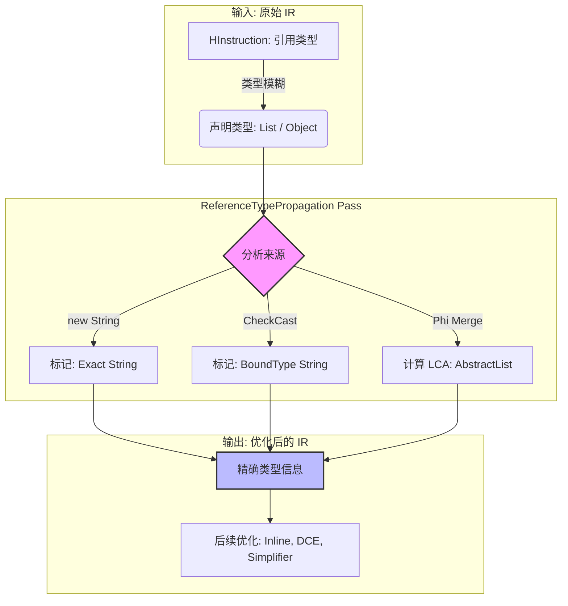
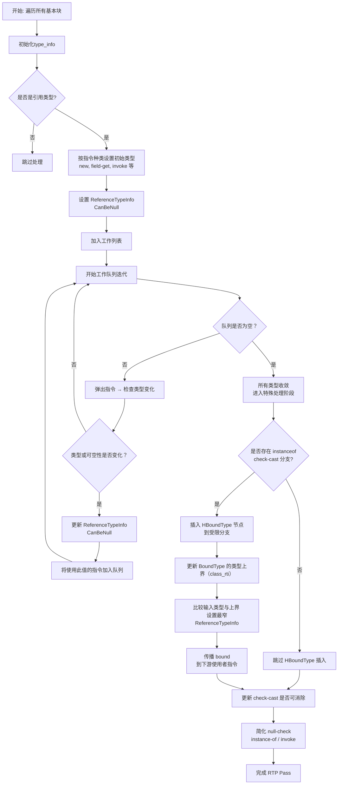
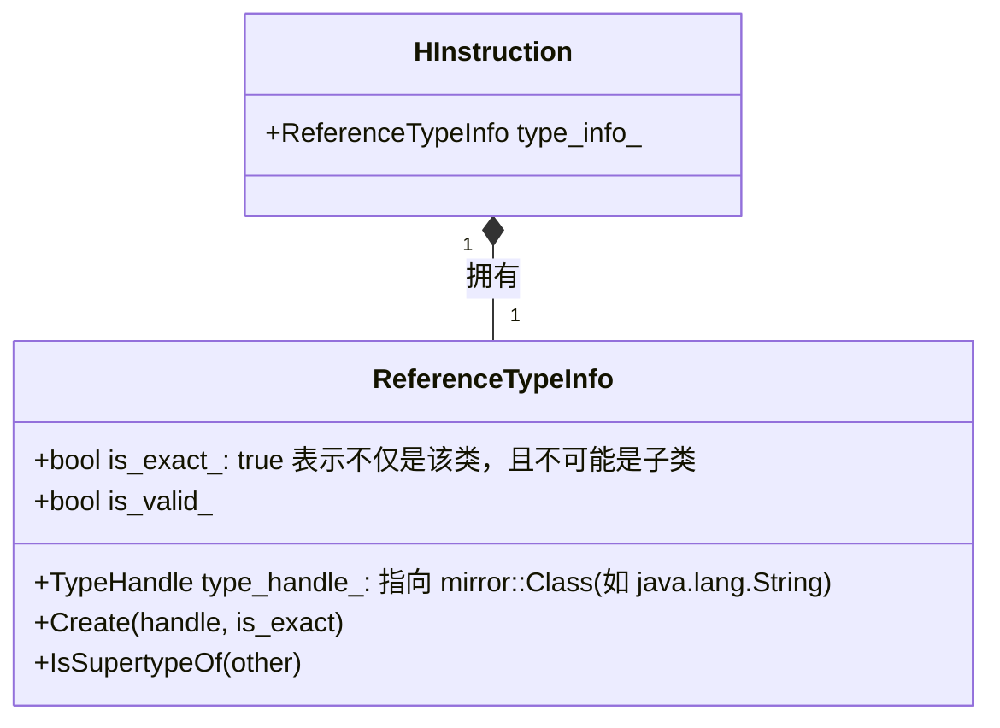
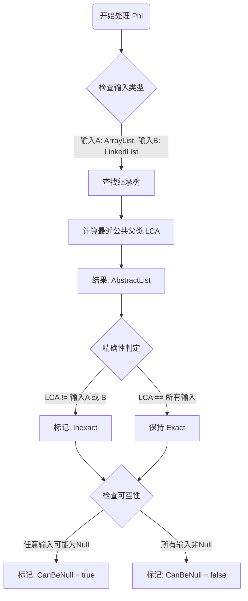
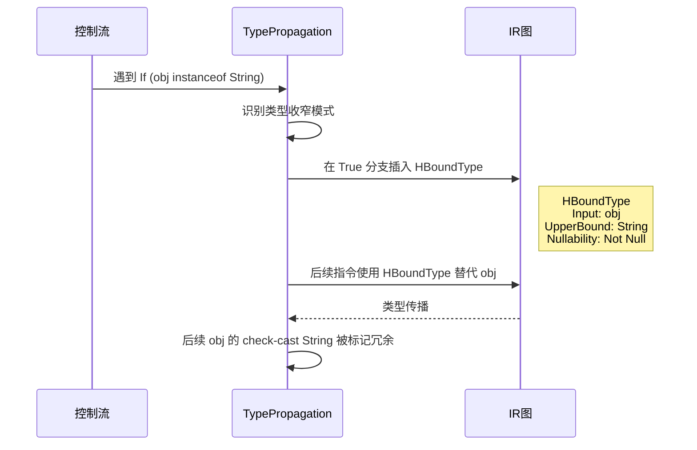
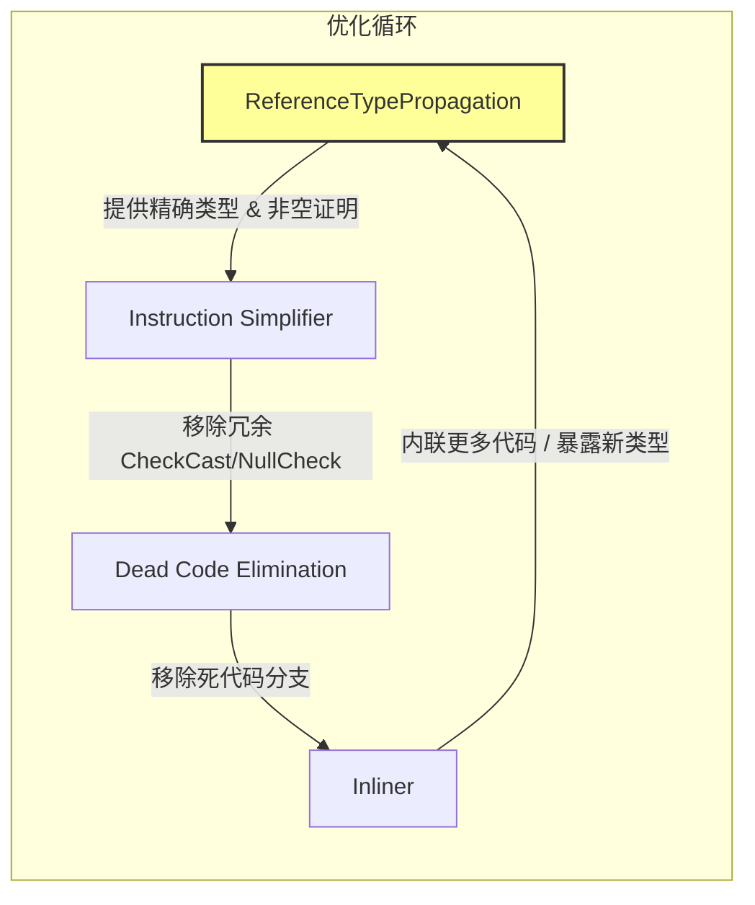

# ReferenceTypePropagation Pass 设计与分析

## 1. Pass 概述与设计目的

ReferenceTypePropagation（引用类型传播）是 Android ART 优化编译器中的核心优化阶段。它的主要作用是在中间表示（IR）中推导和传播引用类型信息，使每个引用类型（`kPrimNot`）的值都附带尽可能精确的类型描述。

在 ART 中，由于 Java 的类型擦除和多态特性，许多字节码指令最初只拥有宽泛的类型信息（如父类 `Object` 或接口 `List`）。ReferenceTypePropagation 利用类加载、分支判断和指令语义，将这些模糊类型转化为更具体的运行时类型（如 `ArrayList`）。

**核心目标：**

1. **确定类型**：推断每个引用的可能类及其精确性（Exactness）。
2. **类型收窄**：在特定控制流（如 `if (obj instanceof String)`）中插入约束节点 `HBoundType`。
3. **可空性分析**：标记值是否可能为 Null，辅助空检查消除（NullCheck Elimination）。



RTP Pass流程



---

## 2. 核心数据结构：ReferenceTypeInfo

`ReferenceTypeInfo` 是类型传播的载体，它封装了 ART 编译器对一个引用值的静态认知。



### 源码：ReferenceTypeInfo 定义

在 `reference_type_info.h` 中，我们可以看到该类如何通过 `TypeHandle`（类引用）和 `is_exact_`（精确性标记）来描述类型：

```cpp
// art/compiler/optimizing/reference_type_info.h

class ReferenceTypeInfo : ValueObject {
 public:
  using TypeHandle = Handle<mirror::Class>;

  // ... 

  // 核心成员变量
  // type_handle_: 指向具体类 (mirror::Class) 的句柄
  TypeHandle type_handle_;
  
  // is_exact_: true 表示该类型是精确的（不能是子类），false 表示可能是该类或其子类
  bool is_exact_;
};

```

---

## 3. 传播规则与算法流程

ReferenceTypePropagation 采用**基于工作列表（Worklist）的迭代算法**。Pass 遍历 IR 图，根据指令类型初始化信息，并通过数据流不断更新，直到所有指令的类型和可空性收敛。

### (a) 基础指令的类型推断

对于创建对象的指令，编译器可以推断出**精确类型**。

**示例：** `HNewInstance`
当 IR 中出现 `new String()` 时，由于这是新分配的对象，其运行时类型必然就是 `String`，不可能变成其子类。

```cpp
// art/compiler/optimizing/reference_type_propagation.cc

void ReferenceTypePropagation::RTPVisitor::VisitNewInstance(HNewInstance* instr) {
  ScopedObjectAccess soa(Thread::Current());
  // 新创建的对象类型必然是精确的，因此传入 true
  SetClassAsTypeInfo(instr, instr->GetLoadClass()->GetClass().Get(), /* is_exact= */ true);
}

```

### (b) 工作列表驱动的传播

只要指令的类型或可空性发生变化，依赖它的后续指令就会被加入重算队列。

```cpp
// art/compiler/optimizing/reference_type_propagation.cc

void ReferenceTypePropagation::RTPVisitor::ProcessWorklist() {
  while (!worklist_.empty()) {
    HInstruction* instruction = worklist_.back();
    worklist_.pop_back();
    // 分别检查 Nullability 和 ReferenceType 是否发生变化
    bool updated_nullability = UpdateNullability(instruction);
    bool updated_reference_type = UpdateReferenceTypeInfo(instruction);
    if (updated_nullability || updated_reference_type) {
      // 若有变化，将依赖该指令的后续指令（如 Phi, BoundType 等）加入工作列表
      AddDependentInstructionsToWorklist(instruction);
    }
  }
}

```

---

## 4. Phi 节点的类型合并 (LCA 算法)

Phi 节点处理控制流汇聚处的类型（例如 `if-else` 的合并点）。合并逻辑遵循“最近公共父类”（Least Common Ancestor）原则。



### 源码：MergeTypes

`MergeTypes` 函数清晰地展示了如何计算两个类型的交集：

```cpp
// art/compiler/optimizing/reference_type_propagation.cc

ReferenceTypeInfo ReferenceTypePropagation::MergeTypes(const ReferenceTypeInfo& a,
                                                       const ReferenceTypeInfo& b,
                                                       HandleCache* handle_cache) {
  // ... (省略有效性检查)

  // 1. 如果 a 是 b 的父类 (Supertype)，则合并结果宽化为 a，且不再精确
  if (a.IsSupertypeOf(b)) {
    result_type_handle = a_type_handle;
    is_exact = false;
  } 
  // 2. 反之，如果 b 是 a 的父类，结果为 b
  else if (b.IsSupertypeOf(a)) {
    result_type_handle = b_type_handle;
    is_exact = false;
  } 
  // 3. 若无直接继承关系，则计算 Common Super Class (LCA)
  else if (!a_is_interface && !b_is_interface) {
    result_type_handle =
        handle_cache->NewHandle(a_type_handle->GetCommonSuperClass(b_type_handle));
    is_exact = false;
  } 
  // 4. 接口合并复杂或无公共关系，保守回退到 java.lang.Object
  else {
    result_type_handle = handle_cache->GetObjectClassHandle();
    is_exact = false;
  }

  return ReferenceTypeInfo::Create(result_type_handle, is_exact);
}

```

---

## 5. HBoundType：类型收窄与约束

`HBoundType` 是本 Pass 的精髓之一。它并不产生运行时代码，但在 IR 中充当“类型锚点”。

**场景：** `if (obj instanceof String)`
当编译器识别出 `instanceof` 检查时，会在 True 分支插入 `HBoundType`，强制将 `obj` 的类型视为 `String`。



### 源码：插入与更新 BoundType

**1. 插入 BoundType**
`BoundTypeForIfInstanceOf` 函数展示了如何捕获 `instanceof` 的目标类型，并在分支内创建约束：

```cpp
// art/compiler/optimizing/reference_type_propagation.cc

void ReferenceTypePropagation::RTPVisitor::BoundTypeForIfInstanceOf(HBasicBlock* block) {
  // ... (省略匹配 If-InstanceOf 模式的代码)
  ReferenceTypeInfo class_rti = instanceOf->GetTargetClassRTI();
  // ...
  // 在 True 分支插入 BoundType，将对象类型限定为 instanceof 的目标类型
  BoundTypeIn(obj, instanceOfTrueBlock, /* start_instruction= */ nullptr, class_rti);
}

```

**2. 更新 BoundType (VisitBoundType)**
`VisitBoundType` 包含了一个巧妙的逻辑：它会在“输入值的现有类型”和“BoundType 的上界”之间选择**更具体**的那个：

```cpp
// art/compiler/optimizing/reference_type_propagation.cc

void ReferenceTypePropagation::RTPVisitor::VisitBoundType(HBoundType* instr) {
  ReferenceTypeInfo class_rti = instr->GetUpperBound(); // 上界（例如 instanceof String）
  HInstruction* obj = instr->InputAt(0);
  ReferenceTypeInfo obj_rti = obj->GetReferenceTypeInfo(); // 输入值的当前推断类型

  if (class_rti.IsExact()) {
    instr->SetReferenceTypeInfo(class_rti);
  } else if (obj_rti.IsValid()) {
    // 关键点：如果输入值的类型 (obj_rti) 已经是上界的子类（更具体），
    // 那么保留输入值的类型，而不是盲目使用宽泛的上界。
    // 例如：已知 obj 是 ArrayList，上界限制是 List，则结果仍是 ArrayList。
    if (class_rti.IsSupertypeOf(obj_rti)) {
      instr->SetReferenceTypeInfo(obj_rti);
    } else {
      // 否则，使用上界作为类型，并标记为非精确
      instr->SetReferenceTypeInfo(
          ReferenceTypeInfo::Create(class_rti.GetTypeHandle(), /* is_exact= */ false));
    }
  }
}

```

---

## 注意 ReferenceTypePropagation Pass 不会主动更新某些HIR指令的类型字段

ReferenceTypePropagation Pass **不会主动更新某些HIR指令的类型字段（如Phi、IfEq/IfEqz/IfNe/IfNez等）**，即使它们的输入值被确定为引用类型。在HIR构建阶段，这些指令的操作数类型（如对 `null` 的判断）默认会设为 `kInt32`，而RTP并不会修改这些字段的原始类型声明。

### RTP 是否更新 `HInstruction` 的 `type_` 字段？

在 `reference_type_propagation.cc` 中，RTP Pass 的作用是：

* 为引用类型（`kPrimNot`）的指令设置 `ReferenceTypeInfo`；
* 传播 `CanBeNull` 标志；
* **不会更改指令的 `type_` 字段**，即：
  * `instr->SetType(...)` 不会出现在 RTP 中；
  * 类型字段是在 SSA 构建器中初始决定的。

## 7. 协同优化机制

ReferenceTypePropagation 与其他 Pass 形成了一个优化闭环：



1. **Instruction Simplifier**: 利用 RTP 的 `is_exact` 将 `instanceof` 替换为常量；利用 `CanBeNull=false` 移除 `HNullCheck`。
2. **Inliner / Devirtualization**: 如果 RTP 证明某对象是 `Exact String`，则方法调用可直接绑定，无需虚表查找。
3. **安全性**: 在编译期验证类型一致性，作为静态分析手段保障代码健壮性。

通过上述机制，ReferenceTypePropagation 极大地消除了 Java 语言动态特性带来的运行时开销，是 ART 编译器高性能的关键保障。
