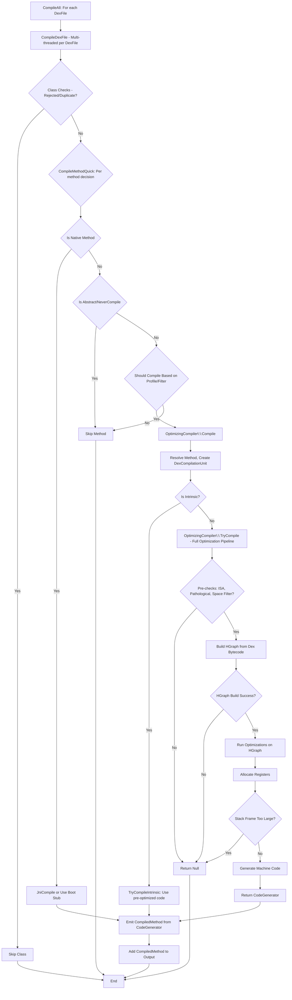
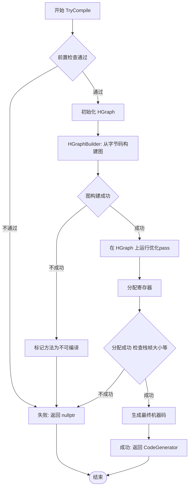

## TL;DR

在dex2oat流程中，`CompileAll`负责实际的编译行为，流程如下：



### `CompileAll` & `CompileDexFile` (多线程文件/类级别)

- `CompileAll` 负责遍历所有的 DEX 文件。
- `CompileDexFile` 会使用多线程处理单个 `.dex` 文件。
它通过一个 `ParallelCompilationManager` 协调并发，并为每个类定义分发一个编译任务。
重要检查： 在此阶段，会跳过已被验证失败的类和重复的类定义（ART 只会加载第一个遇到的版本）。
最终，每个方法都会调用 `CompileMethodQuick` 进行实际的方法级编译。

### `CompileMethodQuick` (方法级决策中心)

这是一个决策函数，根据方法的属性（JNI、抽象、被 `@NeverCompile` 注解）和编译器配置（如 PGO 信息），决定是否以及如何编译该方法。

- JNI 方法： 可能会复用启动镜像中的 JNI 桩，或通过 `JniCompile` 生成 JNI 机器码。

- 抽象方法/ `@NeverCompile` 方法： 直接跳过编译。

- 普通 Java 方法： 结合编译器过滤器和 Profile-Guided Optimization (PGO) 数据（如果可用），判断是否应该进行优化编译。如果决定编译，则会调用 `OptimizingCompiler::Compile`。

### `OptimizingCompiler::Compile` (核心优化编译流水线)

这是真正将 Dalvik 字节码转换为高度优化机器码的入口。

- 准备阶段： 创建 `DexCompilationUnit` 封装方法信息，并切换线程状态到 kNative 以避免阻塞 GC。
- Intrinsic 快速通道： 尝试将方法识别为 Intrinsic（例如 `System.arraycopy`），并使用预编译的、高性能的机器码，绕过复杂编译流程。
- TryCompile 常规通道： 如果不是 Intrinsic，则调用 TryCompile 启动完整的优化编译流水线。
- Emit 收尾： 将 `TryCompile` 生成的机器码、栈映射等信息打包成 `CompiledMethod` 对象，这是最终的编译产物，可写入 .oat 文件。

### `OptimizingCompiler::TryCompile` (HGraph核心优化)

这是进行实际优化和代码生成的函数，专注于单个方法的编译。

1. 前置检查： 检查指令集支持、方法是否是“病态情况”（过大或复杂）、以及是否受“空间过滤器”限制。
2. HGraph 构建： 将 DEX 字节码转换为 HGraph，这是 ART 编译器的中间表示（IR），一个控制流图。如果构建失败，则中止。
3. 优化 Pass： 在 HGraph 上运行一系列优化 Pass（如 Dead Code Elimination, Inlining, Loop Optimizations 等）。
4. 寄存器分配： 将 IR 中的值映射到目标硬件寄存器。
5. 代码生成： 使用 CodeGenerator 将优化后的 HGraph 转换为目标架构的机器码。
6. 栈帧检查： 确保生成的栈帧大小未超出限制。
7. 返回 CodeGenerator，其包含了生成的机器码。

## CompileDexFile

`CompileAll`函数中对每一个DexFile的编译，实际上从`CompileDexFile`开始。它的主要任务是接收一个 `.dex`文件，并使用**多线程**将其中的所有类和方法编译成本地机器码。

```cpp
template <typename CompileFn>
static void CompileDexFile(CompilerDriver* driver,
                           jobject class_loader,
                           const DexFile& dex_file,
                           ThreadPool* thread_pool,
                           size_t thread_count,
                           TimingLogger* timings,
                           const char* timing_name,
                           CompileFn compile_fn) {
  TimingLogger::ScopedTiming t(timing_name, timings);
  // 创建一个并行编译的上下文管理器。这个对象很方便，
  // 它把 driver、class_loader 等多个需要在线程间共享的变量打包在一起，
  // 避免了向 Lambda 表达式传递一大堆参数。
  ParallelCompilationManager context(Runtime::Current()->GetClassLinker(),
                                     class_loader,
                                     driver,
                                     &dex_file,
                                     thread_pool);
  const CompilerOptions& compiler_options = driver->GetCompilerOptions();

  // 处理 PGO (Profile-Guided Optimization) 信息:
  bool have_profile = (compiler_options.GetProfileCompilationInfo() != nullptr);
  bool use_profile = CompilerFilter::DependsOnProfile(compiler_options.GetCompilerFilter());
  ProfileCompilationInfo::ProfileIndexType profile_index = (have_profile && use_profile)
      ? compiler_options.GetProfileCompilationInfo()->FindDexFile(dex_file)
      : ProfileCompilationInfo::MaxProfileIndex();

  // 函数的核心逻辑被定义在一个 C++ Lambda 表达式 compile 中。
  // 这个 Lambda 的作用是编译单个类（class）。
  // 后续这个 Lambda 会被多个线程并发执行，每个线程处理不同的类。
  auto compile = [&context, &compile_fn, profile_index](size_t class_def_index) {
    const DexFile& dex_file = *context.GetDexFile();
    SCOPED_TRACE << "compile " << dex_file.GetLocation() << "@" << class_def_index;
    ClassLinker* class_linker = context.GetClassLinker();
    jobject jclass_loader = context.GetClassLoader();
    ClassReference ref(&dex_file, class_def_index);
    const dex::ClassDef& class_def = dex_file.GetClassDef(class_def_index);
    ClassAccessor accessor(dex_file, class_def_index);
    CompilerDriver* const driver = context.GetCompiler();
    // Skip compiling classes with generic verifier failures since they will still fail at runtime
    DCHECK(driver->GetVerificationResults() != nullptr);
    if (driver->GetVerificationResults()->IsClassRejected(ref)) {
      return;
    }
    // Use a scoped object access to perform to the quick SkipClass check.
    ScopedObjectAccess soa(Thread::Current());
    StackHandleScope<3> hs(soa.Self());
    Handle<mirror::ClassLoader> class_loader(
        hs.NewHandle(soa.Decode<mirror::ClassLoader>(jclass_loader)));
    Handle<mirror::Class> klass = hs.NewHandle(
        class_linker->FindClass(soa.Self(), dex_file, class_def.class_idx_, class_loader));
    Handle<mirror::DexCache> dex_cache;
    if (klass == nullptr) {
      soa.Self()->AssertPendingException();
      soa.Self()->ClearException();
      dex_cache = hs.NewHandle(class_linker->FindDexCache(soa.Self(), dex_file));
    } else if (SkipClass(jclass_loader, dex_file, klass.Get())) {
      // 一个非常重要的检查。一个应用中可能存在多个 Dex 文件，它们之间可能包含重复的类定义。
      // ART 只会加载第一个遇到的版本。这个检查就是为了避免重复编译一个已经被其他 Dex 文件加载过的类。
      // Skip a duplicate class (as the resolved class is from another, earlier dex file).
      return;  // Do not update state.
    } else {
      dex_cache = hs.NewHandle(klass->GetDexCache());
    }

    // Avoid suspension if there are no methods to compile.
    if (accessor.NumDirectMethods() + accessor.NumVirtualMethods() == 0) {
      return;
    }

    // Go to native so that we don't block GC during compilation.
    ScopedThreadSuspension sts(soa.Self(), ThreadState::kNative);

    // Compile direct and virtual methods.
    int64_t previous_method_idx = -1;
    for (const ClassAccessor::Method& method : accessor.GetMethods()) {
      const uint32_t method_idx = method.GetIndex();
      if (method_idx == previous_method_idx) {
        // smali can create dex files with two encoded_methods sharing the same method_idx
        // http://code.google.com/p/smali/issues/detail?id=119
        continue;
      }
      previous_method_idx = method_idx;
      // 对每个方法，调用最初传进来的 compile_fn 函数，将编译的具体工作委托给它。
      // 所有参数，如 driver、方法字节码、访问标志等，都会被传递过去。
      compile_fn(soa.Self(),
                 driver,
                 method.GetCodeItem(),
                 method.GetAccessFlags(),
                 class_def_index,
                 method_idx,
                 class_loader,
                 dex_file,
                 dex_cache,
                 profile_index);
    }
  };
  // ForAllLambda 会将从 0 到 dex_file.NumClassDefs() - 1 (所有类的索引) 的任务分发给 thread_pool 中的工作线程。
  // 每个工作线程会拿到一个 class_def_index，然后执行上面定义的 compile Lambda 表达式，从而实现了对整个 Dex 文件中所有类的并行编译。
  context.ForAllLambda(0, dex_file.NumClassDefs(), compile, thread_count);
}
```

实际运行编译的函数得查看运行这个函数传入的参数`compile_fn`。

```cpp
void CompilerDriver::Compile(jobject class_loader,
                             const std::vector<const DexFile*>& dex_files,
                             TimingLogger* timings) {
  if (kDebugProfileGuidedCompilation) {
    const ProfileCompilationInfo* profile_compilation_info =
        GetCompilerOptions().GetProfileCompilationInfo();
    LOG(INFO) << "[ProfileGuidedCompilation] " <<
        ((profile_compilation_info == nullptr)
            ? "null"
            : profile_compilation_info->DumpInfo(dex_files));
  }

  for (const DexFile* dex_file : dex_files) {
    CHECK(dex_file != nullptr);
    CompileDexFile(this,
                   class_loader,
                   *dex_file,
                   parallel_thread_pool_.get(),
                   parallel_thread_count_,
                   timings,
                   "Compile Dex File Quick",
                   CompileMethodQuick);
    const ArenaPool* const arena_pool = Runtime::Current()->GetArenaPool();
    const size_t arena_alloc = arena_pool->GetBytesAllocated();
    max_arena_alloc_ = std::max(arena_alloc, max_arena_alloc_);
    Runtime::Current()->ReclaimArenaPoolMemory();
  }

  VLOG(compiler) << "Compile: " << GetMemoryUsageString(false);
}
```

可以看到实际的编译方法是`CompileMethodQuick`。

## CompileMethodQuick

`CompileMethodQuick`根据方法的类型、访问标志、注解以及编译配置，决定是否以及如何编译一个具体的方法。它是一个决策中心，处理了多种情况，例如：

- 原生 JNI 方法
- 抽象方法
- 被禁止编译的方法
- 普通的 Java 方法（需要结合 Profile 文件决定是否编译）

```cpp
static void CompileMethodQuick(
    Thread* self,
    CompilerDriver* driver,
    const dex::CodeItem* code_item,
    uint32_t access_flags,
    uint16_t class_def_idx,
    uint32_t method_idx,
    Handle<mirror::ClassLoader> class_loader,
    const DexFile& dex_file,
    Handle<mirror::DexCache> dex_cache,
    ProfileCompilationInfo::ProfileIndexType profile_index) {
  // 这个 Lambda 包含了针对 "Quick" 编译器的特定编译策略。
  // 它只关心“做什么”，而不关心“怎么准备环境”。
  auto quick_fn = [profile_index]([[maybe_unused]] Thread* self,
                                  CompilerDriver* driver,
                                  const dex::CodeItem* code_item,
                                  uint32_t access_flags,
                                  uint16_t class_def_idx,
                                  uint32_t method_idx,
                                  Handle<mirror::ClassLoader> class_loader,
                                  const DexFile& dex_file,
                                  Handle<mirror::DexCache> dex_cache) {
    DCHECK(driver != nullptr);
    const VerificationResults* results = driver->GetVerificationResults();
    DCHECK(results != nullptr);
    MethodReference method_ref(&dex_file, method_idx);
    CompiledMethod* compiled_method = nullptr;
    if (results->IsUncompilableMethod(method_ref)) {
      return compiled_method;
    }

    if ((access_flags & kAccNative) != 0) {
      // Are we extracting only and have support for generic JNI down calls?
      const CompilerOptions& compiler_options = driver->GetCompilerOptions();
      if (!compiler_options.IsJniCompilationEnabled() &&
          InstructionSetHasGenericJniStub(compiler_options.GetInstructionSet())) {
        // Leaving this empty will trigger the generic JNI version
      } else {
        // Query any JNI optimization annotations such as @FastNative or @CriticalNative.
        access_flags |= annotations::GetNativeMethodAnnotationAccessFlags(
            dex_file, dex_file.GetClassDef(class_def_idx), method_idx);
        const void* boot_jni_stub = nullptr;
        if (!Runtime::Current()->GetHeap()->GetBootImageSpaces().empty()) {
          // Skip the compilation for native method if found an usable boot JNI stub.
          // 复用启动镜像中的 JNI 桩: boot image中是否已经存在一个可用的 JNI 桩。如果存在，直接复用，避免重复编译。
          ClassLinker* const class_linker = Runtime::Current()->GetClassLinker();
          std::string_view shorty = dex_file.GetMethodShortyView(dex_file.GetMethodId(method_idx));
          boot_jni_stub = class_linker->FindBootJniStub(access_flags, shorty);
        }
        if (boot_jni_stub == nullptr) {
          compiled_method =
              driver->GetCompiler()->JniCompile(access_flags, method_idx, dex_file, dex_cache);
          CHECK(compiled_method != nullptr);
        }
      }
    } else if ((access_flags & kAccAbstract) != 0) {
      // Abstract methods don't have code.
    } else if (annotations::MethodIsNeverCompile(dex_file,
                                                 dex_file.GetClassDef(class_def_idx),
                                                 method_idx)) {
      // Method is annotated with @NeverCompile and should not be compiled.
    } else {
      const CompilerOptions& compiler_options = driver->GetCompilerOptions();
      // Don't compile class initializers unless kEverything.
      bool compile = (compiler_options.GetCompilerFilter() == CompilerFilter::kEverything) ||
         ((access_flags & kAccConstructor) == 0) || ((access_flags & kAccStatic) == 0);
      // Check if we should compile based on the profile.
      compile = compile && ShouldCompileBasedOnProfile(compiler_options, profile_index, method_ref);

      if (compile) {
        // 如果 compile 标志最终为 true，则调用 driver->GetCompiler()->Compile(...)。
        // 这是真正将 Dalvik 字节码转换成机器码的地方。
        // 即使调用了 Compile，编译器也可能因为内部原因（如方法太复杂）而拒绝编译，此时会返回 nullptr。
        // NOTE: if compiler declines to compile this method, it will return null.
        compiled_method = driver->GetCompiler()->Compile(code_item,
                                                         access_flags,
                                                         class_def_idx,
                                                         method_idx,
                                                         class_loader,
                                                         dex_file,
                                                         dex_cache);
        ProfileMethodsCheck check_type = compiler_options.CheckProfiledMethodsCompiled();
        if (UNLIKELY(check_type != ProfileMethodsCheck::kNone)) {
          DCHECK(ShouldCompileBasedOnProfile(compiler_options, profile_index, method_ref));
          bool violation = (compiled_method == nullptr);
          if (violation) {
            std::ostringstream oss;
            oss << "Failed to compile "
                << method_ref.dex_file->PrettyMethod(method_ref.index)
                << "[" << method_ref.dex_file->GetLocation() << "]"
                << " as expected by profile";
            switch (check_type) {
              case ProfileMethodsCheck::kNone:
                break;
              case ProfileMethodsCheck::kLog:
                LOG(ERROR) << oss.str();
                break;
              case ProfileMethodsCheck::kAbort:
                LOG(FATAL_WITHOUT_ABORT) << oss.str();
                _exit(1);
            }
          }
        }
      }
    }
    return compiled_method;
  };
  // 与通用的执行框架 CompileMethodHarness 分离
  CompileMethodHarness(self,
                       driver,
                       code_item,
                       access_flags,
                       class_def_idx,
                       method_idx,
                       class_loader,
                       dex_file,
                       dex_cache,
                       quick_fn);
}
```

## OptimizingCompiler::Compile

1. 准备阶段
2. 快速通道：尝试将方法识别为 `Intrinsic` 并直接使用预置的高性能代码。
3. 常规通道：如果不是 `Intrinsic`，则启动完整的、包含多阶段优化的 编译流水线 (`TryCompile`)。
4. 收尾阶段：将生成的代码和元数据 `Emit` 成最终产品 `CompiledMethod`。

```cpp
CompiledMethod* OptimizingCompiler::Compile(const dex::CodeItem* code_item,
                                            uint32_t access_flags,
                                            uint16_t class_def_idx,
                                            uint32_t method_idx,
                                            Handle<mirror::ClassLoader> jclass_loader,
                                            const DexFile& dex_file,
                                            Handle<mirror::DexCache> dex_cache) const {
  const CompilerOptions& compiler_options = GetCompilerOptions();
  DCHECK(compiler_options.IsAotCompiler());
  CompiledMethod* compiled_method = nullptr;
  Runtime* runtime = Runtime::Current();
  DCHECK(runtime->IsAotCompiler());
  ArenaAllocator allocator(runtime->GetArenaPool());
  ArenaStack arena_stack(runtime->GetArenaPool());
  std::unique_ptr<CodeGenerator> codegen;
  bool compiled_intrinsic = false;
  {
    ScopedObjectAccess soa(Thread::Current());
    ArtMethod* method =
        runtime->GetClassLinker()->ResolveMethodId(method_idx, dex_cache, jclass_loader);
    soa.Self()->ClearException();  // Suppress exception if any.
    VariableSizedHandleScope handles(soa.Self());
    Handle<mirror::Class> compiling_class =
        handles.NewHandle(method != nullptr ? method->GetDeclaringClass() : nullptr);
    // 创建一个“编译单元”对象。这就像是为要编译的方法建立一个档案袋，把所有相关信息（类加载器、dex 文件、字节码、访问标志等）都打包在一起，方便后续传递。 
    DexCompilationUnit dex_compilation_unit(
        jclass_loader,
        runtime->GetClassLinker(),
        dex_file,
        code_item,
        class_def_idx,
        method_idx,
        access_flags,
        /*verified_method=*/ nullptr,  // Not needed by the Optimizing compiler.
        dex_cache,
        compiling_class);
    // All signature polymorphic methods are native.
    DCHECK(method == nullptr || !method->IsSignaturePolymorphic());
    // Go to native so that we don't block GC during compilation.
    // 将当前线程切换到 kNative 状态，以避免在长时间的编译过程中阻塞 GC
    ScopedThreadSuspension sts(soa.Self(), ThreadState::kNative);
    // Try to compile a fully intrinsified implementation.
    if (method != nullptr && UNLIKELY(method->IsIntrinsic())) {
      DCHECK(compiler_options.IsBootImage());
      // 如果是 Intrinsic 方法，编译器会尝试直接使用预置的、优化的机器码，完全绕过复杂的编译流程。
      // 如果成功，codegen 对象就会被赋值，编译过程可以提前结束。
      codegen.reset(
          TryCompileIntrinsic(&allocator,
                              &arena_stack,
                              dex_compilation_unit,
                              method,
                              &handles));
      if (codegen != nullptr) {
        compiled_intrinsic = true;
      }
    }
    if (codegen == nullptr) {
      codegen.reset(
          TryCompile(&allocator,
                     &arena_stack,
                     dex_compilation_unit,
                     method,
                     compiler_options.IsBaseline()
                        ? CompilationKind::kBaseline
                        : CompilationKind::kOptimized,
                     &handles));
    }
  }
  if (codegen.get() != nullptr) {
    // Emit 函数负责将这些结果（包括机器码、栈映射信息、调试信息等）打包成一个标准的 CompiledMethod 对象。
    // 这个对象就是最终的产物，可以被保存到 .oat 文件中。
    compiled_method = Emit(&allocator,
                           codegen.get(),
                           compiled_intrinsic,
                           compiled_intrinsic ? nullptr : code_item);

    if (kArenaAllocatorCountAllocations) {
      codegen.reset();  // Release codegen's ScopedArenaAllocator for memory accounting.
      size_t total_allocated = allocator.BytesAllocated() + arena_stack.PeakBytesAllocated();
      if (total_allocated > kArenaAllocatorMemoryReportThreshold) {
        MemStats mem_stats(allocator.GetMemStats());
        MemStats peak_stats(arena_stack.GetPeakStats());
        LOG(INFO) << "Used " << total_allocated << " bytes of arena memory for compiling "
                  << dex_file.PrettyMethod(method_idx)
                  << "\n" << Dumpable<MemStats>(mem_stats)
                  << "\n" << Dumpable<MemStats>(peak_stats);
      }
    }
  }

  if (kIsDebugBuild &&
      compiler_options.CompileArtTest() &&
      IsInstructionSetSupported(compiler_options.GetInstructionSet())) {
    // For testing purposes, we put a special marker on method names
    // that should be compiled with this compiler (when the
    // instruction set is supported). This makes sure we're not
    // regressing.
    std::string method_name = dex_file.PrettyMethod(method_idx);
    bool shouldCompile = method_name.find("$opt$") != std::string::npos;
    DCHECK_IMPLIES(compiled_method == nullptr, !shouldCompile) << "Didn't compile " << method_name;
  }

  return compiled_method;
}
```

## TryCompile

整体流程如下：



前置检查主要包括：

- 指令集支持: `IsInstructionSetSupported(instruction_set)` 检查当前硬件架构（如 ARM64）是否被编译器支持。
- Pathological Case: `Compiler::IsPathologicalCase(...)` 检查方法的字节码是否过过大，指令总数和寄存器总数
- 空间优化过滤器: `CompilerFilter::kSpace`。如果编译策略是优先考虑应用大小（而不是性能），这里会拒绝编译那些字节码体积过大的方法，因为它们的机器码可能会更大，从而增加安装包体积。

```cpp
CodeGenerator* OptimizingCompiler::TryCompile(ArenaAllocator* allocator,
                                              ArenaStack* arena_stack,
                                              const DexCompilationUnit& dex_compilation_unit,
                                              ArtMethod* method,
                                              CompilationKind compilation_kind,
                                              VariableSizedHandleScope* handles) const {
  // 尝试记录字节码编译统计信息
  MaybeRecordStat(compilation_stats_.get(), MethodCompilationStat::kAttemptBytecodeCompilation);
  const CompilerOptions& compiler_options = GetCompilerOptions();
  InstructionSet instruction_set = compiler_options.GetInstructionSet();
  const DexFile& dex_file = *dex_compilation_unit.GetDexFile();
  uint32_t method_idx = dex_compilation_unit.GetDexMethodIndex();
  const dex::CodeItem* code_item = dex_compilation_unit.GetCodeItem();

  // 总是使用 Thumb-2 汇编器：某些运行时功能（如隐式栈溢出检查）假设是 Thumb-2。
  // 注意：此处断言 ARM 指令集不等于 Thumb-2（因为 ARM 指令集已弃用，总是使用 Thumb-2）。
  DCHECK_NE(instruction_set, InstructionSet::kArm);

  // 不支持的架构不尝试编译。
  if (!IsInstructionSetSupported(instruction_set)) {
    // 记录不支持 ISA 的编译统计信息
    MaybeRecordStat(compilation_stats_.get(),
                    MethodCompilationStat::kNotCompiledUnsupportedIsa);
    return nullptr;
  }

  // 如果方法过大，则不编译。
  if (Compiler::IsPathologicalCase(*code_item, method_idx, dex_file)) {
    SCOPED_TRACE << "Not compiling because of pathological case"; // 跟踪日志
    // 记录病态情况未编译统计信息
    MaybeRecordStat(compilation_stats_.get(), MethodCompilationStat::kNotCompiledPathological);
    return nullptr;
  }

  // 空间过滤器实现：如果 code item 的代码单元大小超过 128，则不编译。
  static constexpr size_t kSpaceFilterOptimizingThreshold = 128;
  if ((compiler_options.GetCompilerFilter() == CompilerFilter::kSpace)
      && (CodeItemInstructionAccessor(dex_file, code_item).InsnsSizeInCodeUnits() >
          kSpaceFilterOptimizingThreshold)) {
    SCOPED_TRACE << "Not compiling because of space filter"; // 跟踪日志
    // 记录空间过滤器未编译统计信息
    MaybeRecordStat(compilation_stats_.get(), MethodCompilationStat::kNotCompiledSpaceFilter);
    return nullptr;
  }

  // 获取 CodeItem 的调试信息访问器。
  CodeItemDebugInfoAccessor code_item_accessor(dex_file, code_item, method_idx);

  bool dead_reference_safe;
  // 对于 AOT 编译，可能得不到方法，例如如果其类出错，可能是因为超类不可用。
  // JIT 应该总是有一个方法。
  DCHECK(Runtime::Current()->IsAotCompiler() || method != nullptr);
  if (method != nullptr) {
    const dex::ClassDef* containing_class;
    {
      ScopedObjectAccess soa(Thread::Current()); // 确保对 ArtMethod 的安全访问
      containing_class = &method->GetClassDef();
    }
    // MethodContainsRSensitiveAccess 目前很慢，但 HasDeadReferenceSafeAnnotation()
    // 目前很少为 true。
    // 判断方法是否为“死引用安全”，这与GC相关。
    dead_reference_safe =
        annotations::HasDeadReferenceSafeAnnotation(dex_file, *containing_class)
        && !annotations::MethodContainsRSensitiveAccess(dex_file, *containing_class, method_idx);
  } else {
    // 如果无法解析类，则保守地假定它是死引用不安全的。
    dead_reference_safe = false;
  }

  // 创建 HGraph （HIR）。
  HGraph* graph = new (allocator) HGraph(
      allocator,
      arena_stack,
      handles,
      dex_file,
      method_idx,
      compiler_options.GetInstructionSet(),
      kInvalidInvokeType, // 初始的调用类型无效
      dead_reference_safe,
      compiler_options.GetDebuggable(),
      compilation_kind);

  // 如果方法不为空，设置 HGraph 中的 ArtMethod。
  if (method != nullptr) {
    graph->SetArtMethod(method);
  }

  // 如果存在 JIT 运行时，则获取该方法的性能分析信息。
  jit::Jit* jit = Runtime::Current()->GetJit();
  if (jit != nullptr) {
    ProfilingInfo* info = jit->GetCodeCache()->GetProfilingInfo(method, Thread::Current());
    graph->SetProfilingInfo(info);
  }

  // 创建 CodeGenerator，负责将 IR 转换为机器码。
  std::unique_ptr<CodeGenerator> codegen(
      CodeGenerator::Create(graph,
                            compiler_options,
                            compilation_stats_.get()));
  if (codegen.get() == nullptr) {
    // 记录没有 CodeGenerator 的未编译统计信息
    MaybeRecordStat(compilation_stats_.get(), MethodCompilationStat::kNotCompiledNoCodegen);
    return nullptr;
  }
  // 根据编译器选项设置 CFI（Call Frame Information）是否启用。
  codegen->GetAssembler()->cfi().SetEnabled(compiler_options.GenerateAnyDebugInfo());

  // 创建 PassObserver，用于观察编译过程中的各个 Pass。
  PassObserver pass_observer(graph,
                             codegen.get(),
                             visualizer_output_.get(),
                             compiler_options);

  {
    // 记录构建 HGraph 的日志
    VLOG(compiler) << "Building " << pass_observer.GetMethodName();
    // 作用域用于跟踪 HGraphBuilder 的 Pass。
    PassScope scope(HGraphBuilder::kBuilderPassName, &pass_observer);
    // 创建 HGraphBuilder，从 DEX 字节码构建 HGraph。
    HGraphBuilder builder(graph,
                          code_item_accessor,
                          &dex_compilation_unit,
                          &dex_compilation_unit,
                          codegen.get(),
                          compilation_stats_.get());
    // 执行图构建。
    GraphAnalysisResult result = builder.BuildGraph();
    if (result != kAnalysisSuccess) {
      // 如果图构建失败，则不再尝试编译此方法。
      if (method != nullptr) {
        ScopedObjectAccess soa(Thread::Current());
        method->SetDontCompile(); // 设置方法不编译标记
      }
      SCOPED_TRACE << "Not compiling because of " << result; // 跟踪日志
      // 根据不同的失败原因记录统计信息。
      switch (result) {
        case kAnalysisSkipped: {
          MaybeRecordStat(compilation_stats_.get(),
                          MethodCompilationStat::kNotCompiledSkipped);
          break;
        }
        case kAnalysisInvalidBytecode: {
          MaybeRecordStat(compilation_stats_.get(),
                          MethodCompilationStat::kNotCompiledInvalidBytecode);
          break;
        }
        case kAnalysisFailThrowCatchLoop: {
          MaybeRecordStat(compilation_stats_.get(),
                          MethodCompilationStat::kNotCompiledThrowCatchLoop);
          break;
        }
        case kAnalysisFailAmbiguousArrayOp: {
          MaybeRecordStat(compilation_stats_.get(),
                          MethodCompilationStat::kNotCompiledAmbiguousArrayOp);
          break;
        }
        case kAnalysisFailIrreducibleLoopAndStringInit: {
          MaybeRecordStat(compilation_stats_.get(),
                          MethodCompilationStat::kNotCompiledIrreducibleLoopAndStringInit);
          break;
        }
        case kAnalysisFailPhiEquivalentInOsr: {
          MaybeRecordStat(compilation_stats_.get(),
                          MethodCompilationStat::kNotCompiledPhiEquivalentInOsr);
          break;
        }
        case kAnalysisSuccess:
          LOG(FATAL) << "Unreachable"; // 成功不应该出现在这里
          UNREACHABLE();
      }
      pass_observer.SetGraphInBadState(); // 设置 HGraph 处于错误状态
      return nullptr;
    }
  }

  // 根据编译类型运行不同的优化 Pass。
  if (compilation_kind == CompilationKind::kBaseline && compiler_options.ProfileBranches()) {
    graph->SetUsefulOptimizing();
    RunRequiredPasses(graph, codegen.get(), dex_compilation_unit, &pass_observer);
  } else {
    // 运行主要的优化 Pass。
    RunOptimizations(graph, codegen.get(), dex_compilation_unit, &pass_observer);
    // 运行 WriteBarrierElimination Pass。
    PassScope scope(WriteBarrierElimination::kWBEPassName, &pass_observer);
    WriteBarrierElimination(graph, compilation_stats_.get()).Run();
  }

  // 如果是基线编译，且尚未创建性能分析信息，则现在创建。
  if (jit != nullptr &&
      compilation_kind == CompilationKind::kBaseline &&
      graph->IsUsefulOptimizing() &&
      graph->GetProfilingInfo() == nullptr) {
    // 创建并运行 ProfilingInfoBuilder。
    ProfilingInfoBuilder(
        graph, codegen->GetCompilerOptions(), codegen.get(), compilation_stats_.get()).Run();
    // 我们期望创建并附加一个性能分析信息到图中。
    // 但是，如果尝试创建时内存不足，则中止编译。
    if (graph->GetProfilingInfo() == nullptr) {
      SCOPED_TRACE << "Not compiling because of out of memory"; // 跟踪日志
      MaybeRecordStat(compilation_stats_.get(), MethodCompilationStat::kJitOutOfMemoryForCommit);
      return nullptr;
    }
  }

  // 分配寄存器。
  AllocateRegisters(graph,
                    codegen.get(),
                    &pass_observer,
                    compilation_stats_.get());

  // 检查栈帧大小是否超过最大限制。
  if (UNLIKELY(codegen->GetFrameSize() > codegen->GetMaximumFrameSize())) {
    SCOPED_TRACE << "Not compiling because of stack frame too large"; // 跟踪日志
    LOG(WARNING) << "Stack frame size is " << codegen->GetFrameSize()
                 << " which is larger than the maximum of " << codegen->GetMaximumFrameSize()
                 << " bytes. Method: " << graph->PrettyMethod();
    // 记录栈帧过大未编译统计信息
    MaybeRecordStat(compilation_stats_.get(), MethodCompilationStat::kNotCompiledFrameTooBig);
    return nullptr;
  }

  // 执行最终的编译（生成机器码）。
  codegen->Compile();
  // 输出反汇编代码（如果开启）。
  pass_observer.DumpDisassembly();

  // 记录字节码编译成功统计信息。
  MaybeRecordStat(compilation_stats_.get(), MethodCompilationStat::kCompiledBytecode);
  // 释放 CodeGenerator 的所有权并返回。
  return codegen.release();
}
```
