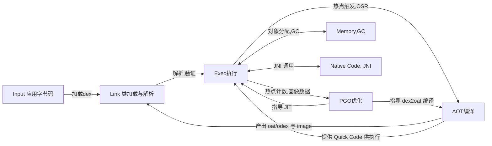
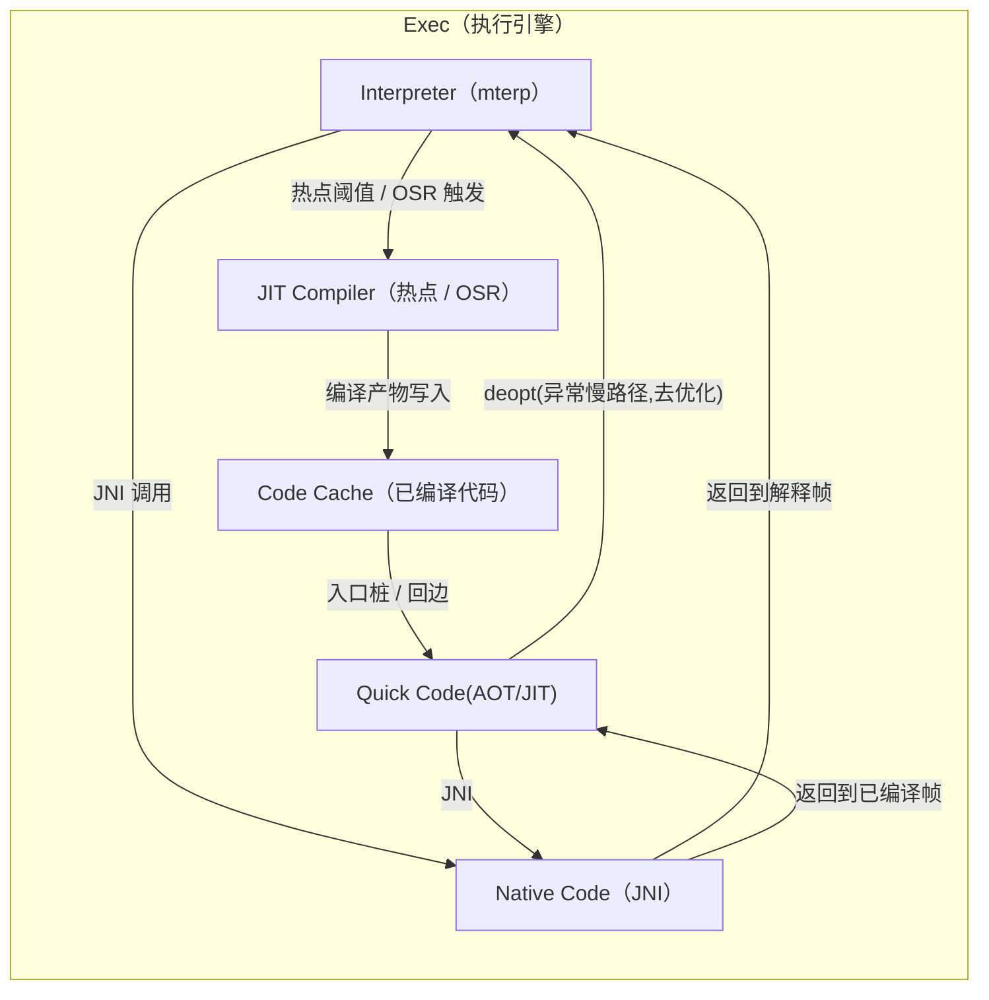
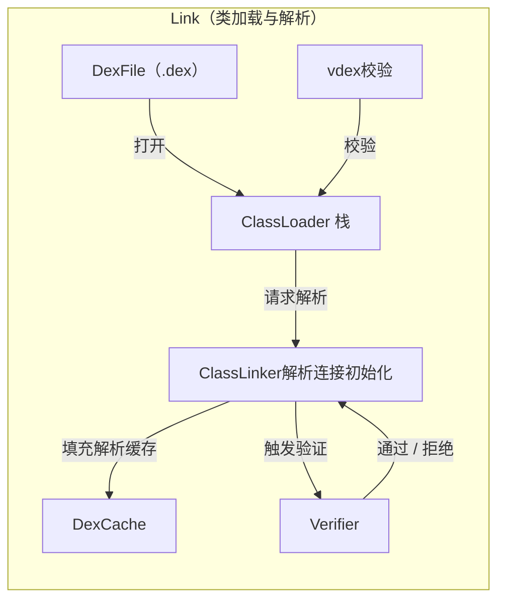
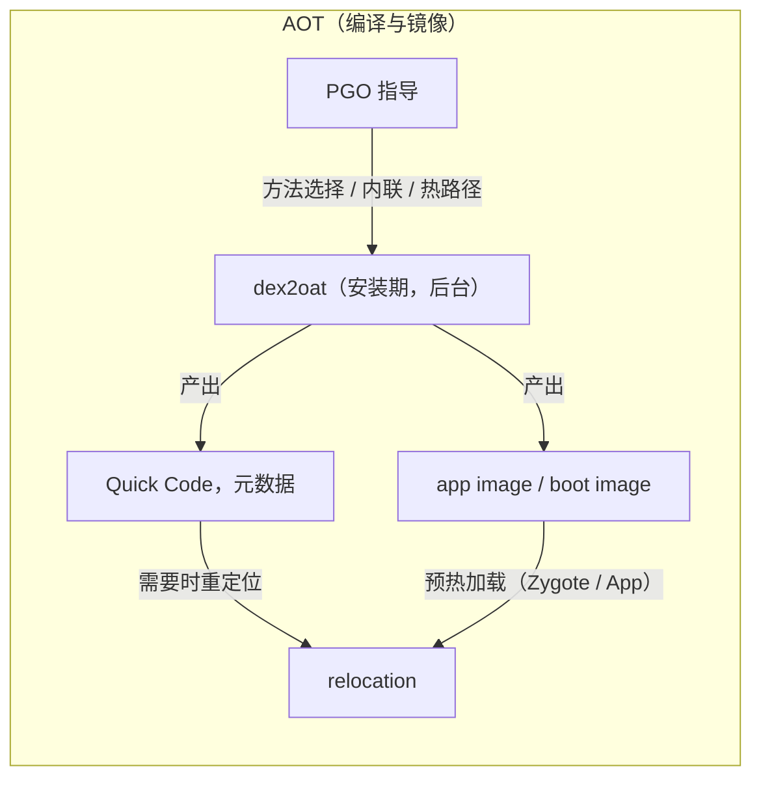
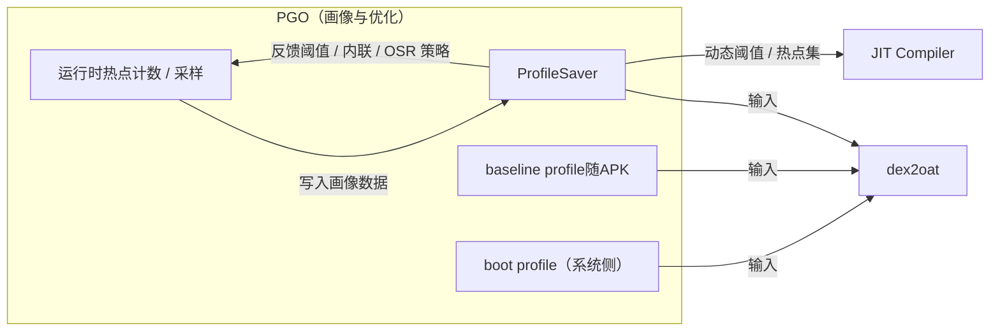
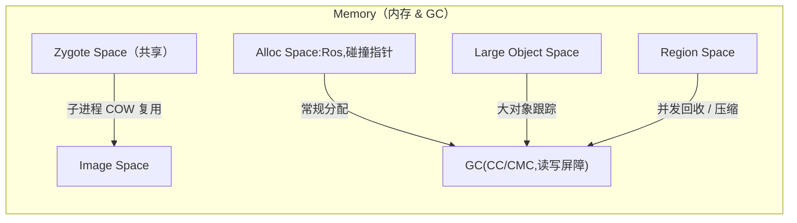
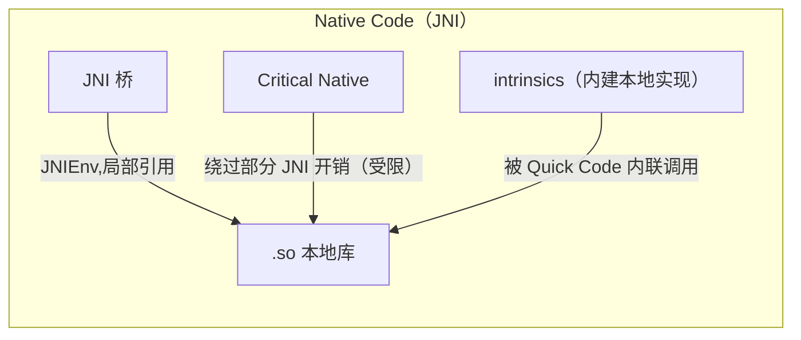

## 安卓运行时

安卓运行时（Android Runtime, ART）是安卓操作系统中专门为应用程序设计的核心运行环境，它负责将应用的Java或Kotlin代码编译成设备可以直接执行的原生指令。与早期的Dalvik虚拟机不同，ART主要采用预先编译（AOT）和即时编译（JIT）相结合的策略，在应用安装或运行时将其DEX字节码高效地转换为本地机器码，从而显著提升了应用的启动速度、运行性能和电池续航。除了执行代码，ART还全面负责内存管理（如垃圾回收GC）、线程调度以及系统服务的交互，是支撑所有安卓应用运行的基石。

## 顶层总览

### 执行引擎Exec（执行引擎）

### 类加载与解析Link（类加载与解析）

---

### AOTdex2oat（编译与镜像）

### PGO画像与优化闭环

---

### 内存与 GCMemory（内存 & GC）

---

### Native JNI

