## 1. 移动终端的挑战

相较于服务器和桌面 Linux，移动设备（Android）的物理内存管理面临一系列苛刻的物理与产品限制：

1. **没有无限制的物理磁盘 Swap**：移动端 Flash 闪存（UFS/eMMC）有严格的擦写寿命限制（P/E Cycles），且随机写入延迟极高，长期向闪存换页会导致闪存磨损与 I/O 阻塞。
2. **极高突发的连续大内存需求**：高像素多摄 ISP（例如 108MP+ 图像处理）、8K 视频编解码、端侧大模型 NPU 运算，可能瞬间需要数十至数百 MB 的**大块缓冲区；部分设备要求物理连续内存，支持 IOMMU/SMMU 的设备则可能使用物理离散、IOVA 连续的页面**。
3. **触控与 120Hz 帧率的极端延迟敏感**：主线程如果因为内存不足触发直接内存回收（Direct Reclaim），耗时几十到数百毫秒，可能造成明显掉帧（Jank），极端情况下可能促成应用无响应（ANR）。

## 2. 物理内存的宏观布局与抽象演进

在常见 ARM64 手机 SoC 中，CPU、GPU 等共享系统 DRAM（常称 UMA）；多数手机配置一个 NUMA node（`pg_data_t`，Node 0），具体 Zone 由内核配置和硬件限制决定，并不保证同时存在 DMA32、NORMAL 和 MOVABLE。

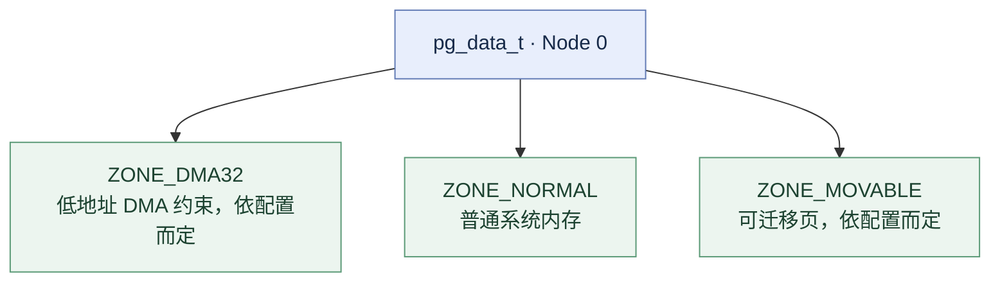

> 内核的物理内存三级管理模型 Node, Zone, Page/Folio

### 2.1 页面描述符演进：从 `struct page` 到 `struct folio`

传统 Linux 以 `struct page` 描述基础页框；其实际大小依内核配置、架构及调试选项而变，基础页大小也可能为 4 KB 或 16 KB。在复合大页（Compound Pages）场景下，这种设计引发了大量问题：代码需要反复通过 `compound_head()` 确认当前是首页（Head Page）还是尾页（Tail Page），带来重复的类型判定和一定运行时开销。

> 复合页（Compound Page）是由物理上连续、阶数对齐的多个单页（如 2MB 的 THP、Hugetlbfs 或驱动大缓冲区）聚合而成的一个逻辑大页。
>
> 由于内核函数经常通过虚拟地址查找页表（PTE）获取到一个任意的 struct page *，该指针可能指向这组连续物理页中的任意一个 4 KB 页框。compound_head() 就是用来识别该页是指向这组复合页的起始首页（Head Page），还是后续的某个尾页（Tail Page），并在是尾页时将其重定向回首页的核心内联函数。
>
> 内核对一个内存块的生命周期管理（引用计数 \_refcount、映射计数 `\_mapcount`、页标志 flags、所属地址空间 mapping、LRU 链表节点等）全部保存在首页的 struct page 中。尾页的结构体空间大部分被复用来存放指向首页的指针及辅助元数据。

在支持 folio 的现代 Android GKI 内核中，使用 **`struct folio`** 抽象：

* **确定性首部**：`struct folio` 保证始终指向内存块的起始页，在接收 folio 的 API 中避免了尾页作为输入带来的歧义。

* **清晰的大页语义**：解耦了单页与高阶复合页在 Page Cache 及匿名页操作中的逻辑，减少重复的 head-page 判定，使接口表达对象级别的生命周期语义；实际性能收益依工作负载而异。

### 2.2 迁移类型（Migrate Types）与反碎片化

一个区域内的所有物理页，必须具有相同的迁移类型。这个基本管理单元被称为 Pageblock（页块）。一个 Zone 内部包含成千上万个连续的 Pageblock。为阻止外部碎片使连续大块内存“碎裂”，每个 Zone 的伙伴系统链表会按**可移动性**实施严格分类：

* **`MIGRATE_UNMOVABLE`**：不可移动页。主要供内核自身核心数据结构、内核栈、SLUB 缓存使用，物理地址一旦分配不可重定位。

* **`MIGRATE_RECLAIMABLE`**：用于可回收的内核分配，例如可回收 slab（部分 dentry/inode 缓存）；并非所有这些对象都能无条件直接释放。

* **`MIGRATE_MOVABLE`**：可移动页。涵盖用户空间堆栈（匿名页）和 Page Cache（文件页），内核可通过更新页表项（PTE）将其平滑重定位。

* **`MIGRATE_CMA`**：连续内存分配器专属页，平时对外表现为可移动页借出。

### 2.3 16 KB Page Size：Android 系统的架构变革

自 Android 15 起，AOSP 正式引入了对 **16 KB 物理页面大小（Page Size）** 的系统级支持：

| 维度 | 4 KB Page | 16 KB Page | 架构收益 / 权衡 |
| :--- | :--- | :--- | :--- |
| **页表层级（取决于 VA_BITS）** | 48-bit VA 常见为 4 级 | 47-bit VA 可为 3 级；48-bit VA 为 4 级 | 不能仅凭 page size 推断层级；PTE 不会因折叠中间层而消失 |
| **单页基础容量** | 4,096 Bytes | 16,384 Bytes | I/O 吞吐提升，启动时间缩短 5%~10% |
| **伙伴系统 Order 0** | 4 KB | 16 KB | 高阶分配成功率大幅提高 |
| **潜在代价** | 内部碎片低 | 内部碎片略有增加 | 小对象 Native 堆与 ELF 对齐要求提升 |

---

## 3. 分配器核心

Android 物理内存分配的底层由多级分配体系协作构成，既保障了微小对象的极速分配，又支持了多媒体外设的“巨页”吞吐。

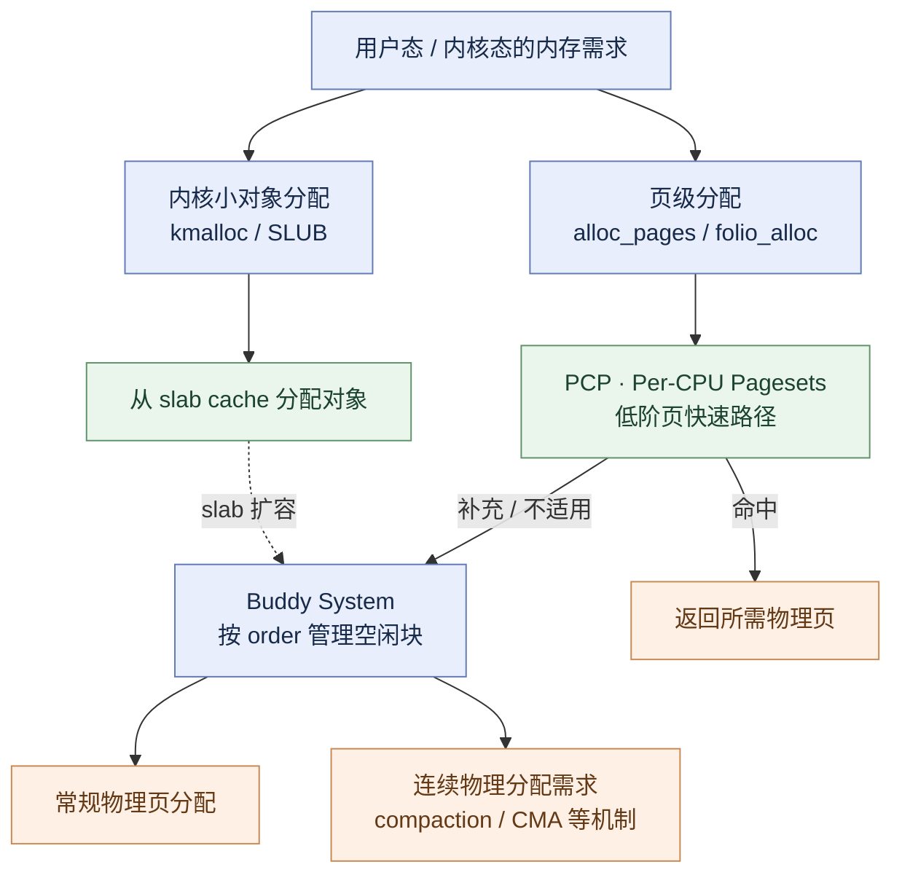

### 3.1 伙伴系统（Buddy System）与 PCP

* **伙伴分配原理**：以 $$2^{\text{order}}$$（即 $$1, 2, 4, 8, \dots, 1024$$ 个物理页框）为单位管理连续内存。当请求阶数对应链表为空时，向上借位并对半拆分；释放时，利用异或位运算快速寻址对应“伙伴”块，只要满足条件就向上递归合并，最大化遏制外部碎片。

* **PCP 快路径（Per-CPU Pagesets）**：为了消除多核 CPU 在高频调用 `alloc_pages(GFP_KERNEL, 0)` 时争抢 `zone->lock` 自旋锁的灾难性瓶颈，各 CPU 维护 per-CPU 页缓存，并通过相应的局部同步机制管理，常见 order-0 与部分低阶分配可避开 `zone->lock`；缓存不足或过量时再与 Buddy 批量交换页面。PCP 并非严格“完全无锁”或“只缓存单页”。

### 3.1.1 内存规整（Memory Compaction）：高阶分配与 CMA 的共同基础

Buddy 只能合并**已经空闲且互为伙伴**的块，因此“空闲内存总量很多”不代表存在足够大的连续物理区域。Compaction 通过 `migrate_pages()` 等机制将可迁移页面搬到其他空闲页框，让一侧出现更大连续空闲范围。

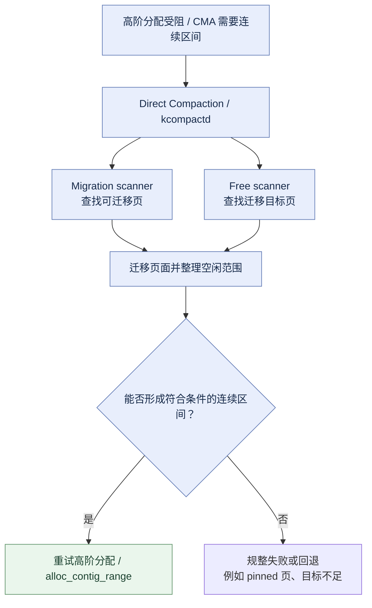

Compaction **不保证成功**：不可移动页、被长期 pin 的页面以及可用迁移目标不足都可能造成失败。`kcompactd` 是后台规整线程；直接规整可能增加发起分配线程的尾延迟。相关观测包括 `/proc/pagetypeinfo`、`/proc/buddyinfo` 和 `/proc/vmstat` 中的 compaction 计数。

### 3.2 CMA（Contiguous Memory Allocator）：动态借还机制

移动 SoC 的 Camera ISP、GPU、Display 往往共享系统 DRAM。需要**物理连续**缓冲区且不能依赖 IOMMU 映射的硬件路径可使用 CMA；支持 scatter-gather/IOMMU 的设备则不一定需要 CMA。以下描述 CMA 的典型动态借还流程：

1. **常态（借出）**：系统启动阶段预留的 CMA 物理区域标记为 `MIGRATE_CMA`。在相机未启动期间，内核允许普通应用将其作为 `MIGRATE_MOVABLE` 内存借用（如缓存应用图标、匿名页）。

2. **瞬态（收回）**：当用户启动相机应用，底层驱动调用 CMA 分配接口时，内核启动**页迁移机制（Page Migration）**。

3. **物理重映射**：内核尝试把 CMA 范围内可迁移的页面搬迁到符合约束的其他空闲页框，并在迁移流程中安全更新映射；整理出连续空闲范围后才交给请求者。遇到 pinned/unmovable 页面时也可能失败。

### 3.2.1 物理连续与 IOVA 连续不是一回事

支持 IOMMU/SMMU 的设备可把多个**不连续的物理页**通过 scatter-gather 映射成设备可使用的 IOVA 地址范围。DMA-BUF 是**跨驱动共享缓冲区的抽象**，CMA 是**物理连续分配机制**，IOMMU 则提供**设备地址翻译**，三者解决不同问题。

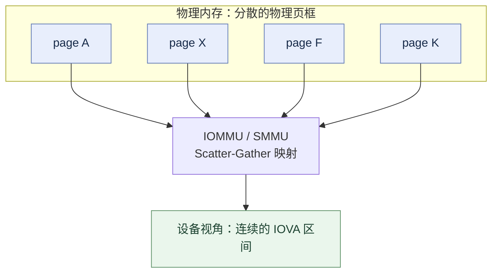

因此，分配大的 Camera/Display/GPU buffer **不自动意味着**需要物理连续 RAM，也不能仅根据 DMA-BUF FD 判断其底层来自 CMA。

### 3.3 从 ION 到标准化 DMA-BUF Heaps

在旧版本 Android 中，高通、联发科等厂商各自通过修改私有的 `ION` 内存驱动来管理跨硬件（CPU、GPU、DSP、ISP）共享内存，导致内核碎片化严重。

在现代 Android GKI 路线上，ION 逐步由主线 **DMA-BUF Heaps** 等接口替代；部分厂商旧内核仍可能提供遗留 ION 接口：

* **核心机制**：通过在 `/dev/dma_heap/` 目录下暴露统一的字符设备节点（如 `system`、部分配置下的 `system-uncached` 或 CMA 类 heap（具体名称与是否存在依设备而定）），用户空间可通过标准 IOCTL 申请跨设备共享缓冲区。

* **零拷贝流转**：分配出的内存以文件描述符（FD）形式在 SurfaceFlinger、Camera HAL、Codec 和渲染引擎之间自由传递，通过 DMA-BUF 导出、导入与附件映射实现跨设备共享，支持 IOMMU 时可映射为设备地址；是否真正零拷贝仍取决于驱动与使用路径。

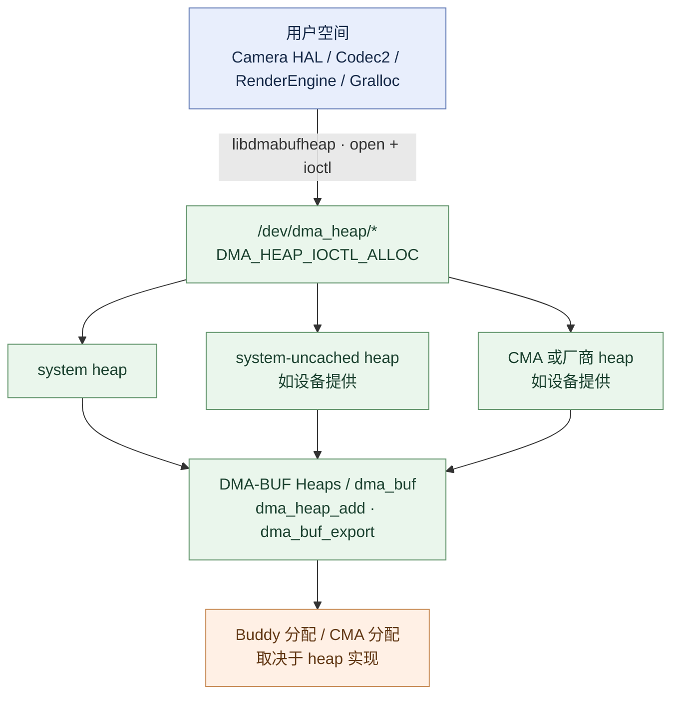

---

## 4. 虚拟内存与缺页：Zygote 与 COW 机制

Android 用户进程通过 `malloc()` 主要由用户态分配器管理，必要时通过 `mmap()` 等系统调用扩展虚拟地址空间（Android bionic/scudo 不应简单等同于 glibc 的 brk/mmap 策略）。新映射通常先建立 VMA 等虚拟内存元数据，匿名物理页可延迟到首次访问时分配；但预触页、文件映射和其他特殊路径存在例外。

物理分配推迟到 CPU 访问未映射地址、抛出硬件异常触发 **Page Fault（缺页异常）**：

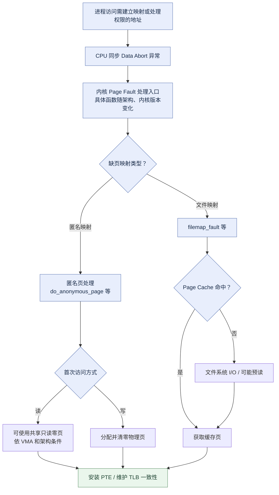

### 4.1 Zygote 写时复制（COW, Copy-On-Write）

Android 绝大多数应用进程都是由 **Zygote** 通过 `fork()` 系统调用孵化而来的：

1. **预加载与共享**：Zygote 在系统启动时，预先将通用的 Android 运行时、核心类库、系统资源和 Framework 基础环境全部加载至内存。

2. **写保护建立**：`fork()` 调用时，内核并不深度拷贝内存，而是对适用 COW 的私有可写映射设置写保护并共享已有物理页，同时正确维护引用/映射计数；`MAP_SHARED` 不遵循这套 COW 复制语义。

3. **写入时拆分（写保护 fault 路径（如 `do_wp_page()`））**：当子应用尝试修改某个单例变量或静态数据时，CPU 再次触发保护性缺页异常。内核依据 VMA、PTE 和 folio 状态判断能否安全复用原页；若不能复用，才分配新页、复制内容并更新 PTE。COW 并非依赖一个通用的硬件“COW bit”。

这极大压缩了新应用的启动延时，并让数十个后台应用能最大化复用基础框架的物理内存。

---

## 5. 内存回收与压缩：MGLRU 与 ZRAM

当可用物理内存降低到警戒水位时，内核必须主动回收页面以避免 OOM。

### 5.1 水位线模型（Watermarks）

> **注意**：水位线描述典型的后台回收触发逻辑，不是简单的 `free < MIN` 就无条件直接回收。分配器还会综合 GFP 约束、order、reserve、zone 和 compaction 等判断。

每个 Zone 维护三条关键水位控制线：

$$ \text{WMARK\\\_MIN} < \text{WMARK\\\_LOW} < \text{WMARK\\\_HIGH} $$

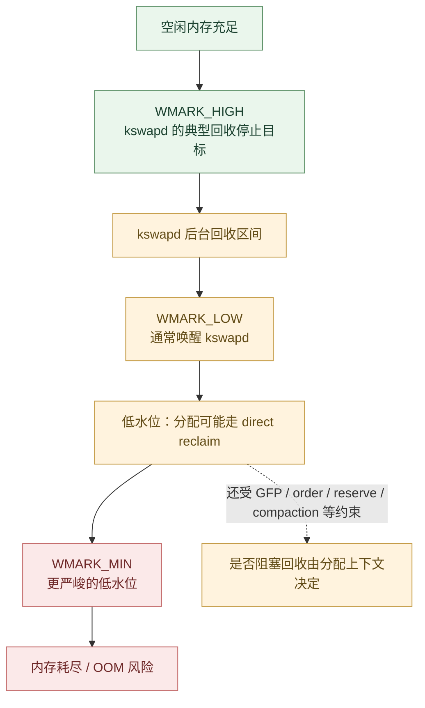

**注：现代 Android 内核开启了 `watermark_boost_factor`。在相应配置和碎片化条件下，分配器可临时提高 watermark boost，促使 `kswapd` 提早介入，避免突发分配陷入高延迟的 Direct Reclaim。**

### 5.2 核心回收演进：双链表 LRU 到 MGLRU

> **版本提示**：下面的 `shrink_active_list()` / `shrink_inactive_list()` 示意图主要讲解**传统 active/inactive LRU** 的典型概念，不等同于启用 MGLRU 后实际执行的统一调用链。图中只保留核心分支，现代内核常使用 `folio` API，回收、swap cache、writeback 与引用计数处理比图示复杂；`PG_referenced` / `PG_active` 的变化也不代表严格的“第二次/第三次访问”计数器。（Multi-Gen LRU）

传统 Linux LRU 并非单链表，而是通过 anonymous/file 的 active/inactive 链表近似记录页面活跃度；它借鉴了多队列冷热分层思想，但不等同于严格的 2Q 算法：

**将页面划分为缓刑区（Inactive List，冷页）与受保护区（Active List，热页）。**

核心标志位：

1. 硬件 PTE Young/Accessed 位：CPU 硬件在翻译该页的虚拟地址并发生读写时，由 MMU 自动置 1。
2. 软件 PG_active（位于 page->flags）：表示该页属于 Active 链表（1）还是 Inactive 链表（0）。
3. 软件 PG_referenced（位于 page->flags）：记录该页最近是否发生过“二次访问”的历史印记。

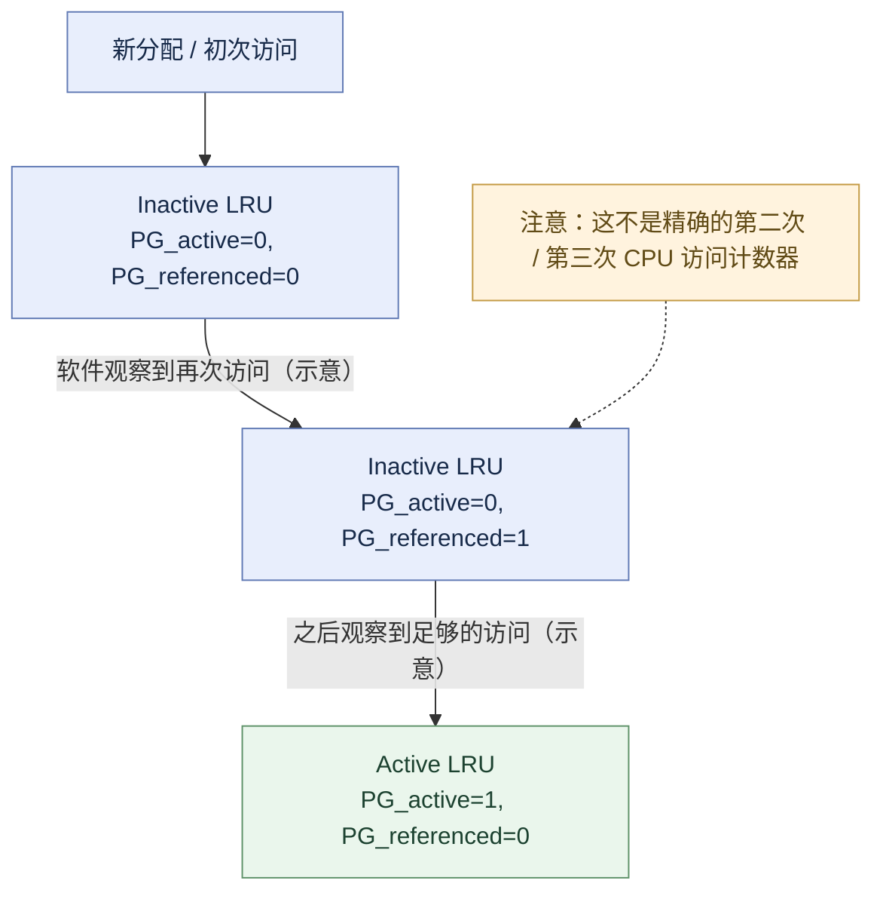

降级扫描（shrink_active_list）的核心目的是：在 Inactive 链表水位偏低时，从 Active 链表末尾挑选未被持续访问的页面，剥离其 PG_active 状态并注入 Inactive 链表头部，为后续回收提供缓冲资源。

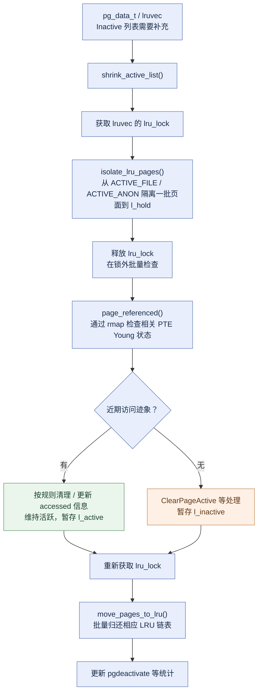

驱逐流程（shrink_inactive_list & shrink_page_list）是由内存压力直接触发（kswapd 或 direct_reclaim）。它从 Inactive 链表尾部抓取冷页，剥离页表映射，并视页面属性分别执行“直接丢弃”、“Flash 回写”或“ZRAM 压缩存储”，最终将物理页交还伙伴系统。

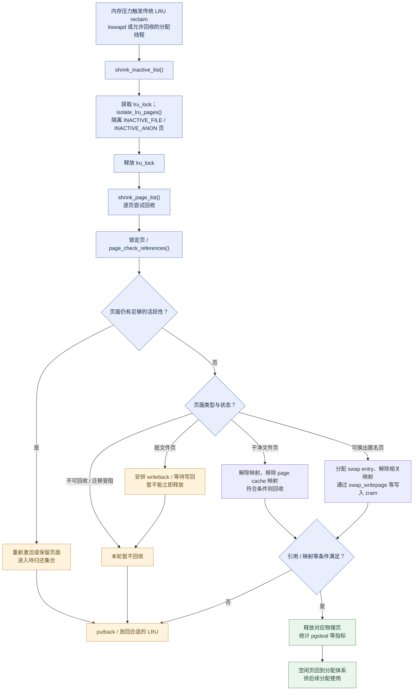

传统 Linux 的 Active/Inactive LRU 在部分移动负载上面临效率和冷热判定问题：

* **锁竞争剧烈**：多核并发扫描时，部分并发路径会竞争 lruvec 的 `lru_lock`，但不是整机唯一一把全局锁。

* **访问判定粗糙**：容易被大文件扫描或突发后台任务“污染”页面冷热判定，导致真正常驻前台的热页被误杀。

现代 Linux 及部分 Android GKI 配置支持 **MGLRU（Multi-Gen LRU，多世代 LRU）**，是否启用需检查设备内核：

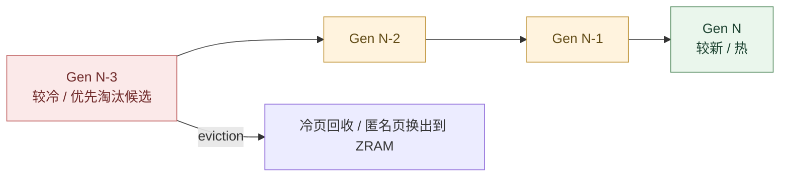

* **世代（Generations）递进**：将物理页归入多个按时间流转的世代，通过 aging 推进世代序号；旧世代逐渐成为淘汰候选，而非每页定时自动迁移。

* **页表级低功耗扫描（Page Table Walk）**：结合 page-table walk 和 rmap walk 发现 PTE Accessed/Young 状态，并据此更新 folio 世代。传统 LRU 也不会在每次普通 CPU 读写时进入内核移动链表；MGLRU 的优势是在 aging 时充分利用页表扫描的空间局部性，同时保留必要的 rmap 与反馈机制。

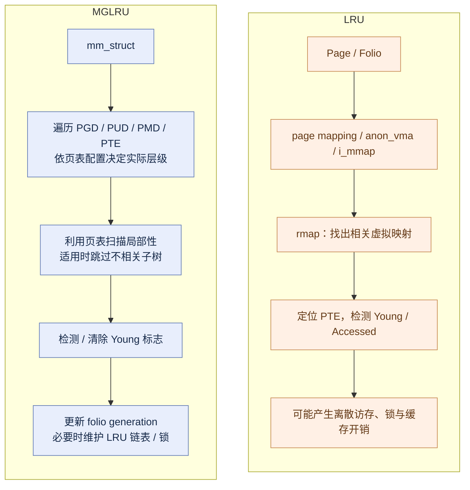

* **性能收益**：公开测试表明 MGLRU 在部分内存压力负载中能降低 reclaim CPU 开销并改善应用响应。

### 5.2.1 memcg 与 `lruvec`：为何回收不只是全局水位线

对于启用了 memory cgroup 的内核，回收同时具有 **node 与 memcg** 维度：`lruvec` 关联某个 node 上某个 memcg 的 LRU 状态，而不是一条全机器共享的 LRU。global reclaim 在系统范围内回收；memcg reclaim 则可能因某个 cgroup 的内存限制触发，即使全局仍有空闲内存。

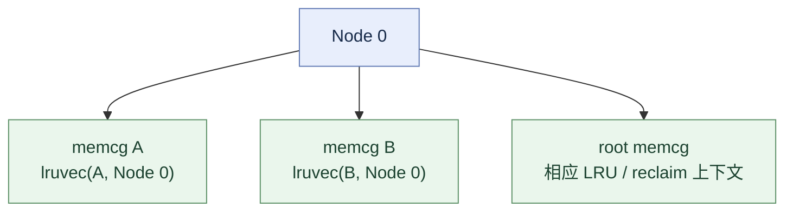

在采用 cgroup v2 的系统中，可通过 `memory.current`、`memory.high`、`memory.max`、`memory.events` 等理解计费、节流、限制与事件；Android 设备是否使用这些接口以及配置方式，须以设备的 cgroup 挂载和内核配置为准。

### 5.3 ZRAM 压缩换出机制（In-Memory Compressed Swap）

由于持续使用 Flash swap 会带来 I/O 和磨损成本（部分实现仍支持受控 writeback），Android 的匿名页（堆、栈）该如何回收？答案是 **ZRAM**。

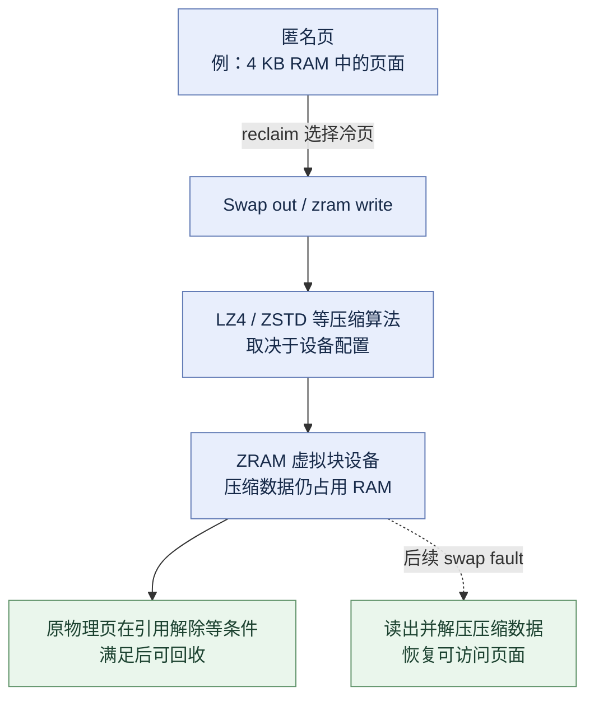

* **内存重分配器 `zsmalloc`**：压缩后的数据大小往往不是 4 KB 的整数倍（例如 1.2 KB、800 Bytes）。普通分配器会带来严重的内部碎片。ZRAM 配合专用的 `zsmalloc` 分配器，能将不同尺寸的小压缩块紧凑拼装在物理页中。

* **Swap Fault（按需解压）**：当用户重新访问已换出页面触发 swap fault 时，内核识别 swap entry，内核瞬时将压缩数据解压回一个新分配的物理页，通常比从闪存读入更快，但仍会带来 CPU 开销和可观测延迟。

* **ZRAM Writeback（可选拓展）**：部分 OEM 厂商结合 Android 定制扩展，可按策略将选中的压缩页写回后备存储；触发条件、写回粒度与介质随实现而异，在保障闪存寿命与极限保活之间寻找折中。

---

### 5.4 Android 17+ 的 mmd：可选的新一代 ZRAM 管理

AOSP 的 Android 17+ 文档引入了内存管理守护进程 `mmd`，用于集中处理 ZRAM 的配置与维护，例如 recompression、writeback 及按进程 writeback。它是**用户态的 swap/ZRAM 管理组件**，不能与负责选择进程终止的 `lmkd` 混为一谈。是否启用及特性支持依系统版本和厂商配置而定。

---

## 6. 内存压力：从 LMK 到 PSI + LMKD

当内存回收与 ZRAM 压缩依然无法赶上内存消耗速度时，系统必须终止低优先级进程以自保。

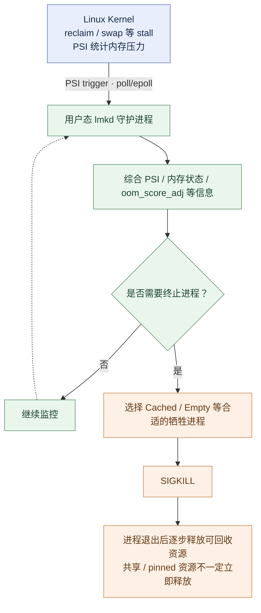

### 6.1 为什么废弃内核级 `lowmemorykiller.c`？

早期 Android 内核内置了 `drivers/staging/android/lowmemorykiller.c`。旧驱动与 shrinker/reclaim 路径耦合，在内核回收上下文中根据阈值挑选牺牲进程，并非在硬件 IRQ 中断处理程序里杀进程。

* **缺点**：内核空间难以深度感知 Android 复杂的应用组件生命周期（如前台 Service、可见 Activity、绑定的 Provider），极易造成“误杀”；同时强行在内核中实现策略逻辑严重阻碍了主线化（Upstream）。

### 6.2 现代化方案：PSI（Pressure Stall Information）

现代 Android 废除内核驱动，转向 Linux 标准的 **PSI 机制**。PSI 不仅关注“剩余多少兆内存”，更关注**“进程因为等待内存分配被阻塞了多久”**。

在 `/proc/pressure/memory` 中，内核提供两项核心指标：

* **`some`**：表示**至少有一个**非就绪任务由于等待内存（如直接回收、等待 Swap In、压缩阻塞）而处于停顿（Stall）的时间比例。

* **`full`**：表示**所有**活跃任务都同时因为等待内存而停顿的时间比例。此时 CPU 完全空转、应用主线程全线卡死。

### 6.3 用户态 `lmkd` 的响应与杀进程优先级

1. **注册监听**：`lmkd` 启动后，向内核的 `/proc/pressure/memory` 写入配置，注册不同压力等级（如低压、中压、危急）的阈值通知（利用 `epoll` 监听文件描述符）。

2. **事件响应**：当 PSI trigger 达到条件并使等待中的 `lmkd` 被唤醒，它不再简单看绝对剩余物理内存，而是获知“系统当前处于严重卡顿状态”。

3. **查表淘汰**：`lmkd` 根据 Android 框架层（ActivityManagerService）动态注入的 **`oom_score_adj`** 分值（$-1000 \sim 1000$），从最高的 Cached 进程、空进程开始，自高向低通过 `SIGKILL` 终止应用，推动被终止进程退出并释放其可释放的资源；实际回收存在时延，共享页与被固定的页未必随之释放。

---

### 6.4 Kernel OOM 与 memcg OOM（和 LMKD 不同）

`lmkd` 是 Android 用户态的压力管理策略，不等于 Linux 内核 OOM killer。若内核无法满足内存分配且回收等手段无效，仍可能进入 kernel OOM 路径；如果触发的是某个 memory cgroup 的硬限制，也可能发生 memcg OOM。不要把所有 `SIGKILL` 都归结为 `lmkd`。

---

## 7. 典型页面生命周期与回收去向一览

> 下表的 migratetype 是典型倾向而非“页面永远固定属于此类”；实际分配涉及 fallback、pageblock 转型、不可迁移页和 pinned page 等例外。

理解 Android 内存，本质是理解不同种类页面的去向：

| 页面类型 | 映射模式 | 伙伴系统迁移类别 | 内存压力下的回收策略 | 回收代价 / 耗时 |
| :--- | :--- | :--- | :--- | :--- |
| **匿名页 (Heap/Stack)** | 私有写入 | `MIGRATE_MOVABLE` | 压缩后写入 **ZRAM** | 中（需消耗 CPU 算力压缩） |
| **只读文件页 (ELF/Dex/Res)** | 共享/私有只读 | `MIGRATE_MOVABLE` | **直接丢弃**（可按需重新读盘载入） | 极低（仅更新页表） |
| **脏文件页 (Dirty Cache)** | 共享可写 | `MIGRATE_MOVABLE` | 由内核 **`writeback`** 刷入 Flash 后再释放 | 高（受制于闪存 I/O 写入带宽） |
| **CMA 借出页** | 匿名页/文件页 | `MIGRATE_CMA` | 触发 **Page Migration** 迁移至常规区域 | 较高（需物理内存整页拷贝） |
| **内核 Slab/Slub** | 内核直接映射 | `MIGRATE_UNMOVABLE` | 通过注册的 **Shrinker** 回收部分缓存结构 | 低~中（视结构复杂度而定） |
