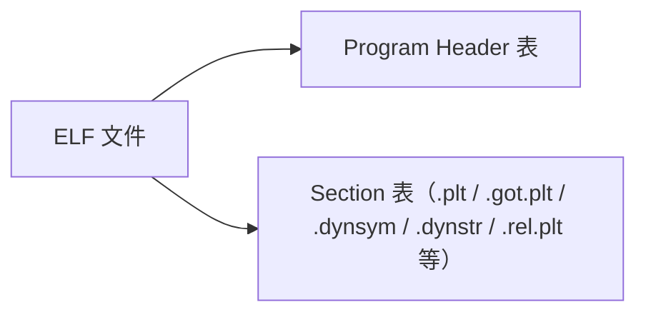
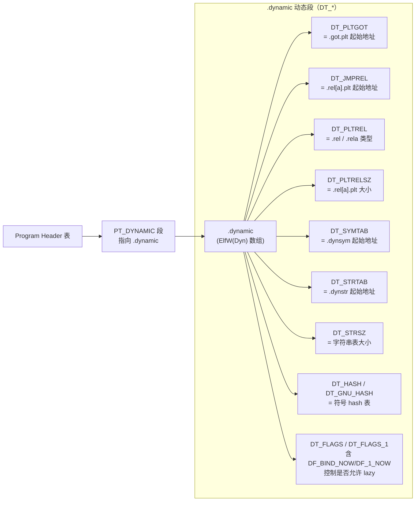
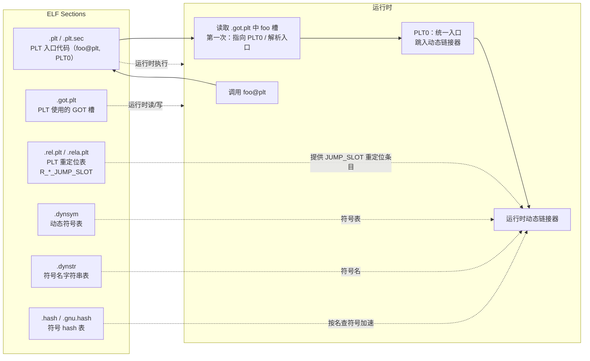
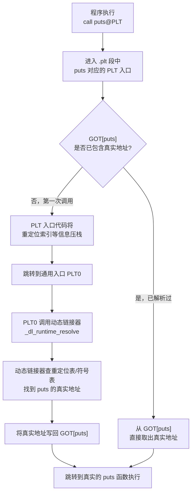
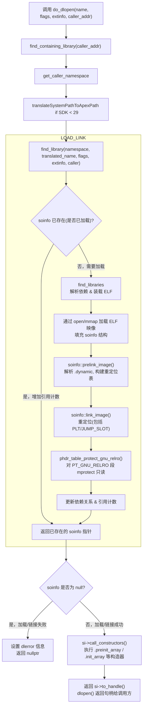
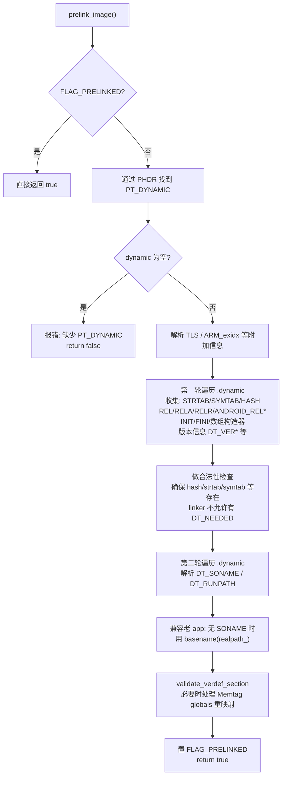
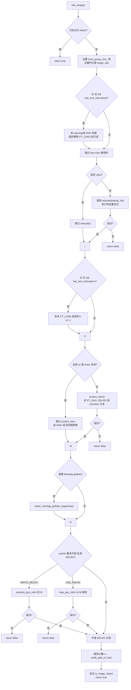
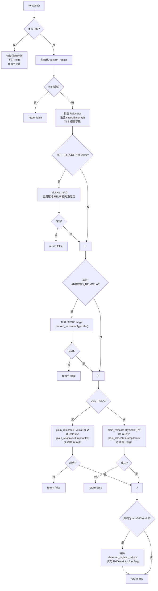

Android 不支持 RTLD_LAZY，总是用 RTLD_NOW，这样可以在 dlopen 返回前就把所有 undefined 符号解析完，从而立刻对 PLT 做 RELRO 保护。

## 延迟绑定

符号的地址不是在程序启动或库加载时一次性解析完，而是等到“第一次真的调用它”时再去解析。

（动态链接器层面的 lazy binding和面向对象里虚函数的lazy binding不是一回事）

<https://www.openeuler.org/en/blog/lijiajie128/2020-11-10-%E5%8A%A8%E6%80%81%E9%93%BE%E6%8E%A5%E4%B8%AD%E7%9A%84PLT%E4%B8%8EGOT>

### 绑定

在使用动态库时，编译好的程序里会有很多“外部符号引用”，比如：

```c
extern int puts(const char*);
...
puts("hello");
```

二进制里，这个调用点并不知道 `puts` 的真实地址，只知道“要调一个叫 puts 的符号”。

**绑定（binding）** = 把这个“符号引用”真正变成一个 **具体地址**：

* 找到这个符号在哪个 so 里
* 算出它在内存中的真实地址
* 把这个地址写到合适的位置

什么时候做这件事，就有两种策略：

* 立即绑定：程序 / so 一加载完，所有相关符号一次性解析、重定位。
* 延迟绑定：先不全解析，只在第一次调用某个函数时，才为这个函数做解析和重定位。

### 为什么要延迟

主要是为了减少启动时开销：

* 动态库很多，符号也很多，全部一次性解析会拖慢启动。
* 有些函数可能整个运行过程中一次都不会用到，提前给它们做重定位是浪费。

所以 ELF 的动态链接机制设计了一个优化：**函数调用的重定位可以等到第一次真正调用时再做**

### 怎么实现

延迟绑定主要就是围绕：`.plt`,`.got.plt` + 动态段 `.dynamic` 里的几类 `DT_*` 项 + PLT 重定位表 `.rel(a).plt`（类型是 `R_*_JUMP_SLOT`）+ 符号表 `.dynsym`, `.dynstr` 这一整套东西在协作。

关键角色有两个：

* **PLT（Procedure Linkage Table，过程链接表）**
* **GOT（Global Offset Table，全局偏移表）**

编译器不会直接 `call puts@绝对地址`，而是：

1. 对外部函数，生成 `call puts@PLT`，跳到当前模块的一个 **PLT stub**。
2. 每个外部函数会有一个 GOT 项，对应这个函数真正的地址。
<!-- 
#### PLT/GOT 相关的 `DT_*`

##### DT_PLTGOT

指向与 PLT 相关的 GOT 区域，典型就是 .got.plt 的起始地址。

动态链接器通过这个指针，知道“PLT/GOT 跳板”在哪；

##### DT_JMPREL

指向 PLT 重定位表（`.rel.plt` 或 `.rela.plt`）；

这些重定位条目就是“函数跳转槽”（`JUMP_SLOT`）对应的 relocation。

##### DT_PLTREL

表示 DT_JMPREL 指向的是 Rel 还是 Rela 表（DT_REL / DT_RELA）；

###### DT_PLTRELSZ

PLT 重定位表的总大小（字节），用来算出条目个数。 -->

### ELF 源文件视角

顶层 ELF 文件



运行时动态链接器首先要通过 `PT_DYNAMIC` 找到内存里的 `.dynamic`，再从里面的 `DT_PLTGOT` / `DT_JMPREL` / `DT_PLTREL` / `DT_PLTRELSZ` 等信息，定位 `.got.plt` 和 `PLT` 重定位表，最后才能对 `.got.plt` 里的条目做修改。

Program Header 视角



Section 视角



### 流程



## 安卓的延迟绑定

### TL;DR

Android 的 bionic 链接器直接**禁用** lazy binding, 因为 lazy binding 会阻碍像 RELRO 这样的加固特性。

### RELRO

RELRO（Relocation Read-Only）就是“把做完重定位后还需要保持不变的那块内存设成只读”，主要是保护 GOT 等表，防止被覆盖劫持控制流。

ELF 程序启动时，动态链接器要做各种重定位，在重定位完成之后理论上`GOT`类似的结构就不该再被改动。
但默认情况下，这些区段是可写的，攻击者一旦拿到任意写，就可以改 `GOT` 某个条目，然后劫持控制流。

RELRO 的核心思路：

* 让链接器把这些需要保护的区段单独放进一个段
* 程序启动时动态链接器先应用所有重定位
* 然后对这个段 `mprotect(PROT_READ)`

<https://www.redhat.com/ja/blog/hardening-elf-binaries-using-relocation-read-only-relro>

### Bionic 实现

<https://cs.android.com/android/platform/superproject/main/+/main:bionic/libc/include/dlfcn.h;l=188>

在头文件`bionic/libc/include/dlfcn.h`这里定义了 `dlopen` 的 flag（`RTLD_NOW`, `RTLD_LAZY` 等）。Android 在注释里直接写了一直使用 `RTLD_NOW` 出于安全原因，不支持 `RTLD_LAZY`。

API 层把 `RTLD_LAZY` 这个宏暴露出来是为了兼容 POSIX，但实现上直接当作 `RTLD_NOW` 处理。

```cpp
/**
 * A dlopen() flag to not make symbols from this library available to later
 * libraries. See also RTLD_GLOBAL.
 */
#define RTLD_LOCAL    0

/**
 * Not supported on Android. Android always uses RTLD_NOW for security reasons.
 * Resolving all undefined symbols before dlopen() returns means that RELRO
 * protections can be applied to the PLT before dlopen() returns.
 */
#define RTLD_LAZY     0x00001

/** A dlopen() flag to resolve all undefined symbols before dlopen() returns. */
#define RTLD_NOW      0x00002

/**
 * A dlopen() flag to not actually load the given library;
 * used to test whether the library is already loaded.
 */
#define RTLD_NOLOAD   0x00004

/**
 * A dlopen() flag to make symbols from this library available to later
 * libraries. See also RTLD_LOCAL.
 */
#define RTLD_GLOBAL   0x00100

/**
 * A dlopen() flag to ignore later dlclose() calls on this library.
 */
#define RTLD_NODELETE 0x01000
```

在`bionic/libdl/libdl.cpp`中

```cpp
__attribute__((__weak__))
void* dlopen(const char* filename, int flag) {
  const void* caller_addr = __builtin_return_address(0);
  return __loader_dlopen(filename, flag, caller_addr);
}
```

dlopen调用`bionic/linker/dlfcn.cpp`中的

```cpp
void* __loader_dlopen(const char* filename, int flags, const void* caller_addr) {
  return dlopen_ext(filename, flags, nullptr, caller_addr);
}

// .....

static void* dlopen_ext(const char* filename,
                        int flags,
                        const android_dlextinfo* extinfo,
                        const void* caller_addr) {
  ScopedPthreadMutexLocker locker(&g_dl_mutex);
  g_linker_logger.ResetState();
  void* result = do_dlopen(filename, flags, extinfo, caller_addr);
  if (result == nullptr) {
    __bionic_format_dlerror("dlopen failed", linker_get_error_buffer());
    return nullptr;
  }
  return result;
}
```

`do_dlopen`是核心执行代码，在`bionic/linker/linker.cpp`中

<https://cs.android.com/android/platform/superproject/main/+/main:bionic/linker/linker.cpp;l=2116>

大致的流程如图



### Linker Namespace

Android之前的状态大概是

* 整个进程里只有一个全局库空间，所有 so 都在一起；

* 任意 so 可以随便 `dlopen/DT_NEEDED` 依赖任何路径下的 so；

* vendor so 大量直接 link framework 的私有 so（libandroid_runtime.so 之类），
系统一升级符号就崩；同时还容易出现“同名不同 ABI 的 so 冲突”。

#### 解决办法

namespace 隔离: 每个 namespace 有独立的搜索路径, 允许加载的目录；
isolated=true 时，动态链接器会严格检查 so 路径，不在这些目录就不让装；只能对白名单中这些库名走跨 namespace 解析。

### soinfo

所有被加载的 native 库都会对应一个 soinfo 结构，里面记录这个库的名字、路径、ASLR 后的基址、所属 namespace 等信息。

#### `soinfo::prelink_image`

##### 核心作用

读取当前 so 的 PT_DYNAMIC 段，解析各种 DT_* 动态表项，把 soinfo 里和符号表、重定位、构造/析构、版本、TLS、Memtag 等相关的字段全部填好，并做一轮合法性校验，最后打上 FLAG_PRELINKED 标记。
真正“改内存、做重定位”的是在后面的 link_image()。

##### 源代码

 <https://cs.android.com/android/platform/superproject/main/+/main:bionic/linker/linker.cpp;l=2852>

##### 流程图



#### `soinfo::link_image`

<https://cs.android.com/android/platform/superproject/main/+/main:bionic/linker/linker.cpp;l=3357>

link_image = 应用重定位 + 段保护（包括 RELRO）+ 一些调试/MTE/RELRO 共享的收尾工作



#### `soinfo::relocate`

<https://cs.android.com/android/platform/superproject/main/+/main:bionic/linker/linker_relocate.cpp;l=592>



### lazy binding?

* 头文件里说明：RTLD_LAZY 在 Android 上“不被支持”，行为等价于 RTLD_NOW；传这个 flag 只是为了兼容 POSIX 接口签名。

* prelink_image 里：DT_PLTGOT 明确被Ignored，链接器不会利用 PLT/GOT 机制去搭建 _dl_runtime_resolve 之类的 lazy 路径。

* relocate() 里：所有 `.rel[a].plt` 条目都走 `plain_relocate<RelocMode::JumpTable>`，`process_relocation_impl()` 会立刻查符号并把真实地址写进 GOT 槽，不保留“跳回 PLT0”的中间状态。

* link_image() 里：relocate() 结束后立即对 PT_GNU_RELRO 做 mprotect，只读，把包含 GOT/PLT 在内的一整块内存锁死，后续运行期就算想改 GOT 也改不了了，更不可能再 lazy binding。
