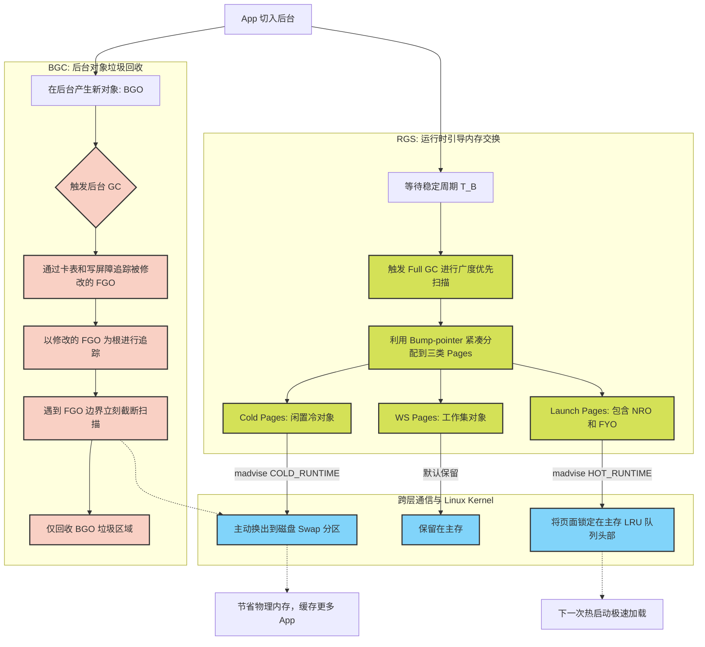

# Fleet：面向智能手机的软硬协同内存管理框架总结

## 1. 研究背景与痛点
* **目标：** 提升智能手机的“热启动”速度（极大地影响用户体验），同时在后台缓存更多的 App。
* **现状痛点：**
  * 现有的 Linux Swap（基于 LRU 策略）是“盲目”的，经常把热启动急需的内存页交换到磁盘，导致热启动卡顿。
  * Android 原生垃圾回收器（GC）在后台执行全局扫描时，会唤醒已 Swap 到磁盘的页面，不仅抵消了 Swap 腾出空间的效果，还容易导致 App 崩溃，限制了后台缓存能力。

## 2. 核心洞察 (Key Observations)
1. **生命周期差异：** 前台对象（FGO）的存活时间远长于后台对象（BGO），且 FGO 占据了绝大部分内存。
2. **热启动的规律：** 在热启动瞬间，App 极大概率重新访问两类特定对象：
   * **NRO (Near Roots Objects)：** 靠近 GC 根节点的对象。
   * **FYO (Foreground Young Objects)：** 刚切入后台前分配的年轻对象。
3. **粒度不匹配：** Android 对象极小（几十字节），而 Linux 内存页较大（4KB），导致传统的基于页面的 Swap 效率低下。

## 3. Fleet 架构与工作流

Fleet 通过虚拟机（ART）与 Linux 内核的跨层协同，完美解决了上述问题。以下是 Fleet 的核心工作流程图：

### 3.1 核心组件一：运行时引导内存交换 (RGS)
* **机制：** RGS 负责“分类、打包与跨层指挥”。当 App 稳定在后台后，Fleet 会通过一次 GC 将小对象分类，并紧凑地分配到对应类型（Launch, WS, Cold）的内存页中。
* **效果：** 通过 `madvise` 系统调用，指挥底层 Linux 将闲置的 Cold Pages 直接踢入磁盘，同时死死保住包含 NRO 和 FYO 的 Launch Pages。这保证了**热启动秒开**，同时**腾出了大量物理内存**。

### 3.2 核心组件二：后台对象垃圾回收 (BGC)
* **机制：** BGC 负责“隔离与精准打击”。由于 Cold Pages 被换到了磁盘，BGC 利用“写屏障”和“专属卡表”只追踪少量被修改的前台对象。在扫描时，一旦碰到前台对象区域（FGO）的边界就立刻停止 。
* **效果：** 彻底杜绝了无用的磁盘唤醒，避免了 GC 扫描和磁盘 Swap 之间的冲突，确保了**后台缓存能力的最大化**。

## 4. 关键实验结果 (Evaluation Results)
在 Google Pixel 3 上的商业 App 测试证明：
* **更强的缓存能力：** Fleet 能够比原生 Android 平均多缓存 **1.21 倍** 的 App。
* **极致的热启动速度：** 平均热启动时间提升 **1.59 倍**。特别是在尾部延迟（90th percentile）上，比之前的顶会研究 Marvin 快了 **4.45 倍**。
* **稳定的系统底盘：** 实现了上述惊艳效果的同时，CPU 占用率、电量消耗和帧率（FPS）表现均与原生 Android 几乎一致，没有任何负面开销。

## 5. 总结
Fleet 框架通过巧妙的“软硬协同”，打破了传统虚拟机与操作系统的认知壁垒。它证明了：通过在运行时识别对象的生命周期与启动热度，并以此指挥底层的分页机制，可以完美平衡手机的“高并发后台缓存”与“极速启动体验”。