# LLVM MachineOutliner 方案说明

主要源码位置：

- `llvm/lib/CodeGen/MachineOutliner.cpp`：generic MO pass，实现指令映射、suffix tree 候选发现、贪心选择、helper 创建和 callsite 改写。
- `llvm/include/llvm/CodeGen/MachineOutliner.h`：generic MO 与 target hook 共享的数据结构。
- `llvm/include/llvm/CodeGen/TargetInstrInfo.h`：target 必须实现或可选实现的 outlining hook。
- `llvm/lib/Target/AArch64/AArch64InstrInfo.cpp`：AArch64 目标上的 legality、成本、LR 保存、PAC/CFI/SP 修复和 helper lowering。
- `llvm/lib/Target/AArch64/AArch64TargetMachine.cpp`：AArch64 打开 `setMachineOutliner(true)` 和 `setSupportsDefaultOutlining(true)`。
- `llvm/lib/CodeGen/TargetPassConfig.cpp` 与 `llvm/include/llvm/CodeGen/CodeGenPassBuilder.h`：MO 在 codegen pipeline 中的位置。

## 一句话结论

LLVM 原生 MO 是一个 post-RA、module 级、基于 suffix tree 的 exact machine-instruction sequence outliner。它把每个可 outline 的机器指令映射成整数串，用 suffix tree 找重复子串，再交给 target hook 判定 legality 和成本，最后按 modeled byte benefit 贪心选择，把重复片段复制到 internal helper function，并把每个 occurrence 改成 call/branch helper。

它的优势是：

- 全 module exact sequence 查找成熟，suffix tree 能一次看到大量重复直线片段。
- target hook 负责 ABI 细节，generic 层不硬编码 AArch64。
- AArch64 已经处理 LR 保存、尾调用 helper、末尾 call thunk、PAC signing consensus、CFI tail-call 限制、SP offset fixup 等基础问题。

它的限制也很清晰：

- 只处理单基本块内连续机器指令串，不跨基本块。
- 依赖机器指令“值相等”，不做寄存器重命名、semantic canonicalization 或多 variant 全局优化。
- selection 是 benefit 贪心，不是全局最优。
- 成本由 target 粗略建模，不自然覆盖 helper alignment padding、branch relaxation/veneer、真实 `.text` padding 和 unwind metadata 的全部影响。
- AArch64 generic MO 对 frame setup/destroy、PAC/BTI、CFI、SP 修改、含 call 序列的处理偏保守。

整体结构可以概括为：

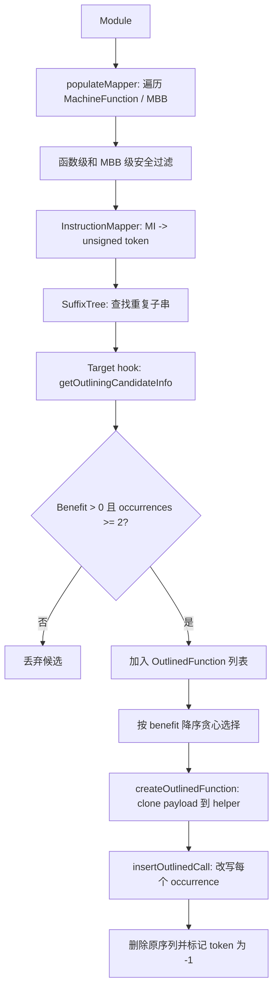

## Pipeline 位置与开关

### 插入位置

legacy pass manager 中，MO 位于 machine codegen pipeline 很靠后的位置：

```text
...
addPreEmitPass()
RegUsageInfoCollector
FuncletLayout
StackMapLiveness
LiveDebugValues
MachineOutliner
BasicBlockSections / MachineFunctionSplitter
CFIFixup
addPreEmitPass2()
```

new pass manager 的 `CodeGenPassBuilder` 中位置一致：`StackMapLivenessPass` 和 `LiveDebugValuesPass` 之后，`addPreEmitPass2` 之前。

因此 MO 是 post-RA / post-PEI 后的 pass。它看到的已经是物理寄存器、真实 frame setup/destroy、真实 call/return pseudo 附近的机器指令，不是 pre-PEI 抽象 frame index 阶段。

### 运行条件

MO 同时受 target capability、优化等级、用户开关控制：

- `TM.Options.EnableMachineOutliner` 必须为真。
- `getOptLevel() != CodeGenOpt::None`。
- `-mllvm -enable-machine-outliner=never` 会禁用。
- `-mllvm -enable-machine-outliner` 或 `=always` 会在所有安全函数上运行。
- 默认模式下，只有 target 声明支持 default outlining 且 `shouldOutlineFromFunctionByDefault()` 返回真时才处理对应函数。

AArch64 target machine 中：

```cpp
setMachineOutliner(true);
setSupportsDefaultOutlining(true);
```

AArch64 默认只对 `minsize` 函数返回 `shouldOutlineFromFunctionByDefault() == true`。如果用户显式传 `-moutline`，clang driver 会加 `-mllvm -enable-machine-outliner`，此时 `RunOnAllFunctions=true`，会在所有 target 判定安全的函数上跑。

相关用户开关：

- `-moutline`：clang driver 层打开 MO。
- `-mno-outline`：clang driver 层关闭所有 MO。
- `-mllvm -enable-machine-outliner=always`：所有安全函数都尝试。
- `-mllvm -enable-machine-outliner=never`：禁用。
- `-mllvm -machine-outliner-reruns=N`：初次 outline 后再重复运行 N 次。
- `-mllvm -enable-linkonceodr-outlining`：允许从 `linkonce_odr` 函数中 outline，默认关。

## 核心数据结构

### `outliner::InstrType`

target 的 `getOutliningType()` 把每条机器指令分类：

- `Legal`：可以作为普通候选指令。
- `LegalTerminator`：可以 outline，但只能作为候选末尾。
- `Illegal`：不能 outline，会切断重复串。
- `Invisible`：忽略，不参与 token 串，也不影响相邻 legal 指令是否连续，例如 debug / kill。

`LegalTerminator` 的实现细节很关键：mapper 先把它当 legal 指令映射，再立即插入一个 unique illegal token，所以 suffix tree 可以找到“以该 terminator 结尾”的重复串，但不能让候选跨过它继续向后延伸。

### `outliner::Candidate`

`Candidate` 表示一个 occurrence，也就是某个 MBB 内一段连续机器指令：

- `StartIdx` / `Len`：在全 module token 串里的位置和长度。
- `FirstInst` / `LastInst`：真实 MachineInstr iterator。
- `MBB`：所属基本块。
- `CallOverhead` / `CallConstructionID`：target 决定 site 怎么改写以及成本。
- `Flags`：target 在 MBB safety 阶段记录的附加信息。
- `FromEndOfBlockToStartOfSeq`：从 MBB live-out 反向扫到 sequence 开始的活跃信息。
- `InSeq`：sequence 内部指令累计的寄存器使用信息。

target 可以用这些 liveness query 做 legality 和 lowering 决策：

- `isAvailableAcrossAndOutOfSeq(Reg)`：从 sequence 开始到基本块结束，包括 sequence 内和后续代码，`Reg` 是否可用。
- `isAvailableInsideSeq(Reg)`：sequence 内部是否没有占用 `Reg`。
- `isAnyUnavailableAcrossOrOutOfSeq({Regs})`：一组寄存器中是否有任意一个不能保证跨 sequence 和后续代码可用。

AArch64 用这些 query 判断：

- `LR` 是否可以不保存。
- 是否能找一个空闲 GPR 保存 `LR`。
- `x16/x17/NZCV` 这类调用 ABI 不保证 preserved 的状态是否会被新 call 破坏。
- `SP` 是否被 sequence 使用，从而判断 caller-side stack LR save 是否需要修复 helper 内 SP offset。

### `outliner::OutlinedFunction`

`OutlinedFunction` 表示一类重复序列的所有 occurrence 和 helper 生成参数：

- `Candidates`：所有 occurrence。
- `SequenceSize`：单个原始片段的字节数。
- `FrameOverhead`：helper frame/return/signing 等开销。
- `FrameConstructionID`：target 决定 helper 怎么收尾或构造 frame。
- `MF`：最终创建的 helper `MachineFunction`。

generic 成本公式：

```text
NotOutlinedCost = occurrence_count * SequenceSize
OutlinedCost    = sum(call_overhead_per_occurrence) + SequenceSize + FrameOverhead
Benefit         = max(0, NotOutlinedCost - OutlinedCost)
```

这里的 `SequenceSize` 和 overhead 都由 target 提供。AArch64 当前 `SequenceSize` 用 `getInstSizeInBytes(MI)` 累加，所以不是简单按每条 4B 固定估算。

## Generic MO 端到端流程

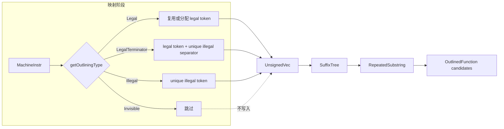

## 源码级执行路径

这一节按 `MachineOutliner.cpp` 的主要函数调用顺序写清楚关键变量和副作用。整体调用链如下：

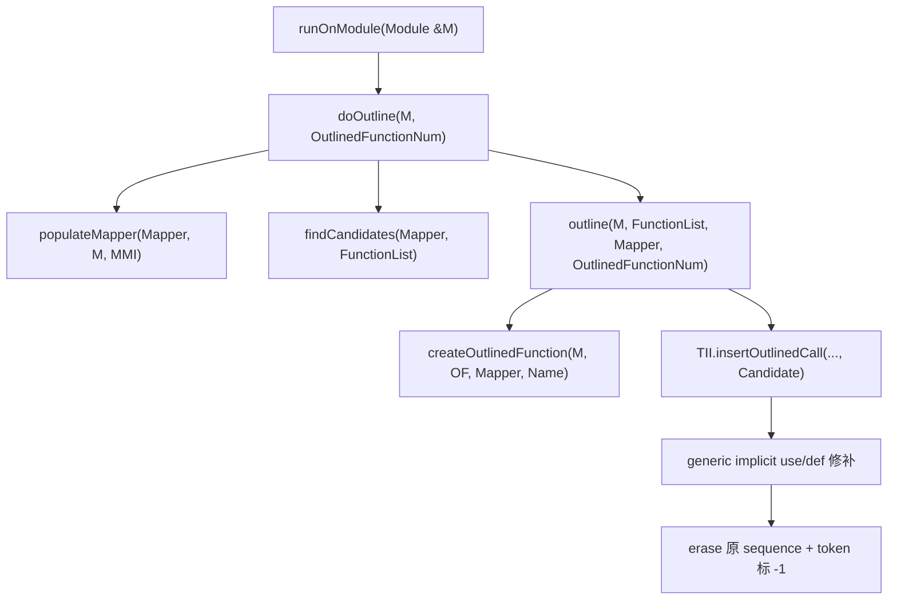

### `runOnModule`

关键变量：

- `OutlinedFunctionNum`：本轮 outline 中 helper 的序号，从 0 开始。
- `OutlineRepeatedNum`：第几轮 outliner，初始为 0，多轮 rerun 时递增。
- `OutlinerReruns`：`-machine-outliner-reruns=N` 指定的额外运行次数。

执行流程：

1. 如果 module 为空，直接返回 false。
2. 设置 `OutlineRepeatedNum = 0`。
3. 调一次 `doOutline(M, OutlinedFunctionNum)`。
4. 如果第一次没有 outline 任何东西，返回 false。
5. 如果第一次有修改，则进入 rerun loop，最多再跑 `OutlinerReruns` 次。
6. 每次 rerun 前把 `OutlinedFunctionNum` 重置为 0，并 `OutlineRepeatedNum++`。
7. 某次 rerun 如果没有 outline 出任何东西，提前退出 loop。
8. 只要第一轮有修改，`runOnModule()` 返回 true。

副作用：

- 多轮运行会在同一个 module 中继续创建 helper。
- 第一轮 helper 名字是 `OUTLINED_FUNCTION_N`。
- 第 k 轮 rerun 的 helper 名字带轮次前缀，例如第二轮是 `OUTLINED_FUNCTION_2_N`。

### `doOutline`

关键变量：

- `MachineModuleInfo &MMI`：从 pass analysis 里拿到，负责 IR function 到 MachineFunction 的映射。
- `OutlineFromLinkOnceODRs`：由全局开关 `EnableLinkOnceODROutlining` 设置。
- `InstructionMapper Mapper`：本轮 token 化状态。
- `std::vector<OutlinedFunction> FunctionList`：所有 target refine 后仍有收益的候选。
- `FunctionToInstrCount`：只有打开 instruction count remark 时才填。

执行流程：

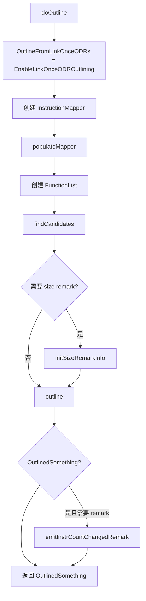

副作用：

- `populateMapper()` 本身不改机器码，只填 `Mapper`。
- `findCandidates()` 不改机器码，只生成候选列表。
- 真正修改 module 和 MachineFunction 的只有 `outline()` 及其下游。
- 如果启用 size remark，会在 outline 前后统计每个 MachineFunction 的 instruction count 并发 remark。

### `populateMapper`

关键变量：

- `Mapper.UnsignedVec`：全 module 的 token 串。
- `Mapper.InstrList`：`UnsignedVec[i]` 对应的 MachineInstr iterator。
- `Mapper.MBBFlagsMap`：每个 MBB 的 target-specific flags。
- `Mapper.InstructionIntegerMap`：用 `MachineInstrExpressionTrait` 把“相等”的 MI 映射到同一个 legal token。
- `Mapper.LegalInstrNumber`：下一个 legal token。
- `Mapper.IllegalInstrNumber`：下一个 unique illegal token，从 `-3` 往下递减。

执行流程：

1. 遍历 module 中每个 IR `Function`。
2. 空函数跳过。
3. 通过 `MMI.getMachineFunction(F)` 找不到 MachineFunction 时跳过。
4. 取 `TII = MF->getSubtarget().getInstrInfo()`。
5. 如果不是 `RunOnAllFunctions`，且 target default 不想 outline 该函数，则跳过。
6. 调 target `isFunctionSafeToOutlineFrom()`，失败则跳过。
7. 遍历每个 MBB。
8. 空 MBB 或少于 2 条指令跳过。
9. `MBB.hasAddressTaken()` 跳过。
10. 调 `Mapper.convertToUnsignedVec(MBB, *TII)`。
11. 更新统计量 `UnsignedVecSize = Mapper.UnsignedVec.size()`。

副作用：

- 填充本轮 suffix tree 的输入串。
- 对每个进入 mapper 的 MBB，保存 target flags，后续构造 `Candidate` 时会复制到 `Candidate::Flags`。
- 不修改原 MachineFunction。

### `findCandidates`

关键变量：

- `SuffixTree ST(Mapper.UnsignedVec)`：本轮 token 串的 suffix tree。
- `CandidatesForRepeatedSeq`：当前 repeated substring 的所有非重叠 occurrence。
- `StringLen = RS.Length`：当前重复子串长度。
- `StartIdx` / `EndIdx`：当前 occurrence 在 `UnsignedVec` 中的闭区间。
- `OutlinedFunction OF`：target refine 后的候选类别。

执行流程：

1. 清空 `FunctionList`。
2. 用 `Mapper.UnsignedVec` 构建 `SuffixTree`。
3. 遍历 suffix tree iterator 产生的每个 `RepeatedSubstring`。
4. 对该 repeated substring 的每个 `StartIdx` 计算 `EndIdx`。
5. 在同一个 repeated substring 内做 non-overlap 过滤。
6. 通过 `Mapper.InstrList[StartIdx]` 和 `Mapper.InstrList[EndIdx]` 找到真实指令范围。
7. 构造 `Candidate(StartIdx, StringLen, StartIt, EndIt, MBB, FunctionList.size(), Mapper.MBBFlagsMap[MBB])`。
8. 如果 occurrence 少于 2，跳过。
9. 取第一个 candidate 的 `TII` 调 `getOutliningCandidateInfo()`。
10. target 可能删除 occurrence，也可能返回空 `OutlinedFunction`。
11. target refine 后 occurrence 少于 2，跳过。
12. `OF.getBenefit() < 1`，发 `NotOutliningCheaper` remark 并跳过。
13. 有收益则 `FunctionList.push_back(OF)`。

副作用：

- 不修改机器码。
- `Candidate::FunctionIdx` 在这里用 `FunctionList.size()` 初始化，但最终选择是按 benefit 重排后的 `OutlinedFunction` 对象本身，不依赖这个 index 做全局最优。

### `outline`

关键变量：

- `FunctionList`：`findCandidates()` 产出的候选类别。
- `Mapper.UnsignedVec`：既是原始 token 串，也是 selection 阶段的占用标记表。
- `OutlinedFunctionNum`：本轮 helper 名字序号。
- `OutlinedSomething`：本轮是否发生修改。

执行流程：

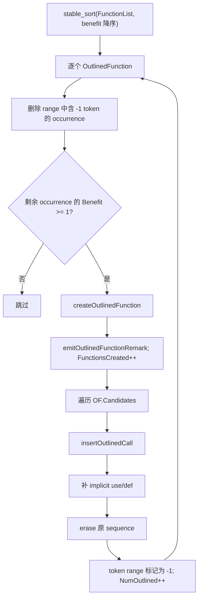

副作用：

- 创建新的 helper MachineFunction。
- 在每个 occurrence 的原位置插入 call/branch/save/restore。
- 删除原始 repeated sequence。
- 把对应 token range 标为 `-1`，后续候选如果 overlap 会被删掉。
- 更新统计 `FunctionsCreated` 和 `NumOutlined`。

### `createOutlinedFunction`

关键变量：

- `FunctionName`：`OUTLINED_FUNCTION_` + 轮次前缀 + 本轮序号。
- `Function *F`：新建 IR function，用来承载 MachineFunction。
- `MachineFunction &MF`：helper 的 machine function。
- `MachineBasicBlock &MBB`：helper 当前只有一个 MBB。
- `FirstCand`：用第一个 occurrence clone payload。
- `LiveIns`：所有 occurrence 在 sequence 入口 live-in 的 union。

副作用：

- 在 IR module 中插入一个 internal helper function。
- 在 `MachineModuleInfo` 中创建对应 MachineFunction。
- clone payload 指令到 helper。
- 给 helper 加 live-ins。
- 调 target `buildOutlinedFrame()` 修改 helper。
- 可能创建 artificial debug subprogram。

### `insertOutlinedCall`

generic 层只调用 target hook。AArch64 hook 会按 `Candidate::CallConstructionID` 插入：

- `MachineOutlinerTailCall`：一条 `TCRETURNdi`，目标是 helper global address。
- `MachineOutlinerNoLRSave` / `MachineOutlinerThunk`：一条 `BL helper`。
- `MachineOutlinerRegSave`：`mov tmp, lr`，`BL helper`，`mov lr, tmp`。
- `MachineOutlinerDefault`：`str lr, [sp, #-16]!`，`BL helper`，`ldr lr, [sp], #16`。

hook 返回值必须是新插入的 call 指令 iterator。generic 层后续从该 iterator 开始做 implicit operand 修补和 erase。

### 1. 收集可处理函数和基本块

`populateMapper()` 遍历 module 中所有 IR `Function`，再从 `MachineModuleInfo` 取对应 `MachineFunction`。

函数级过滤：

- 空函数跳过。
- 没有 `MachineFunction` 跳过。
- 默认模式下，如果 target 的 `shouldOutlineFromFunctionByDefault()` 返回 false，跳过。
- 调 target `isFunctionSafeToOutlineFrom(MF, OutlineFromLinkOnceODRs)`，失败则跳过。

基本块级过滤：

- 空 MBB 或少于 2 条指令跳过。
- `MBB.hasAddressTaken()` 跳过，因为该 block 可能是 indirect branch target。
- 默认 `TargetInstrInfo::isMBBSafeToOutlineFrom()` 会拒绝首条非 debug 指令是 `FENTRY_CALL` 或 `PATCHABLE_FUNCTION_ENTER` 的 block。
- AArch64 再额外计算 `LR`、unsafe regs、是否含 call 等 flags。

### 2. 机器指令映射为整数串

`InstructionMapper::convertToUnsignedVec()` 对每个安全 MBB 做 token 化：

1. 对每条机器指令调用 target `getOutliningType()`。
2. `Legal` 指令按“机器指令表达式相等”映射到同一个 unsigned。
3. `Illegal` 指令映射到 unique illegal number，用来切断重复串。
4. `Invisible` 指令跳过。
5. `LegalTerminator` 先映射成 legal number，再插入 illegal separator。
6. 每个 MBB 末尾如果存在至少两条相邻 legal 指令，再插入一个 unique illegal separator，防止 suffix tree 匹配跨越 MBB / function 边界。

“机器指令表达式相等”使用 `MachineInstrExpressionTrait`：

- hash 包含 opcode 和 operand。
- equality 使用 `MachineInstr::isIdenticalTo(..., IgnoreVRegDefs)`。
- 因为 MO 运行在 post-RA、no-vreg 的 machine 阶段，实际主要是物理寄存器、立即数、全局符号、内存操作等完全相同才会匹配。

这意味着 generic MO 是 exact sequence outliner。比如：

```asm
ldr x8, [x0]
blr x8
```

和

```asm
ldr x9, [x0]
blr x9
```

通常不是同一个 token 序列，除非 target 或上游另有规范化；generic MO 本身不做寄存器重命名。

### `MachineInstrExpressionTrait` 的指令相等规则

`InstructionMapper` 用下面这个 map 记录“某条 MI 对应哪个 legal token”：

```cpp
DenseMap<MachineInstr *, unsigned, MachineInstrExpressionTrait>
```

这里 key 是 `MachineInstr *`，但 hash/equality 不是按指针地址，而是按机器指令表达式：

- hash：`MachineInstrExpressionTrait::getHashValue()`。
- equality：`MachineInstr::isIdenticalTo(Other, MachineInstr::IgnoreVRegDefs)`。

hash 的组成：

- opcode 必须一致。
- 遍历所有 operands，把每个 operand 的 `hash_value(MO)` 加入 hash。
- 唯一忽略项是“virtual register def”。如果 operand 是 register、是 def、且寄存器是 virtual register，则 hash 跳过它。

equality 的组成：

- opcode 必须一致。
- operand 数量必须一致。
- 如果是 bundle，bundle 内每条 MI 也必须递归一致。
- 逐 operand 比较 `MachineOperand::isIdenticalTo()`。
- `IgnoreVRegDefs` 只忽略 virtual register def 的不同；物理寄存器 def 不会被忽略。
- debug instruction 还会比较 debug location；不过 AArch64 MO 会把 debug instruction 标成 `Invisible`，通常不进入 token 串。

对 MO 来说，AArch64 已经是 post-RA/no-vreg 阶段，因此“忽略 virtual register def”基本不产生宽松匹配。实际会导致两条 MI 不相等的常见差异包括：

| operand 类型 | 必须相同的内容 | 例子 |
| --- | --- | --- |
| Register | register number、def/use、subreg | `ldr x8, [x0]` 与 `ldr x9, [x0]` 不同 |
| Immediate | immediate value 和 target flags | `add x0, x0, #8` 与 `#16` 不同 |
| CImmediate / FPImmediate | constant pointer/value | 不同常量对象不同 |
| MachineBasicBlock | MBB 指针 | branch 目标不同则不同 |
| FrameIndex | frame index | 不同栈对象不同，且 AArch64 已经提前把 FI operand 判 illegal |
| ConstantPoolIndex / TargetIndex | index 和 offset | 不同常量池项或 offset 不同 |
| JumpTableIndex | index | 不同 jump table 不同 |
| GlobalAddress | global 指针和 offset | `bl foo` 与 `bl bar` 不同 |
| ExternalSymbol | symbol name 和 offset | PLT symbol 不同则不同 |
| BlockAddress | block address 和 offset | block address 不同则不同 |
| RegisterMask / LiveOut | regmask 内容 | call clobber mask 不同则不同 |
| MCSymbol | symbol 指针 | symbol 不同则不同 |
| CFIIndex | CFI index | 不同 CFI 记录不同，且 AArch64 operand 层会拒绝 CFIIndex 普通 operand |
| Metadata / IntrinsicID / Predicate / ShuffleMask | 对应对象或值 | 任一不同都会不同 |

两个看起来“语义类似”的序列只要临时寄存器不同、global target 不同、branch 目标不同、call regmask 不同、implicit operand 不同，都会映射成不同 token。MO 不会把它们归一化。

### 3. Suffix tree 找重复子串

`findCandidates()` 对全 module `UnsignedVec` 构建 `SuffixTree`。suffix tree 的每个 repeated substring 表示至少出现两次的整数子串。

generic 层对每个 repeated substring：

- 长度至少为 2。
- 遍历所有 start index，构造 `Candidate`。
- 对同一个 repeated substring 内部先做一次 non-overlap 过滤，避免 `AAAAAA` 中 `AA` 的重叠 occurrence 全部进入后续成本计算。
- 取第一个 candidate 的 `TII`，调用 target `getOutliningCandidateInfo(Candidates)`。
- 如果 target 删除后 occurrence 少于 2，放弃。
- 如果 `Benefit < 1`，放弃。
- 否则把它加入 `FunctionList`。

这一阶段只负责“发现候选类别”。最终是否真的 outline，还要等 selection 阶段处理不同候选之间的 overlap。

### Suffix tree 内部如何枚举 repeated substring

LLVM `SuffixTree` 的输入是 `std::vector<unsigned>`，也就是 `Mapper.UnsignedVec`。它用 Ukkonen 算法构建压缩后缀树：

- 每个 leaf 表示输入串的一个 suffix。
- 每个 internal node 表示一个至少被多个 suffix 共享的前缀，也就是某个重复 substring。
- edge label 不是单个字符，而是原串上的 `[StartIdx, EndIdx]` 区间。
- leaf 的 `EndIdx` 指向共享的 `LeafEndIdx`，构造每个 prefix 时只更新一个全局叶子终点，避免 O(N) 更新所有 leaf。
- internal node 有 suffix link，用于 Ukkonen 算法在线性时间内移动到“去掉首字符后的同类状态”。
- 构造完成后，`setSuffixIndices()` 给 leaf 填 suffix start index，并给每个 node 填 `ConcatLen`，即 root 到该 node 的路径总长度。

MO 当前用的是 `SuffixTree` iterator，而不是 `getRepeatedSubstrings()` 函数。iterator 的 `advance()` 逻辑可以简化为：

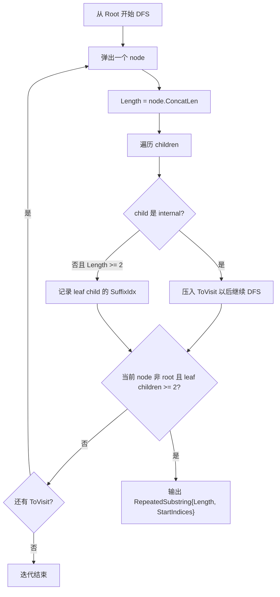

这里有两个细节：

- iterator 只把“当前 internal node 的直接 leaf children”放入 `StartIndices`。这和 `getRepeatedSubstrings()` 的递归收集所有 descendant leaf 不一样。
- internal child 会被压入 `ToVisit` 单独处理，所以更长的重复串会在更深的 internal node 上单独产出。

因此 MO 会枚举很多不同长度的重复串。后续 `findCandidates()` 和 `outline()` 的 overlap/benefit 逻辑决定最终选哪个。

### 4. Target refine 和成本判定

generic 层不知道 AArch64 的 ABI，因此候选 legality 和 lowering 成本都交给 `TargetInstrInfo::getOutliningCandidateInfo()`。

target 在这里可以：

- 删除不安全 occurrence。
- 决定每个 occurrence 的 `CallConstructionID` 和 `CallOverhead`。
- 决定 helper 的 `FrameConstructionID` 和 `FrameOverhead`。
- 按 target 真实指令大小设置 `SequenceSize`。
- 返回空 `OutlinedFunction()` 表示拒绝。

AArch64 的具体逻辑见后文。

### 5. 按 benefit 贪心选择

`outline()` 先把所有 `OutlinedFunction` 按 `getBenefit()` 从大到小 stable sort。

随后逐个处理：

1. 删除已经与之前 accepted candidate 重叠的 occurrence。实现方式是：已经被 outline 删除的 token 在 `Mapper.UnsignedVec` 中被标成 `-1`。
2. 重新用剩余 occurrence 计算 `OF.getBenefit()`，如果不再有收益则跳过。
3. 创建 helper function。
4. 逐个 occurrence 插入 call/branch helper。
5. 删除原 sequence。
6. 把原 token range 标成 `-1`，防止后续候选重叠使用。

这就是 MO 的核心选择策略：按当前 target-modeled benefit 的贪心。它不求全局最优，也不会在冲突图上求最大权独立集。

### overlap 处理的两层机制

MO 有两层 overlap 处理，分别发生在 `findCandidates()` 和 `outline()`。

第一层是同一个 repeated substring 内的 occurrence 去重。`findCandidates()` 对某个 `RS.Length` 的所有 `RS.StartIndices` 逐个尝试构造 candidate：

```text
StartIdx = RS.StartIndices[i]
EndIdx   = StartIdx + RS.Length - 1
```

只有当它和当前 `CandidatesForRepeatedSeq` 中已有 candidate 全都不重叠时才保留：

```text
EndIdx < Existing.StartIdx || StartIdx > Existing.EndIdx
```

这个规则处理的是同一种重复串内部的自重叠，例如 token 串 `AAAAAA` 里长度 2 的 `AA` 可以出现在 0、1、2、3、4，但最多只能选择 0、2、4 这种不重叠集合。

第二层是不同 `OutlinedFunction` 之间的跨候选冲突。`outline()` 先按 benefit 降序处理 `FunctionList`。一旦某个 occurrence 被真正 outline，generic 层会把它在 `Mapper.UnsignedVec` 中的 token range 全部写成 `static_cast<unsigned>(-1)`。

后续候选处理前会删除任何 range 内含 `-1` 的 occurrence：

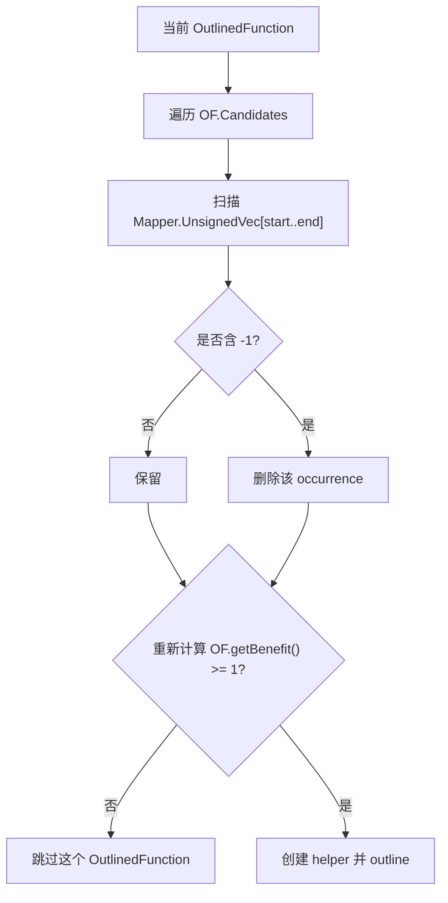

这意味着：

- 高 benefit 候选会优先占用 token。
- 低 benefit 候选如果和高 benefit 候选 overlap，会丢掉对应 occurrence。
- 丢掉部分 occurrence 后，`OF.getBenefit()` 会用剩余 occurrence 重新计算。
- 如果剩余 occurrence 不足以盈利，则整个候选类别跳过。

这是贪心，不是全局最优。它没有回溯，也不会为了多个中等收益候选撤销一个大收益候选。

### 6. 创建 helper function

`createOutlinedFunction()` 做的事情：

- 新建一个 IR `Function`，名字形如 `OUTLINED_FUNCTION_N`。
- 设置 `InternalLinkage` 和 `UnnamedAddr::Global`。
- 添加 `OptimizeForSize` / `MinSize`，减少 helper 之间 padding。
- 调 target `mergeOutliningCandidateAttributes()` 合并候选属性。
- 如果任一候选需要 unwind table，helper 也设置对应 `UWTableKind`。
- 创建一个 `MachineFunction` 和单个 `MachineBasicBlock`。
- 从第一个 candidate clone 原始机器指令到 helper。
- CFI 指令会复制对应 `MCCFIInstruction` 到 helper 的 frame instruction list。
- debug instruction 跳过，普通指令清空 debug location 并 drop memrefs。
- 设置 MachineFunction property：`NoPHIs`、`NoVRegs`、`TracksLiveness` 等。
- 计算所有 occurrence 在 sequence 入口的 live-in union，并添加到 helper MBB live-ins。
- 调 target `buildOutlinedFrame()` 插入 helper frame、return、signing、SP fixup 等。

这里 helper payload 只从第一个 occurrence clone。其他 occurrence 必须已经被 exact matching 和 target legality 证明等价。

### helper 属性和 debug subprogram 细节

`createOutlinedFunction()` 先创建一个 IR-level function，再通过 `MachineModuleInfo` 创建对应 `MachineFunction`。这些属性会影响后端 codegen、linker 和 debug info：

- 函数类型是 `void ()`。
- 初始创建时用 `ExternalLinkage`，随后立刻改成 `InternalLinkage`。
- 设置 `UnnamedAddr::Global`，表示函数地址本身不承载语义身份，便于后续合并/优化。
- 添加 `OptimizeForSize` 和 `MinSize`，注释里明确是为了避免 outlined functions 之间插入 padding。
- 调 `TII.mergeOutliningCandidateAttributes(*F, OF.Candidates)` 合并 target features / nounwind 等属性。
- 计算所有 parent function 的 `UWTableKind` 最大值；如果不是 `None`，给 helper 设置同样的 unwind table kind。
- 创建一个 IR `entry` basic block，里面只有 `ret void`。这个 IR 只是 MachineFunction 的容器，真实执行逻辑在 MachineBasicBlock 里。
- 新建一个 MachineBasicBlock，并插入 helper MachineFunction。
- 从第一个 candidate clone payload。debug instruction 跳过；普通 MI 清空 debug loc 并 drop memrefs；CFI MI 会复制对应 `MCCFIInstruction` 到 helper 自己的 frame instruction list。
- 设置 MachineFunction properties：清掉 `IsSSA`，设置 `NoPHIs`、`NoVRegs`、`TracksLiveness`。
- `freezeReservedRegs(MF)` 固定 helper 的 reserved register 信息。
- 计算所有 occurrence 入口 live-in 的 union，并加到 helper MBB。
- 最后调用 target `buildOutlinedFrame()`。

debug subprogram 逻辑：

- `getSubprogramOrNull(OF)` 会从所有 candidate 的 parent function 中找第一个 `DISubprogram`。
- 如果找到了，就用同一个 compile unit 和 file 创建 helper 的 artificial `DISubprogram`。
- helper debug subprogram 的 line 是 0，flag 包含 `FlagArtificial`、`SPFlagDefinition`、`SPFlagOptimized`。
- 不创建局部变量 debug info。
- 这让 debug info 能知道 helper 是编译器生成的 optimized artificial function。

### 7. 改写 callsite

对每个 occurrence：

1. 在原 sequence 第一条指令位置调用 target `insertOutlinedCall()` 插入 call/branch。
2. generic 层为新 call 指令补 implicit operands：
   - sequence 内所有 def 加为 implicit def。
   - sequence 内暴露 use 加为 implicit use。
   - 同时移除被移动 call 的 callsite info。
3. 删除新 call 后面到原 sequence 最后一条指令的所有原始指令。
4. 标记 token 已删除。

注意：generic MO 的 implicit use/def 建模是基于被删除 range 的寄存器 operand 扫描，目标是维护 MachineVerifier 和后续 liveness 假设，不是完整的跨 CFG semantic live-in/live-out 框架。

### callsite implicit use/def 扫描算法

target `insertOutlinedCall()` 插入 call 后，generic 层会把被删除 sequence 的寄存器约束挂到新 call 上。源码从 sequence 末尾反向扫到新 call 指令之后，维护两个集合：

- `DefRegs`：sequence 内定义过的寄存器，最后会加到 call 的 implicit def。
- `UseRegs`：sequence 对外暴露的 use，最后会加到 call 的 implicit use。
- `InstrUseRegs`：当前单条 MI 内看见的 use，用来处理同一条 MI 里 read-modify-write 的情况。

扫描逻辑：

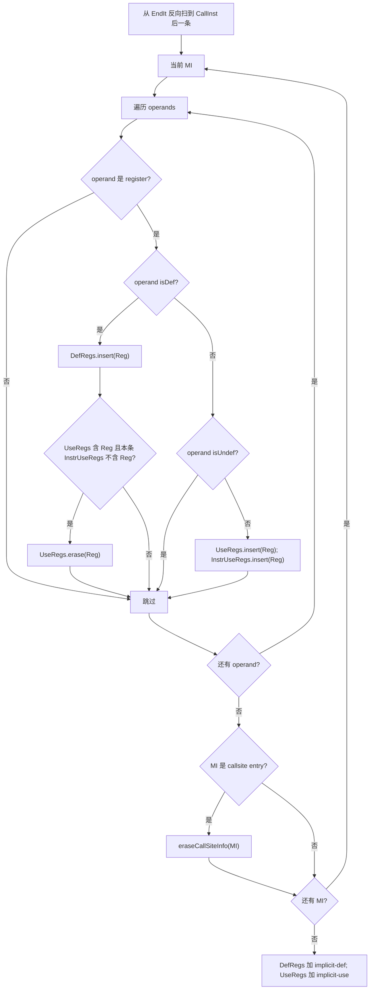

直观解释：

- 反向扫描中，看到一个 use，说明这个寄存器的值需要从 helper call 边界传入，加入 `UseRegs`。
- 再往前看到同一个寄存器的 def，说明该 use 可以由 sequence 内部定义提供，不再是 exposed use，于是从 `UseRegs` 删除。
- 但如果同一条 MI 同时 use 和 def 同一个寄存器，`InstrUseRegs` 会阻止误删，保留 read-modify-write 的 use。
- 所有 def 都要挂到新 call 上，因为原 sequence 删除后，后续 liveness 仍需要知道这些寄存器由 call 产生。

限制：

- 它只扫描 register operands，不理解内存语义。
- 它是 MI operand 层的保守建模，不是 target-specific ABI live-in/live-out 精确重建。
- 它会删除被搬走 call 的 callsite info，避免 stale callsite metadata 留在原函数中。

### 8. Rerun

`runOnModule()` 至少运行一次 `doOutline()`。如果 `-machine-outliner-reruns=N`，则最多再跑 N 次。

第二轮能发现第一轮 helper/callsite 改写后新产生的重复，但代价是编译时间更高，且命名会变成 `OUTLINED_FUNCTION_2_N` 这类形式。

多轮命名规则：

```text
OutlineRepeatedNum = 0: OUTLINED_FUNCTION_0, OUTLINED_FUNCTION_1, ...
OutlineRepeatedNum = 1: OUTLINED_FUNCTION_2_0, OUTLINED_FUNCTION_2_1, ...
OutlineRepeatedNum = 2: OUTLINED_FUNCTION_3_0, OUTLINED_FUNCTION_3_1, ...
```

每一轮 rerun 都会把 `OutlinedFunctionNum` 重置为 0，所以名字里的第二个数字是该轮内部序号。

### remarks 和统计量

MO 定义的 `STATISTIC`：

- `NumOutlined`：被 outline 的 candidate occurrence 数量。源码在每个 occurrence 物化后递增一次。
- `FunctionsCreated`：创建的 helper function 数量。
- `NumLegalInUnsignedVec`：写入 token 串的 legal instruction 数量。
- `NumIllegalInUnsignedVec`：写入 token 串的 illegal separator / illegal instruction 数量。
- `NumInvisible`：被标为 invisible 并跳过的 instruction 数量。
- `UnsignedVecSize`：当前 mapper token 串大小。

optimization remarks：

- `NotOutliningCheaper`：target refine 后有候选，但 `OutliningCost >= NotOutliningCost`，也就是 `Benefit < 1`。remark 中包含长度、occurrence 数、outline cost、not-outline cost 和其他 occurrence 的 debug loc。
- `OutlinedFunction`：成功创建 helper 时发出。remark 中包含 saved bytes、sequence 长度、occurrence 数和所有 start loc。
- `FunctionMISizeChange`：如果 module 打开 instruction count changed remark，MO 会在 outline 前后记录每个 MachineFunction instruction count，并对发生变化的函数发 size-info remark。

这些 remark 主要服务诊断和 `-Rpass/-Rpass-missed` 类输出，不参与选择算法。

## Target hook 合同

target 需要实现：

- `getOutliningCandidateInfo()`：给重复序列集合做 target-specific legality、成本和 lowering 分类。
- `getOutliningType()`：把每条 MI 分类为 legal / legal terminator / illegal / invisible。
- `isFunctionSafeToOutlineFrom()`：函数级安全性过滤。
- `buildOutlinedFrame()`：helper 内部 frame / return / signing / stack fixup。
- `insertOutlinedCall()`：callsite 插入 call/branch/save/restore。

target 可选实现：

- `isMBBSafeToOutlineFrom()`：基本块级过滤和 flags。
- `mergeOutliningCandidateAttributes()`：把候选函数属性合并到 helper。
- `shouldOutlineFromFunctionByDefault()`：默认模式下哪些函数值得 outline。

generic MO 的边界是：它只负责发现和调度，ABI 正确性必须由 target hook 保证。

### `mergeOutliningCandidateAttributes`

当前 AArch64 没有在 `AArch64InstrInfo` 里覆盖这个 hook，因此使用 `TargetInstrInfo` 默认实现。默认实现只做两件事：

- 从第一个 candidate 的 parent function 拿 `"target-features"` attribute，并复制到 helper。
- 如果所有 candidate 的 parent function 都有 `nounwind`，则给 helper 加 `nounwind`。

复制 `"target-features"` 的原因是 helper payload 来自 parent function 的机器指令。如果 parent function 是在特定 target features 下生成的，例如使用某些 AArch64 extension 指令，helper 也必须带同样 feature 信息，否则后续 asm/printer/subtarget 判断可能不一致。

`nounwind` 的合并规则是 all-of，而不是 any-of。只有所有来源函数都保证不 unwind，helper 才能标成 `nounwind`。如果任一 parent 可能 unwind，helper 不能擅自丢 unwind 行为。

注意：`UWTableKind` 不在这个 hook 里合并，而是在 `createOutlinedFunction()` 中单独取所有 candidate parent 的最大值。

## AArch64 MO 的安全过滤

这一节按源码执行顺序展开。AArch64 的安全性判断分三层：函数级、MBB 级、指令级。前两层决定哪些区域会进入 `InstructionMapper`，第三层决定单条 MI 在 token 串里是 `Legal`、`LegalTerminator`、`Illegal` 还是 `Invisible`。

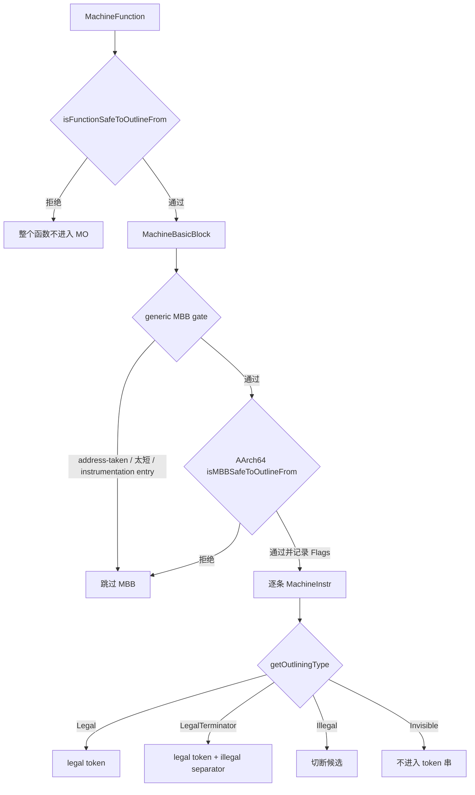

### 函数级过滤

generic `populateMapper()` 先做通用过滤：

- IR `Function` 为空，跳过。
- 找不到对应 `MachineFunction`，跳过。
- 默认模式下，`shouldOutlineFromFunctionByDefault()` 为 false，跳过。AArch64 默认只对 `minsize` 函数返回 true；显式 `-moutline` / `-enable-machine-outliner` 会让 pass 跑所有 target 判定安全的函数。
- target `isFunctionSafeToOutlineFrom()` 返回 false，跳过。

AArch64 `isFunctionSafeToOutlineFrom()` 当前拒绝：

- `F.hasLinkOnceODRLinkage()` 且没有打开 `-enable-linkonceodr-outlining`。
- `F.hasSection()`，也就是函数显式放在某个 section。
- `MF.getInfo<AArch64FunctionInfo>()` 为空。
- `AFI->hasRedZone().value_or(true)` 为真。注意这里 `unknown` 会按 true 处理，所以 redzone 状态无法证明时也拒绝。
- `MF.getTarget().getMCAsmInfo()->usesWindowsCFI()` 为真。

拒绝原因：

- `linkonce_odr` 可能被 linker dedup，module 内创建 private helper 会改变体积收益和 dedup 机会。
- explicit section 可能要求所有代码留在指定 section；MO 生成的 helper 是新的 internal function，不一定满足原 section 语义。
- redzone 函数允许在不移动 SP 的情况下使用 SP 以下区域；AArch64 MO 的 LR 保存可能移动 SP 或在 SP 附近写内存，因此 unknown/redzone 情况保守拒绝。
- Windows unwind info 没有对应 MO fixup。

### MBB 级过滤和 flags

generic mapper 进入 `convertToUnsignedVec()` 前还会跳过：

- `MBB.empty()`。
- `MBB.size() < 2`。
- `MBB.hasAddressTaken()`。address-taken block 可能是 indirect branch target，移动开头指令会破坏 landing pad 语义。

默认 `TargetInstrInfo::isMBBSafeToOutlineFrom()` 会拒绝首条非 debug 指令是：

- `TargetOpcode::FENTRY_CALL`。
- `TargetOpcode::PATCHABLE_FUNCTION_ENTER`。

这些 instrumentation / patchable entry 序列必须留在函数入口附近。

AArch64 `isMBBSafeToOutlineFrom()` 继续做寄存器安全分析，并在 `Flags` 中记录摘要：

- 反向累计整个 MBB 的 `LiveRegUnits`。
- 如果 `W16`、`W17`、`NZCV` 在整个 block 内都可用，设置 `UnsafeRegsDead`。
- 加入 MBB live-outs 后，如果 `W16`、`W17` 或 `NZCV` 在 block 内看似可用但实际 live-out，则拒绝整个 MBB。
- 如果 MBB 内任意 MI 是 call，设置 `HasCalls`。
- 查找是否存在一个非 reserved、非 `LR`、非 `X16`、非 `X17` 的 `GPR64` 在整个 MBB 内可用。
- 如果没有可用 GPR 保存 LR，且 `LR` 在 MBB 某处不可用，设置 `LRUnavailableSomewhere`。

这里 `W16/W17/NZCV` 被称作 unsafe，是因为按 AArch64 PCS：

- `x16/x17` 是 intra-procedure-call scratch registers，普通 call 边界不保证 preserved。
- `NZCV` 条件码也不保证 call 前后 preserved。

MO 会把 inline 机器码片段替换成 call/branch helper。如果这个新边界破坏了原本后续还要使用的 `x16/x17/NZCV`，程序语义就会错。因此 AArch64 在 MBB 级先做粗过滤，候选级再做精过滤。

### 指令级分类总览

AArch64 `getOutliningType()` 的执行顺序如下：

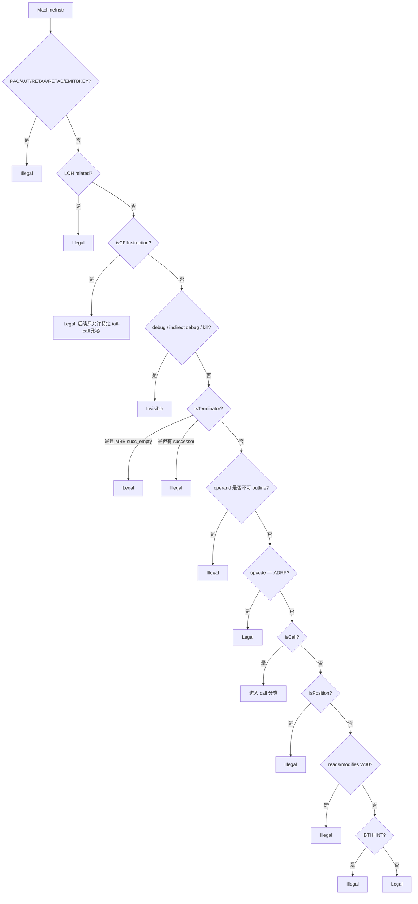

### `Illegal` 指令清单

AArch64 MO 没有维护一个“所有 illegal opcode 的固定表”。源码是按一组谓词动态判定：有些是明确 opcode，有些是机器指令属性，例如 `isTerminator()`、`isCall()`、`isPosition()`、`readsRegister(W30)`，还有一些是 operand 类型。因此“illegal 的指令”准确地说是下面这些类别。

明确按 opcode 直接 `Illegal` 的 return-address signing / authentication 指令：

- `AArch64::PACIASP`
- `AArch64::PACIBSP`
- `AArch64::AUTIASP`
- `AArch64::AUTIBSP`
- `AArch64::RETAA`
- `AArch64::RETAB`
- `AArch64::EMITBKEY`

原因：这些指令和函数入口/出口的 return-address signing contract 绑定。MO 生成的是共享 helper，不能简单把 caller 的 signing/authentication 指令搬到 helper。

LOH related 指令直接 `Illegal`：

- `FuncInfo->getLOHRelated().count(&MI)` 为真。

原因：LOH 是 linker optimization hint，通常成组依赖相对位置。只移动其中一部分可能破坏 linker 后续识别。

非 `CFI_INSTRUCTION` 的普通 MI 中，如果 operand 层出现以下内容，也直接 `Illegal`：

- operand 是 `CPI`。
- operand 是 `JTI`。
- operand 是 `CFIIndex`。这里特指非 `TargetOpcode::CFI_INSTRUCTION` 指令里的 CFIIndex operand；真正的 CFI pseudo 会先被 `MI.isCFIInstruction()` 分支处理。
- operand 是 `FI`。
- operand 是 `TargetIndex`。
- operand 是非 implicit register，且寄存器是 `LR` 或 `W30`。

原因：

- `CPI/JTI/FI/TargetIndex` 和当前函数局部表、frame object 或 target-specific index 绑定，直接复制到 helper 需要额外重定位和修复。
- 显式使用 `LR/W30` 的指令很容易和 helper call/return ABI 冲突。

其他直接 `Illegal`：

- `MI.isPosition()`。
- `MI.readsRegister(W30)` 或 `MI.modifiesRegister(W30)`。
- BTI HINT：`AArch64::HINT` 且 immediate 是 `32`、`34`、`36`、`38`。
- 非函数出口 terminator：`MI.isTerminator()` 且所在 MBB 有 successor。
- call 目标是 `\01_mcount`。
- unsupported call pseudo：如果 `MI.isCall()`，但 opcode 不是 `BL`、`BLR`、`BLRNoIP`，且不能证明 callee 是无栈帧本地函数，则按 `Illegal` 处理。

BTI HINT 不允许搬走，因为原 basic block 可能是 indirect branch landing pad。把 BTI 移入 helper 后，原地址不再满足 BTI landing requirement。

按源码规则汇总如下：

| Illegal 来源 | 具体命中条件 | 为什么拒绝 |
| --- | --- | --- |
| return-address signing/auth opcode | `PACIASP`、`PACIBSP`、`AUTIASP`、`AUTIBSP`、`RETAA`、`RETAB`、`EMITBKEY` | 与函数 PAC/AUT contract 绑定，不能作为普通 payload 搬走 |
| LOH related MI | `getLOHRelated().count(&MI)` | linker optimization hint 依赖成组位置 |
| 非出口 terminator | `MI.isTerminator()` 且 MBB 有 successor | MO 不改写 CFG successor，不能跨基本块 outline |
| 局部对象 operand | `CPI`、`JTI`、`FI`、`TargetIndex` | 绑定当前函数的常量池、跳表、frame object 或 target index |
| 非 CFI pseudo 的 CFI operand | 非 `CFI_INSTRUCTION` 指令中出现 `CFIIndex` operand | generic clone 不知道如何维护该 CFI 语义 |
| 显式 LR operand | 非 implicit register operand 是 `LR/W30` | 容易和 helper call/return 使用的 LR 冲突 |
| position 指令 | `MI.isPosition()` | 位置相关，移动后语义可能变化 |
| 任意读写 W30 | `readsRegister(W30)` 或 `modifiesRegister(W30)` | 影响 link register 语义 |
| BTI HINT | `HINT #32/#34/#36/#38` | 原 block 的 indirect landing pad 不能被搬走 |
| `_mcount` call | callee 名字是 `\01_mcount` | Linux ftrace 等依赖它保持原位置 |
| unsupported call pseudo | call opcode 不是 `BL/BLR/BLRNoIP`，且没有证明为安全本地 call | call ABI、stack layout 和 LR 保护无法建模 |

### `Invisible` 指令

以下指令不进入 token 串，也不切断 legal range：

- `MI.isDebugInstr()`。
- `MI.isIndirectDebugValue()`。
- `MI.isKill()`。

含义是：debug / kill 不影响重复序列匹配。它们不会被 token 化，但 helper clone 时 debug instruction 也会被跳过。

### Terminator 分类

terminator 先于 operand 扫描处理：

- 如果 `MI.isTerminator()` 且 `MI.getParent()->succ_empty()`，返回 `Legal`。
- 如果 `MI.isTerminator()` 但 MBB 有 successor，返回 `Illegal`。

这表示 MO 只允许函数出口 terminator 进入候选。普通 block 内的 conditional branch、unconditional branch、switch lowering 之类会切断候选，因为 generic MO 不重写 CFG successor，也不处理跨基本块 continuation。

### `ADRP` 特判

`AArch64::ADRP` 在 operand 扫描后被特判为 `Legal`。

源码注释的理由是：有些后续检查会误判 PC-relative 指令和 LR 关系，但 `ADRP` 不要求 LR 保存某个特定值，因此可以 outline。

### Call 指令分类

call 分类是 AArch64 MO 最关键的保守边界。

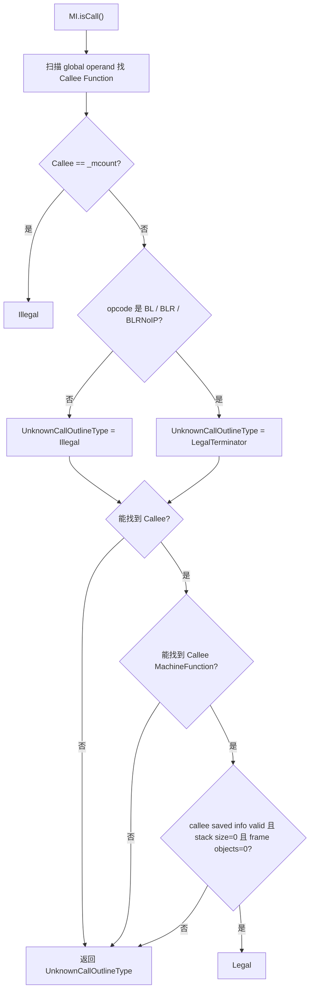

具体规则：

- 如果 call 目标是 `\01_mcount`，直接 `Illegal`。
- 对未知 call，默认 `Illegal`。
- 但如果 opcode 是 `BL`、`BLR` 或 `BLRNoIP`，未知 call 可以作为 `LegalTerminator`。
- 如果找不到 callee function，返回 `UnknownCallOutlineType`。
- 如果找到了 callee function，但没有对应 `MachineFunction`，返回 `UnknownCallOutlineType`。
- 如果 callee 的 `MachineFrameInfo` 还没有 valid callee-saved info，返回 `UnknownCallOutlineType`。
- 如果 callee stack size 大于 0，返回 `UnknownCallOutlineType`。
- 如果 callee frame object 数大于 0，返回 `UnknownCallOutlineType`。
- 只有 callee 信息完整、没有 stack frame、没有 frame object 时，call 才是普通 `Legal`。

`LegalTerminator` 的含义是：这个 call 可以出现在候选末尾，但不能作为 interior call。mapper 会在它后面插入 illegal separator，强制 suffix tree 只匹配到 call 为止。

保守原因是：如果 outline 的片段包含 call，helper 可能需要保存 LR，保存 LR 可能移动 SP；如果原 call 有 stack arguments 或 callee 依赖 caller stack layout，SP 改变会破坏 ABI。

## AArch64 候选 refine 和成本选择

`getOutliningCandidateInfo()` 接收同一个 repeated sequence 的所有 occurrence。它会进一步删除不安全 occurrence，并为剩余 occurrence 决定 callsite lowering 和 helper frame lowering。

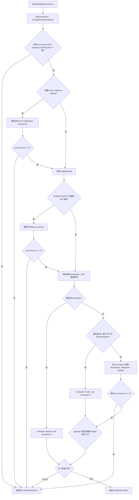

### PAC signing consensus

所有 occurrence 必须在以下属性上完全一致：

- `shouldSignReturnAddress(false)`。
- `shouldSignReturnAddress(true)`。
- `shouldSignWithBKey()`。
- subtarget 是否 `hasV8_3aOps()`。

不一致则拒绝整个 repeated sequence。原因是 helper 是一个共享函数，不能同时满足不同 signing scope、不同 key 或不同 PAuth 指令集要求。

如果代表 candidate 的函数可能需要 signing，AArch64 会先把 worst-case signing 成本加入 `FrameOverhead`：

- 估算一条 PAC 和一条 AUT，共 8B。
- 后续 `buildOutlinedFrame()` 里可能用 `RETAA/RETAB` 替代 `AUT + RET`，但 refine 阶段按保守成本估算。

### signing 场景下的 SP modification 检查

如果需要 signing，AArch64 会删除含非法 SP 修改的 occurrence。允许的 SP 修改非常窄：

- `ADDXri` / `ADDWri`，且源寄存器是 `SP`，累计 `SPValue += imm`。
- `SUBXri` / `SUBWri`，且源寄存器是 `SP`，累计 `SPValue -= imm`。
- 其他任何 modifies `SP` 的指令非法。
- 扫完整个 candidate 后，`SPValue` 必须回到 0。

这只是 signing 场景下的一层额外检查；后面如果选择 stack LR save，还会再检查 SP-relative load/store 是否能 offset fixup。

### unsafe register occurrence 删除

如果并非所有 MBB 都设置了 `UnsafeRegsDead`，AArch64 会对每个 occurrence 调：

```text
C.isAnyUnavailableAcrossOrOutOfSeq({W16, W17, NZCV})
```

如果 `W16/W17/NZCV` 在 sequence 或后续路径上不可用，就删除该 occurrence。删除后少于 2 个 occurrence 则拒绝。

### CFI 数量一致性

refine 会统计代表 occurrence 中的 CFI 指令数量 `CFICount`。如果 `CFICount > 0`，则要求每个 parent function 的 frame instruction 总数都等于 `CFICount`。

换句话说：如果要 outline CFI，就必须把该函数里的所有 CFI 都覆盖进去。否则 CFI address offset 会被拆散，unwind 信息会错。

后面还有一条最终限制：如果 `FrameID != MachineOutlinerTailCall && CFICount > 0`，拒绝。也就是说，AArch64 MO 实际只允许 CFI 出现在 tail-call outline 形态里。

### stack fixup 可行性

当 callsite 或 helper 为保存 LR 移动 SP 时，helper payload 里的 SP-relative memory instruction 可能要修 offset。`IsSafeToFixup` 的规则：

- `MI.isCall()` 直接认为 safe。
- 如果既不读 SP 也不写 SP，safe。
- 如果修改 SP，unsafe。
- 如果是 load/store，尝试用 `getMemOperandWithOffset()` 找 base 和 offset。
- base 必须是 `SP`。
- offset 不能是 scalable。
- 用 `getMemOpInfo()` 查询该 opcode 的合法 offset 范围。
- 检查 `Offset + 16` 是否仍在合法范围内。
- 其他 SP 使用，例如 `add x0, sp, #8`，当前不支持。

如果所有指令都 safe，`AllStackInstrsSafe=true`。

### 普通序列的 LR 保存策略

如果 candidate 既不是函数出口 terminator，也不是末尾 call thunk，AArch64 会逐个 occurrence 选择 callsite 形态：

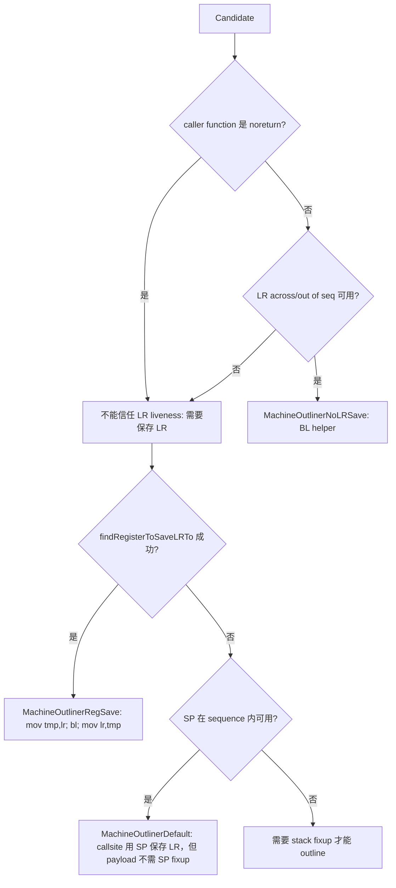

`findRegisterToSaveLRTo()` 的要求：

- 遍历 `AArch64::GPR64RegClass`。
- 过滤 target reserved register。
- 过滤 `LR`。
- 过滤 `X16` 和 `X17`。
- 候选寄存器必须 `C.isAvailableAcrossAndOutOfSeq(Reg)`。
- 候选寄存器必须 `C.isAvailableInsideSeq(Reg)`。

这里的 `Default` 有两种结果：

- 如果只保留“不需要 helper payload stack fixup”的 occurrence 更划算，MO 会剪掉需要复杂 stack fixup 的 occurrence，并让 helper frame 走普通 `NoLRSave` frame。
- 如果对所有 occurrence 都使用 stack LR save 更划算，且 `AllStackInstrsSafe=true`，MO 会选择 `MachineOutlinerDefault` frame，并在 helper 中修正 SP-relative load/store offset。

### helper 内部 call 的额外 frame 成本

如果 payload 内包含非 tail call，helper 自己执行 `BL callee` 会覆盖 helper entry LR。除 `TailCall` 和 `Thunk` 这类不需要 helper `RET` 的形态外，helper 必须保存自己的 LR。

判断规则：

- 如果 `[front, back)` 中任意 MI 是 call，认为需要 helper LR save。
- 如果最后一条是 call，但 `FrameID` 不是 `MachineOutlinerThunk` 或 `MachineOutlinerTailCall`，也认为需要 helper LR save。
- 如果需要 helper LR save 且 `AllStackInstrsSafe=false`，拒绝整个 repeated sequence。
- 如果可以处理，`FrameOverhead += 8`，对应 helper 内一条 `STRXpre` 和一条 `LDRXpost`。


## AArch64 lowering class

AArch64 定义了五种 `MachineOutlinerClass`。它们同时描述 callsite 如何进入 helper，以及 helper 如何返回。

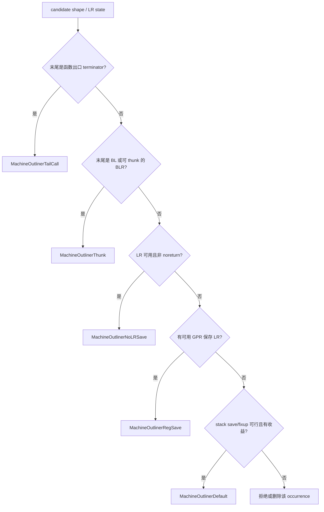

### `MachineOutlinerTailCall`

用于 sequence 末尾是函数出口 terminator 的场景。

原始形态：

```asm
I1
I2
RET
```

改写后：

```asm
b OUTLINED_FUNCTION
```

helper：

```asm
OUTLINED_FUNCTION:
  I1
  I2
  RET
```

特点：

- callsite overhead：4B，一条 branch / tail call pseudo。
- helper frame overhead：0，因为原始 return 已在 payload 内。
- 不需要保存 caller LR。
- CFI 只有在这种 tail-call 形态下才允许被 outline。

### `MachineOutlinerThunk`

用于 sequence 最后一条是 call 的场景，例如：

```asm
I1
I2
BL foo
```

改写后：

```asm
BL OUTLINED_FUNCTION
```

helper：

```asm
OUTLINED_FUNCTION:
  I1
  I2
  B foo    // MIR 中由 TCRETURN* 表达
```

含义是：caller 调 helper，helper 最后 tail-call 原 callee。原 callee 返回时直接回到 caller 的 continuation。

特点：

- callsite overhead：4B。
- helper frame overhead：0。
- 不需要 helper 额外 `RET`。
- 不需要在 helper 内保存自己的 LR，因为 final call 被改成 tail-call。
- 对 indirect call 且 BTI 开启的情况更保守：`BLR/BLRNoIP` 只有在 `!HasBTI` 时才允许走 thunk。

### `MachineOutlinerNoLRSave`

用于普通 helper call，但能证明 callsite 的 `LR` 在 sequence 和后续代码中可用，也就是不需要保留原 `LR`。

改写后：

```asm
BL OUTLINED_FUNCTION
```

helper：

```asm
OUTLINED_FUNCTION:
  I1
  I2
  RET
```

特点：

- callsite overhead：4B。
- helper frame overhead：4B，一条 `RET`。
- 不需要 caller-side save/restore LR。

### `MachineOutlinerRegSave`

用于需要保留 LR，但能找到一个 sequence 内外都可用的 GPR 暂存 LR。

改写后：

```asm
mov xN, x30
BL  OUTLINED_FUNCTION
mov x30, xN
```

实际 MIR 使用 `ORRXrs` 表达 `mov`。

helper：

```asm
OUTLINED_FUNCTION:
  I1
  I2
  RET
```

特点：

- callsite overhead：12B，save + BL + restore。
- helper frame overhead：4B。
- 不移动 SP，因此不需要修复 helper 内 SP-relative load/store。
- `findRegisterToSaveLRTo()` 遍历 `GPR64RegClass`，排除 reserved、`LR`、`X16`、`X17`，并要求该寄存器：
  - `isAvailableAcrossAndOutOfSeq()`。
  - `isAvailableInsideSeq()`。

### `MachineOutlinerDefault`

用于需要保留 LR，且不能用寄存器保存，只能在 callsite 用 SP 临时保存 LR。

改写后：

```asm
str x30, [sp, #-16]!
BL  OUTLINED_FUNCTION
ldr x30, [sp], #16
```

helper：

```asm
OUTLINED_FUNCTION:
  I1
  I2
  RET
```

特点：

- callsite overhead：12B。
- helper frame overhead：4B。
- 因为 caller 进入 helper 前移动了 SP，helper 内如果有 SP-relative load/store，需要把 offset 加 16。
- `fixupPostOutline()` 只支持可通过 immediate offset 修复的 SP-based load/store。
- 修改 SP 的指令更严格，只允许能证明 overall SP delta 为 0 的简单 add/sub 场景；其他 SP 修改拒绝。
- 对 helper 内部也有 call 且还需要 stack LR save 的场景非常保守，避免“双重 stack fixup”。

## AArch64 helper 内含 call 的处理

如果 outlined payload 内部存在非 tail call，那么 helper 自身执行 `BL callee` 会覆盖 helper entry 的 LR。对于普通 helper `RET` 形态，helper 必须保存自己的 return address。

AArch64 `buildOutlinedFrame()` 在 helper 中发现非 tail call 时：

```asm
str x30, [sp, #-16]!
...
bl callee
...
ldr x30, [sp], #16
ret
```

如果需要 DWARF unwind info，还会插入：

- CFA offset +16 的 CFI。
- LR 位于 CFA-16 的 CFI。

同时 helper 内的 SP-relative load/store 会调用 `fixupPostOutline()` 做 offset +16。

由于历史 bug 46767，generic AArch64 MO 不愿同时处理 caller-side stack LR save 和 helper-side stack LR save 的双重 offset 修复。因此 `getOutliningCandidateInfo()` 会剪掉一部分“payload 内有 call 且无法安全保存 LR”的候选。

### `buildOutlinedFrame` 的具体执行路径

AArch64 `buildOutlinedFrame(MBB, MF, OF)` 在 helper MBB 上做最终形态修补：

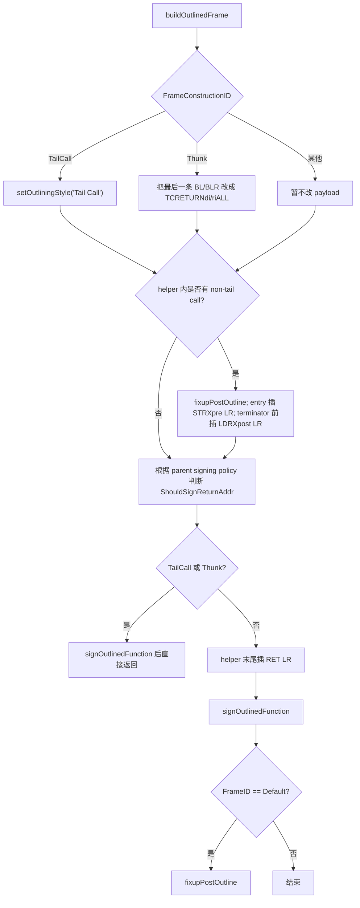

关键细节：

- `MachineOutlinerTailCall`：payload 已经包含 return，helper 不额外插 `RET`。
- `MachineOutlinerThunk`：helper payload 最后一条 call 会被替换成 tail-call pseudo：
  - `BL` -> `TCRETURNdi`。
  - `BLR` / `BLRNoIP` -> `TCRETURNriALL`。
- helper 内如果仍有 non-tail call，则说明 helper 自己需要保护 entry LR：
  - 先调用 `fixupPostOutline(MBB)`，因为插入 `STRXpre/LDRXpost` 会移动 SP。
  - helper entry 插 `STRXpre SP, LR, SP, -16`。
  - helper terminator 前插 `LDRXpost SP, LR, SP, 16`。
  - 如需 DWARF unwind，紧跟 save 位置插 CFA offset 和 LR offset CFI。
- 如果不是 tail-like frame，最后插入 `RET LR`。
- signing 在插入 helper `RET` 之后执行，这样 `signOutlinedFunction()` 可以选择把 `RET` 替换成 `RETAA/RETAB`。

### `fixupPostOutline` 的 SP offset 计算

`fixupPostOutline()` 只修 helper MBB 内 “SP base + immediate offset” 的 load/store：

1. 遍历 helper MBB 每条 MI。
2. 如果 `!MI.mayLoadOrStore()`，跳过。
3. 调 `getMemOperandWithOffsetWidth()` 解析 base、byte offset、是否 scalable、访问宽度。
4. 如果解析失败，跳过。
5. 如果 base 是 register 且不是 `SP`，跳过。
6. 取 offset operand：`getMemOpBaseRegImmOfsOffsetOperand(MI)`。
7. 调 `getMemOpInfo()` 得到该 opcode 的 scale 和合法 offset 信息。
8. 计算：

```text
NewImm = (OldByteOffset + 16) / Scale
```

9. 把 immediate operand 改成 `NewImm`。

为什么是 `+16`：MO 在 helper entry 或 callsite 额外 push 了 16B 保存 LR，使 helper 内看到的 `SP` 比原 inline 执行时低 16B。原本 `[sp + old]` 对应的对象现在位于 `[sp + old + 16]`。

安全性前提在 refine 阶段已经检查：

- offset 不是 scalable。
- `OldByteOffset + 16` 仍在该 load/store opcode 的合法 immediate 范围内。
- 只处理 load/store。其他 SP use，例如 `add x0, sp, #8`，不会被 fixup，因此 refine 阶段会拒绝。

## FrameSetup / FrameDestroy 支持边界

原生 AArch64 MO 基本不能系统性 outline 一般的 `FrameSetup` / `FrameDestroy` 片段。源码里没有专门按 `MachineInstr::FrameSetup` 或 `MachineInstr::FrameDestroy` flag 建模 frame state，而是通过 opcode、operand、terminator、CFI 和 SP/LR 规则间接限制。

整体判断可以概括为：

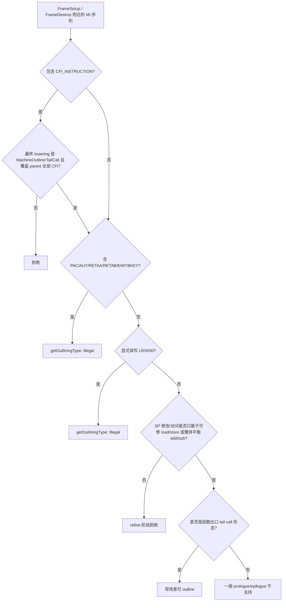

典型 prologue / frame setup 为什么难处理：

- prologue 往往伴随 `CFI_INSTRUCTION`，AArch64 MO 后续要求带 CFI 的候选只能在 `MachineOutlinerTailCall` frame 下成立；普通函数入口 prologue 不是 tail-call outline 形态。
- PAC prologue 里的 `PACIASP`、`PACIBSP`、`EMITBKEY` 会在 `getOutliningType()` 中直接 `Illegal`。
- 保存 `x29/x30` 的 `stp x29, x30, ...` 显式使用 `LR/W30`，会被 operand / register 规则拒绝。
- 修改 `SP` 的 frame setup 指令不是通用可重写对象。MO 只在特定 LR-save fixup 场景里修 SP-based load/store offset；不做完整 frame-state 迁移。
- 函数入口处的 BTI / patchable / instrumentation 也可能触发 MBB 或指令级拒绝。

典型 epilogue / frame destroy 为什么难处理：

- 恢复 `x30`、`ret x30`、`RETAA/RETAB`、`AUTIASP/AUTIBSP` 都和 LR 或 return-address authentication 绑定，很多会直接 `Illegal`。
- epilogue 常伴随 CFI state 恢复；AArch64 MO 只允许非常窄的 CFI tail-call 情况。
- 非函数出口 epilogue 或异常路径 epilogue 通常需要 CFG/landing pad/unwind state 建模，generic MO 不处理跨基本块 frame state。

能处理的窄场景：

- 候选正好以函数出口 terminator 结束，最终选择 `MachineOutlinerTailCall`。
- 如果含 CFI，则 candidate 中的 CFI 数量必须等于每个 parent function 的全部 frame instructions 数量，也就是不能只搬一部分 CFI。
- 不含被明确拒绝的 PAC/AUT/BTI/LR 显式使用等指令。
- SP 使用必须满足 refine 阶段的安全条件。

因此，原生 AArch64 MO 对 frame setup/destroy 的能力更接近“函数出口完整尾部序列可作为 tail-call helper 搬走”，而不是“理解并重建 prologue/epilogue 的 frame state”。一般意义上的 prologue/epilogue outline 不属于当前 MO 的能力范围。

## PAC / CFI / BTI 处理

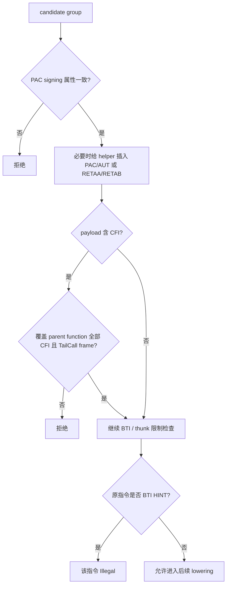

### PAC signing consensus

AArch64 要求同一 helper 的所有 occurrence 在 return address signing 策略上达成一致：

- `shouldSignReturnAddress(false)` 一致。
- `shouldSignReturnAddress(true)` 一致。
- signing key 一致。
- 是否支持 v8.3a PAuth 指令一致。

如果不一致，整个 repeated sequence 被拒绝。原因是 helper 是一个 shared function，不能对不同 caller 使用不同 signing contract。

如果候选函数可能签名 return address，AArch64 会把额外 PAC/AUT 成本先计入 `FrameOverhead`。在 `buildOutlinedFrame()` 里，`signOutlinedFunction()` 根据 target 能力插入：

- A-key：`PACIASP` 或 `PACIA`。
- B-key：`EMITBKEY` + `PACIBSP` 或 `PACIB`。
- 对应 `AUTIASP` / `AUTIBSP`，或者在 v8.3a 下把 `RET` 改为 `RETAA` / `RETAB`。
- 如果需要 DWARF unwind，还插入 `DW_CFA_AARCH64_negate_ra_state` 对应 CFI。

具体插入位置：

- `MBBPAC = MBB.begin()`，PAC 相关指令插在 helper MBB 最开头。
- B-key 场景先插 `EMITBKEY`，再插 PAC。
- 如果 subtarget 有 PAuth 指令，`PACIA/PACIB` 会显式带 `LR def`、`LR use` 和 `SP internal-read` operand；否则使用 `PACIASP/PACIBSP` pseudo/alias。
- PAC 指令设置 `FrameSetup`。
- 如果需要 DWARF unwind，PAC 后面插 `CFI_INSTRUCTION(createNegateRAState)`，也标 `FrameSetup`。
- `MBBAUT = MBB.getFirstTerminator()`，认证或 return-auth 逻辑插在第一个 terminator 位置。
- 如果 subtarget 有 PAuth 且 terminator 是普通 `RET`，直接在 `RET` 前构造 `RETAA/RETAB` 并复制原 `RET` implicit operands，然后删除原 `RET`。这种情况下不额外插 AUT，也不插第二个 negate-ra-state CFI。
- 否则在 terminator 前插 `AUTIASP/AUTIBSP`，标 `FrameDestroy`，并插第二个 `CFI_INSTRUCTION(createNegateRAState)` 标 `FrameDestroy`。

### CFI

AArch64 指令分类允许 CFI 进入 candidate，但后续有硬约束：

- 如果 candidate 内有 CFI，要求每个 parent function 的所有 CFI 都被这个 candidate 覆盖，即 `CFICount == parent frame instruction count`。
- 非 `MachineOutlinerTailCall` 的 frame ID 下，如果 `CFICount > 0`，拒绝。

也就是说，generic AArch64 MO 对 CFI 基本只支持函数出口 tail-call 型整体搬运，不做“caller 保留 CFI 状态变化、helper 搬机器指令”的分离模型。

### BTI

AArch64 generic MO 对 BTI 的处理偏保守：

- 原 site 的 BTI HINT 不允许被 outline，因为它可能是 indirect branch landing pad。
- 如果任一 candidate 所在函数开启 branch target enforcement，`BLR/BLRNoIP` 结尾的 thunk 被禁止。
- helper 是新建 internal function。MO 不把原 site 的 BTI HINT 搬进 helper，也不在 `getOutliningType()` 中把 BTI 当作普通 payload；这样可以避免原 indirect landing pad 失效。
