## 早期阶段

> 参考：[GC算法汇总](https://www.cnblogs.com/jillzhang/archive/2006/11/03/549281.html)

### 引用计数（Reference Counting）算法

#### 出现时间与背景

引用计数（Reference Counting）是最早出现的自动内存管理方法之一，由 George E. Collins 在 1960 年的论文 *A Method for Overlapping and Erasure of Lists* 中提出。它与 McCarthy 在 1960 年描述的 Lisp 标记-清除式垃圾回收几乎同时出现，但思路截然不同：引用计数不通过周期性的全局可达性扫描来发现垃圾，而是在引用被建立、覆盖或删除时维护对象的引用计数，并在计数降为 0 时立即回收对象。

#### 基本原理

- 为每个对象维护一个引用计数器，记录指向该对象的引用数量。
- 每当有新引用指向对象时计数+1，引用失效时计数-1；
- 一旦计数降为0，说明程序中无法访问该对象，垃圾回收器立即回收其内存。

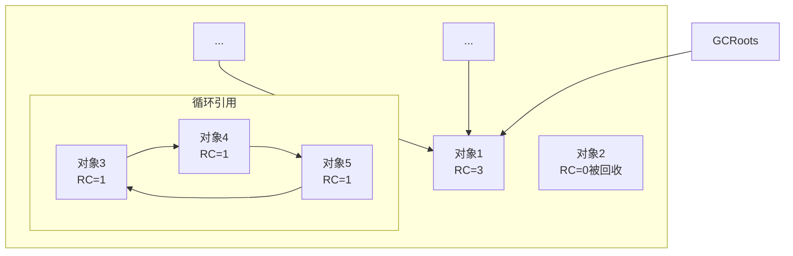

#### 主要优点

- 由于对象在计数归零时立即释放，引用计数可以及时回收内存，避免长时间积累垃圾占用空间。
- 另外，对象的销毁是确定性的（可预测的），这对需要及时释放资源（如文件句柄）的场景很有帮助。
- 实现也比较简单，不需要复杂的扫描过程。

#### 主要缺点

- 引用计数需要对每次指针赋值操作进行额外处理（增减计数），在多线程环境下还可能需要原子操作，增加了开销。
- 此外，无法处理循环引用的问题是致命缺陷：如果两个对象互相引用，双方计数都不为零，垃圾回收器将永远无法回收它们。这会导致内存泄漏。为解决循环引用，现实中的引用计数系统往往需要辅助机制，要么需要手动设置弱引用，要么需要其他GC辅助。

#### 代表实现 

##### CPython

CPython解释器采用“引用计数 + 分代循环 GC (tracing)的混合方案”：

- 引用计数负责绝大多数无环对象，特点是“快 + 释放时机确定”；

- 循环 GC负责引用环，特点是“补漏洞 + 代价稍高，按需运行”。

##### 早期COM

COM（Component Object Model）是微软在 Windows 上定义的一套“二进制组件标准”，让不同语言、不同进程、甚至不同机器上的对象，可以通过统一的接口规范互相调用。

通过 IUnknown::AddRef() / IUnknown::Release() 接口，由开发者自己遵守调用规范，来维护计数并决定对象何时销毁。

##### 早期 Objective-C 

手写 retain/release，“裸引用计数”

- retain：引用计数 +1
- release / autorelease：引用计数 −1；到 0 时对象 dealloc

引入ARC之后“调用 retain/release” 这件事从人工交给编译器自动插。

##### Swift

Swift 只对 class 实例（引用类型） 做 ARC，值类型 (struct/enum) 直接按值复制、不参与引用计数

Swift 还引入了 strong / weak / unowned 引用 来控制引用关系，防止强引用循环。

- 默认是 强引用（strong）：持有对象，计数 +1；
- weak：不增加引用计数，目标释放后自动变成 nil（必须是 Optional）；
- unowned：不增加计数，也不会自动变 nil，如果对象已经被释放再访问就崩。

#### 适用场景

- 引用计数适用于对象生命周期很明确、很少产生循环引用的场景。例如脚本解释器、GUI应用中的资源管理等。
- 由于其无法自动处理循环引用，一般不单独用于大型通用语言的内存管理，而是配合其他算法使用。
- 在需要低延迟且希望及时释放对象的场景下（如音频处理等实时系统），引用计数因无全局停顿也有一定吸引力，但必须权衡循环引用的问题。

### 标记-清除（Mark-Sweep）算法
#### 出现时间与背景

标记-清除算法是第一种实用且完善的垃圾收集算法，由 Lisp 之父 John McCarthy 等人在 1960 年提出并成功应用于 Lisp 语言。它标志着自动垃圾回收的正式诞生，是现代许多GC算法的基础。

#### 基本原理

垃圾回收分为两个阶段：首先标记，后清除。GC 会暂停程序的执行（STW，即 Stop-The-World），从一组根对象（如全局变量、栈变量等）出发，遍历并标记所有可达的对象。标记阶段结束后，任何未被标记的对象即被视为垃圾，在随后的清除阶段将其所占内存释放。简单来说，就是“标记所有存活对象，清理所有未标记对象”。

阶段1 — 标记（STW）

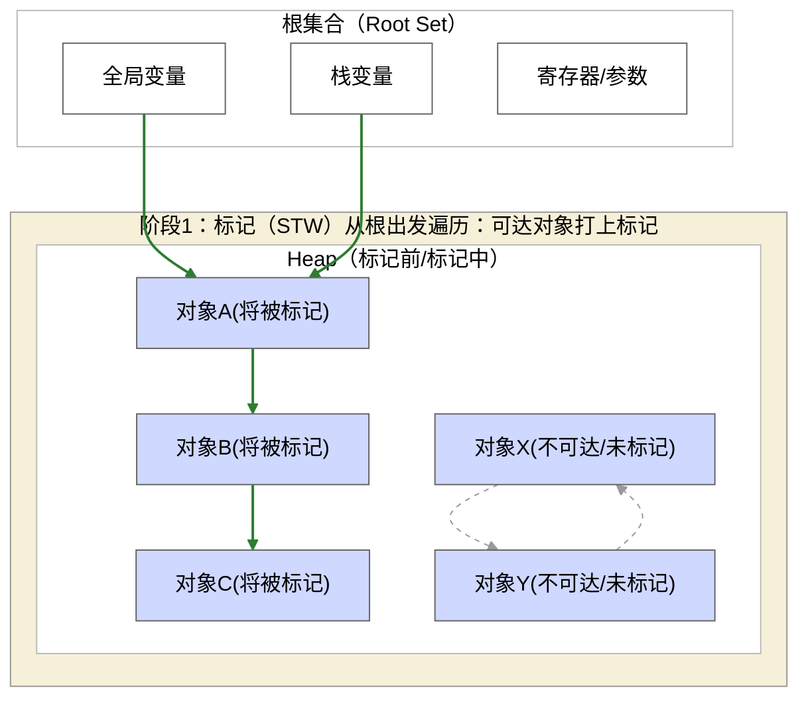

阶段2 — 清除（STW）

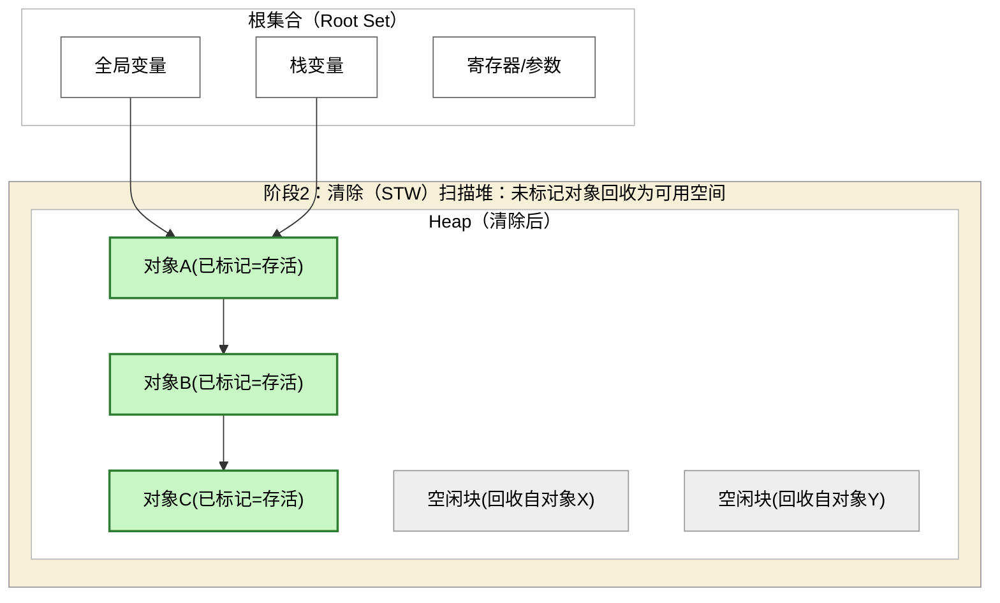

#### 主要优点

- 实现相对简单，不需要在日常内存分配或指针赋值时维护额外信息，只有在触发GC时才进行遍历扫描。
- 相比引用计数，它无需维护计数也能回收循环引用的对象，保证不留漏网垃圾。
- 在程序不触发GC时，没有运行时性能负担——这对早期内存和CPU都很有限的环境而言非常重要。

#### 主要缺点

- 一方面，它需要暂停整个应用，在单线程里完成所有标记和清除工作，停顿时间可能很长，尤其堆越大、对象越多时回收耗时越久。这在交互式应用中会造成明显卡顿。
- 清除未标记对象后，堆内存会留下许多不连续的碎片。大量碎片会导致大对象难以找到足够的连续内存分配，降低内存利用效率。
- 每次触发GC都必须遍历整个堆，算法效率随堆大小线性下降，扩展性很差：当CPU核数和堆容量大幅增加时，纯粹的标记-清除几乎无法利用上完整的硬件实力。
  
#### 代表实现

早期的 Lisp 实现都采用标记-清除，其简单可靠的特性使其在内存较小的环境下运行良好。直到今天，一些语言的实现或库仍使用标记-清除或其变种。

例如，著名的 Boehm GC 是C/C++领域广泛使用的保守式标记-清除垃圾收集库，不需要对编译器做特殊支持即可集成。Boehm GC因实现简单稳定，常用于桌面应用或游戏脚本中，其中的对象数量有限、停顿可控的场景（如 Unreal 游戏引擎曾使用它管理内存）。JavaScript 的早期实现也曾主要依赖标记-清除算法。

#### 适用场景

标记-清除适合内存空间较小、对暂停不敏感的批处理或脚本场景。如果应用程序堆不大、对象图关系简单，那么一次STW扫描的停顿还能接受，标记-清除的低运行开销优势就比较明显。但是在需要大堆、高并发或对响应延迟要求高的场景下，它的长停顿和碎片问题使其难以胜任。

## 改进阶段

随着垃圾回收技术的发展，研究者们在1960年代中后期和1970年代提出了改进方案，以提高回收效率、解决碎片等问题。其中最重要的两类改进算法是复制算法和标记-压缩算法。

### 复制（Copying）算法

#### 出现时间与背景

复制算法诞生于 1960 年代。麻省理工的 Marvin Minsky 在 1963 年发表论文，提出了将堆分成两半并通过复制存活对象来进行回收的方法。随后在 1970 年，C.J. Cheney 提出了著名的 Cheney 复制算法，优化了复制过程中的扫描和指针更新，实现了高效的半区复制。复制算法的出现是为了解决标记-清除在回收效率上的不足。

#### 基本原理

- 将可用堆内存平分为两个半区（semispaces）。
- 程序开始时只在第一个半区（From-space）分配对象。当触发垃圾回收时，暂停程序运行，将存活对象复制到另一半空闲空间（To-space），按复制的顺序紧密排列。
- 复制完成后，整个原来的 From 空间即全部可用（因其中垃圾已丢弃）。下一次GC再将角色对调过来。由于每次都只使用一半空间，另一半作为复制的目标，复制算法也称为“停止-复制”（Stop-and-copy）回收。

GC 前（只使用 From-space）

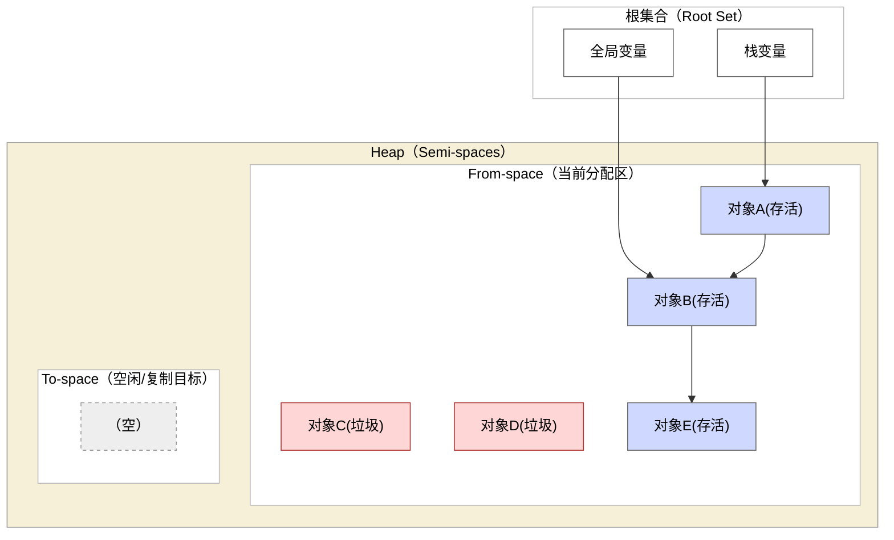

GC 时（STW 复制存活对象到 To-space，紧密排列；From-space 整块变空）

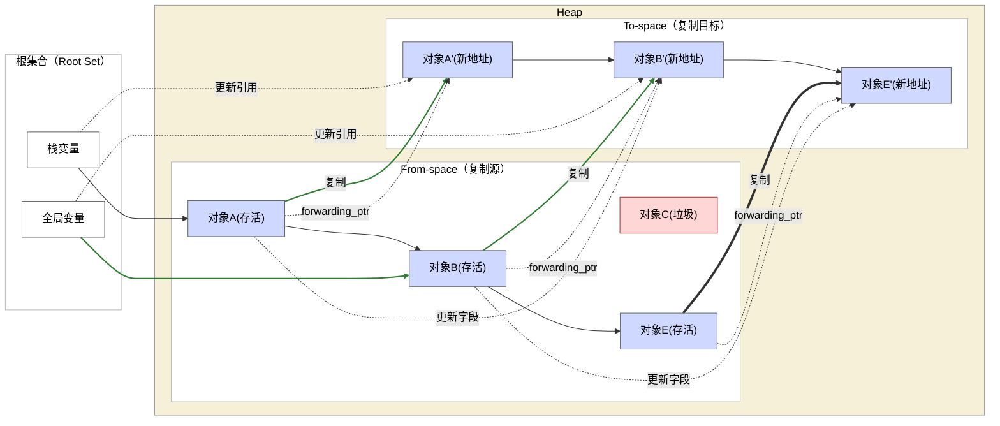

#### 主要优点

复制算法显著提高了内存回收和分配效率。

- 每次回收只需要遍历并复制存活对象，复杂度与存活对象数量成正比（而非堆大小）。
- 如果大部分对象都朝生夕灭，复制算法只需移动少量对象就能回收大量空间，速度非常快。
- 同时，复制过程中自然地将存活对象压缩到新空间中，不会产生碎片，剩余空间形成连续的可用内存块。
- 此外，内存分配也变得极其简单——由于每次回收后整个半区都是空闲的，新对象只需在半区中顺序分配（bump pointer）即可，无需维护复杂的空闲链表。这带来了很高的**分配吞吐量**和**良好的缓存局部性**。

#### 主要缺点

- 复制算法需要**牺牲一半的内存容量**来换取回收效率。在任何时候，只有一半的堆用于存放对象，另一半是空的以备复制之需，这对内存资源是一种浪费。
- 如果存活对象很多（达到半区容量），复制大量对象本身也会带来较大开销，**存活率高时效率下降**。
- 另外，对象地址在回收后会发生改变，这**要求能够更新所有对象引用**，这对实现提出了额外要求（需要移动对象的GC一般都需要某种**屏障**（barrier）或更新机制）。
  
> 总体来说，在内存充裕、对象朝生夕死的场合，复制算法性能最佳；反之则会因复制成本和空间浪费变得不划算。

> 值得一提的是，在纯复制GC难以接受的场合，一些改良方案如增量复制（Baker提出）通过插入写屏障支持了更加平滑的复制回收，这属于增量式 GC的范畴，下节介绍。

#### 代表实现

- 复制算法非常适合新生代对象回收，因此在后来的分代收集器中被广泛采用。
  - 许多语言的运行时在早期版本中直接使用纯复制GC，例如早期的 Smalltalk 实现和一些函数式语言的运行时系统。
  - Java Virtual Machine (JVM) 的 Serial 新生代收集器（也称 Copying Scavenge）就是典型的半区复制算法：新生代Eden区满时，将存活对象复制到Survivor区。
  - 另外，一些即时(JIT)编译的语言（Lua的某些实现等）也曾使用复制回收。
  

#### 适用场景

- 复制算法适用于对象生命周期短、垃圾量大的场景。例如即时通讯服务器中大量短命消息对象的回收、新生代内存占比较小的应用等。由于复制需要预留足够内存，内存空间充足时算法效果最佳。当可用内存受限或者对象存活率很高（如缓存大量长生命周期对象）时，就不宜使用纯复制算法。
  
### 标记-压缩（Mark-Compact）算法

#### 出现时间与背景

标记-压缩是在标记-清除基础上的改进方案。早期的标记-清除会导致内存碎片问题，研究者在 1960-70 年代探索出了“压缩”技术，将清除和内存整理结合起来。Lisp 2 语言的实现中就出现了标记-压缩算法的应用。

#### 基本原理

标记阶段与标记-清除相同，标记完存活对象后，在清除垃圾之前增加一个压缩（整理）阶段。通过遍历堆内存，将所有存活对象向一端移动，紧凑地排列在一起。这样在回收完成后，所有空闲空间都被合并成了一个连续区域，碎片被消除。压缩过程通常需要更新对象的引用（因为对象地址改变），因此需要暂停应用程序直到整理完成。

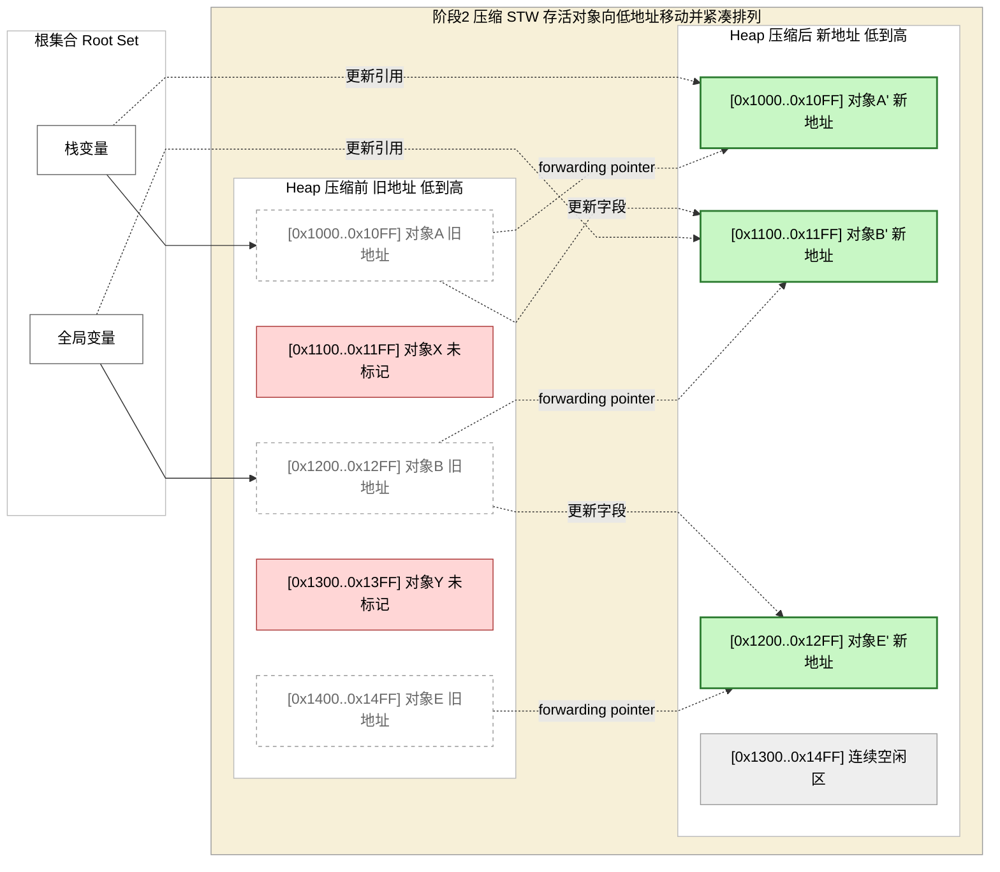

#### 主要优点
- 标记-压缩消除了碎片化。在该算法管理下，只要堆中有空闲内存，就总能找到可用的连续块来满足大对象分配，不会出现碎片导致的“有空闲内存却无法分配大对象”问题。这提高了内存利用效率和程序的稳定性。
- 由于压缩让存活对象聚集，也能在一定程度上改善缓存局部性。
- 相比复制算法，标记-压缩不需要备用半区，额外内存开销低。
  
#### 主要缺点

- 压缩过程需要移动大量对象，对大型堆而言开销不小，因此依然会导致较长的 STW 停顿。
- 和标记-清除一样，标记-压缩的总体GC开销与堆大小和存活对象数量相关。实现上，整理需要更新所有指向被移动对象的引用，相比标记-清除增加了实现复杂度。
- 标记-压缩一般也无法像纯复制那样实现简单高速的顺序分配，因为对象并未被整体搬迁到一个空半区，而是堆内保持连续但相对位置可能变化，需要管理一个移动后的分配指针或空闲列表。

#### 代表实现

- JVM 的老年代收集通常是标记-压缩：如 Serial Old 和 Parallel Old 收集器对老年代都执行标记-压缩整理，以回收空间并消除碎片。
- Microsoft .NET 的垃圾回收器在进行全面堆回收（即第2代GC）时也采用标记-压缩来整理内存。
- 一些早期的 Lisp 实现（如 Lisp 2）以及调优后的 Smalltalk VM 也使用了压缩算法以提高内存利用率。

#### 适用场景

- 标记-压缩适用于内存碎片敏感的场景，以及需要长时间运行的应用（如服务器进程）——这些应用若使用不压缩的GC，长时间运行后碎片累积可能导致性能下降甚至内存不足错误。
- 在可接受偶尔较长停顿以换取持续高吞吐的场景下，压缩GC是良好选择。例如批处理任务、后台服务等通常使用会定期触发完全压缩的GC来保持内存整洁。
- 在延迟非常敏感的场合，纯标记-压缩由于长暂停不一定适用，此时可以结合并发或增量技术来降低每次压缩的停顿时间。
  
## 增量式与并发垃圾回收
进入 1970年代后，随着对实时和交互式系统需求的增长，研究者开始探索增量式（incremental）和并发（concurrent）垃圾回收算法，以减少GC造成的长时间停顿。增量/并发GC试图将回收工作拆分为多个小步，与程序执行交替进行或并行进行，从而降低单次停顿时间。这一领域的重要理论基础是 Dijkstra 等人在 1978 年提出的“三色标记”算法，它首次阐明了如何在程序运行的同时正确地进行标记清理。

### 增量式回收与“三色标记”

#### 出现时间与背景

Dijkstra 等人在 1978 年发表的论文中提出了并发标记的方法，被视为增量式GC的开端。H.Baker 在 1978 年提出了增量复制算法（俗称 Baker’s treadmill），实现了一个可与应用交替运行的复制GC。之后，许多变种增量算法被提出。1990年代早期，Hudson 等人提出了著名的火车算法 (Train Algorithm)，这是一种增量式回收老年代的算法，被用于一些Java虚拟机以实现低暂停的老年代回收。

#### 基本原理

增量式GC通常仍基于标记-清除或复制算法，但将一次完整GC过程分解为许多小步骤穿插执行。

典型的方法是三色标记法：

- 将对象按照标记过程分为白/灰/黑三色，垃圾回收线程和程序（赋值）线程通过维护这些颜色状态，确保即使程序在标记过程中继续改变指针，也能保证最终未标记白色的对象都是不可达垃圾。通过精巧的写屏障或读屏障，增量GC可以在短暂暂停应用或不暂停的情况下完成一部分标记工作，然后让应用继续运行，如此反复。最终达到在较长时间内逐步完成一次完整回收，而不是一次性长时间停顿。

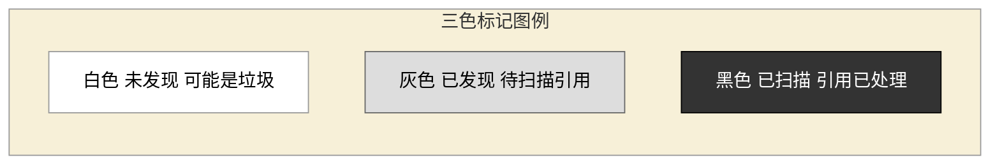

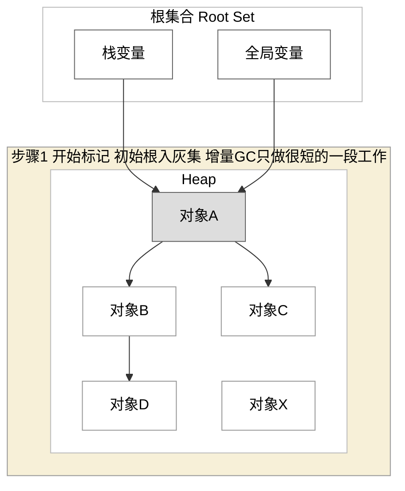

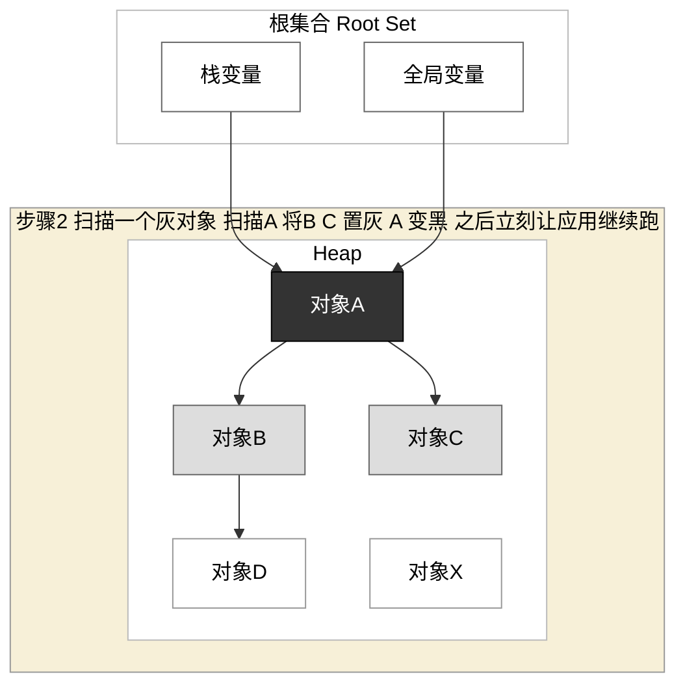

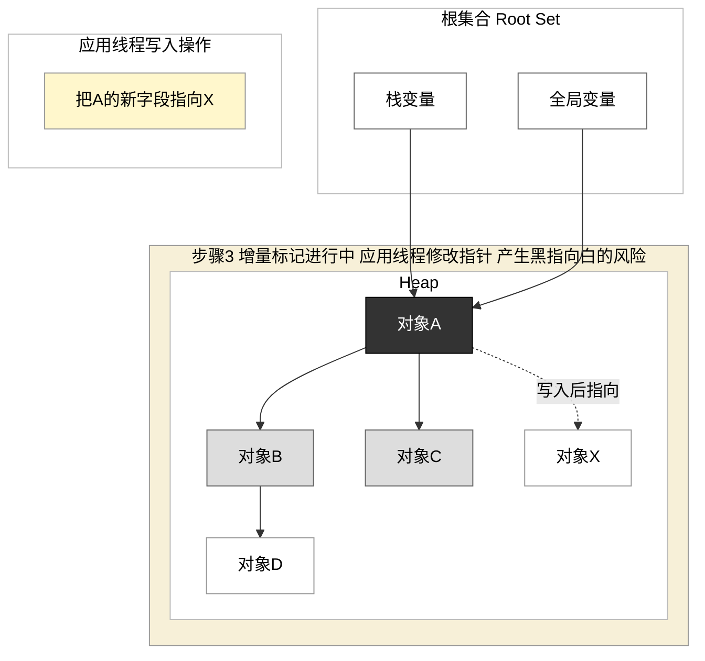

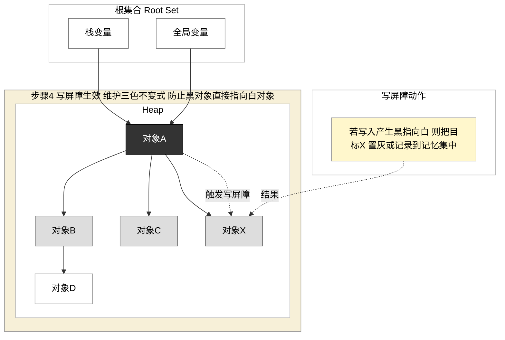

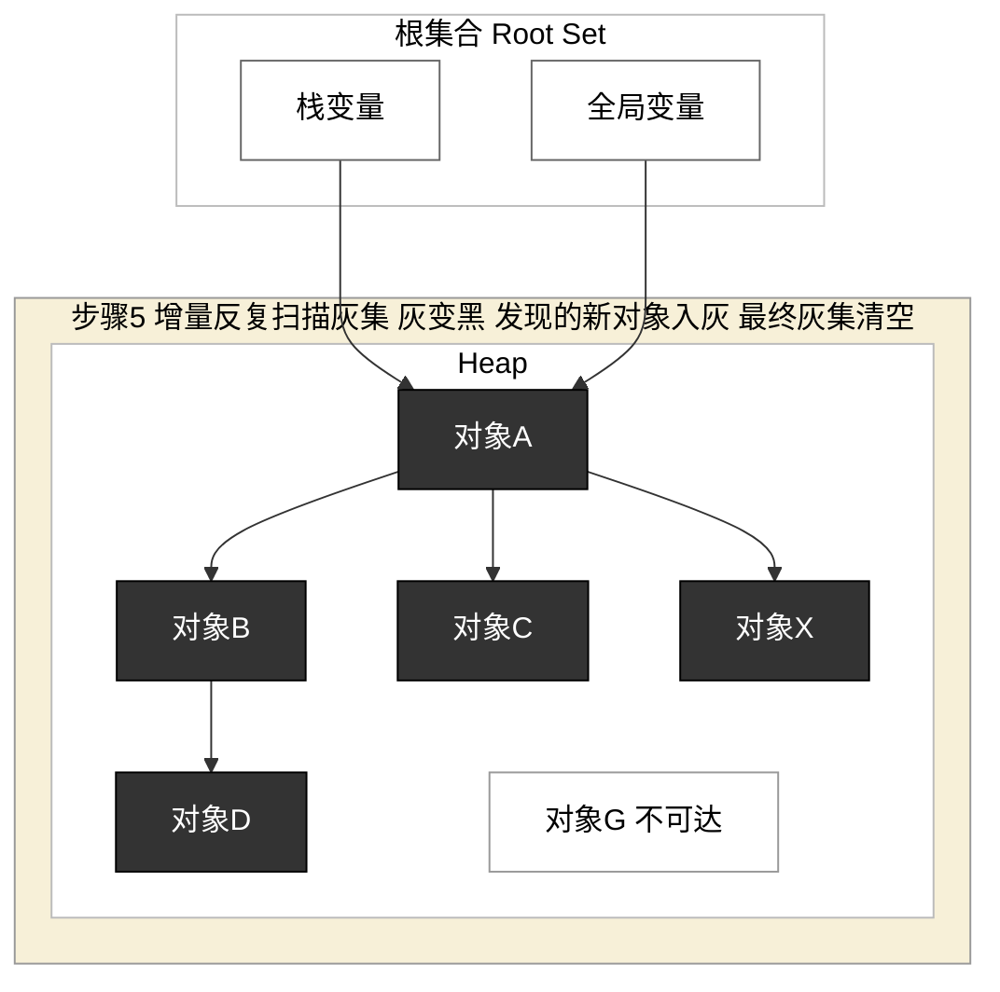

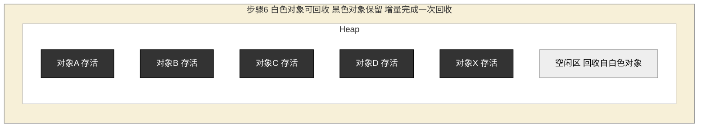

* Dijkstra 写屏障：写入时立刻补标，维护不变式 黑对象不指向白对象
* Steele 读屏障：读取时才补标，维护不变式 程序不读取白对象
* SATB 快照屏障（Snapshot-At-The-Beginning）：并发标记开始时逻辑快照记录所有存活对象，写入时将被覆盖的旧引用记录到 SATB 队列中，确保标记完成时至少覆盖快照时刻的所有可达对象。该策略被 G1 收集器采用，相比 Dijkstra 屏障，SATB 在标记结束时可能残留部分"浮动垃圾"，但能避免因写屏障漏标而导致的存活对象被误回收。

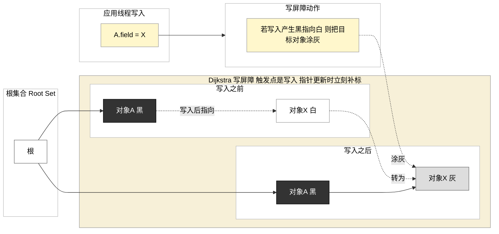

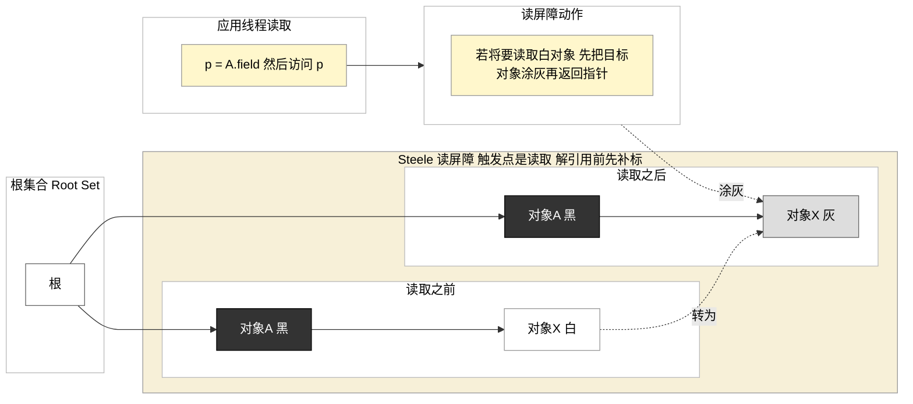

#### 主要优点

增量式算法将一次GC拆分为多个小块工作，极大降低了单次停顿时间，提高了应用的响应性。对于交互式、实时系统来说，这至关重要。增量回收还能根据需要调整每次回收切片的工作量，从而在吞吐和延迟之间找到动态平衡。在合理调度下，增量GC可以让程序的暂停分布更加平滑（许多极短暂停替代一个长暂停）。
#### 主要缺点

通过增量方式避免长暂停往往以总开销增加为代价。维护三色不变式需要插入写屏障/读屏障以监控程序的更新操作，这增加了程序运行时的指令开销。并且，增量回收通常无法充分利用多核并行，因为它需要频繁与程序线程交替，会引入同步和调度开销。如果垃圾产生速度过快，还有可能出现“增量追赶不上分配”的情况，逼不得已仍要触发一次完整的STW回收（称为concurrent mode failure等情况）。因此，增量GC适合垃圾产生平稳、实时要求高，但吞吐量要求适中的场景。

#### 代表实现

许多现代GC都借鉴了增量思想。例如 Java早期的CMS（i-cms增量模式）和Oracle JRockit VM 都实现过增量模式的GC；Microsoft .NET 提供了后台GC（Background GC），在第0代和第1代回收时尽量并发进行部分工作；Lua 语言的GC也是增量式的三色标记算法，以降低脚本执行卡顿。移动设备上的垃圾回收器往往也采用增量技巧来减缓卡顿。在实时系统领域，IBM 的 Metronome GC 提供了硬实时的增量回收保证，是增量GC的极致应用。

### 并发垃圾回收
#### 出现时间与背景

理论上，并发与增量紧密相关，都源于1970年代的研究。但真正将并发GC用于主流商用虚拟机是在 2000年代。典型代表是 HotSpot JVM 在 JDK 1.5 中引入的 CMS 垃圾收集器（约 2004 年），这是 Java 首次提供低延迟选项，用并发换取短暂停。之后 Azul Systems 针对其大型 JVM (Zing) 开发了 C4（Continuously Concurrent Compacting Collector）无停顿回收器，能在数百GB堆内存上实现毫秒级停顿。Go 语言从 1.5 版本（2015 年）开始也引入了并发标记清除GC，以减少Stop-The-World时间。
#### 基本原理

并发GC是指垃圾回收线程与应用程序线程同时并行运行（在多核处理器上），垃圾回收不需要完全暂停应用即可进行。通常，并发GC也结合了上面的增量思想，比如 Java 的 CMS（并发标记清除）回收器就让标记和清除过程在应用运行时并行执行，只在某些阶段略微停顿应用。实现并发GC需要解决与增量GC相同的问题，即程序在GC运行时继续修改对象引用，需要通过写屏障等手段维护一致性。

#### 主要优点

并发GC把大部分回收工作移到后台线程完成，应用程序线程因此遭受的暂停非常短甚至可以忽略。对于超低延迟要求的应用，这是关键的改善。另外，并发利用多核能力，GC能与程序并行，在一定程度上减少了因为GC而浪费的CPU时间 —— 尤其在CPU闲置时并发GC可以充分利用空余资源完成回收。
#### 主要缺点

并发GC会占用与程序并发的CPU资源，因此会降低程序的整体吞吐性能。例如 Go 1.5 的并发GC为了将延迟降低一个数量级，CPU 使用率增加了约 20%。此外，并发GC通常无法压缩内存（如CMS算法不移动对象)，长期运行会出现碎片，导致内存利用率下降甚至需要额外空间以避免并发回收来不及回收导致的失败。实际中，Go 的并发回收为了避免"并发模式失败"，默认让应用使用双倍内存（堆使用100%冗余）来保证有足够空间等待并发GC完成。由此可见，并发回收在降低停顿的同时，牺牲了相当多的CPU和内存开销。最后，并发GC实现复杂度高，需要严格保证与程序交互的正确性，这也是其多年未成为主流的原因之一。
#### 代表实现

HotSpot JVM 的 CMS 收集器是经典的并发标记-清除实现：它在应用运行过程中并发完成标记和大部分清理，只在新生代复制和最终清理时有短暂停顿。CMS 极大降低了老年代回收停顿时间，不过因为不压缩内存，会出现碎片和"并发失败"问题，需要在碎片过多时退化为STW的标记-压缩 Full GC。Oracle JVM 后来提供的 G1 （后文介绍）也包含并发标记阶段。Azul 的 C4 收集器通过硬件支持的读屏障实现了完全并发的压缩回收，被称为"无停顿"GC，是并发技术的尖端案例。新的语言运行时如 Go、Erlang 等也倾向于使用并发GC来满足服务端应用的低延迟需求。需要注意的是，并发GC往往需要更复杂的调优和监控，以避免因为GC线程争夺过多资源反而拖慢应用或因为垃圾产生过快而回收不及时的情况。

## 分代垃圾回收（Generational GC）

#### 出现时间与背景

进入 1980 年代，垃圾回收领域出现了一个里程碑性的发现：“弱分代假说”。研究人员通过统计分析发现，绝大多数对象都是“朝生夕灭”——新分配的对象往往在不久后就变成垃圾，只有少数对象能存活较长时间。1984 年 Lieberman 和 Hewitt 等人发表论文正式提出了分代回收的思想，以对象生命周期为依据优化垃圾收集。此后，分代GC在 Baker、Hudson、Moss 等专家的完善下，逐渐成为主流垃圾回收器的标配技术。

#### 基本原理

分代GC将堆内存划分为数个"世代"（代），通常至少分为新生代（Young/ Nursery）和老年代（Old/Tenured）。新创建的对象先分配在新生代；新生代空间较小且回收频繁，大部分短命对象会在这里被快速回收。只有那些经历多次新生代GC仍存活的"幸存者"才会晋升（Promote）到老年代。老年代则存放生命周期长的对象，回收频率较低。由于新生代垃圾最多，可以使用高效但空间浪费型的算法（如复制算法）回收，而老年代垃圾较少且空间大，通常使用节省空间的算法（如标记-压缩或标记-清除）回收。通过分代，每一代都采用最适合其对象特性的GC算法，同时将主要开销集中在"朝生夕灭"的对象上。

#### 主要优点
分代GC几乎融汇了垃圾收集优化的各个方面，使得现代GC在效率上相比早期有了质的飞跃：
- 缩短平均停顿时间：由于绝大部分回收发生在新生代且新生代容量相对较小，一次 Minor GC（新生代回收）非常迅速，停顿时间很短。只有在老年代满时才触发较大规模的 Major/Full GC，因此绝大多数情况下应用暂停时间大幅降低。
- 提高吞吐量：新生代采用复制算法后，对象分配仅需指针碰撞，分配非常快捷；而短命对象很快被回收，不会在老年代占用空间，减少老年代扫描压力。加上存活对象集中带来的缓存局部性提升，这些都抵消了维护分代所需的一些开销。总体而言，分代回收器可以更快回收更多垃圾，GC自身吞吐量提高。
- 降低内存碎片：新生代频繁回收并采用复制/压缩算法，保证新生代几乎无碎片。老年代即使用标记-清除，由于长寿命对象相对稀疏，碎片增长速度也降低。而且很多实现会在老年代适时触发压缩整理，减少碎片堆积。
- 自适应调优：许多现代分代GC可以根据运行情况自动调整各代大小和GC频率，实现自调节。例如HotSpot的分代GC会根据Minor GC晋升率动态调整新生代容量，以取得较平衡的回收效率。

#### 主要缺点

分代算法在引入巨大性能提升的同时，也带来了一些折衷：

- 实现和兼容性复杂度：分代GC需要移动对象并维护跨代引用，这通常要求语言运行时和编译器紧密配合，对写入指针的操作插入写屏障（Write Barrier）进行记录。具体来说，当老年代对象引用新生代对象时，Minor GC 必须扫描这些跨代引用才能正确判断新生代对象的存活状态。为了不扫描整个老年代，分代GC使用**卡表（Card Table）**将老年代划分为若干小卡片（通常 512 字节），当某张卡片内存在指向新生代的指针时，写屏障将其标记为"脏卡"；Minor GC 只需扫描脏卡即可。这种技术和并发标记中的三色不变式写屏障是两个不同层次的概念：前者关注"代际间引用追踪"，后者关注"并发标记正确性"。因此，实现分代GC往往需要深入修改虚拟机/运行时，无法像Boehm GC那样直接给现有语言插入。这也是C/C++等语言很少有真正分代GC的原因。
- 额外内存开销：为了复制和晋升对象，分代算法需要预留额外内存空间。新生代的半区复制本身浪费部分空间，另外还需要维护跨代指针的记忆集（Remembered Set）或卡表等结构，这些都是额外的内存负担。
- 停顿时间分布不均：虽然大部分GC停顿很短，但当老年代触发Full GC时，仍然可能需要遍历整个堆并进行压缩，造成一次较长的停顿（相对于Minor GC而言）。因此最坏情况下的延迟并未彻底消除，而是被降低了发生频率。
- 参数调优要求：分代回收引入了例如新生代大小、晋升阈值等参数，配置不合理会影响性能。虽然许多JVM/.NET都有自适应机制，但对一些特殊应用场景，仍需要专家调整各代大小以获得最佳效果。

#### 代表实现

如今几乎所有主流语言的内存管理都采用了分代思想。Java JVM自诞生起即使用新生代+老年代的分代架构，新生代典型算法是复制清除或标记整理，老年代典型算法是标记压缩或标记清除整理。.NET CLR同样实现了三代回收（第0代、第1代、第2代），并主要使用标记-压缩算法。JavaScript 的 V8 引擎也采用了分代GC（新生代用Scavenge复制算法，老年代用标记-压缩）。其他如 Ruby MRI、Lua 5.0+、Haskell GHC、Erlang VM 等无一例外都或多或少地融入了分代式的管理策略。可以说，分代GC已成为现代通用语言运行时的标配。

#### 适用场景

分代算法适用于绝大多数一般用途应用，特别是面向对象编程中创建大量临时对象的场景。由于弱分代假说在各种语言中几乎都是成立的，分代GC可以针对这种内存分配模式提供最好的折中：在牺牲少量内存和指令开销的前提下，换取极大提升吞吐并显著降低常规停顿。

除非系统对内存非常苛刻或者对象生命周期分布极端异常，否则分代GC几乎总是优选方案。当然，对于那些实时性要求特别高（绝不能有偶尔的长暂停）的场合，仍需要结合并发/增量技术，甚至使用专用的实时GC算法来保证延迟上限。

## 并行、高吞吐量垃圾回收
随着硬件发展，多核处理器逐渐普及。垃圾回收算法也相应发展出了并行GC技术，通过多线程并行执行回收过程以缩短暂停时间、提高吞吐量。并行GC通常还是采用上述各种算法（如标记-清除、复制等），但利用多线程在STW停顿期间加速回收过程。

#### 出现时间与背景

并行GC概念在1980年代就有研究，但真正应用在主流虚拟机是在1990年代末和2000年代初。当时服务器开始配备多颗CPU，Sun的JVM和IBM的JVM分别开发了并行垃圾收集器。Java在 JDK1.4 (~2002年) 引入了 Parallel Scavenge 和 Parallel Old 收集器，即新生代和老年代的并行回收，实现了完全多线程化的STW垃圾收集。Microsoft .NET 则提供了 Server GC 模式（与 Workstation GC 相对），在Server模式下垃圾回收会使用多个线程并行工作，以充分利用多核提升回收速度。

#### 基本原理

以Parallel Scavenge为例，GC触发时暂停应用，启用多条GC线程并行执行标记、复制或压缩过程。由于多核环境下这些线程可同时运行，总的垃圾回收墙钟时间明显缩短。例如本来单线程标记需100ms，多线程可能50ms就完成。对于需要压缩和复制的阶段，也能近似线性地加速。在并行GC模式下，虽然程序本身停顿依旧，但停顿时间随着CPU核数增加近似反比减少。因此总停顿时长降低，或者在相同停顿预算下可以回收更大的堆。

#### 主要优点

- 并行GC的优势在于最大化吞吐量。GC暂停虽然还在发生，但更短暂，应用因为GC等待的累计时间减少，从而提升整体吞吐效率。在后台批处理、科学计算等对暂停不敏感但要求尽快完成计算的场景，并行GC非常适用。
- 此外，并行GC实现相对简单（相比并发GC），不需要额外写屏障维护一致性，只需处理线程同步问题。对于具有多核的服务器，开启并行GC几乎是“免费”地获得回收加速。正如JVM调优建议所说，如果关注吞吐量可以选择多线程Parallel GC。.NET Server GC 也是默认在服务器环境启用的，通过专用GC线程并行回收来提高回收效率。

#### 主要缺点

- 并行GC依然是Stop-The-World回收，因而没有改善延迟的最差情况——一次Full GC停顿可能还是数百毫秒，只是这个停顿无法通过增加线程进一步减少（受限于需要处理的存活对象量和并行效率）。并行GC会占用多核资源同时停顿应用，对于核数较少的环境反而可能导致应用响应更加不流畅（因为GC把CPU都用了）。
- 另外，线程之间的协调也有一定开销，线程越多并行效率未必线性提升（存在同步开销和内存带宽限制）。因此在单机核心数量有限或者需要保障响应时间的情况下，并行GC并不解决本质问题。
#### 代表实现

- HotSpot JVM 的 Parallel GC（也称“吞吐量优先GC”）是经典实现，新生代并行复制、老年代并行标记-压缩，目标是最高吞吐而不关心停顿时间。它在多核服务器上表现出色，也是长期以来JDK的默认GC（直到Java 9改为G1）。
- .NET 的 Server GC 则会为每个CPU核心创建专门的GC线程，利用并行提升回收速度；而工作站模式下则使用单线程GC以减少对前台的干扰。
- Oracle JDK 8 提供的 Parallel Scavenge 就是在Server模式下追求极致吞吐的收集器，其调优参数甚至允许指定GC占用CPU时间的期望百分比等。总之，并行GC几乎是多核时代顺水推舟的改进，目前仍被很多高性能场景采用（如大数据处理中的JVM参数常设为Parallel GC以得到最高处理速度）。
#### 适用场景

- 并行GC适用于对吞吐量要求高、对停顿时延不敏感的场合。例如后台批处理服务、离线计算任务、MapReduce作业等，此类任务更关心总运行时间而非过程中是否有短暂停顿。在这些情况下，并行GC利用多核大大缩短GC耗时，从而让程序更快完成全部工作。
- 另一方面，对于GUI应用、交互式服务等，并行GC虽然缩短了停顿，但停顿仍然存在且可能不够短，因此往往不是首选。不过在现代Collector（如G1）出现以前，一些需要均衡性能的服务器应用会选择Parallel GC，以兼顾还不错的暂停时间和高吞吐。

## 现代垃圾收集器：低延迟与区域化

进入 2010年代，随着内存容量步入百GB乃至TB量级、以及应用对响应延迟要求越来越严苛，垃圾回收技术又迎来了新一轮的创新。现代GC算法在结合上述分代、并发、并行、压缩等各种技术手段的基础上，发展出区域化分区（Region）管理和低延迟回收的新思路。代表性的现代GC包括 Garbage-First (G1)、Shenandoah、ZGC 等，它们都是为在超大堆内存上获得可控的低暂停而设计的。

### Garbage-First (G1) 回收器
#### 出现时间与背景

G1 是Oracle为 HotSpot JVM 开发的新一代垃圾收集器，大约在 2011年随JDK7作为实验特性推出，经过改进在2017年的 JDK9 中成为默认GC。它的目标是取代传统的CMS和Parallel GC，提供“一刀切”的通用垃圾回收方案。

#### 基本原理

G1的核心思想是**区域化**+**分代**+**增量压缩**。它将整个堆划分为大小相等的区域（Region）（几百KB到几MB不等）。这些区域并不固定地属于新生代或老年代，而是动态分配角色。G1在后台维护各区域的垃圾比例，并优先回收垃圾最多的区域（即”Garbage-First“的由来）以尽可能提高回收收益。回收时，G1会选定若干区域作为收集集（Collection Set），然后对这些区域执行并发标记和STW的对象复制压缩，将存活对象 evacuate 到空闲区域中，回收整个收集集的区域。这样实现了增量式的整体压缩：一次GC只整理部分堆区域，避免传统Full GC整理全堆的长停顿。G1 还保留了分代概念，新生代默认也用区域划分并采用类似复制算法的回收，但与老年代采用统一的区域管理。

#### 主要优点

作为混合型算法，G1集合了并发、并行、压缩、分代等多种技术于一身。其突出优点包括：
- 可预测的低延迟：G1支持设置最大停顿时间目标（比如50ms），并会据此选择每次回收的区域数目，努力将暂停时间控制在目标之内。多数情况下，G1的停顿都非常短（小于10ms甚至1ms），只有在压缩大量区域时才可能略长一些。
- 并发标记：G1 在回收周期中包含并发全堆标记阶段，利用空闲CPU周期提前完成存活对象标记，这样在正式回收时只需复制存活对象，减少STW时间。G1的并发标记采用 SATB（Snapshot-At-The-Beginning）屏障，在标记开始时对所有存活对象做逻辑快照，写入时通过 SATB 队列记录被覆盖的旧引用，确保标记不遗漏任何快照时刻可达的对象。
- 区域化带来的可扩展性：由于每次操作处理一个或若干区域，G1能够良好地扩展到非常大的堆。实际应用中，G1已成功用于数 TB 大小的堆内存而保持可用。区域化还方便实施并行：不同GC线程可处理不同区域的数据结构，提高并行效率。
- 内存整理：G1的复制回收使得所回收的区域得到完全整理（无碎片）。即便整个堆不会一次性完全压缩，但局部的压缩避免了CMS那样的碎片累积问题，降低了长期运行出现内存碎片的风险。
- 附加优化：G1附带一些实用的优化特性，例如字符串去重（在回收时检测并合并重复字符串对象）等，这利用了GC遍历对象的机会来做额外优化，提高了整体内存效率。
#### 主要缺点
作为一个高度复杂的收集器，G1相对于前辈也有一些折中：
- 吞吐量略低于纯并行GC：由于引入了写屏障维护 Remembered Set、并发线程开销等，G1的GC运行开销比Parallel GC要高一些。在默认目标停顿时间100ms下，G1会倾向于最大化应用吞吐而不是最短停顿。只有当指定更低的停顿目标时，G1才会积极缩短停顿，但这可能以更多GC次数和更高开销为代价。所以在极端追求吞吐的批处理场景下，Parallel GC 可能仍略胜。
- 最坏情况停顿仍存在：如果应用内存压力过大或产生垃圾的速率过高，G1可能来不及在目标时间内回收足够内存，不得不触发Full GC。G1的Full GC退化为单线程标记-压缩，停顿时间可能非常长（这也是G1设计者试图极力避免的情况）。不过正常使用和调优下，Full GC出现概率很低。
- 内存占用略有增加：区域划分和复杂的数据结构（记忆集等）会消耗部分内存。此外，为了确保有空闲区域用于对象晋升和复制，G1需要保持一定比例的空闲区域（例如默认堆空闲阈值），这在高负载下相当于需要预留一些冗余内存空间以保证回收效率。
#### 典型应用
G1 在 Java 9+ 中成为默认垃圾收集器，适用于大部分中大型Java应用。特别是那些堆内存大（几GB到几百GB）、对停顿时间有要求又需要一定吞吐量保障的服务，例如各类后端服务、WEB应用服务器等。G1相对于CMS减少了调优负担、避免碎片，因此被广泛接受。实践中，如果应用需要亚毫秒级的极低延迟，G1可能还不够，这时才考虑更先进的收集器（如ZGC、Shenandoah）。但对于要求较均衡（既要尽量低延迟又要有稳定吞吐）的场景，G1几乎是首选方案。
### Shenandoah 回收器

#### 出现时间与背景

Shenandoah 是由 Red Hat 开发并贡献给 OpenJDK 的低延迟垃圾收集器。其原型于2014年前后公布，并在 2019年随 JDK12 合入主线（未默认启用，需要手动开启）。Shenandoah 的目标是在任意堆大小下都能将GC停顿时间控制在10ms以内。它的设计灵感部分来自Azul的无停顿GC，但实现思路与HotSpot已有的G1有渊源（比如也采用了区域划分）。
#### 基本原理

Shenandoah与G1一样将堆划分为多个区域（Region）进行管理，但它不区分新生代和老年代（Shenandoah 是非分代收集器）。Shenandoah的回收分两个主要阶段：并发标记和并发压缩（复制）。首先，像其他GC一样并发地标记存活对象；然后进入并发压缩阶段，Shenandoah会启动GC线程在程序运行的同时，将存活对象从原区域复制/移动到新区域，实现堆内的完全压缩整理。由于对象可能在程序运行时被移动，Shenandoah采用了一种名为 Brooks Pointer 的技术：在每个对象头中预留一个转发指针，用来指向对象的新地址。同时，引入读屏障和写屏障：读屏障在程序读引用时检查对象是否已经搬迁，如果是则重定向到新位置；写屏障用于在并发阶段维护引用更新。借助这些手段，Shenandoah做到在GC过程中后台完成对象移动，而STW停顿仅发生在极短的初始化和最终引用调整阶段。
#### 主要优点
Shenandoah是首个开源的、在OpenJDK上实现的并发压缩收集器，具备以下显著优点：
- 超低暂停时间：因为绝大部分工作都在并发完成，Shenandoah的GC停顿几乎与堆大小无关，可维持在个位数毫秒甚至亚毫秒级别。无论堆是几百MB还是数百GB，暂停都“与堆大小无关”，这对需要严苛延迟保证的应用极为有利。
- 解决碎片问题：与CMS只能并发标记清除不同，Shenandoah做到了并发复制压缩，因此不会产生碎片，即使长时间运行也无需因碎片而触发Full GC整理。
- 良好的扩展性：Shenandoah支持多核并行执行，其并发GC线程可以利用额外CPU内核完成回收任务，因此在大规模多核机器上效率更佳。此外，Shenandoah也能够处理超大堆内存（官方目标是支持TB级别堆）。
- 兼容性：Shenandoah的实现尽量避免和程序逻辑强耦合，对现有Java代码和JNI代码都保持良好兼容。它不区分代，因此不需要调整分代大小，也没有Generational相关的Write Barrier，调优相对简化。
#### 主要缺点
Shenandoah作为激进的低延迟GC，也付出了一定代价：
- 吞吐量开销：读取每个对象引用时都要通过读屏障检查对象是否转移，这增加了一次指针判断和潜在的指针重定向，对应用的CPU吞吐造成少许影响。此外，并发复制期间占用CPU资源，也削减了应用可用的处理能力。一般预期Shenandoah比Parallel或G1减少一些吞吐量（官方目标是在可接受范围内）。
- 内存开销增加：每个对象头需要额外的转发指针（增加几个字节的开销），并且在并发压缩过程中，需要新区域来容纳存活对象副本，这实际上要求堆中留有一定比例的空闲区域备用。因此Shenandoah相对于G1需要更多的内存冗余空间（据统计大约额外10-20%）来达到最佳效果。不过Shenandoah号称“heap缩放中立”，即不会像Go那样要求整整双倍内存，只是略高于传统GC。
- 实现复杂度及成熟度：Shenandoah的实现非常复杂，对JVM和硬件内存模型都有特殊要求（例如需要支持读屏障，高效的比较交换操作等）。作为相对新的GC，它在极端情况下的表现和成熟稳定程度还在不断改进中。
#### 典型应用

Shenandoah非常适合对延迟要求极高的Java应用，例如高频交易系统、实时交互服务器、在线游戏服务器等。这些场景下，偶尔几十毫秒的停顿都难以接受，Shenandoah提供了有力的保障。在RedHat的OpenJDK版本以及一些JDK发行版中，Shenandoah已经可以用于生产环境。需要注意Shenandoah当前不支持32位JVM，且只有在JDK12+（或部分JDK11的变体）上可用。对一般应用而言，如果G1已经能满足延迟要求，则无需使用Shenandoah；但当需要更进一步降低99.9%延迟尾部时，Shenandoah是一个重要的选项。
### ZGC 回收器
#### 出现时间与背景

ZGC（Z Garbage Collector）是Oracle推出的另一款超低延迟垃圾收集器。它从一开始就设计为仅支持64位的大堆内存场景，目标与Shenandoah类似，也是<10ms 停顿和任意堆大小下的可扩展性。ZGC 最早随 JDK 11 (2018) 作为实验性功能发布，在JDK15中转为生产可用。ZGC的名字中的“Z”寓意接近零的停顿时间。
#### 基本原理

ZGC采用Region划分（与Shenandoah类似，将堆分块管理）以及并发标记-整理算法。与Shenandoah不同的是，ZGC并不使用Brooks指针进行对象拷贝，而是通过指针着色（Pointer Coloring）技术和读屏障来实现并发压缩。具体来说，ZGC利用64位地址空间的高位，比特对对象引用添加元数据标记（颜色位），用于区分指针的不同状态（如Marked1, Marked2, Remapped等）。在并发GC过程中，对象实际可能存在于新旧两处位置，但通过读屏障检查指针的标记颜色，ZGC可以在访问时决定对象是否已经移动、是否需要重定向。ZGC的写屏障则只用于记录跨Region引用等较少的用途，主要的开销集中在读屏障。由于采用了指针染色，ZGC不需要对象头中的额外指针，也避免了维护巨大的记忆集：它通过全局的数据结构跟踪Region间引用。ZGC也是非分代的，目前（JDK17以前）不划分新生代/老年代，所有对象统一管理。

#### 主要优点

ZGC号称“现代”垃圾收集器，具备一系列优点：
- 极低的停顿时间：和Shenandoah类似，ZGC将几乎所有工作移到并发阶段完成。官方数据显示，ZGC 的暂停时间通常 <1ms，即使在几百GB堆上也能做到亚毫秒级别。这使得GC对应用延迟的影响微乎其微。
- 可扩展的大堆支持：ZGC 设计可支持高达数TB的堆内存（通过使用64位地址的高位作为元数据），并且堆越大，ZGC相对传统GC的优势越明显。它采用Region让并发工作量随堆线性扩展，多核环境下仍可以保持短暂停。
- 内存开销低：ZGC不需要像Shenandoah那样在对象头存额外指针，也不需要为每个区域维护繁杂的记忆集（它用着色指针和页面表映射解决了引用追踪）。因此相比之下，ZGC的额外内存开销更低。当然，为了并发压缩，ZGC仍需要一定空闲空间保证有地方复制存活对象，但官方认为其内存占用是“相对低”的。
- 吞吐性能不错：尽管ZGC也牺牲了一部分吞吐量来换取低延迟，但实际测试表明它对应用吞吐的影响比预想的小。在某些场景下，ZGC的吞吐量甚至略高于Shenandoah。这可能归功于它的算法简化了跨区域引用处理，减少了Barrier的频率。
#### 主要缺点

ZGC也有一些限制和折中：
- 只支持64位系统：因为依赖指针着色，ZGC需要充裕的虚拟地址位空间，在32位系统上无法实现。此外，ZGC目前仅在Linux/macOS/Windows的64位HotSpot上可用，不支持更早期的平台。
- 非分代带来的局限：早期版本的ZGC不分代，意味着所有对象都一视同仁地并发回收。对于大量朝生夕灭的对象场景，ZGC每次仍需处理它们增加开销。为此，ZGC在JDK17开始引入了分代ZGC的实验，尝试将新生代优化与ZGC结合。不过在分代ZGC成熟前，某些大量短命对象的负载下，ZGC的CPU开销可能高于理想值。
- 实现复杂度：ZGC对虚拟机和底层操作系统支持要求很高，例如需要底层支持多重内存映射、读屏障高效实现等。虽然Oracle的实现已经比较成熟，但开发和调试这样复杂的GC需要很高的技术门槛。
#### 典型应用

ZGC适用于超大内存、高吞吐且低延迟要求的场景。例如内存容量动辄数百GB的内存数据库、大数据处理中的长生命周期进程、需要稳定低暂停的在线服务等。特别是在那些垃圾产生速率中等、但绝不能有长暂停的应用上，ZGC提供了前所未有的保障。当前ZGC在JDK17+已经非常成熟，不少公司开始在Java服务中启用ZGC以获得更低的99th延迟。需要注意的是，如果应用创建大量瞬时对象（如一些高速消息处理），分代GC理论上更高效，不过随着分代ZGC的逐步完善，这一差距也会被弥合。
## 其他现代GC实例
除了上述热点，现代还有一些值得一提的垃圾回收技术：
- Azul C4：由Azul Systems开发的商业JVM收集器，首次实现了真正意义上无停顿（pauseless）的垃圾回收。它通过硬件协助实现读屏障，并使用多代并发压缩算法，可以在数TB堆上实现亚毫秒级停顿。Shenandoah和ZGC的很多理念都与Azul C4一脉相承。
- Immix：2008 年由 Blackburn 和 McKinley 提出的混合算法，结合了标记-清除（高空间利用率）和复制（分配快）的优点。它将堆划分为块（block）和线（line），存活对象在线内紧凑排列，空闲空间以线为单位回收，实现了接近复制算法的分配速度（快速 bump pointer）和接近标记-清除的内存利用率。Immix 已被 Jikes RVM、Ruby 的 GC 等采用，被誉为"第三种基础GC算法"。
- IBM J9 Balanced GC：与 G1 同期（2010 年前后）的区域化分代收集器，将堆划分为若干区域，但采用不同的策略：它不按垃圾比例优先回收，而是通过"疏散"（evacuation）将存活对象从部分区域迁移出去，形成完整的空闲区域。其设计侧重减少碎片和在超大堆（>100GB）上保持可预测的暂停。
- Epsilon GC：JDK11引入的一个特殊“GC”，实际上是不做任何回收的对照组（即分配了也不回收，内存占满即退出）。它并非用于生产，而是用于测试应用在无GC干扰时的性能上限，以及给极少数短生命周期应用做内存管理。Epsilon的存在体现了GC对性能影响的一个极端：没有GC延迟，但也没有GC回收。
- Rust/C++等手动内存管理：虽然不属于GC，但需要指出，有些系统级语言选择不使用垃圾回收，而采用手动或其他方式管理内存（如Rust通过编译器的借用检查+引用计数Arc/RC）。它们避免了运行时GC开销和停顿，但增加了开发复杂性。这些并不是垃圾回收算法的发展方向，不过在特定领域仍有生命力，体现出GC在性能和开发效率上的权衡。
## 不同垃圾回收算法的性能权衡

| 算法/收集器            | 暂停延迟                         | 吞吐量                             | 内存占用                          | 典型场景                         |
| ---------------------- | -------------------------------- | ---------------------------------- | --------------------------------- | -------------------------------- |
| 引用计数               | 几乎无全局暂停（释放峰值可能抖） | 平时有持续开销（每次赋值维护计数） | 每对象计数；循环引用需额外处理    | 超低延迟、需要及时释放资源       |
| 标记-清除（STW）       | 长暂停（随堆变大更明显）         | 平时快，但暂停很伤体验             | 标记位开销小；碎片多              | 小堆/批处理/嵌入式               |
| 标记-压缩（STW）       | 长暂停（还要整理）               | 平时快；整理后分配更稳定           | 无碎片，利用率高                  | 允许偶尔长停、追求长期稳定       |
| 复制算法（STW）        | 通常更短（看存活对象多少）       | 分配快；存活多时拷贝成本高         | 需要较大额外空间（半区/双倍思路） | 新生代（对象朝生夕灭）           |
| Immix（标清+复制混合） | 较短（STW 或增量均可）           | 分配快；空间利用率高于纯复制       | 接近标清利用率，远低于纯复制       | 通用内存受限场景                 |
| 分代收集               | 多数停顿短；少量 Full GC 较长    | 总体吞吐好（写屏障有成本）         | 记忆集/晋升等中等开销             | 通用默认方案（大多数应用）       |
| 并行收集（STW 多线程） | 仍 STW，但更短（吃核数）         | 吞吐最高（GC 更快）                | 与原算法接近                      | 吞吐优先：批处理/离线计算        |
| 并发/增量（如 CMS）    | 低停顿（大部分并发）             | 吞吐下降（并发线程+屏障）          | 需预留空间；不压缩易碎片          | 延迟敏感服务；调优复杂           |
| G1（区域化+并发）      | 低且可控（目标停顿）             | 中高（略低于纯并行）               | Region/RSet + 需留空余量          | 大多数中大型 Java 服务（均衡型） |
| Shenandoah（并发压缩） | 极低（常 <10ms，甚至 1-2ms）     | 偏低（读屏障更重）                 | 需更高冗余（并发搬迁）            | 极致低延迟：交易/电信等          |
| ZGC（并发标记整理）    | 极低（常 <1ms，堆再大也稳）      | 中等（接近 G1，优于 Shenandoah）   | 中等冗余（并发整理空间）          | 大堆 + 低延迟在线服务            |

> 综上所述，垃圾回收算法的发展史就是一部在延迟、吞吐和内存三者之间不断寻找折中的历史。从最初简单但停顿漫长的标记-清除，到兼顾吞吐的分代算法，再到追求极致低停顿的并发压缩算法，每一种技术的出现都解决了前一代算法的某些痛点，同时也引入了新的权衡。正如业界所认识到的，没有“一招鲜”的GC可以通用于所有场景——不同应用对暂停时间、内存占用、CPU开销的侧重不同，需要选择不同的回收策略甚至手工调优参数来满足需求。幸运的是，经过数十年的研究积累，现代垃圾回收器已经提供了一系列可选方案，从高吞吐的Parallel GC到低延迟的ZGC/Shenandoah，开发者可以根据应用特点和性能目标进行权衡取舍，选择最适合的一种或让运行时自动调优。展望未来，随着硬件的发展和需求的变化，垃圾回收技术仍将在这“三角平衡”中不断演进，追求更智能地自适应调整，实现既高吞吐又低延迟且高效内存利用的“理想”垃圾收集器。正如这一路走来的历程所展示的，那将是一个持续挑战但值得期许的目标。
