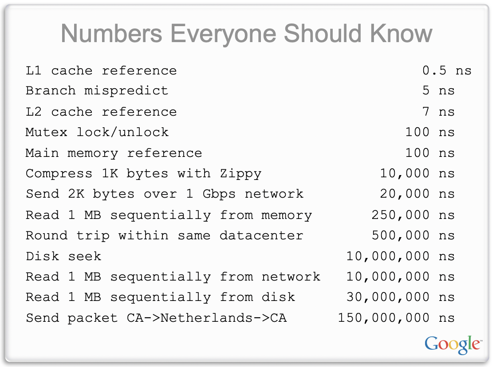
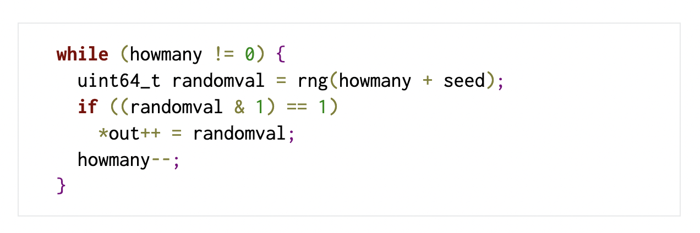
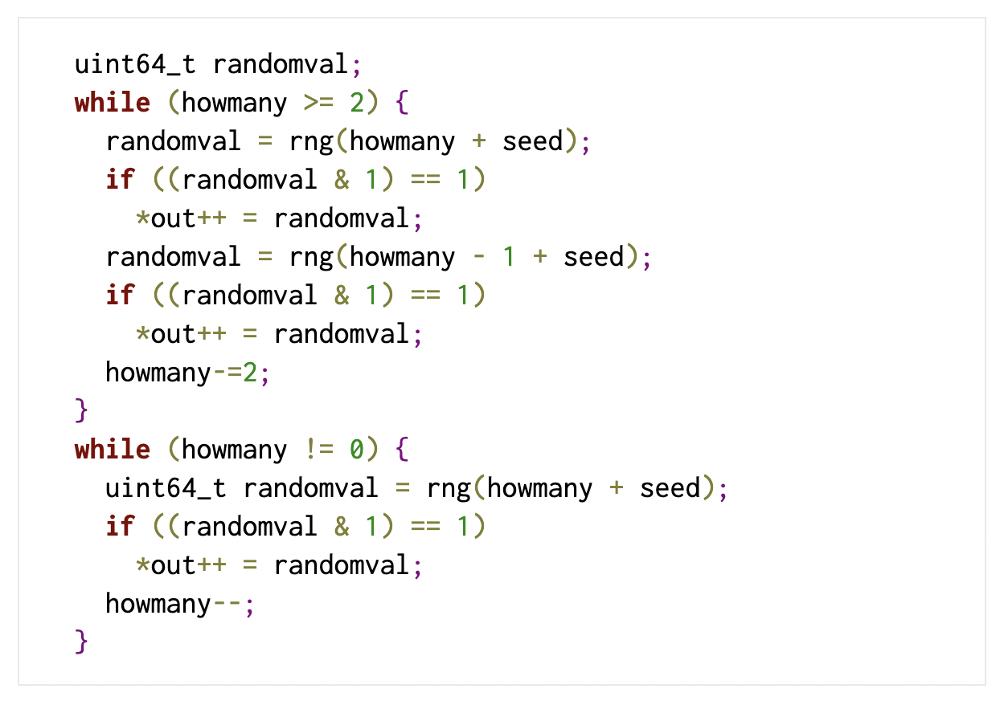
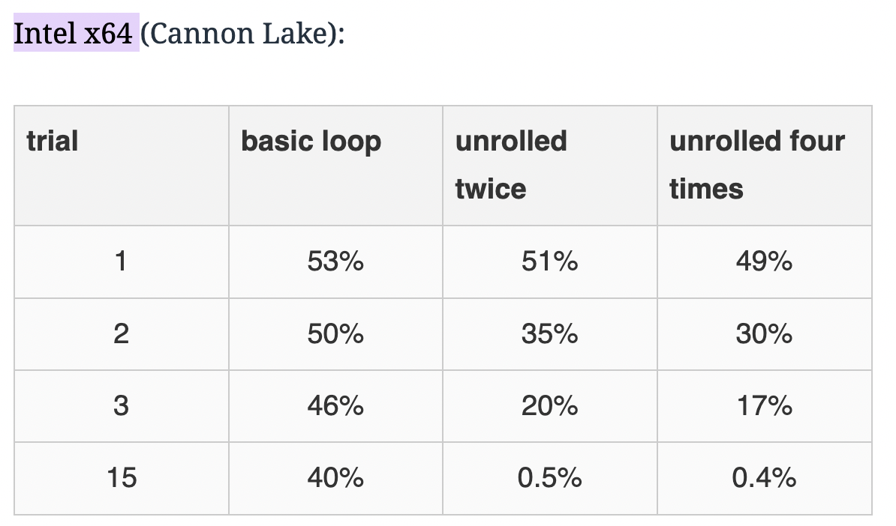

# Performance Hints

[Jeffrey Dean & Sanjay Ghemawat, Performance Hints, 2025, https://abseil.io/fast/hints.html](https://abseil.io/fast/hints.html)

Abseil 官方网站发布的《Performance Hints》由 Google 传奇工程师 Jeff Dean 和他的长期合作者 Sanjay Ghemawat 撰写。文章系统阐述了编写高性能 C++ 代码的一系列建议，包括如何进行性能估算和测量、API 设计抉择、算法改进、内存管理优化、并发优化等。

> We should forget about small efficiencies, say about 97% of the time: premature optimization is the root of all evil. Yet we should not pass up our opportunities in that critical 3%.  --Knuth

Knuth 这句“过早优化是万恶之源”常被误解为完全不必考虑性能，但他本意并非否定一切早期优化。他的完整表述我们应在97%的情况下忘掉细微的效率优化，但绝不能放弃那关键的3%机会。Knuth 还指出，对于精心打造的软件，轻松获得的12%速度提升绝不算微不足道。可见，完全不顾及性能可能埋下隐患：

* 在大型系统中，如果开发阶段完全不考虑性能，最后往往会出现“**flat profile**”：性能损耗散落在各处，剖析时没有明显热点可供下手优化
* 如果写的是**库代码**，真正遇到瓶颈的往往是下游使用者，他们很难直接改库内部实现（还要理解别人的代码、跨团队沟通）
* 系统进入**重度使用**后，再做结构性改动会更难、更贵、风险更高
* 由于前期没建立成本直觉，容易错过本来很便宜的优化点，最后只能靠**昂贵方案**补救（例如过度冗余地复制数据或过度扩容硬件资源）。

因此，在不明显增加代码复杂度的前提下应尽量选择更高效的实现方案，为程序打好性能基础

## Estimation

如果不知道不同操作的相关成本，就无法进行准确的估计性能！

### 先判断这段代码“属于谁”，再决定要多在意性能

很多时候，不需要算到小数点后，只要先把代码分个类，就能做出正确的取舍：

* **测试代码**：主要关注 **渐进复杂度**（算法/数据结构是不是会炸），同时也要避免测试跑太久拖慢开发迭代
* **应用代码**：先判断是不是 **初始化/一次性** 代码，还是会落到 **热路径**（比如每个请求、每帧、每条消息都会走到）。光分清这两类，通常就足够决定“值不值得引入复杂度”
* **公共库代码**：未来会不会变成热点很难预判，所以更应该遵循一些“**不引入非局部复杂度，但收益稳定**”的习惯用法（比如小 vector 更倾向 InlinedVector、能扁平化就扁平化、能减少分配就减少分配）。这样即使后来它真的变热，起点也更高，而且更容易继续往下优化

### 纸上估算（Back-of-the-envelope）：三步快速排除方案

当在两个设计之间摇摆时，可以用“纸上估算”快速做粗筛：

1. **数一数昂贵操作**：比如 disk seek、网络 round-trip、传输字节数、锁竞争、分配次数、缓存未命中等
2. **乘上粗略单价再求和**：得到资源消耗（CPU/IO/网络/内存带宽）的大概数量级
3. 如果关心的是 **latency**，且系统存在并发，那么还要考虑**哪些成本能重叠**（并行后延迟不一定等于总成本之和）

这种估算不替代真实测量，但它非常擅长做一件事：**快速淘汰明显不划算的方案**。

例如不同层级存储的访问延迟相差悬殊：L1 缓存命中约需 0.5 ns，L2 缓存约 3 ns，而访问主存则高达 ~50 ns（图片中的数据来自 [https://static.googleusercontent.com/media/research.google.com/en//people/jeff/stanford-295-talk.pdf](https://static.googleusercontent.com/media/research.google.com/en//people/jeff/stanford-295-talk.pdf)）。



除了缓存/主存这种“微观成本”，也可以给系统里常见的“宏观操作”记几个大概数（不用精确，数量级正确就很有价值），比如：

* **分支误预测**：纳秒级，但在超高频循环里能变成主导成本
* **无竞争锁**：十几纳秒级；一旦有竞争，故事会变得很魔幻
* **SSD 读 4KB**：几十微秒级；读 1MB 往往到毫秒级
* **机械盘 seek**：毫秒级
* **同机房网络往返**：几十微秒级

现代CPU架构可以参考文章
[https://www.lighterra.com/papers/modernmicroprocessors/](https://www.lighterra.com/papers/modernmicroprocessors/)

### 例子：生成包含 30 张缩略图的网页（串行 / 并行 / SSD）

假设网页要展示 **30 张缩略图**，原图都在磁盘上，每张约 **1MB**。两个设计一算就能看出差距：

* **串行读取 + 逐张生成缩略图**  
  每张图片：一次 seek（约 5ms）+ 传输（约 10ms）≈ 15ms  
  30 张就是 30 × 15ms ≈ **450ms**

* **并行读取（图片均匀分布在 K 块盘上）**  
  总资源消耗差不多，但 **latency** 大致会按 K 倍下降（忽略分布不均的“倒霉情况”）  
  如果底层是很多盘的分布式文件系统，预期延迟可以压到 **十几毫秒级**

* **单块 SSD**  
  单张图片大致变成：20µs + 1ms ≈ 1.02ms  
  30 张约 **30ms**

这种估算能直接指导“该优化哪里”：是要 **并行化**、要 **换介质**、还是要在 CPU 上抠细节。 

### 例子：对 10 亿个 4-byte 数做 quicksort 的估计

一个粗略但很实用的近似：一个“不错的” quicksort，大概会对大小为 N 的数组做 `log2(N)` 轮 partition（可以理解成 `log(N)` 次“全数组级别的 pass”）。每一轮里，数组会被从内存流进 cache，partition 代码会把每个元素和 pivot 比较一次。我们把主要成本加一加：

* **内存带宽（memory bandwidth）**
  * 数组大小：`10^9 * 4B ≈ 4GB`
  * 假设单核可用内存带宽约 `16GB/s`
  * 那每一轮 pass 读一遍数组大概是 `4GB / 16GB/s ≈ 0.25s`
  * `N ≈ 2^30`，所以 `log2(N) ≈ 30`，总共约 `30` 轮
  * 仅内存传输的总成本约 `30 * 0.25s = 7.5s`

* **分支误预测（branch mispredictions）**
  * 总比较次数约 `N * log2(N) ≈ 10^9 * 30 = 3e10`（300 亿次比较）
  * 粗略假设一半会误预测：`1.5e10`（150 亿次）
  * 假设每次误预测代价 `5ns`
  * 那分支误预测成本约 `1.5e10 * 5ns = 75s`
  * 这里我们把“预测正确的分支成本”近似当成 0（只抓主导项）

把两项加起来，总耗时估算约 `7.5s + 75s = 82.5s`。这个数量级结论非常有杀伤力：**在这个模型里，分支误预测就是压倒性的主因**。

也可以把 cache 考虑进来（虽然上面已经能看出主导项是谁了）：

* 假设有 `32MB` 的 **L3 cache**，并且 **L3 → 核心** 的传输成本可忽略
* `32MB / 4B = 8e6 ≈ 2^23`，也就是 L3 能放下约 `2^23` 个数
* quicksort 递归下去后，后面的很多轮其实是在更小的子数组上做 partition  
  当子数组规模小到能常驻 L3 时，后续 pass 的“从内存读 4GB”就不成立了
* 粗略估算：最后 `22` 轮都可以在 L3 常驻数据上完成（第 `23` 轮把数据“带进 L3”，之后都在 cache 上做）
* 那内存传输从原来的 `30` 次，变成只需要大约 `10` 次
  * 新的内存传输成本：`10 * 0.25s = 2.5s`（而不是 7.5s）

可以发现：即使把内存传输成本从 7.5s 砍到 2.5s，**总体仍被 75s 的分支误预测拖累**

## Measurement

在真正开始做性能改动之前（或者面临“性能 vs 简洁性”的权衡时），一定会想做测量或更严谨的估算。**会测量，是性能工作里最核心的工具**。

> profiling 一个不熟的系统，往往也是快速理解代码结构的办法——顺着动态调用图去读最“忙”的那几条路径，会更快建立“系统到底在干啥”的直觉。

### Profiling tools and tips

常见工具很多，但一个很实用的流程是：先用能给宏观视角的 profiler，再在需要时下钻细节。

一些小技巧：

* 用尽量接近生产的构建方式：**开优化 + 带符号**
* 如果能写一个覆盖目标路径的 **microbenchmark**，迭代速度会快很多：  
  - 它能验证改动是否真的变快  
  - 也能作为回归测试防止“过几个月又慢回去”  
  但 microbenchmark 也可能有过于理想化、缺少真实负载特征的问题
* 尽量结合 **性能计数器（performance counters）**：不仅更精确，也能告诉是卡在 cache miss、分支、前端、还是别的东西
* 注意 **锁竞争**：锁争用会让 CPU 利用率看起来很低，但系统其实是在排队；一些 mutex 实现支持竞争剖析
* 需要时做 **分配剖析（allocation profile）**：分配次数本身会消耗 allocator/G C 时间，而且频繁分配在长跑程序里还容易带来更多 cache miss

### What to do when profiles are flat（profile 很平怎么办）

有时会遇到“CPU profile 很平”的情况：没有一个函数看起来是压倒性的罪魁祸首。几个常见策略：

* 别小看很多 **1%**：做二三十个 1% 的小改动是很现实的，合起来就很可观（前提是有稳定、靠谱的 microbenchmark）
* 往调用栈更上层找 **loop**（flame graph 很好用）：  
  有时真正该优化的是“循环的组织方式”。比如某段逻辑原先按边/点增量构建复杂结构，后来改成一次性把全部输入喂进去“一口气构建”，就能消掉一堆 per-edge 的内部检查
* 退一步找更高层的 **结构性优化/算法优化**，不要只盯着指令级抠细节
* 找 **过度通用** 的实现并替换：例如反复 regex match 的地方，如果 prefix match 就够了，regex 往往是性能税
* **减少分配次数**：先拿到 allocation profile，从最大的贡献者开始“削皮”  
  这通常同时减少 allocator 时间，并降低 cache miss（长期运行时尤其明显）
* 采集其他类型的 profile，尤其是基于 **硬件计数器** 的数据：它们常能直接指出 cache miss 很高的函数/路径

## 核心性能优化技巧

### 提高缓存局部性和内存使用效率

现代计算中，内存访问往往是性能瓶颈。访问主存比访问一级缓存慢两个数量级。

因此，优化缓存局部性（cache locality），尽可能让数据访问命中高速缓存，对性能提升至关重要。精心考虑重要数据结构的内存占用和缓存占用往往能带来巨大收益：既避免昂贵的缓存未命中，又减少内存总线流量，从而加速本程序和同机运行的其他程序。

具体建议包括：

#### **紧凑数据结构**

使用紧凑的方式表示经常访问或占用内存大的数据。例如，**采用连续内存布局而非分散节点**。这样可显著减少内存用量，并通过减少需要触碰的缓存行数量来提升性能。

> AOSP JIT编译中 ProfilingInfo 把可变数量的缓存紧挨着放在对象后面（trailing arrays）。ProfilingInfo 的内存布局是：对象本体后面紧跟 InlineCache[] 和 BranchCache[]，通过指针偏移直接定位，避免“对象里再挂指针到堆上多个小数组”。这就是典型的“扁平化 + 连续布局”

#### **优化内存布局**

仔细安排结构体或类的字段顺序，以**减少由于对齐需求造成的空隙（padding）浪费**。例如，将具有不同对齐要求的字段重新排序，使总的填充字节最小。

同时，尽量选择较小的数据类型存储值（如能用 `uint8_t` 就不用 `uint32_t`），避免用较大类型浪费空间。对于 `enum`，在 C++ 中一般占用 `int` 大小，如数据范围允许可使用小一点的底层类型（比如 `enum class X : uint8_t`）来节省空间。

#### **提升数据的空间局部性**

**将经常一起访问的字段在结构体内靠得更近**，保证它们尽量落入同一缓存行，从而在一次内存读取中抓取所需的多个字段。相反，将“冷”数据（不常用的数据）从“热”数据旁边移开，可以将冷数据放到结构末尾甚至通过指针另存，以免冷数据占据宝贵的缓存空间。对于**只读的热数据和经常修改的热数据**，也应**分开存放**，避免修改操作导致相邻的只读数据所在缓存行失效。

#### **利用索引代替指针**

在 64 位系统上，指针占用 8 字节，指针众多会浪费空间。可以考虑用整数索引来替代真实指针，索引指向一个数组或向量，从而将实际对象集中存储。这样不仅索引本身更小（如果元素不超过 2^32 个，用 32 位索引即可），而且对象彼此连续存放，带来更好的缓存局部性。

#### **批量分配与扁平化存储**

**避免使用为每个元素单独分配内存的容器**（如 `std::map`、`std::unordered_map` 每个节点独立分配）。尽量**使用扁平、连续存储的容器**，例如 `std::vector` 或 Abseil 的 `flat_hash_map/flat_hash_set`，一次分配一大片内存存放多个元素。这些容器对缓存更加友好，并且减少了内存分配器调用的开销。

一种实用技巧是将元素分块存储，每个块容纳固定数量的元素，以在保持算法复杂度的同时显著降低数据结构的缓存占用。很多常用类型都采纳了此策略（如字符串和 vector 本身就是单块存储；Abseil 的 `flat_hash_map` 也使用分块技术）。

#### **内联小容量存储**

针对经常只包含少量元素的容器类型，使用内嵌（Small Buffer）优化。例如 Abseil 的 `InlinedVector` 在容器对象内部预留了一定空间，可直接容纳若干元素。当**元素数目较少时无需额外堆分配**，提高了局部性和创建销毁效率，非常适合频繁构造的小容器（例如作为栈上局部变量）。应注意如果元素类型本身很大，内嵌空间会使对象变得庞大，此时未见得有利。

#### **避免不必要的嵌套映射**

有时可以用**单级容器**替代**多级嵌套容器**。例如原本用 `map<A, map<B,C>>`，可改为 key 为复合类型 `(A,B)` 的单级 `map<pair<A,B>, C>`。这种**扁平化可以显著减少查找和插入成本**。

#### **使用内存池（Arena）**

对于包含众多子对象的复杂数据结构，考虑使用 Arena 分配器将对象批量分配在一块大内存中。这样可以**让原本分散的对象集中在较少的缓存行里，并且释放时一次性回收而无需逐个析构，降低内存管理成本**。需要警惕的是，滥用 Arena 可能导致长期存活的 Arena 堆积大量短命对象，徒增内存占用。

#### **小范围映射用数组优化**

如果映射的键域很小或稀疏可压缩，不妨用**数组或定长向量直接表示映射**。例如，当键是小范围整数或枚举值时，可用数组下标直接定位值，比 `std::unordered_map` 等通用结构更高效。

#### **位向量替代小集合**

如果集合的元素域可以用一个较小范围的整数来表示，不妨使用位向量来替代通用的集合容器表示该集合。位向量用连续的二进制位标记元素是否存在，利用按位布尔运算即可高效地完成并集、交集等集合操作。相比在小集合上逐个插入查找，按位运算的开销极低，因而能显著提高此类操作的效率。例如 Abseil 提供的 InlinedBitVector 就是适合用于小集合的位向量实现。

#### **分片（Sharding）降低并发争用**

对于多线程环境中由单一锁保护的共享结构（比如缓存、哈希表、map），如果访问频率很高，锁竞争很容易成为瓶颈。一个常见思路是**把结构拆成多个分片（shards）**：按 key 做哈希或范围划分，将数据分散到多个子表里，并为每个分片使用独立的锁。这样不同线程大概率会落到不同分片，争抢同一把锁的概率大幅下降，从而提升并发吞吐。
需要注意分片不是“免费午餐”：分片数量过多会增加内存开销，也可能让跨分片操作变复杂；但在热点路径里，它往往是“改动不大、收益很大”的并发优化。

#### 例子

链表在内存中通过指针将分散的节点串联，节点彼此可能相距甚远，CPU 缓存无法有效预取，导致遍历链表时频繁发生缓存未命中。

在实际测试中，数组的优势是显著的：例如，将 100 万整数求和，使用数组连续存储时耗时约 0.00085 秒，而使用链表节点分散存储则耗时约 0.00492 秒，慢了近 5.8 倍（[https://www.geeksforgeeks.org/dsa/why-arrays-have-better-cache-locality-than-linked-list/](https://www.geeksforgeeks.org/dsa/why-arrays-have-better-cache-locality-than-linked-list/)）

```text
Sum of array: 1783293664. Time taken: 0.000854 seconds.
Sum of linked list: 1783293664. Time taken: 0.004918 seconds.
```

### 利用分支预测优化指令流水

现代 CPU 带有分支预测器，试图提前猜测分支（如 if 或循环跳转）的执行方向，以减轻分支跳转对流水线的冲击。如果预测正确，CPU 可不间断地执行；但分支预测失误会导致流水线清空，之前预取的指令作废，付出高昂的性能代价。

参考数据显示，分支未预测命中一次大约损失 5 ns（在 3GHz 时相当于 ~15 个时钟周期）。尽管绝对时间看似很小，但累积起来足以成为热点：比如快速排序估算例子里，每比较两个数就是一次分支，根据模型约一半比较会分支失误，结果在排序十亿个数时，光分支失误就耗费了约 75 秒 CPU 时间，占总排序时间的九成以上（总耗时约 82.5 秒，其中 75 秒来自分支预测失败）。由此可见，降低分支误预测率对性能至关重要。

优化分支预测主要有两方面：

* **让可预测的分支更容易被预测**
* **将难预测的分支影响减到最小**

#### **重构代码以减少难预测分支**

尽量**避免在性能关键路径中出现依据“随机”数据或高速变化数据的条件跳转**。如果某逻辑分支的走向通常固定（例如大部分请求都是成功，错误路径极少走到），可以考虑代码上重构，使常见路径不通过分支或将分支转换为等价的 **算术/逻辑运算**。

例如，使用位运算替代 if 判断、利用条件移动指令（cmov）等手段，实现无分支化计算，在分支极难预测时往往更高效。此外，也可以通过分两段处理将数据集按照某条件划分，使每段内部分支更可预测（例如将数据按是否有某属性分开处理，消除单个函数内部的混合分支）。

#### **提示编译器预计的分支走向**

编译器如 GCC 和 Clang 提供了内建的分支预测提示，如 `__builtin_expect`，以及宏封装如 `LIKELY()/UNLIKELY()` 或 `ABSL_PREDICT_TRUE/FALSE`。这些允许程序员声明“我预计条件大概率为真/假”，编译器会据此调整指令排布，尽可能使预测为真的分支顺序执行而将不太可能执行的分支做跳转。

需要注意的是，正如 GCC 文档所言，程序员对分支行为的主观预测有时并不可靠，**理想情况下应使用PGO(Profile Guided Optimization** 来获得真实的分支概率。PGO 编译会在实际运行收集的概率信息基础上优化代码布局，比静态猜测更加有效。

比如AOSP源代码里广泛运用`LIKELY()/UNLIKELY()`指导分支预测提示:

```cpp
inline ObjPtr<mirror::Class> ClassLinker::ResolveType(dex::TypeIndex type_idx,
                                                      ArtMethod* referrer) {
  Thread::PoisonObjectPointersIfDebug();
  DCHECK(!Thread::Current()->IsExceptionPending());
  ObjPtr<mirror::Class> resolved_type = referrer->GetDexCache()->GetResolvedType(type_idx);
  if (UNLIKELY(resolved_type == nullptr)) {
    resolved_type = DoResolveType(type_idx, referrer);
  }
  return resolved_type;
}
```

#### **将冷热代码分离**

对于少数情况下才会执行的分支（例如错误处理、日志记录等），可以**通过代码拆分减少它们对主流程的干扰**。Abseil 建议将这些“不走运路径”提取为独立的函数（标记 `ABSL_ATTRIBUTE_NOINLINE` 等），**使得常规路径的代码更紧凑**，不含不必要的分支和代码膨胀。这样一来，CPU 在指令缓存中主要保留高频路径，罕见路径只有在执行到时才跳过去，提高了指令缓存和分支预测的有效性。

#### **增加循环的可预测性**

循环本质上也包含一个分支（每次迭代末尾跳回或退出）。如果循环次数固定或较多，分支预测器往往能学会该模式；但在迭代次数很少或不定时，循环分支可能同样代价不小。一个技巧是**循环展开（unrolling）：通过手动或编译器自动展开循环，将每次循环处理多份工作，减少总迭代次数，从而降低分支次数**。

现代编译器也认识到这点：例如 LLVM 在 `-O2` 就会尝试自动展开小循环；GCC 从版本 10 开始也对部分架构在 `-O2` 默认展开循环，因为它对 SPEC 基准测试表现有明显提升。

Daniel Lemire 的基准实验证明，展开循环可以显著改善分支预测效果：在生成随机数并判断奇偶的测试中，不展开的循环每次约 40–50% 的分支错误率，而展开 4 倍后错误率降至 0.5% 以下（长流水线下几乎所有分支都预测正确）。



loop_unroll：



分支预测结果



这是因为展开后每个循环跳转携带更多历史信息供预测器使用，提高了预测准确率。

### 内存对齐与数据对齐策略

内存对齐（memory alignment）是高性能编程中常被忽视但很重要的细节。由于**硬件访问内存往往以固定大小的缓存行（通常 64 字节）为单位**，且许多 CPU 指令要求数据按其大小对齐（例如 8 字节的 double 通常要求地址是 8 的倍数），不当的对齐会带来性能损失甚至硬件异常。因此，在数据布局上应遵循对齐原则。

#### **减少结构填充浪费**

通过调整结构体字段顺序，可以消除由于默认对齐而插入的空隙字节。例如，一个结构含有 `int32` 和 `char` 字段，如果按`char-int32-char`顺序，编译器会在第一个 `char` 之后插入 3 字节填充以满足下一个字段的对齐需求；但若调换顺序为`int32-char-char`，则大概率无需填充，从而减小结构大小。这种手工优化对齐能节省内存并提升缓存利用率（“class layout”优化）。需要注意编译器不会自动调整字段顺序，因为那会改变数据布局语义，所以只能由程序员在定义结构时安排。

#### **利用对齐改善缓存行为**

可以考虑将某些经常一起访问的数据按缓存行对齐，以确保它们落在同一缓存行里，避免跨行访问。一种做法是使用 C++11 的 `alignas()` 指示符或编译器扩展（如 `__attribute__((aligned(64)))`）将对象对齐到 64 字节边界，使其刚好独占缓存行。

这在以下情况有帮助：

* (1) 对于需要原子更新的大型结构，独占缓存行可避免与无关数据发生“伪共享”（false sharing）
* (2) 对于需要利用 SIMD 指令（如 AVX）处理的数组数据，对齐到 32 或 64 字节可使向量加载/存储更高效。现代 x86 处理器即使遇到非对齐访问一般也能处理，但可能需要额外的总线周期，尤其当一个变量跨越两个缓存行时，会产生两次内存访问的开销。

#### **避免伪共享**

**伪共享指多个线程各自处理不同数据，却因为这些数据恰好共用同一个缓存行，导致彼此无意间产生缓存一致性开销**。典型案例是多个线程计数器紧挨在一个结构或数组中，线程更新各自计数时不断使缓存行无效。在这种情况下，通过在线程数据之间插入填充（padding）或提高对齐（例如将每个计数器 `alignas(64)`），使每个计数器占据独立的缓存行，可以大幅提升并发性能。

[https://coffeebeforearch.github.io/2019/12/28/false-sharing-tutorial.html](https://coffeebeforearch.github.io/2019/12/28/false-sharing-tutorial.html)

#### **关注结构的对齐要求**

某些**低层优化（如手动压缩位字段）可能导致数据未对齐**。例如将多个布尔值用 bit 打包在一起，可以节省空间，但如果由此让常用数据落在奇地址或不对齐地址上，可能使访问变慢甚至触发硬件的惩罚路径。在进行此类压缩优化时，一定要通过基准测试验证收益，并确保不会造成“欠对齐”（under-alignment）的热数据访问开销。

### 函数内联优化：把握内联的度

函数内联（inlining）是 C++ 常用的优化手段，将函数调用展开为直接的函数体代码，从而省去调用开销并为编译器提供更多优化上下文。

**适度的内联可以提升性能，但过度内联会导致代码膨胀，反而损害性能**。

代码膨胀带来的问题包括：

* 可执行文件变大，占用更多指令缓存（i-cache），指令缓存容量有限，大量重复展开的代码会导致指令缓存不命中率上升，甚至挤占分支预测器的资源
* 增加分页和内存占用
* 编译、链接时间变长

因此，不要“一味求快内联所有代码”。函数内联并非越多越好。**对性能敏感的热点函数，可以内联其关键路径逻辑，但要避免把冷路径也内联进去**。对于模板库，要警惕模板实例膨胀的问题，通过适当封装来共用代码。

判断内联效果的最好办法是测量和比较：如果发现某些内联带来的二进制膨胀大于性能收益，就应果断取消内联或调整代码结构。

#### **剥离无关的内联逻辑**, **缩减常用内联代码的规模**

对被广泛调用的函数，如果其实现较复杂，完全内联到每个调用点会极大增加代码段大小。一种方法是**将其中复杂但不常走的部分提取为非内联函数调用，仅保留关键快路径内联**。

#### **为模板和通用库代码降膨胀**

C++ 模板和内联结合会导致“每个实例一份代码”。Abseil 建议对于大型模板库，例如 Abseil 自己的 `flat_hash_map`，可以将与特定类型无关的共通逻辑抽取为非模板的普通函数，实现一次，模板代码里调用它们。同时可以利用属性如 `ABSL_ATTRIBUTE_NOINLINE` 显式禁止某些函数内联，并将少数慢路径代码转移到源文件实现（即不在头文件定义，迫使非内联）。

#### **避免内联不必要的隐性工作**

一个有趣的建议是提供更合适的函数接口以减少编译器隐式生成的代码。例如，在某优化中，开发者为一个函数新增了接受 `const char*` 的重载，替代原先接受 `const std::string&` 的版本，从而避免每次调用都构造和析构一个临时 `std::string` 对象。由于临时对象构造代码不再在调用点内联展开，整体代码量和运行开销都降低了。

## 编译器与硬件的相关优化策略

高效的机器码离不开编译器和硬件两方面的配合。上述性能技巧很多都与编译器优化和 CPU 微架构特性息息相关。下面分别从这两方面加以说明：

### 编译器层面的优化策略

#### **自动内联与优化级别**

主流 C++ 编译器在启用优化（`-O2/-O3`）时，会根据内部启发式自动决定函数是否内联。一般而言，小型函数或被频繁调用的函数倾向被内联，而大型函数或递归、虚函数通常不会内联。编译器还会在链接时间优化（LTO）阶段跨翻译单元内联。开发者可以用 `inline` 关键字或 `__attribute__((always_inline))` 强制提示内联，用 `noinline` 禁止内联，但需慎重使用，让编译器自行决定通常是明智的。正如上文分析的，编译器也会考虑代码尺寸影响，避免内联过度增加体积（GCC/Clang 的内联 heuristic 本身就在平衡这一点）。如果特别关注代码体积，可使用 `-Os` 优化等级，它会更加保守地内联。

#### **循环优化与矢量化**

编译器对循环有丰富的优化手段。根据优化级别和循环大小，GCC 和 Clang 会尝试循环展开和循环交换等优化。新的 GCC 版本已开始在 `-O2` 对部分架构默认展开小循环，因为实测证明对一些基准有效。编译器还能进行自动向量化，将标量循环转换为 SIMD 指令并行处理——这要求数组等数据结构在内存中连续且对齐良好，否则可能放弃向量化或使用代价更高的指令。程序员可以通过编写简单的循环（避免数据相关的分支、函数调用等）让编译器更容易成功向量化，并利用 `#pragma clang loop vectorize` 等指示强制/提示向量化。当数据对齐符合预期时，编译器生成的 SIMD 代码可以数倍乃至数十倍加速计算密集型任务。

#### **利用性能分析反馈（PGO）**

如前所述，编译器支持 PGO 来提升优化决策。开启 PGO 时，编译器首先生成插桩二进制收集运行时信息，包括函数和分支的热度、循环次数等；随后根据实际数据重新编译生成优化后的二进制。PGO 使编译器能够精确地内联真正的热点函数、调整代码布局以减少指令缓存 miss，以及安排分支使预测更准确。

#### **内存布局和对齐优化**

编译器会遵循 ABI 对齐要求来布局结构体和类的字段，但不会自动为减少填充而改变字段顺序（因为那会改变程序语义）。因此，正如上文所述，字段重排需要程序员手动完成。不过，编译器会进行一些结构体复合重排（针对字节对齐相同的字段可能做分组）和尾 padding 重用等优化，但这些优化空间有限。对于全局变量和静态数据，编译器/链接器通常按其自然对齐放置，有时会在不同数组之间插入填充以避免伪共享（比如 GCC 有 `-falign-*` 一系列选项控制函数和数据在内存中的对齐方式）。在并发场景下，如果显式告诉编译器某些结构需要更大对齐（如 64 字节），编译器会相应地在这些对象之间插入填充，从而避免它们共享缓存行。例如，在 Rust 等语言中也有类似机制（如 `#[repr(align(64))]`）用于防止伪共享。总体而言，编译器遵循语言和 ABI 规范对齐，但程序员可以利用对齐关键字来指导编译器产生特定布局，从而优化缓存行为。

#### **分支重排与预测提示**

编译器会采用静态启发式对分支方向做出假设，例如许多编译器假设循环和 if 的后向分支（如循环回跳）大概率会执行、多数情况下判断为真的条件在代码顺序路径上、不成立时采取跳转。基于这些规则，编译器布局汇编代码时通常将可能的路径顺序放置，而把不太可能执行的路径放在跳转目标。从 GCC 的实现看，如果没有更信息，编译器假定 if 条件成立概率为 50%，但有一些特殊情况：如 switch/case 会根据分支多少给某些分支权重大一点，以及像异常、错误检查这种模式可能被视为不太可能。借助 `__builtin_expect` 或 C++20 的 `[[likely]]/[[unlikely]]` 属性，程序员可以明确某分支的相对概率，编译器会调整机器码次序，将标记为 likely 的分支做“直通”（fall-through），unlikely 的则通过跳转避开主路径。这不影响最终功能，但能减少指令乱跳，提高流水线效率。

#### **其它优化**

编译器还实施许多底层优化，如常见子表达式消除、循环不变代码外提、函数尾调用优化等，利用 CPU 的各种功能单元。另外值得一提的是，链接器或专门的工具也能进一步优化程序的内存布局。

例如 BOLT 工具可以根据实际使用频率重新排列函数和基本块，提高指令局部性，从而提升执行性能（对大型服务二进制的优化达两位数百分比）。这些工具本质上也是在做更智能的“缓存优化”和“分支优化”。

### 硬件层面的性能优化机制

现代 CPU 的微架构设计提供了多种机制来提高指令执行和内存访问效率。理解这些硬件特性有助于我们编写更高效的代码，并配合编译器优化。以下是几个重要方面：

#### **层次缓存架构**

几乎所有现代处理器都采用了多级缓存（L1/L2/L3）的存储层次。L1 缓存非常小但极快，通常与 CPU 核心紧耦合；L2 较大稍慢；L3 更大且通常为多核共享。CPU 每次从内存取数据时，先在 L1 查找，未命中再逐级向下查找。利用程序的局部性原理（近期访问的数据很可能再次被访问，访问的地址往往聚集在某个范围），缓存能将常用数据留在高速层，显著降低平均内存访问延迟。因此，我们强调的数据结构优化（连续存储、紧凑布局）正是为了迎合缓存的这一工作方式。一旦数据在某级缓存命中，就避免了更下一级 50ns 级别的延迟。

#### **硬件预取（Prefetching）**

CPU 不仅被动等待指令访问内存，还会主动预取数据。比如硬件数据预取器监测到程序顺序访问内存的模式时，会提前将后续内存块加载到缓存。对于顺序遍历数组的场景，预取器可以使后面的访问几乎都命中缓存。而对于链表这类跳转访问，预取器难以发挥作用。这解释了为何顺序存储的数据结构通常性能更好。程序员也可以使用软件预取指令（如 `__builtin_prefetch`）提示 CPU 提前加载某内存地址。不过在很多情况下，硬件预取已经足够智能，手动预取需慎用，否则可能增加总线负担而无益。指令预取器也会根据程序执行顺序批量加载指令缓存行，这意味着代码局部性也很重要——函数顺序调用、分支顺序执行的代码，应尽量在二进制中靠近，以增加预取命中。

#### **分支预测器**

CPU 为了减小流水线停顿，配备了专门的分支预测单元。它会记录最近的分支历史、模式，甚至结合分支目标地址等信息，使用诸如两级自相关预测、全局历史预测等算法来猜测下一次分支的走向。当程序进入一个分支指令时，预测器立即给出“跳转”或“不跳转”的预测，使得 CPU 可以预先把对应位置的指令取到流水线。如果后来发现猜错了（即分支条件实际结果与预测相反），则清空流水线并纠正方向。

虽然现代预测器的准确率通常很高（≥95% 在许多应用中），但一旦遇到难以预测的分支（例如随机分布的条件），错误仍然频繁发生，严重拖累性能。硬件上的改进包括增加预测表的大小和复杂度，但软件层面仍需尽量降低分支的不确定性（前文讨论的多种方法都是围绕这一点）。值得一提的是，返回地址预测和间接跳转预测也是分支预测的一部分，用于函数返回和多路分派（如虚函数调用）的预测。对开发者而言，这些内部机制虽不可直接控制，但明白它们的存在能够解释一些性能现象，例如：为何大量小函数的调用可能比内联还快（因为返回预测成功率高），又例如为何切换不同代码路径时可能触发性能骤降（分支预测失效导致流水线反复清空）。

#### **无序执行与内存并行**

自上世纪 90 年代以来，CPU 基本都采用了乱序执行（Out-of-Order Execution）技术。它允许处理器在等待一个耗时操作（比如内存读取）的同时，先执行后续独立的指令，以充分利用运算单元。乱序执行配合寄存器重命名和指令窗口，可以让单核在理想情况下同时跟踪并执行多个指令，从而超过“每时钟 1 条指令”的限制（典型的 x86 核心可能达到每周期 4–6 条指令的吞吐）。

对于我们编程来说，乱序执行意味着：

* (1) 若能减少指令间的数据依赖（dependency），CPU 就有更大余地去并行执行它们，这提示我们尽量避免长串的依赖链；
* (2) 当发生缓存未命中时，如果后续指令不依赖该数据，CPU 可以继续执行后续指令，从而隐藏内存延迟。这也是为什么缓存未命中虽然代价几十纳秒，但有时观察到的程序停顿未必那么严重，因为 CPU 可能“忙别的去了”。但需要警惕的是，当程序被内存延迟完全拖住（即指令几乎都依赖那笔数据），或发生内存乱序执行限制（比如对同一地址的读必须等待前面的写），那么乱序执行也束手无策。因此编写代码时，要尽可能提高并行性、避免严重的内存瓶颈。比如大块数据处理可以拆分成多小块交替处理，让 CPU 在等待一块数据载入时去处理另一块已经在缓存的数据。

#### **TLB 和内存分页**

与缓存类似的重要硬件部件是TLB。这是用于加速虚拟地址到物理地址转换的缓存。访问新页（比如跨越 4KB 边界）可能导致 TLB 未命中，需要走页表，耗时相对长。程序的内存访问模式会影响 TLB 命中率，例如顺序扫描一大块内存会顺次消耗完 TLB 项然后不断引发缺失。如果数据量巨大超过了 TLB 容量，性能会急剧下降。

这方面优化手段包括尽量提高数据局部性（一次处理局部的一块数据再移动到下一块，减少活跃页数），以及对于非常大的数据结构考虑使用大页（large page）来减小页表深度和 TLB 压力。开发者要了解像 TLB 这样的微架构因素——虽然它们平时不显眼，但在极限性能场景下会成为短板。一般应用中，只要遵循前述缓存优化原则，也会相应减少无谓的 TLB 开销。

#### 小结

编译器和硬件提供了强大的优化能力：编译器在前端努力生成高效的指令序列，硬件在后端尽量以并行和高速缓存应对指令流和数据流。写高性能 C++ 代码，需要充分利用这些机制：让编译器“看得到”优化机会（例如简单明了的循环便于自动向量化），让硬件“用得上”性能特性（例如数据连续以发挥缓存和预取）。

> 减少缓存未命中、减少分支失误、减少对齐开销、减少指令缓存压力——归根结底就是为了更好地适配 CPU 的工作方式。

## ART 里对Baker read barrier 的“超热路径”的优化

```asm
ENTRY_ALIGNED art_quick_read_barrier_mark_introspection, 512
    // At this point, IP0 contains the reference, IP1 can be freely used.
    // For heap poisoning, the reference is poisoned, so unpoison it first.
    UNPOISON_HEAP_REF wIP0
    // If reference is null, just return it in the right register.
    cbz   wIP0, .Lmark_introspection_return
    // Use wIP1 as temp and check the mark bit of the reference.
    ldr   wIP1, [xIP0, #MIRROR_OBJECT_LOCK_WORD_OFFSET]
    tbz   wIP1, #LOCK_WORD_MARK_BIT_SHIFT, .Lmark_introspection_unmarked
.Lmark_introspection_return:
    // Without an extra register for the return switch case address calculation,
    // we exploit the high word of the xIP0 to temporarily store the ref_reg*8,
    // so the return switch below must move wIP0 instead of xIP0 to the register.
    ldr   wIP1, [lr, #BAKER_MARK_INTROSPECTION_FIELD_LDR_OFFSET]  // Load the instruction.
    bfi   xIP0, xIP1, #(32 + 3), #5   // Extract ref_reg*8 to high word in xIP0.
    adr   xIP1, .Lmark_introspection_return_switch
    bfxil xIP1, xIP0, #32, #8         // Calculate return switch case address.
    br    xIP1
.Lmark_introspection_unmarked:
    // Check if the top two bits are one, if this is the case it is a forwarding address.
    tst   wIP1, wIP1, lsl #1
    bmi   .Lmark_introspection_forwarding_address
    READ_BARRIER_MARK_INTROSPECTION_SLOW_PATH BAKER_MARK_INTROSPECTION_FIELD_LDR_OFFSET

.Lmark_introspection_forwarding_address:
    // Shift left by the forwarding address shift. This clears out the state bits since they are
    // in the top 2 bits of the lock word.
    lsl   wIP0, wIP1, #LOCK_WORD_STATE_FORWARDING_ADDRESS_SHIFT
    b .Lmark_introspection_return

    // We're very close to the alloted 256B for the entrypoint code before the
    // array switch cases. Should we go a little bit over the limit, we can
    // move some code after the array switch cases and return switch cases.
    .balign 256
    .hidden art_quick_read_barrier_mark_introspection_arrays
    .global art_quick_read_barrier_mark_introspection_arrays
art_quick_read_barrier_mark_introspection_arrays:
    FOR_XREGISTERS INTROSPECTION_ARRAY_LOAD, BRK0_BRK0
.Lmark_introspection_return_switch:
    FOR_WREGISTERS MOV_WIP0_TO_WREG_AND_BL_LR, BRK0_BRK0
    .hidden art_quick_read_barrier_mark_introspection_gc_roots
    .global art_quick_read_barrier_mark_introspection_gc_roots
art_quick_read_barrier_mark_introspection_gc_roots:
    READ_BARRIER_MARK_INTROSPECTION_SLOW_PATH BAKER_MARK_INTROSPECTION_GC_ROOT_LDR_OFFSET
END art_quick_read_barrier_mark_introspection
```

这段 `art_quick_read_barrier_mark_introspection`是 ART（Android Runtime）里 **Baker read barrier** 的“超热路径”之一：在并发/增量 GC 期间，每次**读到一个对象引用**，都可能需要把它“标记/转发/变灰”，避免读到旧地址或漏标。

### 1) **极短 fast path + 早返回**：把常见情况压到几条指令里

```asm
UNPOISON_HEAP_REF wIP0
cbz   wIP0, .Lmark_introspection_return
ldr   wIP1, [xIP0, #MIRROR_OBJECT_LOCK_WORD_OFFSET]
tbz   wIP1, #LOCK_WORD_MARK_BIT_SHIFT, .Lmark_introspection_unmarked
```

* `cbz wIP0`：**空指针直接返回**，避免后续任何读 header。`cbz/tbz` 这种“测试+分支合一”的指令，就是典型的“减少指令数、减少依赖链”的微优化（热路径里很值）。
* `ldr lock_word` 只做 **一次**，后续所有判断都复用 `wIP1`，避免重复 load。
* `tbz mark_bit`：如果对象已经处于“已标记/已处理”态（常见），**直接走 return**，把慢路径隔离出去。

分支预测失败是纳秒级的硬伤，在“每次引用读取都可能进来一次”的路径上，越少越好。

### 2) **把“少见但必须处理”的情况分流**：forwarding address 快速处理 + slow path 外置

```asm
.Lmark_introspection_unmarked:
tst   wIP1, wIP1, lsl #1
bmi   .Lmark_introspection_forwarding_address
READ_BARRIER_MARK_INTROSPECTION_SLOW_PATH ...

.Lmark_introspection_forwarding_address:
lsl   wIP0, wIP1, #LOCK_WORD_STATE_FORWARDING_ADDRESS_SHIFT
b .Lmark_introspection_return
```

* `tst + bmi`：用 **位技巧**判断 lock word 的高位状态（“top two bits are one” 代表 forwarding address）。这类位测通常比多层 if/else 更短、更可预测。
* forwarding address 走 **纯移位**就能把新引用算出来：`lsl wIP0, wIP1, #...`，然后回到 return。
* 真正复杂的情况（要进入 GC 的标记/状态机）丢到 `READ_BARRIER_MARK_INTROSPECTION_SLOW_PATH`：这就是 Abseil 里那类“**冷路径外置**、让热路径保持紧凑”的经典套路（在 ART 这种 i-cache/前端压力很大的地方尤其重要）。

### 3) **对齐 + 固定布局**：让“地址计算”和“跳表”变成常数成本

```asm
ENTRY_ALIGNED art_quick_read_barrier_mark_introspection, 512
...
.balign 256
art_quick_read_barrier_mark_introspection_arrays:
...
.Lmark_introspection_return_switch:
...
art_quick_read_barrier_mark_introspection_gc_roots:
...
```

以及 `asm_support_arm64.h` 里把这些**布局约束写成常量**：

* `BAKER_MARK_INTROSPECTION_ARRAY_SWITCH_OFFSET 0x100`（也就是 256B）
* `BAKER_MARK_INTROSPECTION_GC_ROOT_ENTRYPOINT_OFFSET 0x300`（768B）
* 以及 “从 LR 回退到那条 LDR 指令”的偏移：`BAKER_MARK_INTROSPECTION_FIELD_LDR_OFFSET` / `ARRAY_LDR_OFFSET`（heap poisoning 时是 -8，否则 -4）

### 4) **“指令自省” + 跳转表（computed goto）**

核心逻辑：

```asm
ldr   wIP1, [lr, #BAKER_MARK_INTROSPECTION_FIELD_LDR_OFFSET]  // 把“调用点的LDR指令”读出来
bfi   xIP0, xIP1, #(32 + 3), #5   // 抽取 ref_reg*8 塞到 xIP0 高位
adr   xIP1, .Lmark_introspection_return_switch               // switch 基址
bfxil xIP1, xIP0, #32, #8         // 基址 + (ref_reg*8) -> case 地址
br    xIP1                        // 间接跳转（computed goto）
```

它干了件很狠的事：

1. **不把“目标寄存器号”当参数传进来**（那会污染寄存器/增加 calling convention 成本）。
2. 而是从 LR（返回地址）倒推到调用点，把那条 `LDR` 指令本身读出来（`ldr wIP1, [lr, offset]`），再从指令编码里把 “rd（目标寄存器）” 位域抠出来。
3. 用这个寄存器号去跳到 `.Lmark_introspection_return_switch` 的某个 case，让对应 case 把 `wIP0` move 到正确的 W 寄存器然后 return。

这就是 **jump table / computed goto** 的汇编版，而且是“每个调用点目标寄存器几乎固定”的场景：间接分支预测器（BTB）通常也能学得很好，实际往往比一串 compare+branch 更稳。

### 5) **寄存器“塞缝”技巧**：拿 xIP0 的高 32 位当临时变量

注释里写得很直白：

> 没有额外寄存器……用 xIP0 的高字临时存 ref_reg*8

这类技巧属于 Performance Hints 里“减少状态、减少寄存器压力”的极端版本：
少用一个寄存器，编译器/汇编器就少一次 spill/fill 风险，热路径就可能少一次内存访问——而内存访问是最贵的那档。

### 小结

* **把热路径做短**：少 load、少指令、少分支；早返回。
* **把冷路径赶出去**：slow path 外置，避免 i-cache 污染。
* **让分支更可预测**：先判最常见状态（null / already-marked），把难预测的丢到后面。
* **用布局换速度**：对齐 + 固定偏移，让跳转/寻址变成常数级计算。
* **jump table / computed goto**：用于“返回值需要进不同寄存器”的场景，避免一堆分支。
