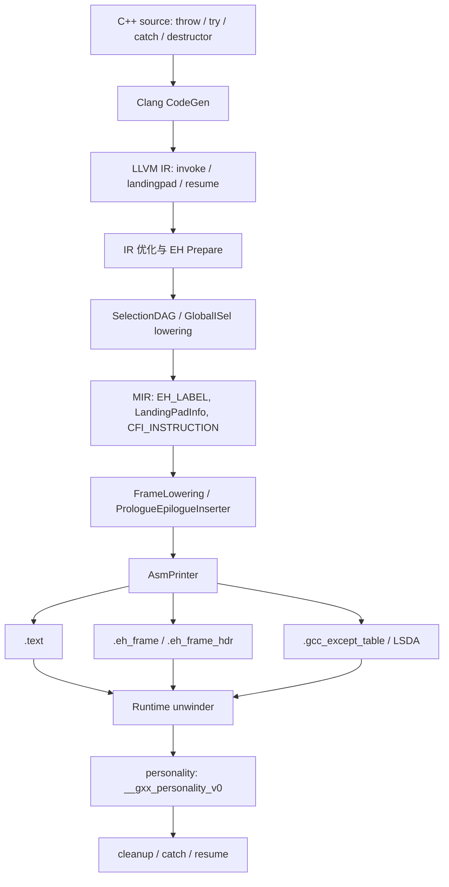
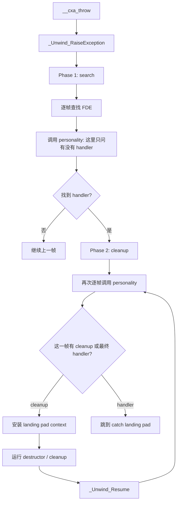
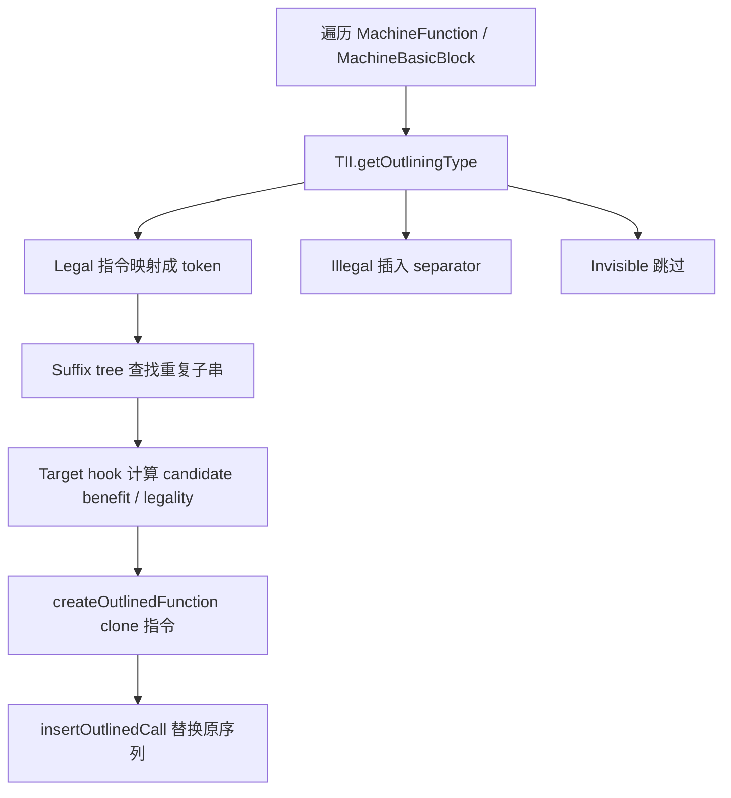

# LLVM 15 异常处理编译链路详解

异常处理可以分成两条同时存在的链：

1. **控制流链**：异常从哪里抛出，哪个 `catch` 或 cleanup 应该执行。
2. **栈展开链**：给定某个 PC，如何恢复 caller frame、LR、FP、SP、callee-saved registers。

这两条链分别落到两类元数据：

```text
.eh_frame / .eh_frame_hdr     -> unwind / CFI / frame recovery
.gcc_except_table / LSDA      -> call-site range / landing pad / catch-cleanup action
```

如果只记住一句话：**CFI 回答“怎么退栈”，LSDA 回答“退栈到这个函数时要不要执行 handler/cleanup”。**

---

## 1. 异常处理的整体图



编译器最终要保证以下不变量：

1. 一个可能 unwinding 的 call，如果当前函数有 cleanup 或 handler 要执行，它在目标文件中必须能对应到正确的 call-site range。
2. 每个运行时可能穿过的栈帧，必须有足够的 unwind 信息，至少能恢复 caller 的返回地址和 CFA。
3. landing pad 入口必须符合 ABI 约定：能拿到 exception object 和 selector，并执行正确的 catch/cleanup 分支。
4. cleanup 如果没有最终处理异常，执行完必须继续 unwind，通常表现为调用 `_Unwind_Resume`。
5. 后端移动、outline、合并或删除机器指令时，不能破坏 EH label range、CFI 状态和 LSDA action 的一致性。

---

## 2. 相关标准与约定

### 2.1 C++ 语言语义

C++ 异常语义只规定高层行为：

```cpp
try {
  may_throw();
} catch (const E &e) {
  handle(e);
}
```

语言层要求：

- `throw` 构造异常对象。
- 栈展开过程中，离开作用域的自动对象析构函数必须执行。
- 第一个类型匹配的 `catch` 处理异常。
- `catch (...)` 能捕获所有异常。
- `throw;` 在 handler 内重新抛出当前异常。
- `noexcept` 函数如果让异常逃出，需要调用 terminate。

语言标准不规定 `.eh_frame`、LSDA、`__cxa_throw`、`__gxx_personality_v0`。这些属于 ABI、运行时和编译器实现。

### 2.2 Itanium C++ ABI / Level II EH ABI

ELF 平台上的 C++ zero-cost EH 通常使用 Itanium C++ ABI 风格运行时。虽然名字叫 Itanium，但它已成为很多 ELF C++ ABI 的通用模型。

典型运行时函数：

```text
__cxa_allocate_exception   分配异常对象存储
__cxa_throw                抛出异常，进入 unwinder
__cxa_begin_catch          进入 catch 时登记异常对象
__cxa_end_catch            离开 catch 时释放/递减 handler 状态
_Unwind_RaiseException     开始两阶段 unwind
_Unwind_Resume             cleanup 完成后继续传播异常
__gxx_personality_v0       GNU C++ personality function
```

Itanium 模型的关键是 **two-phase unwinding**：



两阶段设计的好处是：先确认存在最终 handler，再执行 cleanup。否则如果 unwind 到一半才发现没有 handler，会很难恢复已经析构的对象。

### 2.3 DWARF CFI、`.eh_frame` 与 `.eh_frame_hdr`

`.eh_frame` 记录 call frame information，核心记录类型是：

```text
CIE: Common Information Entry
  - CFI 版本、code/data alignment、return address register
  - augmentation，例如 personality、LSDA encoding、FDE address encoding

FDE: Frame Description Entry
  - 对应某个函数或代码范围
  - initial_location / address_range
  - 一串 DW_CFA 指令，描述 PC 前进过程中 CFA、LR、FP、寄存器位置怎么变化
```

`.eh_frame_hdr` 通常提供一个可二分查找的索引，让 unwinder 能从 PC 快速找到对应 FDE。

CFI 的本质是 PC-indexed state machine。例如 AArch64 上函数序言：

```asm
.cfi_startproc
stp x29, x30, [sp, #-16]!
.cfi_def_cfa_offset 16
.cfi_offset x29, -16
.cfi_offset x30, -8
mov x29, sp
.cfi_def_cfa_register x29
...
ldp x29, x30, [sp], #16
.cfi_def_cfa sp, 0
ret
.cfi_endproc
```

含义：

- CFA 是 canonical frame address，通常代表 caller 的栈位置基准。
- `x30` 是 LR，AArch64 上保存返回地址。
- unwinder 给定函数内某个 PC，可以按 CFI 恢复 caller frame。

### 2.4 LSDA 与 `.gcc_except_table`

LSDA 是 language-specific data area。C++ personality 读取 LSDA 来判断某个异常 PC 对应哪个动作。

LSDA 的典型内容：

```text
LPStart encoding / LPStart
TType encoding / type table offset
call-site table encoding / call-site table length
call-site table:
  start offset
  length
  landing pad offset
  action index
苛刻一点的平台还会有 alignment / relocation 差异

action table:
  type filter
  next action offset

type table:
  type_info pointers / null / filter data
```

call-site entry 可抽象成：

```text
[try_begin, try_end) -> landingpad, action
```

在 C++ 中：

- `catch (T)` 需要 type table 中的 `type_info`。
- `catch (...)` 通常对应 catch-all 语义。
- cleanup action 表示“这里只运行析构或清理，不最终捕获”。
- call-site action 字段为 0 通常表示没有 action；action table 中的 type filter 0 表示 cleanup action。不同层的“0”不要混淆。

### 2.5 AArch64 ABI 约定

AArch64 GNU/Linux C++ EH 采用 table-based unwinding，并使用 Itanium C++ ABI 的 Level II 机制作为语言级 EH ABI。

AAPCS64 对寄存器角色的约定会影响 unwind 和 outliner：

```text
x0-x7    参数 / 返回值寄存器
x8       间接返回值相关场景常用
x16/x17  IP0/IP1，过程内调用临时寄存器，caller-saved
x18      platform register，平台相关
x19-x28  callee-saved
x29      FP
x30      LR
SP       栈指针
```

对 EH 来说，最重要的是：

- LR / FP / SP 的保存和恢复必须被 CFI 正确描述。
- callee-saved registers 如果被函数修改，也必须能在 unwind 中恢复。
- outliner 如果制造 helper call，会引入新的 LR 使用、helper FDE 和潜在 CFI 成本。

---

## 3. Runtime 视角：异常真正抛出时发生什么

以这个 C++ 片段为例：

```cpp
struct S { ~S(); };
struct E {};

void may_throw();
void handle();

int f() {
  S s;
  try {
    may_throw();
    return 1;
  } catch (const E &) {
    handle();
    return 2;
  }
}
```

如果 `may_throw()` 抛出 `E`：

1. `may_throw` 内部调用 `__cxa_throw`。
2. `__cxa_throw` 调用 `_Unwind_RaiseException`。
3. unwinder 根据当前 PC 查 `.eh_frame_hdr`，找到当前函数的 FDE。
4. 按 FDE 的 CFI 恢复 caller 的 CFA / LR / FP 等。
5. 对每个 frame 调用 personality，例如 `__gxx_personality_v0`。
6. personality 读取该 frame 的 LSDA。
7. personality 判断 caller return address 是否落在某个 call-site range 内。
8. 如果该 range 有 cleanup 或 catch action，phase 2 会跳到对应 landing pad。
9. landing pad 执行析构、类型匹配、`__cxa_begin_catch`、用户 catch body。
10. 如果只是 cleanup，不捕获，则调用 `_Unwind_Resume` 继续传播。

可以把 unwinder 对每个栈帧做的事情理解成：

```text
PC -> FDE -> CFI -> 恢复上一帧上下文
PC -> LSDA -> 当前函数是否要执行 cleanup/catch
```

CFI 与 LSDA 是并列关系，不是替代关系。

---

## 4. Clang 前端如何生成 EH IR

### 4.1 throw 表达式

C++：

```cpp
throw E{};
```

Clang CodeGen 大致做：

```text
1. 调用 __cxa_allocate_exception(sizeof(E)) 分配异常对象内存
2. 在异常对象内存中构造 E
3. 调用 __cxa_throw(exception_object, type_info, destructor)
4. __cxa_throw noreturn
```

简化 IR 形态：

```llvm
%mem = call ptr @__cxa_allocate_exception(i64 1)
; construct E into %mem
call void @__cxa_throw(ptr %mem, ptr @_ZTI1E, ptr @_ZN1ED1Ev) #noreturn
unreachable
```

源码重点：

```text
clang/lib/CodeGen/ItaniumCXXABI.cpp
clang/lib/CodeGen/CGException.cpp
```

`CGException.cpp` 负责异常控制流和 EH scope；Itanium ABI 文件负责 C++ ABI runtime 调用细节。

### 4.2 try/catch 与 invoke

普通 `call` 只有一个后继；`invoke` 有两个后继：

```llvm
invoke void @_Z9may_throwv()
        to label %normal
        unwind label %lpad
```

含义：

- 正常返回，跳到 `%normal`。
- 发生 unwind，跳到 `%lpad`。

`landingpad` 是 Itanium 风格 EH IR 的入口：

```llvm
%lp = landingpad { ptr, i32 }
        cleanup
        catch ptr @_ZTI1E
```

返回的 aggregate 一般包含：

```text
exception pointer
selector
```

selector 用于判断匹配哪个 catch clause。Clang 常生成类似逻辑：

```llvm
%exn = extractvalue { ptr, i32 } %lp, 0
%sel = extractvalue { ptr, i32 } %lp, 1
%tid = call i32 @llvm.eh.typeid.for(ptr @_ZTI1E)
%match = icmp eq i32 %sel, %tid
br i1 %match, label %catch, label %cleanup_or_resume
```

实际 IR 会更复杂，因为还要处理析构、catch object 初始化、`catch (...)`、异常规格、`noexcept`、terminate path 等。

### 4.3 cleanup 的 IR 形态

如果作用域内有需要析构的对象：

```cpp
S s;
may_throw();
```

Clang 需要确保异常路径执行 `s.~S()`。IR 上可能表现为 `landingpad cleanup`：

```llvm
lpad:
  %lp = landingpad { ptr, i32 }
          cleanup
  call void @_ZN1SD1Ev(ptr %s)
  resume { ptr, i32 } %lp
```

这里 `resume` 表示“这个 landing pad 没有捕获异常，只做了 cleanup，现在继续传播”。后面 `DwarfEHPrepare` 会把 `resume` 降成运行时调用。

### 4.4 Clang EHStack

Clang CodeGen 内部维护 EH scope stack。可以把它理解成一组嵌套作用域：

```text
try/catch scope
cleanup scope
terminate scope
filter scope
```

当生成一个可能抛异常的调用时，CodeGen 查询当前 EHStack：

- 如果当前没有任何 EH 动作，可能生成普通 `call`。
- 如果当前有 cleanup 或 catch，需要生成 `invoke`。
- `invoke` 的 unwind destination 是一个 landing pad block。
- 如果函数还没有 personality，第一次需要 EH 时设置 personality。

关键源码路径：

```text
clang/lib/CodeGen/CGException.cpp
  EnterCXXTryStmt
  getInvokeDestImpl
  EmitLandingPad
  EmitCXXTryStmt
  EmitCXXThrowExpr
```

---

## 5. LLVM IR EH 模型

### 5.1 Itanium/DWARF 模型的三个核心指令

LLVM IR 中最重要的是：

```text
invoke      可能 unwind 的 call
landingpad  EH landing pad 入口
resume      继续传播异常
```

#### invoke

```llvm
%r = invoke i32 @g()
       to label %ok
       unwind label %lpad
```

`invoke` 的返回值只在 normal edge 上定义。异常 edge 进入 landing pad。

#### landingpad

```llvm
%lp = landingpad { ptr, i32 }
        cleanup
        catch ptr @_ZTI1E
        catch ptr null
```

限制：

- landing pad block 必须是某个 `invoke` 的 unwind destination。
- `landingpad` 必须是 block 的第一个非 PHI 指令。
- 一个 landing pad block 只能有一个 `landingpad` 指令。

#### resume

```llvm
resume { ptr, i32 } %lp
```

`resume` 继续传播当前异常。它不是普通 call，而是 IR 终结符。后端准备阶段会降低它。

### 5.2 Windows funclet 模型

Windows SEH / MSVC ABI 不使用本文主线的 Itanium `landingpad` 模型，而使用 funclet 指令族：

```text
catchswitch
catchpad
cleanuppad
catchret
cleanupret
```

对应对象文件元数据也不是 `.gcc_except_table` 这一套，而是 Windows 的 `.pdata` / `.xdata`、funclet 结构和 SEH personality 约定。

所以本文关于 LSDA、`.gcc_except_table`、`__gxx_personality_v0` 的分析，不应直接套到 Windows SEH。

---

## 6. IR 到后端：DwarfEHPrepare

LLVM CodeGen 前有一个重要 pass：

```text
llvm/lib/CodeGen/DwarfEHPrepare.cpp
```

它的任务可以概括为：把 IR 中相对抽象的 EH 结构改写成更适合后端生成代码和表的形式。

最典型的动作是处理 `resume`：

```llvm
resume { ptr, i32 } %lp
```

会被改写成近似：

```llvm
%exn = extractvalue { ptr, i32 } %lp, 0
call void @_Unwind_Resume(ptr %exn)
unreachable
```

在某些 ARM EHABI 场景下，可能使用 `__cxa_end_cleanup`。在 Itanium/DWARF 主线中，cleanup 继续传播通常就是 `_Unwind_Resume`。

如果函数里有多个 `resume`，pass 可能合并成一个公共 `unwind_resume` block，通过 PHI 汇总异常对象。

---

## 7. SelectionDAG/MIR：把 invoke 变成机器层 EH range

### 7.1 invoke lowering 的关键点

源码：

```text
llvm/lib/CodeGen/SelectionDAG/SelectionDAGBuilder.cpp
  visitInvoke
  lowerStartEH
  lowerEndEH
  lowerInvokable
```

概念上，IR：

```llvm
invoke void @may_throw()
        to label %normal
        unwind label %lpad
```

会在 MIR/asm 生成中变成：

```text
EH_LABEL <begin>
CALL may_throw
EH_LABEL <end>
BR normal

lpad:
EH_LABEL <landingpad label>
...
```

然后 MachineFunction 记录：

```text
BeginLabel, EndLabel -> LandingPadInfo
```

这些 label 之后会成为 LSDA call-site table 的 start/length/landing pad offset。

### 7.2 MachineFunction 中的 EH 数据结构

关键源码：

```text
llvm/include/llvm/CodeGen/MachineFunction.h
llvm/lib/CodeGen/MachineFunction.cpp
```

重要结构可抽象为：

```cpp
struct LandingPadInfo {
  MachineBasicBlock *LandingPadBlock;
  SmallVector<MCSymbol *, ...> BeginLabels;
  SmallVector<MCSymbol *, ...> EndLabels;
  MCSymbol *LandingPadLabel;
  SmallVector<int, ...> TypeIds;
};
```

MachineFunction 还保存：

```text
FrameInstructions     CFI 指令列表
LandingPads           landing pad 信息
TypeInfos             catch type table
FilterIds             exception filter 信息
Personality           personality function
```

`MachineFunction::addInvoke` 记录 invoke 的 begin/end labels。

`MachineFunction::addLandingPad` 读取 IR `LandingPadInst`，把 cleanup、catch、filter 条款转换为 MachineFunction 中的 type id / action 信息。

`MachineFunction::tidyLandingPads` 会清理没有有效 label 或没有 try range 的 landing pad 信息。

---

## 8. AsmPrinter：生成 CFI 和 LSDA

### 8.1 DwarfCFIException

源码：

```text
llvm/lib/CodeGen/AsmPrinter/DwarfCFIException.cpp
```

它负责在函数维度发出和 EH/CFI 相关的汇编 directive：

```asm
.cfi_startproc
.cfi_personality ... __gxx_personality_v0
.cfi_lsda ... .Lexception0
...
.cfi_endproc
```

核心逻辑：

```text
beginFunction:
  判断是否需要 personality
  判断是否需要 LSDA
  判断是否需要 CFI
  发出 .cfi_startproc / .cfi_personality / .cfi_lsda

endFunction:
  如果函数有 personality / LSDA，发出 exception table
```

### 8.2 EHStreamer

源码：

```text
llvm/lib/CodeGen/AsmPrinter/EHStreamer.cpp
```

它负责把 `MachineFunction::LandingPads` 转成 LSDA。

关键步骤：

```text
1. computePadMap
   建立 landing pad 到编号/排序的映射。

2. computeActionsTable
   把 catch / filter / cleanup type ids 编码成 action table。

3. computeCallSiteTable
   扫描 MachineBasicBlock 和 EH labels，形成 call-site entries。

4. emitExceptionTable
   发出 LSDA header、call-site table、action table、type table。
```

call-site entry 的抽象形式：

```text
CallSiteEntry {
  BeginLabel
  EndLabel
  LandingPadLabel or null
  Action
}
```

概念汇编：

```asm
.section .gcc_except_table,"a",@progbits
.Lexception0:
  .byte   0xff              // LPStart omitted
  .byte   0x9b              // TType encoding, example only
  .uleb128 .Lttbase0-.Lttbaseref0
.Lttbaseref0:
  .byte   0x01              // call-site encoding, example only
  .uleb128 .Lcst_end0-.Lcst_begin0
.Lcst_begin0:
  .uleb128 .Ltmp0-.Lfunc_begin0   // start
  .uleb128 .Ltmp1-.Ltmp0          // length
  .uleb128 .Ltmp2-.Lfunc_begin0   // landing pad
  .uleb128 1                      // action + 1 encoding
.Lcst_end0:
  ... action table ...
  ... type table ...
```

真实编码会受 pointer encoding、relocation model、target ABI、linker relaxation 影响。

---

## 9. 一个端到端例子

### 9.1 C++ 源码

```cpp
struct E {};
void may_throw();
void handle();

int f() {
  try {
    may_throw();
    return 1;
  } catch (const E &) {
    handle();
    return 2;
  }
}
```

### 9.2 简化 LLVM IR

```llvm
define i32 @_Z1fv() personality ptr @__gxx_personality_v0 {
entry:
  invoke void @_Z9may_throwv()
          to label %invoke.cont
          unwind label %lpad

invoke.cont:
  ret i32 1

lpad:
  %lp = landingpad { ptr, i32 }
          catch ptr @_ZTI1E
  %exn = extractvalue { ptr, i32 } %lp, 0
  %sel = extractvalue { ptr, i32 } %lp, 1
  %tid = call i32 @llvm.eh.typeid.for(ptr @_ZTI1E)
  %match = icmp eq i32 %sel, %tid
  br i1 %match, label %catch, label %resume

catch:
  %caught = call ptr @__cxa_begin_catch(ptr %exn)
  call void @_Z6handlev()
  call void @__cxa_end_catch()
  ret i32 2

resume:
  resume { ptr, i32 } %lp
}
```

实际 Clang 生成的 IR 会因优化级别、opaque pointer、RTTI、异常对象布局、catch object 类型而变化。

### 9.3 简化 MIR/asm 概念

```asm
_Z1fv:
.Lfunc_begin0:
  .cfi_startproc
  .cfi_personality 155, DW.ref.__gxx_personality_v0
  .cfi_lsda 27, .Lexception0

.Ltmp0:
  bl _Z9may_throwv
.Ltmp1:

  mov w0, #1
  ret

.Ltmp2:              // landing pad label
  ... receive exception object / selector ...
  bl __cxa_begin_catch
  bl _Z6handlev
  bl __cxa_end_catch
  mov w0, #2
  ret

  .cfi_endproc

.section .gcc_except_table
.Lexception0:
  ... call-site entry: [.Ltmp0, .Ltmp1) -> .Ltmp2, catch E action ...
```

异常从 `may_throw` 抛出时：

1. unwinder 先离开 `may_throw` 自己的 frame。
2. 到达 `f` 时，return address 对应 `.Ltmp1` 附近。
3. personality 查 `f` 的 LSDA，发现 PC 属于 `.Ltmp0` 到 `.Ltmp1` 的 call-site range。
4. action table 指向 `catch E`。
5. phase 2 跳到 `.Ltmp2`。

---

## 10. CFI 与 LSDA 的错误表现

### 10.1 CFI 错误

如果 CFI 错，例如：

- CFA offset 错。
- LR 保存位置错。
- FP rule 错。
- PAC return-address state 没有正确描述。
- outlined helper 没有 FDE 或 FDE 覆盖范围错误。

表现可能是：

```text
unwinder 找不到上一帧
恢复出错误 LR
跳到错误地址
析构没有机会执行
catch 看似失效但根因是退栈已坏
crash in _Unwind_RaiseException / personality / __cxa_throw
```

### 10.2 LSDA 错误

如果 LSDA 错，例如：

- call-site range 起止 label 错。
- action table 指向错误 catch 类型。
- cleanup action 丢失。
- landing pad offset 错。
- after outline / block placement 后没有同步 range。

表现可能是：

```text
catch 不执行
析构不执行
异常继续外抛
catch(...) 误捕获或不捕获
terminate
运行时跳到错误 landing pad
```

### 10.3 二者的区别

```text
CFI 错：unwinder 不知道“怎么退”。
LSDA 错：personality 不知道“退到这里要干什么”。
```

---

## 11. AArch64 后端中的 EH/CFI 细节

### 11.1 函数序言与 CFI

AArch64 常见序言：

```asm
stp x29, x30, [sp, #-16]!
.cfi_def_cfa_offset 16
.cfi_offset x29, -16
.cfi_offset x30, -8
mov x29, sp
.cfi_def_cfa_register x29
```

语义：

- `stp x29, x30, [sp, #-16]!` 调整栈并保存 FP/LR。
- `.cfi_def_cfa_offset 16` 告诉 unwinder CFA 从当前 SP 往上 16。
- `.cfi_offset x30, -8` 告诉 unwinder LR 在 CFA - 8。

当函数结束恢复：

```asm
ldp x29, x30, [sp], #16
.cfi_def_cfa sp, 0
ret
```

如果启用 pointer authentication，可能还会出现：

```asm
paciasp / pacibsp
autiasp / autibsp
retaa / retab
DW_CFA_AARCH64_negate_ra_state
```

这类状态也会影响 unwind 正确性。

### 11.2 `uwtable` 与 helper FDE

LLVM IR 函数属性 `uwtable` 表示需要生成 unwind table。即使函数没有 catch，也可能需要 `.eh_frame`，因为异常可能要穿过这个 frame。

MachineOutliner 创建 helper 时，如果候选来源函数带 `uwtable`，helper 也需要相应 unwind 信息。否则异常穿过 helper 时，unwinder 可能无法恢复 caller。

---

## 12. MachineOutliner 与 EH

本章扩展 AArch64 MachineOutliner 与 C++ EH 的交互。重点是：MachineOutliner 是机器码层 pass，它不是 Clang/IR 层的 EH 语义重建器。

### 12.1 MachineOutliner 基本算法

源码：

```text
llvm/lib/CodeGen/MachineOutliner.cpp
```

核心流程：



`getOutliningType` 返回：

```text
Legal            可参与重复匹配
LegalTerminator  可作为候选末尾，但之后插入 illegal separator
Illegal          切断候选
Invisible        不参与 token，例如 debug/kill
```

MachineOutliner 的优势是可以跨函数发现重复机器指令序列；风险是它发生在 IR EH 语义已经被降低到 label/range 之后。

### 12.2 outline 为什么会影响 EH

原始代码：

```asm
caller:
.Ltmp0:
  bl may_throw
.Ltmp1:
  ...

.section .gcc_except_table
  call-site: [.Ltmp0, .Ltmp1) -> landingpad, catch/cleanup action
```

outline 后可能变成：

```asm
caller:
.Ltmp0:
  bl OUTLINED_FUNCTION_0
.Ltmp1:
  ...

OUTLINED_FUNCTION_0:
  bl may_throw
  ret
```

更精确地说，EH 正确性取决于两个条件：

1. helper 自己有足够 CFI，使 unwinder 能从 helper frame 回到 caller。
2. caller 中替换后的 `bl OUTLINED_FUNCTION_0` 仍处于原来正确的 call-site range 内，或者 helper 自己被赋予等价 LSDA。

在常见简单场景中，如果原来的 EH begin/end label 保留在 caller，替换 call 位于同一 range 内，那么 caller 的 LSDA 仍可能正确处理从 helper 传回来的异常。异常会先穿过 helper，再到 caller；caller personality 看到的是 `bl OUTLINED_FUNCTION_0` 的返回地址。

但 MachineOutliner 本身并不从语义上证明以下条件：

```text
所有 occurrence 的 EH action 完全等价
helper 内部 throwing PC 是否需要本地 landing pad
outline 后 call-site range 是否仍精确覆盖 replacement call
helper 是否需要 LSDA，而不仅是 FDE
landing pad body 中的普通指令 outline 是否改变 EH 协议
```

因此它主要依靠更保守的机器指令 legality、position boundary、CFI 限制和 target hook，而不是完整 LSDA-aware 重建。

### 12.3 AArch64 getOutliningType 的 EH 相关规则

源码：

```text
llvm/lib/Target/AArch64/AArch64InstrInfo.cpp
  AArch64InstrInfo::getOutliningType
```

重要规则如下。

#### 12.3.1 PAC/AUT/RETAA/RETAB/EMITBKEY 拒绝

```cpp
case AArch64::PACIASP:
case AArch64::PACIBSP:
case AArch64::AUTIASP:
case AArch64::AUTIBSP:
case AArch64::RETAA:
case AArch64::RETAB:
case AArch64::EMITBKEY:
  return outliner::InstrType::Illegal;
```

这些指令与返回地址签名状态有关。把它们随便搬进 helper 会破坏返回地址认证与 CFI 状态。

#### 12.3.2 CFI 初始标记为 Legal，但后续强限制

```cpp
if (MI.isCFIInstruction())
  return outliner::InstrType::Legal;
```

注释说明：当前只在 tail-call outline 或有正确 offset fixup 时才可能 outline CFI。LLVM 15 AArch64 走的是保守路径。

#### 12.3.3 debug/kill invisible

```cpp
if (MI.isDebugInstr() || MI.isIndirectDebugValue())
  return outliner::InstrType::Invisible;
if (MI.isKill())
  return outliner::InstrType::Invisible;
```

这类指令不参与 token 序列。

#### 12.3.4 非函数出口 terminator 拒绝

```cpp
if (MI.isTerminator()) {
  if (MI.getParent()->succ_empty())
    return outliner::InstrType::Legal;
  return outliner::InstrType::Illegal;
}
```

这避免候选跨越普通 CFG 边界。

#### 12.3.5 某些 operand 拒绝

```cpp
if (MOP.isCPI() || MOP.isJTI() || MOP.isCFIIndex() ||
    MOP.isFI() || MOP.isTargetIndex())
  return outliner::InstrType::Illegal;

if (MOP.isReg() && !MOP.isImplicit() &&
    (MOP.getReg() == AArch64::LR || MOP.getReg() == AArch64::W30))
  return outliner::InstrType::Illegal;
```

这类 operand 通常依赖函数局部上下文，例如 frame index、jump table、constant pool、CFI index 或 link register。

#### 12.3.6 call 的处理

对于 unknown callee，AArch64 只放开真实 call opcode 作为候选末尾：

```cpp
if (MI.getOpcode() == AArch64::BLR ||
    MI.getOpcode() == AArch64::BLRNoIP ||
    MI.getOpcode() == AArch64::BL)
  UnknownCallOutlineType = outliner::InstrType::LegalTerminator;
```

`LegalTerminator` 的含义是：

```text
call 可以作为 outlined 序列最后一条
call 后立即插入 separator，不能让候选跨过 call 继续匹配
```

如果 callee 是当前模块内可见函数，且后端已知它没有 stack frame、没有 frame object，才可能把这个 call 作为普通 `Legal`。

#### 12.3.7 position 拒绝

```cpp
if (MI.isPosition())
  return outliner::InstrType::Illegal;
```

EH label、普通 label、debug label 等 position 类机器指令通常会切断候选。这一点对 EH 很关键：MachineOutliner 不应直接把 EH range label 搬进 helper。

#### 12.3.8 读写 W30/LR 拒绝

即使 operand 检查没有捕获到，后面仍有：

```cpp
if (MI.readsRegister(AArch64::W30, ...) ||
    MI.modifiesRegister(AArch64::W30, ...))
  return outliner::InstrType::Illegal;
```

因为 outline helper 本身要使用 LR，随意移动 LR 相关指令非常危险。

#### 12.3.9 BTI hint 拒绝

AArch64 BTI 指令影响间接分支目标属性，outline 后可能改变 callability，因此保守拒绝。

### 12.4 CFI candidate 后续过滤

源码：

```text
llvm/lib/Target/AArch64/AArch64InstrInfo.cpp
  AArch64InstrInfo::getOutliningCandidateInfo
```

AArch64 会统计候选中的 CFI 指令数量。

如果候选中有 CFI，要求候选包含父函数全部 CFI：

```text
CFICount > 0 时，CFICount 必须等于 C.getMF()->getFrameInstructions().size()
```

否则拒绝。

随后，如果不是 tail-call outline 且候选中有 CFI，也拒绝：

```text
FrameID != MachineOutlinerTailCall && CFICount > 0 -> reject
```

所以实际能力很窄：

```text
CFI 在 mapper 阶段可以进入 token
但多数非 tail-call CFI outline 会被 target hook 拒绝
只有非常受限的 tail-call/terminal 场景才可能保留
```

### 12.5 helper 中如何处理 CFI

`MachineOutliner::createOutlinedFunction` 会创建 `OUTLINED_FUNCTION_N`，并把候选指令 clone 到 helper。

关键逻辑：

```cpp
if (I->isCFIInstruction()) {
  unsigned CFIIndex = I->getOperand(0).getCFIIndex();
  MCCFIInstruction CFI = Instrs[CFIIndex];
  BuildMI(MBB, MBB.end(), DL, TII.get(TargetOpcode::CFI_INSTRUCTION))
      .addCFIIndex(MF.addFrameInst(CFI));
} else {
  MachineInstr *NewMI = MF.CloneMachineInstr(&*I);
  NewMI->dropMemRefs(MF);
  NewMI->setDebugLoc(DL);
  MBB.insert(MBB.end(), NewMI);
}
```

也就是说，如果 CFI 被允许进入 helper，它会复制到 helper 自己的 `MachineFunction::FrameInstructions` 中，而不是在 caller continuation 上自动重建一套等价 CFI 状态。

同时，helper 会根据来源 candidate 的 `uwtable` 情况设置自己的 unwind table 属性，使其能生成 FDE。

### 12.6 MachineOutliner 没有完整 LSDA 重建

MachineOutliner 不会完整做这些事情：

```text
读取原函数 LSDA call-site table
识别每个 throwing call 对应哪个 action
比较多个 occurrence 的 action 是否一致
把原函数 landing pad/action/type table 复制进 helper
为 helper 生成新的 C++ LSDA
更新所有受影响的 call-site range
```

它更多依赖：

```text
EH_LABEL / position 不参与 outline
call 只能出现在受限位置
CFI 只能在极窄场景 outline
LR/PAC/AUT/BTI 等敏感指令拒绝
helper 生成自己的 FDE
```

这就是“CFI-aware，但不是完整 EH/LSDA-aware”。

### 12.7 EH-heavy 程序中的体积分析

对异常代码做 outliner 体积评估时，不能只看 `.text`。

需要同时看：

```text
.text
.eh_frame_hdr
.eh_frame
.gcc_except_table
.rela.eh_frame / .rela.gcc_except_table
stripped alloc section total
```

原因：

- helper 增加新函数，可能增加 FDE。
- `.eh_frame_hdr` 可能增加二分表条目。
- outline 改变函数布局，可能影响 LSDA 编码长度。
- replacement call 可能使 call-site table 变化。
- 代码减少的收益可能被 EH metadata 抵消一部分。

实践中，EH-heavy workload 上经常出现：

```text
.text 下降明显
.eh_frame / .eh_frame_hdr / .gcc_except_table 上升
最终 stripped total 收益小于 .text 收益
```
---

## 13. 总结

LLVM 15 上 C++ 异常编译可以压缩成这条链：

```text
C++ throw/try/catch/destructor
  -> Clang EHStack
  -> LLVM IR invoke/landingpad/resume
  -> DwarfEHPrepare: resume lowering
  -> SelectionDAG: EH_LABEL begin/end + MachineFunction LandingPadInfo
  -> FrameLowering: CFI_INSTRUCTION / prologue / epilogue
  -> AsmPrinter:
       .eh_frame / .eh_frame_hdr
       .gcc_except_table / LSDA
  -> runtime unwinder + __gxx_personality_v0
```

最重要的区分：

```text
.eh_frame       描述如何展开栈
.gcc_except_table 描述展开到当前函数时要执行什么 EH action
```

AArch64 MachineOutliner 与 EH 的关系可以概括为：

```text
它有 CFI-aware 的保守限制
它会给 outlined helper 生成 unwind table / FDE
它会复制被允许的 CFI 到 helper 的 frame instructions
它拒绝 EH label/position、PAC/AUT、LR/W30、部分局部 operand
它允许部分 call 作为 LegalTerminator
它没有完整 LSDA/call-site/action 重建能力
```

因此评估或修改 MachineOutliner 时，应同时看 `.text` 与 EH metadata。对于 EH-heavy workload，`.text` 缩小不等于最终二进制一定缩小；`.eh_frame`、`.eh_frame_hdr`、`.gcc_except_table` 的增量必须纳入收益模型。
